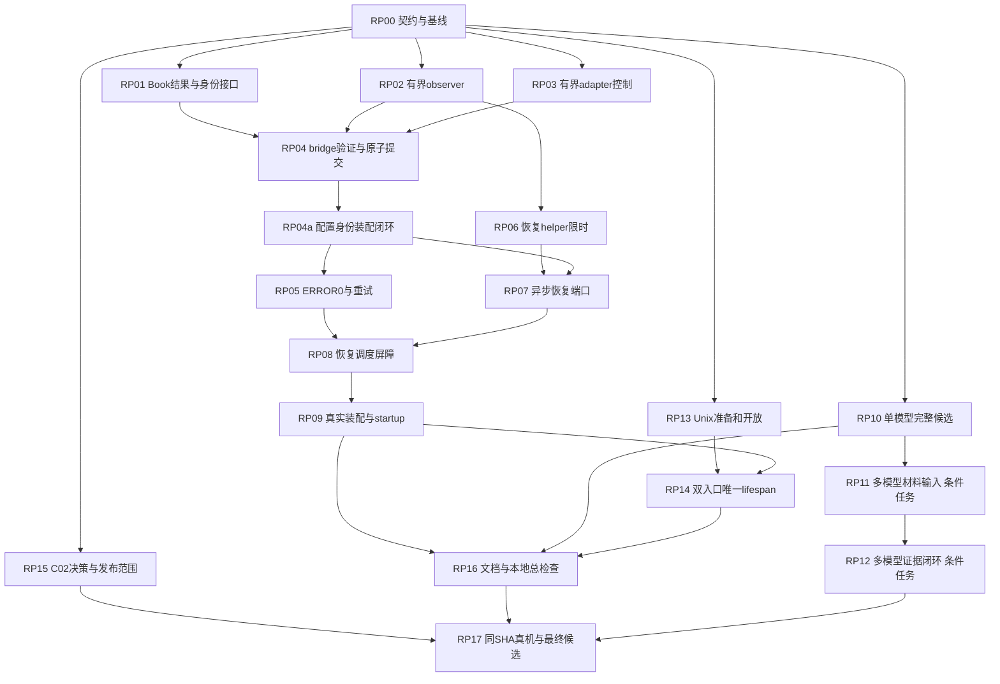

# v3 审查修复执行Plan

日期：2026-09-22。状态：**可供实施评审；未实施，未获产品范围决策，未做新硬件验收**。
上游：[事实复核](20260922-v3plan-review-verification.md)、[六个修复包](20260922-v3plan-fix-plan.md)。
本Plan的接口、参数和状态真源是[执行契约K1—K8](20260922-v3plan-execution-contracts.md)，任务引用契约，不让实施者在任务中重新选择行为。

## 1. 目标、基线和范围

目标：使加载见证在有限时间内结束，拒绝迟到/错身份事实；已证STOPPED正确释放两种预算且不丢失败语义；恢复有实际运行接线与安全排空；生产候选材料逐模型完整；两个入口共同就绪并只清理一次；更新规范导航和明确C02发布决策。

核对基线：`79d44d2`及用户现有两个未提交代码文件（`backend_control.py`、`test_backend_control.py`）。这些补丁与上轮快照一致；本次仅编辑check文档，不自动提交用户代码。实施时先保存基线SHA/补丁摘要和现有改动归属，再逐片整合，不reset、不覆盖、不把整批用户修改混入提交。

现行约束：根README描述已交付服务；`plan/`是设计/证据，不自动代表通过。沿用ADR-01/02的项目隔离与硬件证据前置；无SysDocs库，不初始化。Graphify已有节点用于定位，关键方法已直接核对源码。

本轮补查纠正一个适用范围：原复核F01的“到期后启动recovery”只在scheduler已注入恢复端口时成立。当前v2装配没有该端口，启动用的同步`DeploymentRecovery`不是异步`ControlRecoveryPort`。RP07—RP09专门补接线，不能把这项当成只改deadline的一行修复。

### 固定工程选择

| 议题 | 本Plan固定选择 | 不允许的替代 |
|---|---|---|
| 身份所有权 | Book.Runtime.instance唯一存储；bridge只读lookup | 另建prepared/committed identity字典，先写bridge再验operation |
| 加载已证STOPPED | ERROR、预留0、保留错误、本代停止marker；warm受现有retry限制 | 直接UNLOADED让调用循环无限重载，或扩宽stopped允许任意状态 |
| adapter UNKNOWN | 本轮立即保守失败；独立轮询仅对adapter RUNNING | 重发load或悄悄增加整段加载重试 |
| 轮询策略 | K1内部frozen policy，固定间隔、有界window | 新增一套环境变量/CLI临时绕过策略 |
| 恢复 | 显式异步适配端口；新60s总预算；先关准入、再可信排空 | HTTP/task超时当作停止、drain到期直接删除lease |
| listener生命周期 | 外层唯一lifespan、准备两socket后开放共同gate | 各入口自行启动/清理共享对象，固定sleep猜ready |
| C02 | 产品决策前保持现有拒绝规则；K8分支单独处理 | 自动接受放弃35B，或直接减page cache |

不在范围：视频项目、audio能力扩展、O01门槛下调、同UID内隔离、模型下载/驱动/磁盘配置、旧档案全面重写。Blob原语义不改，可选的组合测试不阻塞本轮。

## 2. 依赖图与检查点



RP11/RP12只在RP15确定的生产模型数>1时必需；单模型范围已获确认时，记录`N/A：accepted scope仅一个model_id`后解除RP12依赖，不能填写passed。RP15未决不阻止工程修复及lab验证，只阻止最终生产范围定稿与RP17生产结论。

| 检查点 | 包含任务 | 通过条件 |
|---|---|---|
| CP-A0 | RP00—RP01 | 契约可解析/审阅；Book结果字段兼容回归通过 |
| CP-A1 | RP02—RP03 | 底层deadline与原始身份标签校验回归通过；没有新真机通过声明 |
| CP-B | RP04、RP04a、RP05 | 实际启动提供配置身份，load/stop均经同一Book；ERROR0及并发重试边界通过 |
| CP-C | RP06—RP07 | helper各阶段共用截止；异步恢复端口完整STOPPED证明，不持Book |
| CP-D | RP08—RP09 | 新预算、lease/control排空、真实构造的scheduler端口全部贯通 |
| CP-E | RP10及按需RP11—RP12 | 候选严格集合检查；多模型时材料命名空间可离线复核 |
| CP-F | RP13—RP14 | 两入口失败/取消清理通过，只有一次lifespan，无就绪前业务副作用 |
| CP-G | RP15—RP17 | 产品决策明确、本地全部检查通过、同SHA目标测试和最终候选证据完整 |

可独立推进候选、入口准备及C02决策；同改`scheduler.py`的RP04/05/08、同改`runtime.py/run.py`的RP04/04a/09/14顺序执行，不同时写文件。每个任务形成可验证提交；RP04与RP04a因必需构造参数相互衔接，作为同一集成检查/原子提交单元，禁止提交“runtime要求参数而main尚未提供”的过渡版本。CP-B前不能宣称身份问题已修完。

## 3. 通用执行与验证命令

下列`$PY`为**已经核验版本的独立Python3.12解释器**。不使用会自动重建项目`.venv`的裸`uv run`。若需uv隔离命令，使用`uv run --no-project --python 3.12 --with-requirements requirements-dev.lock ...`；每次执行记录实际版本。

```bash
"$PY" --version
"$PY" -m pytest tests -m 'not thor' -q
"$PY" -m ruff check .
"$PY" run.py --check-config
git diff --check
```

以下每任务列出定向Verification；代码/配置行为提交还必须满足以上仓库全量门槛。全部任务带文档影响；规范文字集中RP00/RP16写，实施中若契约改变需在同片补文档，不能等最终忘记同步。文件上限是主要实现/测试约5个；实际扩散超过5个时拆出前置兼容片，禁止“顺手大重构”。

## Task RP00：冻结可执行契约与输入基线

**Primary owner:** arch。**Collaborators:** backend。**Dependencies:** None。**Estimated scope:** M，3个文档。

**Description:** 将K1—K7作为C03/C08/C09的明确增量同步，列出旧行为/新行为和兼容边界；记录review SHA与两文件patch hash，禁止把原审查意见全量当需求。
特别核实K4 launch终结事实的来源：现有model_runner可产生LaunchOperation，但当前v2 observer默认没有launch_lookup。未派发可证明无launch；派发失联必须保持unresolved，不能用task.done代替。若固定控制协议不能提供终结证明，明确自动恢复该分支只能失败封闭，另立控制协议能力任务，不能伪造接口实现。

**Files likely touched:** `plan/08-execution-plan.md`、`plan/02-scheduler.md`、本执行契约文档。
**Documentation impact:** C03中固定K1—K5、C08引用K7、C09注明K6分阶段范围；C02公式不改。
**Acceptance criteria:**
- [x] 已记录唯一身份所有者、ERROR0 marker、UNKNOWN策略、freshness/截止含义、恢复端口与lease规则。
- [x] 默认值明确为软件值；launch证明缺口有可测试的失败行为；legacy兼容路径不依赖反射判断。
**Verification:** 文档与实际签名对照、代码块语法检查（省略号签名明确为示意）、`git diff --check`；本任务不需要runtime全量。

**执行结果（2026-09-22）**：已把 K1—K5 同步为 `plan/08-execution-plan.md` 的「C03 增量」表（旧/新行为与兼容边界
8 行）、K7 为「C08 增量」、K6 分阶段范围为「C09 增量」，K3/K5 同步进 `plan/02-scheduler.md`；基线、patch 摘要与
归属写入 08 §1.2.1 与契约 K0。

签名对照结果：新增符号 15 个（`LifecyclePolicy`、`ExpectedInstance`、`DeadlineDocker`、`probe_loopback`、
`Book.instance/load_stopped/retry_stopped_load`、`Runtime.load_stopped_generation`、`DeploymentRecoveryPort`、
`ServingGate`、`TcpServerAdapter`、`ControlServer.prepare/activate`、`measurements_index`、
`require_instance_identity`、`lifecycle_policy`）；改签名 2 处（`LlamaCppAdapter.release` 加 `deadline`、
`build_candidate.measurements_dir` 改可选）；位置纠正 2 处（`build_v2_context` 在 `run.py:86` 不在 `runtime.py`；
`require_production_openable` 在 `contracts_v2.py:568` 不在 `candidate.py`）。另确认 K5 适配器须满足既有
`ControlRecoveryPort`（`contracts.py:106`），不新造同形 Protocol。

K4 launch 来源已核实：`ports_v3.LaunchOperation`（`ports_v3.py:78`）← `model_runner.SupervisedLaunch`
（`model_runner.py:45`）← `DockerProcessObserver.launch_lookup`（`process_observer.py:309`）。两处缺口已确认：
`process_observer.py:348` 在 `launch is None` 时默认 `launcher_terminal=True`，且 `run.py:139-142` 只传三个位置
参数；`LlamaCppAdapter.load`（`llama_cpp.py:299-317`）不创建 `SupervisedLaunch` 且 `launch_operation` 恒为 `None`。
故该分支固定失败封闭（`launch_unresolved` → UNKNOWN，recover `ok=False`），控制协议 launch 终结能力另立任务。

验证：`git diff --check` exit 0；Python 3.12.11 下 12 个代码块 `compile` 全部通过。
本次未执行 runtime 全量测试、未 push、未做目标同步；用户两个未提交文件保持原样未入本提交。

## Task RP01：增加兼容结果字段与Book唯一身份接口

**Primary owner:** backend。**Collaborators:** arch。**Dependencies:** RP00。**Estimated scope:** M，4文件。
**Description:** 实现K2的尾部可选字段、Runtime.instance、Book.instance/loaded的同步写回接口；所有已证停止入口清身份。此片提供兼容底座，RP04才移除bridge缓存，不把中间状态宣称为最终修复。
**Files likely touched:** `model_scheduler/contracts.py`、`model_scheduler/model_registry.py`、`tests/test_registry.py`、`tests/test_backend_control.py`。
**Documentation impact:** K2签名如有变化同步C03，公共HTTP/control-v1不变。
**Acceptance criteria:**
- [x] 原五位置参数构造、legacy加载测试仍通过；新字段不改变原字段含义。
- [x] Book的当前operation成功同时写READY+完整身份；旧operation和有冲突的状态不产生部分写入。
- [x] stopped/bootstrap/finish_recovery清identity，failed/UNKNOWN保留identity；覆盖全部既有Book写入口。
**Verification:** `"$PY" -m pytest tests/test_registry.py tests/test_backend_control.py -q`，再通用全量检查。

**执行结果（2026-09-22）**：`contracts.Observation` 末尾新增 `instance`、`valid_until` 两个默认 None 字段
（依赖方向 `contracts -> control_protocol_v1 -> contracts_v2`，与 K2 一致）；`Runtime.instance` 为唯一已接受身份；
新增只读 `Book.instance(model_id)`；`Book.loaded(operation, now, *, instance=None)` 先校验参数类型、再校验
operation、最后在同一批赋值中写 READY 与身份（任意拒绝都无部分写入）。`stopped`/`bootstrap_stopped`/
`finish_recovery` 清身份；`failed`/`begin_recovery`/`release(ABORTED)` 保留身份。

新增 7 个测试（`tests/test_registry.py`）：原五位置参数构造与默认 None、携带身份与截止、当前 operation 一次写入
READY+身份、旧 operation 与冲突状态均无部分写入、已证 stop 清身份而 failure 保留、bootstrap/finish_recovery 无身份、
ABORTED 保留身份。RED 阶段确认 7 failed / 21 passed。

验证：定向 `tests/test_registry.py tests/test_backend_control.py` 38 passed；全量
`pytest tests -m 'not thor' -q` **907 passed、1 skipped、1 deselected**（耗时 15m44s）、`ruff check .` 通过、
`run.py --check-config` 通过。解释器为 uv 提供的 CPython 3.12.11
（`uv run --no-project --python 3.12 --with-requirements requirements-dev.lock`，仓库 `.venv` 仍是 3.13.5）。

偏差说明：任务列出的 `tests/test_backend_control.py` **未改动**——该文件含用户未提交的改动，编辑会把用户代码混入本
提交；改为在 `test_registry.py` 内覆盖，并以该文件作为回归（`test_backend_control.py` 全数通过）。
bridge 私有缓存 `_instances` 的移除仍属 RP04，本片只提供 Book 侧唯一身份底座，**不宣称身份问题已修完**。

## Task RP02：为v3 observer建立有界事实采集

**Primary owner:** backend。**Collaborators:** none。**Dependencies:** RP00。**Estimated scope:** M，3文件。
**Description:** 在ports_v3定义K1的LifecyclePolicy及K4的ExpectedInstance；新增有deadline的Docker/端口调用入口，ps/inspect/端口共享sample_deadline，线程内串行采集、返回后复核。observer新增expected输入并在原始labels层校验。此底层兼容片可保留未传expected的旧构造；RP04a的managed装配必须显式提供，不允许正式路径回退。
**Files likely touched:** `model_scheduler/process_observer.py`、`model_scheduler/ports_v3.py`、`tests/test_process_observer.py`。
**Documentation impact:** C03采样时刻、启动事务未知时STOPPED拒绝规则与取消边界。
**Acceptance criteria:**
- [x] 截止已到零次I/O；ps超时不再inspect；空列表不调用inspect；端口超时使用剩余时间。
- [x] 慢观察返回后不能给出有效终态；同一次底层工作未退出时不派发下一轮。
- [x] launch仍starting/派发结果未知时，即使容器暂缺且端口关闭也不能证STOPPED。
- [x] expected存在时错配置摘要/镜像/runtime或额外candidate标签拒绝；不在丢失原始labels后才判断其来源。
**Verification:** `"$PY" -m pytest tests/test_process_observer.py tests/test_ports_v3.py -q`；新可控runner记录每次argv、timeout、退出，不依赖真实Docker。

**执行结果（2026-09-22）**：`ports_v3` 新增 `LifecyclePolicy`（构造拒绝非有限/非正/bool 及三条不等式，用
`ContractError`）、`ExpectedInstance`（ID、`name@sha256:<64hex>` 与 64hex 摘要、`digest_kind` 校验）与
`DeadlineDocker` Protocol；`ports_v3.Observation` 新增 `launch_resolved: bool = True`。`process_observer` 新增
`probe_loopback(port, *, deadline, now)`、`DeadlineDockerRunner`，`run_docker` 增加可选 `timeout` 以保持旧调用兼容；
`DockerProcessObserver` 新增 `expected` 与 `policy`，并把四个事实源收进单一 worker 的 `_collect`，共用
`sample_deadline`，返回后复核 deadline 与 max_age；`_expected_digest` 在原始 labels 层判定，有 `expected` 时不再有
`candidate or config` 回退。

关键语义决定：区分“**没有** launch 来源”与“来源**答称没有**”——前者 `launch_resolved=False` 且永不能证 STOPPED，
后者才是“本 boot 未派发”的正面证据。现有单测/集成两类夹具都显式注入了该 callable，因此未被此改动打破；
`run.py:139-142` 的生产装配未注入，按 RP00 的决定保持失败封闭，由 RP04a 显式提供。

新增 22 个测试（`tests/test_process_observer.py`）：策略默认值与 7 组非法值、期望值 8 组非法 ID/摘要、
过期 deadline 零 I/O、耗尽窗口后不再 inspect、空列表不 inspect、超出 max_age 的样本不给终态、
无 launch 来源不证 STOPPED、来源存在时解析成功、expected 接受 canonical 事实并拒绝错配置摘要/多 candidate 标签/
错 runtime/错镜像、无 expected 时 legacy 摘要回退仍可用、`DeadlineDockerRunner` 每次只给剩余时间且到期拒绝、
`probe_loopback` 截止已过不连且超时取剩余。全部不依赖真实 Docker。

验证：定向 `test_process_observer.py + test_ports_v3.py` 55 passed；受影响的集成
`test_process_lifecycle.py + test_managed_execution.py` 15 passed；全量
`pytest tests -m 'not thor' -q` **938 passed、1 skipped、1 deselected**（15m43s，较 RP01 的 907 增加 31）、
`ruff check .` 通过、`run.py --check-config` 通过。解释器为 uv 提供的 CPython 3.12.11。

## Task RP03：给adapter控制调用传递deadline

**Primary owner:** backend。**Collaborators:** arch。**Dependencies:** RP00。**Estimated scope:** M，约4文件。
**Description:** 实现K4显式managed adapter release接口和load/stop/release剩余时间控制；移除stop丢弃deadline行为。控制超时返回不可证，保留已派发/终结事实，不能伪装未派发。
**Files likely touched:** `model_scheduler/adapters/llama_cpp.py`、`model_scheduler/ports_v3.py`、`tests/test_llama_adapter.py`、`tests/test_backend_control.py`。
**Documentation impact:** 控制响应仅是控制事实，不是STOPPED；adapter UNKNOWN策略不变。
**Acceptance criteria:**
- [x] load/stop/release均接受绝对deadline；已过期不发HTTP；无身份孤儿仍可显式release(model_id, deadline)。
- [x] HTTP超时/取消不生成已证STOPPED或terminal launch；正常模型协议和legacy客户端仍兼容。
**Verification:** `"$PY" -m pytest tests/test_llama_adapter.py tests/test_backend_control.py -q`；超时fake验证control调用次数及参数，之后全量检查。

**执行结果（2026-09-22）**：`ports_v3` 新增 `ManagedAdapterPort`（显式声明 `load/stop/release`，均带绝对 deadline）。
`LlamaCppAdapter` 新增 `_control_call(action, model_id, deadline)`：过期零派发；执行中用 `asyncio.timeout(剩余)`
收敛；超时返回 False 表示“不可证”；`CancelledError` 向上抛而不折算为拒绝。新增 `_unverified()` 作为控制不可证时的
返回——state=UNKNOWN、`launch_operation=None`、`launch_resolved=False`，**不是** STOPPED。`load` 改为经 `_control_call`，
`stop` 不再 `del deadline` 并按结果返回 `StopAck(accepted=...)`，`release(model_id, deadline=None)` 支持显式 deadline。

新增 8 个测试（`tests/test_llama_adapter.py`，含可挂起的 `RecordingControl`）：过期 deadline 对控制面与 HTTP 均零
派发；控制调用超时返回 UNKNOWN 且 `launch_resolved=False`；超时后仍保留“已派发”事实（断言控制面被真正调用过）；
stop 用调用方 deadline 且超时返回 non-accepted；无身份孤儿可显式 `release(model_id, deadline)`；
过渡期单参数 `release(model_id)` 仍可用；adapter 满足 `ManagedAdapterPort`。RED 阶段 6 failed / 21 passed。

遗留缺口（RP04 关闭）：`ManagedLifecycle.stop` 仍以 `await release(model_id)` 单参数调用，且仍用
`getattr(adapter, "release", None)`；`release` 的 `deadline` 默认值与该调用点一并去除。本次未改动
`backend_control.py`——它含用户未提交改动，编辑会把用户代码混入提交。

验证：定向 `test_llama_adapter.py + test_backend_control.py` 37 passed；全量
`pytest tests -m 'not thor' -q` **945 passed、1 skipped、1 deselected**（较 RP02 的 938 增加 7）、
`ruff check .` 通过、`run.py --check-config` 通过。解释器为 uv 提供的 CPython 3.12.11。

## Task RP04：见证验证与原子身份提交贯通

**Primary owner:** backend。**Collaborators:** arch。**Dependencies:** RP01、RP02、RP03。**Estimated scope:** M，5文件。
**Description:** 实现K1/K2/K4验证窗口、精确轮询、身份期望和原因码；ManagedLifecycle删除私有identity缓存，runtime接受必需expected_instances并注入book.instance，scheduler在锁内验当前operation后提交。与RP04a一起完成集成和提交。
**Files likely touched:** `model_scheduler/backend_control.py`、`model_scheduler/scheduler.py`、`model_scheduler/runtime.py`、`tests/test_backend_control.py`、`tests/integration/test_managed_execution.py`。
**Documentation impact:** 补齐C03加载见证与stop终态的区别；详细错误保留内部不扩公共错误枚举。
**Acceptance criteria:**
- [x] UNKNOWN→RUNNING恰2次观察；截止后零次新观察；慢观察的迟到RUNNING不可接受；无observer立即失败。
- [x] 冷启动identity=None可发现合格实例；wrong model/deployment/runtime/digest/StartedAt、未来/陈旧样本拒绝；观测没有权力自己定义期望身份。
- [x] load/stop不修改身份；过期或旧op成功/停止不污染新一代；旧load finally不能pop新task。
- [x] managed要求完整RUNNING身份和valid_until，legacy原结果不被误拒；stop四事实和无身份release回归通过。
**Verification:** `"$PY" -m pytest tests/test_backend_control.py tests/integration/test_managed_execution.py -q`，再全量；使用可控时钟和有界脚本，禁止用宽泛`>=2`作为终态证据。

**执行结果（2026-09-22，提交 `3d2755f` + `c`）**：bridge 删除 `_instances`，`instance()` 改为注入的只读
`instance_lookup`；`load` 用 `verify_deadline = min(caller_deadline, now + verify_window)` 做有界见证，
`valid_until = min(deadline, sampled_at + max_age)` 由 bridge 推导（K2 明确不由观测侧给出）；
拒绝原因码落齐 `observer_missing / verify_deadline_exhausted / observer_failed / observation_stale /
observation_identity_mismatch / launch_unresolved / load_proven_stopped`；`launch_resolved=False` 的 STOPPED 一律降级
为 UNKNOWN。孤儿释放改为显式 `adapter.release(model_id, deadline)`，去掉 `getattr` 猜测。
scheduler：`book.loaded(operation, now, instance=observation.instance)`，新增 `require_instance_identity`
（显式模式，不用反射猜）与 `lifecycle_policy`；`_finish_load` 的 finally 只在仍持有该槽时 pop。
runtime：managed 装配固定 `require_instance_identity=True`，bridge 取 `book.instance`。

新增 11 个测试（`tests/test_backend_control.py`）：恰 2 次观察、窗口耗尽零观察、迟到样本、缺完整身份、
错模型、冷启动可发现、未解 launch 不证停止、已证停止上报、孤儿 release 收到 deadline、
bridge 按期望值复核身份（正反例）。集成 9 项（真实 llama.cpp adapter + 真实 docker observer）全通。
测试约定：注入 `now` 后必须让注入的 `sleep` 同步推进假时钟，否则 UNKNOWN 轮询会死循环。

**RP04a 执行结果**：`build_managed_execution` 新增必需 `expected_instances`（模型集合必须完全相等、
每项必须属于本 deployment/model 且 `digest_kind == "config"`，否则 `RuntimeCompositionError`），并把 mapping
交给 bridge；`run.py` 的 `main` 在 `--check-config` 早退之前对**原始字节**求 SHA-256，
`build_v2_context(config, *, config_sha256, ...)` 校验 64hex 后按 `deployment_id + 每模型 runtime_id +
runtime.image_digest + config_sha256` 构造唯一期望 mapping，**同一份 mapping 同时传给 observer 与 bridge**；
bridge 在 labels 层之外再按期望值核对 runtime/image/digest。v1 分支复用同一 `config_sha256`。

新增：启动拒绝缺/错摘要（4 组非法值）、bridge 期望值正反例、main 确把 64hex 摘要交给装配
（在 `test_main_orders_lock_before_context_and_serves_the_v2_plan` 内断言）。
`test_managed_execution.start_lab` 的真实 observer 与 `build_managed_execution` 现在共用同一 `ExpectedInstance`。

验证：全量 `pytest tests -m 'not thor' -q` **957 passed、1 skipped、1 deselected**（15m37s）、
`ruff check .` 通过、`run.py --check-config` 通过。解释器为 uv 提供的 CPython 3.12.11。
所有 `build_v2_context` / `build_managed_execution` 调用点已迁移，无不可运行的中间提交。

## Task RP04a：从配置原始字节闭合生产身份输入

**Primary owner:** backend。**Collaborators:** arch。**Dependencies:** RP04。**Estimated scope:** M，5文件；与RP04同一原子提交。
**Description:** 按K4签名在main计算config_bytes摘要，build_v2_context构造唯一期望mapping，同时传observer与runtime。迁移真实构造调用及完整进程生命周期夹具，不以测试手工构造bridge代替实际装配。
**Files likely touched:** `run.py`、`model_scheduler/runtime.py`、`tests/integration/test_control_socket.py`、`tests/integration/test_managed_execution.py`、`tests/integration/test_process_lifecycle.py`。
**Documentation impact:** C03明确当前identity_digest实际绑定config、与candidate摘要不同；无需新增配置字段/环境变量。
**Acceptance criteria:**
- [x] main传入原始字节SHA-256；build_v2_context缺/错摘要、期望模型集合不完整时启动拒绝。
- [x] 实际observer和bridge使用相同mapping；managed scheduler显式require_instance_identity=True；无弱校验fallback。
- [x] 原样配置可接受对应label，修改配置但复用旧容器拒绝；两标签同时出现拒绝。
- [x] RP04/RP04a全部调用点迁移后共同跑全量，不产生不可运行的中间提交。
**Verification:** `"$PY" -m pytest tests/integration/test_control_socket.py tests/integration/test_managed_execution.py tests/integration/test_process_lifecycle.py tests/test_process_observer.py -q`及通用全量；Linux专属运行证据留到RP17。

## Task RP05：加载STOPPED释放预算且保留失败/重试边界

**Primary owner:** backend。**Collaborators:** none。**Dependencies:** RP04a。**Estimated scope:** M，4文件。
**Description:** 实现K3两个窄Book方法、本代停止marker及scheduler分流，普通acquire错误语义保持；warm消费marker后才能有限重试。
**Files likely touched:** `model_scheduler/model_registry.py`、`model_scheduler/scheduler.py`、`tests/test_registry.py`、`tests/test_scheduler_lifecycle.py`。
**Documentation impact:** C03新增ERROR0状态行，明确物理/逻辑预算、错误与准入是独立维度。
**Acceptance criteria:**
- [x] 当前LOADING+STOPPED转ERROR0，双committed下降一次、instance清空、last_error保留；普通acquire仍失败。
- [x] UNKNOWN保预算；旧generation/epoch/重复结果/有lease均不能释放或消费marker。
- [x] begin_load/failed/begin_recovery清marker；历史stopped_at不能授权本代retry。
- [x] 默认warm连续失败恰4次load、已证停止路径0次额外stop；limit0只首次；两个并发warm不超额计数。
**Verification:** `"$PY" -m pytest tests/test_registry.py tests/test_scheduler_lifecycle.py tests/integration/test_managed_execution.py -q`及全量。

**执行结果（2026-09-22）**：`Runtime` 新增 `load_stopped_generation`；`Book` 新增 `load_stopped(op, now,
code="load_proven_stopped")` 与 `retry_stopped_load(model_id, *, expected_epoch, expected_generation)`；
`failed`/`begin_load`/`begin_recovery` 清 marker，`begin_load` 在 `can_load` 用掉旧 `stopped_at` 后才清它。
scheduler：`_finish_load` 见到 STOPPED 转 `load_stopped`（而非 `failed`）；`_reclaim_failed_model` 在同一锁内
重查额度，有本代 marker 就消费它（**不发 Docker 卸载**），否则走既有 cleanup+真实 STOPPED 路径，且只有真正
取得转换才计数一次。

新增 8 个测试：Book 侧 6 个（ERROR0 双预算下降且 acquire 仍拒、UNKNOWN 保预算且无 marker、marker 只消费一次且
不接受跨 epoch、迟到/重复结果不释放、新 load 清 marker 与历史 stopped_at、recovery 清 marker）；
调度器侧 2 个（已证停止路径 2 次 load 且 0 次 stop、两个并发 warm 只花一份额度）。
「默认连续失败恰 4 次 load」「limit=0 只首次」**已有覆盖**（`test_warm_gives_up_after_the_retry_limit`、
`test_a_zero_retry_limit_keeps_a_failed_load_terminal`），按「不重复报告已有覆盖」未重复添加。

验证：全量 `pytest tests -m 'not thor' -q` **965 passed、1 skipped、1 deselected**（15m36s，较 RP04a 的 957 增加 8）、
`ruff check .` 通过、`run.py --check-config` 通过。解释器为 uv 提供的 CPython 3.12.11。

## Task RP06：恢复helper的每个Docker阶段都有截止

**Primary owner:** backend。**Collaborators:** none。**Dependencies:** RP02。**Estimated scope:** M，3文件。
**Description:** DeploymentRecovery的listing、inspect、stop、复查全部使用K4 DeadlineDocker，不能只在循环外判断；在已有同步helper边界维持同deployment和StartedAt验证。
**Files likely touched:** `model_scheduler/control_recovery.py`、`tests/test_control_recovery_port.py`、`tests/test_process_observer.py`（若需共享runner夹具）。
**Documentation impact:** 区分“下令停止”与“采集到停止”，补helper超时证据。
**Acceptance criteria:**
- [x] 任一步耗尽预算，下一步不再派发；Docker stop timeout与整体deadline一致。
- [x] 不操作其他deployment；旧identity不可重定向到新容器；未知结果保守失败。
**Verification:** `"$PY" -m pytest tests/test_control_recovery_port.py tests/test_process_observer.py -q`及全量。

**执行结果（2026-09-22）**：`DeploymentRecovery` 把注入的 docker 收进 `DeadlineDockerRunner(self._monotonic, ...)`，
listing / inspect / stop / 复查四个阶段共用同一 deadline，且每段派发前各自检查剩余预算（不再只在循环外判断）。
新增 `_stop_argv(container_id, deadline)`：`--time` 取**剩余预算**（不超过既有 30s 宽限），预算耗尽则不派发。
`_inspect` 与 `_verified_stop` 现在都带 deadline，并在到期时按超时/未知保守失败。
`reconcile` 的 listing 异常按「是否已到期」区分 `recovery_timeout` 与 `container_listing_failed`。
`stop_instance` 与 `_verified_stop` 的复查返回 None（复查做不出来）时返回 `docker_unavailable`，
**不因命令已发出就记为已停止**——即「下令停止」与「采集到停止」分开。

新增 3 个测试（`tests/test_control_recovery_port.py`，含可控 `Clock`）：listing 吃掉预算后不再派发 inspect/stop
（断言 verbs 只有 `ps`）、`--time` 等于剩余预算（12s）而非固定 30、复查失败不算停止。
「不操作其他 deployment」「旧 identity 不重定向」为既有覆盖，未重复添加。

验证：定向 `test_control_recovery_port.py + test_process_observer.py` 61 passed；
全量 `pytest tests -m 'not thor' -q` **968 passed、1 skipped、1 deselected**（15m38s，较 RP05 的 965 增加 3）、
`ruff check .` 通过、`run.py --check-config` 通过。解释器为 uv 提供的 CPython 3.12.11。

## Task RP07：构建不写Book的异步恢复端口

**Primary owner:** backend。**Collaborators:** arch。**Dependencies:** RP06、RP04a。**Estimated scope:** S，2文件。
**Description:** 在现有control_recovery模块中增加K5适配器，在线程边界调用helper，独立observer逐模型确认；不引入新的恢复HTTP服务或权限模型。
**Files likely touched:** `model_scheduler/control_recovery.py`、`tests/test_control_recovery_port.py`。
**Documentation impact:** 更新C03恢复端口的输入/输出与信任边界。
**Acceptance criteria:**
- [x] helper成功但一个observer UNKNOWN/launch未终结时ok=False；错/缺model拒绝，只有准确模型全集返回成功。
- [x] port无Book引用/回调；取消不丢失尚未退出worker句柄；一个总deadline贯穿全部阶段。
**Verification:** `"$PY" -m pytest tests/test_control_recovery_port.py -q`及全量；控制样本按K1带真实测试时钟，不再用时间戳0掩盖新鲜度要求。

**执行结果（2026-09-22）**：`DeploymentRecoveryPort` 在 `control_recovery.py` 落地。构造拒绝：非本 deployment 的
helper、空/重复/与 observer 键集不一致的模型登记（`models` 显式给出时必须与 observers 精确相等，缺一个即拒绝）。
`recover(deadline)`：总 deadline 已过即零派发；在**受跟踪 worker 线程**中调用
`DeploymentRecovery.reconcile(close_admission=no-op)`——准入由调度器先关，端口不持 Book、不收回调、不引入新的
HTTP 服务或权限模型；helper 不 ok 或仍有未证容器时失败且**不询问任何 observer**；之后逐模型独立观察，要求
STOPPED、`launch_resolved=True`、身份归属本 deployment/model、`0<=now-sampled_at<=max_age` 且 `now<deadline`，
全部满足才 `RecoveryResult(True, "complete", None, 全部模型ID)`。失败一律 `phase="failed"` 加有限码：
`recovery_timeout` / `recovery_failed` / 透传 helper 的 `stop_failed`、`container_listing_failed` 等 /
`observation_unknown` / `launch_unresolved` / `observation_identity_mismatch` / `observation_stale` /
`observer_failed`；helper 与 observer 的未知异常都保守折算为失败，不向上抛。`pending_workers()` 保留未退出的
worker 句柄（`asyncio.shield` + 完成后清理）。端口从不下令 `docker rm`，已停止未删除的容器是合格结果。

新增 15 个用例（`tests/test_control_recovery_port.py`，该文件现 35 个）：登记集合四项拒绝、异 deployment helper
拒绝、端口形状（协程签名 + 无 book/callback 参数）、全模型见证成功（并断言两个 observer 收到同一 deadline）、
第二模型 UNKNOWN 即整轮失败且后续不再被问、launch 未解析、陈旧与未来样本、observer 抛异常、异模型身份、
helper 无法证停时不询问 observer、过期 deadline 零派发、样本晚于 deadline、已停止未删除容器、取消后 worker 仍被
跟踪。RED 阶段 5 failed / 30 passed（失败点：`recovery_unproven_stop` 码、`observe` phase、异常外泄、缺身份归属、
超时与陈旧码混淆）。测试按 K1 使用注入的可控时钟（样本时间戳取 `clock.now`，不以时间戳 0 掩盖新鲜度）。

验证：定向 `test_control_recovery_port.py` 35 passed；全量 `pytest tests -m 'not thor' -q` **983 passed、1 skipped、
1 deselected**（15m36s，较 RP06 的 968 增加 15）、`ruff check .` 通过、`run.py --check-config` 通过。解释器为 uv
提供的 CPython 3.12.11。

## Task RP08：新恢复预算与lease/control排空屏障

**Primary owner:** backend。**Collaborators:** arch。**Dependencies:** RP05、RP07。**Estimated scope:** M，3文件。
**Description:** 依K5改造自动/显式recover共享内部执行逻辑；触发时关准入并冻结epoch，排空后才调用port；删除超时人工release lease的处理。
**Files likely touched:** `model_scheduler/scheduler.py`、`tests/test_scheduler_lifecycle.py`、`tests/test_control_recovery_port.py`。
**Documentation impact:** C03恢复状态图、60s总期限、超时保持关闭及人工重试规则。
**Acceptance criteria:**
- [x] caller已过期仍创建一次fresh恢复预算，重复触发不续期；当前操作的失败才可触发。
- [x] 新准入立即关闭；lease未可信释放/control事务未终结时到期不调用全局stop，不删lease，不释放预算。
- [x] 旧load/eviction在恢复完成后不能再次写回或launch；触发任务不会被恢复等待自身死锁。
- [x] exact STOPPED集合且epoch当前才清身份/预算；失败保持recovering；人工有限重试可达，不自动无限循环。
**Verification:** `"$PY" -m pytest tests/test_scheduler_lifecycle.py tests/test_control_recovery_port.py -q`及全量；可控Barrier验证“排空前helper调用数=0”。

**执行结果（2026-09-22）**：`scheduler.py` 的恢复路径按 K5 重写。`_start_recovery()`（锁内调用）只在没有未完成
恢复任务时创建唯一 task，并用 `now + LifecyclePolicy.recovery_seconds` 固定 60s 预算——caller deadline 过期也
照样得到 fresh 预算，重复失败只并入现有尝试、不续期。`_execute_recovery(deadline)` 先锁内 `begin_recovery`
（幂等，复用失败尝试的 epoch）关闭准入，再 `_drain_for_recovery` 在同一 deadline 内等 lease / 已派发 load /
eviction 批全部结束；**删除**“drain 超时直接 `book.release(lease, ABORTED)`”的强杀路径：未排空即
`recovery_drain_timeout` 失败，保持 recovering、预留、身份与 lease，不调用全局 stop。排空后才调用端口，
锁内按 epoch + 完整 `stopped_models`（含 `StaleOperation` 分支）完成 `finish_recovery`；任何失败保持关闭。
人工 `recover(deadline)` 改为显式、有界（`min(caller, now+60)`）的重试入口：只在无活动恢复任务时接受、
复用当前 epoch、不自动循环。触发者仍在 `_loads` 摘除后才创建恢复任务，不自锁。

新增 6 个用例（`tests/test_scheduler_lifecycle.py`，该文件现 65 个）：过期 caller 仍得到 fresh 60s 预算、
两个失败合并为一次尝试且 deadline 不延长、lease 未归还时到期不调用端口且 lease/预算/身份保留、eviction 批
未终结前端口调用数为 0、恢复运行中新准入立即得到 `control_recovering`、失败尝试后人工有界重试可完成。
另修正 `test_a_late_load_write_back_is_rejected_and_keeps_the_raw_fence` 的同步点（K5 下 begin_recovery 先于
端口调用，改为等 epoch）。RED 阶段 5 failed / 2 passed（fresh 预算缺失、重复触发、强杀 lease、不等 eviction、
人工重试被拒）。

偏差说明：任务列出的 `tests/test_control_recovery_port.py` 本轮未改——RP07 已把端口本身的拒绝/新鲜度语义测完，
RP08 的排空屏障需要真实调度器夹具（可控 lease/eviction/时钟），放在 `test_scheduler_lifecycle.py` 更直接。

验证：定向 `test_scheduler_lifecycle.py + test_registry.py` 99 passed；关联
`test_managed_execution.py + test_admin_api.py + test_control_api.py` 51 passed；
`test_process_lifecycle.py + test_control_socket.py + test_operational_cases.py + test_runtime.py + test_blob_recovery.py`
53 passed、1 skipped；全量 `pytest tests -m 'not thor' -q` **989 passed、1 skipped、1 deselected**（15m39s，
较 RP07 的 983 增加 6）、`ruff check .` 通过、`run.py --check-config` 通过。解释器为 uv 提供的 CPython 3.12.11。

## Task RP09：把恢复端口真正接入v2及启动流程

**Primary owner:** backend。**Collaborators:** none。**Dependencies:** RP08。**Estimated scope:** M，4文件。
**Description:** run显式创建异步port并通过scheduler_kwargs注入，保留原startup角色；startup的同步helper移出事件循环，worker不得通过close_admission回调操作Book。
**Files likely touched:** `run.py`、`model_scheduler/runtime.py`、`tests/integration/test_control_socket.py`、`tests/integration/test_managed_execution.py`。
**Documentation impact:** 当前装配图注明启动reconcile与运行时recover使用不同接口、同一底层受限helper。
**Acceptance criteria:**
- [x] 用真实build_v2_context构造出的scheduler.recovery非None且满足async端口；不能靠单测手工注入绕过实际接线。
- [x] 未验证加载失败真正触发适配器，helper/observer失败时health不宣称恢复。
- [x] startup关闭Book在事件循环完成，worker仅I/O；慢reconcile期间事件循环其他诊断任务可运行。
**Verification:** `"$PY" -m pytest tests/integration/test_control_socket.py tests/integration/test_managed_execution.py -q`及全量；Linux专属用例不得在macOS冒充通过。

**执行结果（2026-09-22）**：生产装配接线完成。`run.build_v2_context` 用注入/默认的同步 `DeploymentRecovery`
构造 `DeploymentRecoveryPort`（逐模型 observers + 登记模型全集），经 `scheduler_kwargs["recovery"]` 交给
`build_managed_execution`；`RunContextV2.recovery` 仍是同步 helper，`serve_v2` 的启动 reconcile 角色不变。
`runtime.reconcile_startup` 改为：宿主事件循环先 `book.begin_recovery()` 关闭准入，再
`await asyncio.to_thread(recovery.reconcile(close_admission=no-op, deadline))`——worker 只做阻塞 I/O、不触
Book，慢 reconcile 不再阻塞事件循环。

新增 4 个用例：`test_control_socket.py` 的 `test_the_v2_context_wires_the_async_recovery_port_into_the_scheduler`
（真实 `build_v2_context` 的 `scheduler.recovery` 是 `DeploymentRecoveryPort` 且 `recover` 为协程，helper 仍是
`context.recovery`）与 `test_v2_health_never_claims_recovery_while_the_books_stay_closed`（recovering 时
`llama_swap` 探针健康但 `control` 必须为 false）；`test_managed_execution.py` 的
`test_an_unverified_load_really_reaches_the_wired_recovery_port`（真实 `build_managed_execution` + 真实端口：
未见证的加载失败真正调用 helper，observer 证不出停止时 `recovering` 保持 True、模型 ERROR）；
`test_process_lifecycle.py` 的 `test_startup_reconciliation_keeps_the_loop_live_and_admission_on_the_host`
（worker 线程内探测事件循环仍响应，且宿主在 docker I/O 之前已关闭准入）。既有两处 v2 上下文测试的假 recovery
（`object()`）改为真实 `DeploymentRecovery`——否则新装配会拒绝启动，这本身就是“手工注入绕不过真实接线”的证明。

RED 阶段 2 failed / 2 passed（`scheduler.recovery is None`；worker 内探测到 `[False]`）。Linux 专属用例未在
macOS 冒充。

偏差说明：任务列 4 文件，实际改 5 个（`run.py`、`model_scheduler/runtime.py`、
`tests/integration/test_control_socket.py`、`tests/integration/test_managed_execution.py`、
`tests/integration/test_process_lifecycle.py`）——“慢 reconcile 不阻塞事件循环”需要现有 `reconcile_startup`
夹具（`FakeDocker`/`_loaded_book`），放 `test_process_lifecycle.py` 更直接。

验证：定向 4 passed；关联 `test_runtime.py + test_admin_api.py + test_control_api.py +
test_scheduler_lifecycle.py + test_control_recovery_port.py` 154 passed；全量 `pytest tests -m 'not thor' -q`
**993 passed、1 skipped、1 deselected**（15m37s，较 RP08 的 989 增加 4）、`ruff check .` 通过、
`run.py --check-config` 通过。解释器为 uv 提供的 CPython 3.12.11。

## Task RP10：生产候选先拒绝不完整模型集合

**Primary owner:** backend。**Collaborators:** none。**Dependencies:** RP00。**Estimated scope:** M，3文件。
**Description:** 实现K6第一阶段，旧单目录输入仅支持完整单模型；重写旧混测成功fixture为合法单模型并新增混测拒绝用例，不牺牲原lab路径。
**Files likely touched:** `model_scheduler/acceptance/candidate.py`、`tests/test_candidate.py`、`tests/test_deploy_render.py`。
**Documentation impact:** C09/CLI说明明确单目录模式范围；现有生产renderer逐模型拒绝不变。
**Acceptance criteria:**
- [x] 全未测、混测、已测缺物理峰值/错材料均拒绝，exit2且不写candidate。
- [x] 完整单模型通过；输出已有内容不覆盖；lab显式预算校准仍可运行。
**Verification:** `"$PY" -m pytest tests/test_candidate.py tests/test_deploy_render.py -q`及全量。

**执行结果（2026-09-22）**：`build_candidate` 在配置解析后、任何昂贵读取与写输出之前新增两道门槛：注册模型数
必须恰为一个（`--measurements DIR supports exactly one registered model, but this configuration registers N:
a mixed set needs per-model measurement material`），随后对唯一模型复用 `require_production_openable`
（`contracts_v2.py:568`）——未测、缺 `measurement_ref`、缺物理峰值或不可启动 profile 都拒绝。原先
“已测模型恰好一个”的内联检查被该门槛取代；`measurements_dir` 仍为必填，签名不变（`measurements_index`
属 RP11）。CLI 的 `--measurements` 帮助文案注明单目录模式范围；lab 校准 CLI 未改。

测试：候选夹具重写为**合法单模型**（保留已测的 vision 模型、清理 pinned/preload 与 policy 条目），并新增 4 个
用例：混测拒绝且**不读任何昂贵材料**（source 被删除仍是同一个拒绝）、已测缺物理峰值拒绝、材料属于另一个模型
拒绝、CLI 混测 **exit 2 且不创建输出**；`test_an_unmeasured_model_is_refused` 的断言改为
`require_production_openable` 的消息。`test_software_cases.py` 的模型能力（vision 模型同时具备 `chat`）与 S05
断言随之更新；`test_deploy_render.py` 删除因夹具单模型化而冗余的裁剪。RED 阶段 3 failed / 14 passed
（未测消息不符、混测读到 source、CLI 曾成功产出混测候选）。

deviation：任务列 3 文件，实际改 5 个（增加 `model_scheduler/acceptance/__main__.py` 的 CLI 帮助文案与
`tests/test_software_cases.py` 的能力/S05 断言）——单模型夹具改变了 S 层看到的能力集合，不改这两处会导致
S 层回归。

验证：`test_candidate.py + test_deploy_render.py` 48 passed；受夹具影响的
`test_software_cases.py + test_candidate.py + test_deploy_render.py` 64 passed；全量
`pytest tests -m 'not thor' -q` **997 passed、1 skipped、1 deselected**（15m37s，较 RP09 的 993 增加 4）、
`ruff check .` 通过、`run.py --check-config` 通过。解释器为 uv 提供的 CPython 3.12.11。

## Task RP11：按模型索引输入多份测量材料（条件任务）

**Primary owner:** backend。**Collaborators:** arch。**Dependencies:** RP10；最终发布范围>1时必需。**Estimated scope:** M，4文件。
**Description:** 实现K6严格index及互斥CLI，按model_id验证材料，将hash可重算的namespace引用写入现有candidate-v3；单目录单模型兼容保持。
**Files likely touched:** `model_scheduler/acceptance/candidate.py`、`model_scheduler/acceptance/__main__.py`、`model_scheduler/acceptance/measurement_material.py`（新，纯材料分组/校验）、`tests/test_candidate.py`。
**Documentation impact:** C09新增index输入和局部/全局artifact digest规则，不改模型能力闭集。
**Acceptance criteria:**
- [ ] 两个完整已测模型成功；输入顺序/宿主目录位置变化不改变语义摘要；一个模型材料不能代另一个。
- [ ] 缺/多模型、重复键/模型、错identity、symlink/路径逃逸拒绝；局部measurement_ref可独立复算。
**Verification:** `"$PY" -m pytest tests/test_candidate.py -q`及全量；直接解析生成CandidateV3并重算digest。

**状态（2026-09-22）**：**N/A**——RP15/ADR-05 把最终生产范围冻结为单模型 `qwen25vl-7b`，未触发本任务
“最终发布范围 > 1”的条件。若将来发布范围改为多模型（含 35B 新方法分支），本任务恢复为必需。

## Task RP12：多模型材料进入证据包并被离线复核（条件任务）

**Primary owner:** backend。**Collaborators:** arch。**Dependencies:** RP11。**Estimated scope:** M，5文件。
**Description:** runner复制K6命名空间材料并在report manifest登记，verify复用分组校验，merge保留全部材料；不能只生成引用却让后续工具丢材料。
**Files likely touched:** `model_scheduler/acceptance/runner.py`、`model_scheduler/acceptance/verify.py`、`model_scheduler/acceptance/measurement_material.py`、`tests/test_acceptance_runner.py`（新建，用于材料链集成场景）、`tests/test_verify.py`。
**Documentation impact:** C09/06材料链明确：输入材料→candidate refs→run artifacts→merge→verify→render。
**Acceptance criteria:**
- [ ] 两模型candidate→run fixture→merge→verify→production render测试链消费到对应材料；移动整个包不依赖原绝对路径。
- [ ] 缺一文件/改bytes/hash/错namespace退出2；完整但测量语义失败退出3；不把手填passed当最终证据。
**Verification:** `"$PY" -m pytest tests/test_acceptance_runner.py tests/test_verify.py tests/test_candidate.py tests/test_deploy_render.py -q`及全量；RP12不通过，多模型发布保持阻塞。

**状态（2026-09-22）**：**N/A**——与 RP11 同因：RP15/ADR-05 冻结单模型生产范围，多模型材料链未触发；
单模型的材料链已由既有 S/B/O 路径覆盖（RP17 复验）。发布范围若改为多模型，本任务与其“不通过则多模型发布
保持阻塞”的规则同时生效。

## Task RP13：Unix socket先准备权限，再开始accept

**Primary owner:** backend。**Collaborators:** none。**Dependencies:** RP00。**Estimated scope:** S，2文件。
**Description:** 实现K7 prepare/activate/stop状态及start兼容便利方法，保留内核peer身份检查，清理仅属于本次启动的socket。
**Files likely touched:** `model_scheduler/control_server.py`、`tests/integration/test_control_socket.py`。
**Documentation impact:** C08说明准备/开放区别、0660与UID白名单为不同层；非白名单连接层关闭不改成403。
**Acceptance criteria:**
- [x] prepare后零handler调用，chmod/chown成功后才activate；重复/错序activate受控拒绝。
- [x] group KeyError、权限失败、启动取消均无本次遗留；已有live socket及被替换inode不被误删。
- [x] 原allowed UID/伪造header/非白名单、HTTP1.1限制测试保持通过。
**Verification:** `"$PY" -m pytest tests/integration/test_control_socket.py -q`；RP17再跑Linux真实双UID场景。

**执行结果（2026-09-22）**：`ControlServer` 增加 K7 生命周期：`prepare()`（`start_serving=False`）只 bind 并完成
chmod/chown，`activate()` 才开始 accept，`start()` 保留为两者的兼容便利入口。重复 `prepare()`、错序
`activate()` 与重复 `activate()` 都抛 `ControlServerError`。bind 成功后记录 socket 的 `(st_dev, st_ino)`；
`stop()` 幂等，且只在路径仍持有该 inode 时才 unlink——被替换的文件与别的 live listener 的 socket 都不会被删除。
失败回滚覆盖 bind 失败、`grp.getgrnam` 的 KeyError（原实现只捕 `OSError`，会遗留 socket）、chmod/chown 失败与
prepare 期间的取消；bind 阶段被中断（server 对象未返回）时只删除“仍是 socket 且无人监听”的残留。内核 peer
凭据检查、UID 白名单与非白名单连接层关闭语义未改（0660/组是文件权限层，白名单是连接层）。

新增 6 个用例（`tests/integration/test_control_socket.py`）：prepare 后 0660 且零 handler 调用、未 activate 时
连接被内核拒绝、activate 后可服务；错序/重复激活受控拒绝；缺组与权限失败都不留 socket；prepare 被取消不留
socket；第二个 server 对 live socket 拒绝且不删除它；stop 不删被替换的 inode。RED 阶段 6 failed（无
prepare/activate；被替换的 inode 被删）。

验证：新用例 + 验收指定的既有身份/协议用例 12 passed；全量 `pytest tests -m 'not thor' -q` **1003 passed、
1 skipped、1 deselected**（15m37s，较 RP10 的 997 增加 6）、`ruff check .` 通过、`run.py --check-config` 通过。
Linux 真实双 UID 场景留待 RP17；macOS 未冒充。

## Task RP14：双入口统一就绪与唯一lifespan

**Primary owner:** backend。**Collaborators:** arch。**Dependencies:** RP13、RP09。**Estimated scope:** M，5文件。
**Description:** 实现K7外层owner，提取具名应用lifespan，新增薄TCP adapter及共享gate；确保TCP端口冲突时尚未启动preload。
**Files likely touched:** `run.py`、`app.py`、`model_scheduler/listener_lifecycle.py`（新）、`tests/integration/test_control_socket.py`、`tests/test_listener_lifecycle.py`（新）。
**Documentation impact:** C08描述准备→恢复→单lifespan→双ready→gate及反向关闭，库版本适配约束。
**Acceptance criteria:**
- [x] 两边全部准备成功前业务handler调用数为0；同Book/boot_id，lifespan启动/清理恰各一次。
- [x] TCP端口占用不触发preload；Unix activate、Uvicorn startup/SystemExit、取消失败均清理自有资源。
- [x] shutdown先关闭两入口再清共享状态；日志/health不假称ready；正常兼容API和control端点行为不变。
**Verification:** `"$PY" -m pytest tests/test_listener_lifecycle.py tests/integration/test_control_socket.py tests/test_admin_api.py -q`及全量；锁定Uvicorn契约用可观测事件，不用猜测sleep。

**执行结果（2026-09-22）**：新增 `model_scheduler/listener_lifecycle.py`：`ServingGate`（进程内布尔，open/close/
ready）、`gated_app`（ASGI wrapper，closed 时在 **dispatch 前** 用该入口自己的 503 形状拒绝——网关
`service_unavailable`、控制面 C05 `temporarily_unavailable`；`/live` 豁免，`/health` 由 wrapper 直接 503 且
`ok=false`/全 checks false）、`TcpServerAdapter`（`serve(prepared_socket)` 用 uvicorn 公开的
`startup()/main_loop()/shutdown()` 与 `capture_signals()` 驱动传入 socket，`ready` 在 startup 返回时 settle 为
`None`、失败 settle 为异常、取消 settle 为 cancelled；`stop(deadline)` 置 `should_exit` 并按时限等待，幂等；
显式 `interface="asgi3"` 避免 uvicorn 对 bound method 的 ASGI2 误判；不读/改 uvicorn 内部 server 列表）。
`app.py` 抽出具名 `application_lifespan`（`app.state.config`/`preload_retry_delays` 驱动，清理体包在
`try/finally`，因此取消/异常同样只执行一次共享清理；`create_app` 仍以它为 lifespan，v1 `uvicorn.run` 路径不变）。
`run.py` 新增 `_bind_tcp_socket`（端口占用即 `RuntimeCompositionError`）与 `run_v2`（K7 唯一 owner：gate 关闭→
`control.prepare()`→绑定 TCP→reconcile+blob recover→`async with application_lifespan`→`adapter.serve()`+
`await adapter.ready`→`control.activate()`→`gate.open()`；停止反向：`gate.close()`→`adapter.stop(deadline)`→
`control.stop()`→退出 lifespan；`serve_v2` 现在只是 `asyncio.run(run_v2(...))`）。

新增 14 个用例：`tests/test_listener_lifecycle.py` 10 个（gate 初始关闭与开关、closed 时零 handler/零 body 读取且带
`X-Request-ID`、`/live` 可用与 `/health` 不假称 ready、open 后原样透传、控制面自己的 C05 503、header 不能开 gate、
真实 uvicorn 启动后 `ready` 与真实请求、失败 startup settle 异常且不服务、未 serve/失败后 `stop` 幂等）与
`tests/integration/test_control_socket.py` 4 个（owner 全流程：lifespan 起停各一次、控制面与 TCP 可用、socket 与
端口回收；慢 reconcile 期间两入口都拒连且 preload 未启动；8090 被占用时 lifespan 不启动且自有 socket 回收；
owner 取消后共享清理恰一次且两入口资源回收）。RED 阶段 3 failed（asgi2 误判、断言形状）随后逐条转绿。

验证：定向 `tests/test_listener_lifecycle.py + tests/test_admin_api.py + tests/integration/test_control_socket.py`
（新用例与 K7/v2/owner 子集）43 passed；全量 `pytest tests -m 'not thor' -q` **1017 passed、1 skipped、1 deselected**
（15m48s，较 RP13 的 1003 增加 14）、`ruff check .` 通过、`run.py --check-config` 通过。Uvicorn 契约锁定
0.53.0，就绪观测只用 `startup()` 的真实返回，没有 sleep 推测。解释器为 uv 提供的 CPython 3.12.11。

## Task RP15：C02决策记录与最终生产model集合

**Primary owner:** arch。**Collaborators:** backend。**Dependencies:** RP00。**Estimated scope:** M，3文档。
**Description:** 按K8准备Proposed ADR并记录用户选择；更正35B取整数，历史材料与当前候选范围分开。未选择则保留UNDECIDED，只阻止最终生产结论。
**Files likely touched:** `plan/adr/decisions.md`、`plan/08-execution-plan.md`、`plan/validation.md`。
**Documentation impact:** C02/ADR的已决策状态唯一；validation保留原记录并加勘误，不擦失败。
**Acceptance criteria:**
- [x] 明列Accepted/Proposed、选定method版本、生产model_id集合及排除依据，没有把实验ready当生产准入。
- [x] 若要求35B生产，先形成新method验证任务和证据要求；新方法未证前RP17生产验收阻塞。
**Verification:** 整数公式复算、文档交叉引用和`git diff --check`；本任务不重跑模型，也不代用户接受产品取舍。

**执行结果（2026-09-22）**：用户选择**保留现有方法并冻结当前生产候选范围**，已记录为
[ADR-05](../plan/adr/decisions.md)（**Accepted**）：method 版本 `system_nonfree_upper_bound_v1`，15% 余量、整数公式与
`model_budget_bytes = 36,000,000,000 B` 不变；**生产 model_id 集合 = {`qwen25vl-7b`}**
（`physical_resident_peak_bytes = 29,675,012,096`，预留 `34,126,263,911 B ≤ 36e9`）；排除 `qwen36-35b`
（预留 75,029,940,839 B > MemTotal 65,893,224,448 B，现方法下本机不可准入）、`qwen36-27b`（仅 lab：预留为估算、
未做三轮测量）与 `embedding`/`rerank`（无真实 fixture/测量）；明确排除只是**当前候选范围**、不是永久不可用，
并保留“必须生产支持 35B”分支的前置条件（新 method 版本/字段/collector/evaluator/候选绑定 + 重新校准，不得临时扣
page cache）。`qwen-small` 时代的已冻结候选结论**不得沿用**到改名后的 `qwen25vl-7b`。第二条验收按条件不成立而
满足：用户未选择 35B 分支，故 RP17 生产验收**不阻塞**；若将来改选该分支，ADR-05 已写明其必须先完成新 method
验证任务，届时 RP17 的生产结论随之阻塞。

同步位置：`plan/08-execution-plan.md` C02 段落新增决策增量（含排除依据与 RP11/RP12 → N/A）；`plan/validation.md`
**保留原始记录不擦失败**，新增文末「勘误与决策更新」并把 35B 的预留整数由 `75,029,940,838` 更正为
`75,029,940,839`（另在 35B 一节 §3 后加指向该勘误的一行指针），同时把历史材料（35B 校准、27B lab 实验、
`qwen-small` 冻结候选）与当前候选范围分开。

验证：用现行整数公式 `physical_reserved_bytes_from_peak`（`contracts_v2.py`）实际复算——
35B `(65,243,426,816×115+99)//100 = 75,029,940,839`、7B `= 34,126,263,911`，且 `35B > MemTotal`、
`7B ≤ 36e9` 两个判定与文档一致；文档交叉引用（ADR-05 ↔ plan/08 C02 ↔ validation 勘误 ↔ 本记录）经本地链接
检查通过；`git diff --check` exit 0。本任务**不重跑模型**、未做目标同步、未代用户接受取舍；源码树未改动
（`git diff --stat` 仅 4 份文档），故未重跑全量测试——最近一次全量 1017 passed 对应同一源码树（RP16 记录）。
解释器为 uv 提供的 CPython 3.12.11。

## Task RP16：导航、规范与本地总检查

**Primary owner:** arch。**Collaborators:** backend。**Dependencies:** RP05、RP09、RP10、RP14；多模型时加RP12。**Estimated scope:** M，4文档。
**Description:** 合并各片规范说明，修README/05/08历史与当前状态，保留06门禁真源；复核原23个ID都映射到修复、部分纠正或明确不改。
**Files likely touched:** `plan/README.md`、`plan/05-tasks-and-acceptance.md`、`plan/08-execution-plan.md`、本执行Plan。
**Documentation impact:** R5完成，指向同一规范/状态入口；不初始化SysDocs。
**Acceptance criteria:**
- [x] 入口含08，旧SHA与旧“未实施”标为历史；C03/C08/C09与实现一致，未测结论仍未测。
- [x] 原用户改动完整保留，diff仅相关变更；不提交模型/凭据或原审查未跟踪目录。
- [x] Python3.12全量测试、ruff、check-config、diff检查通过；各提交可审阅且无未解释的缺测。
**Verification:** 通用全量检查、23-ID映射、链接检查和逐片diff审阅；结果写入实际验证记录，不能预填通过。

**执行结果（2026-09-22）**：导航与历史分层落地，**只改4份文档**，无源码改动。`plan/README.md`：入口表新增
`08`、K1—K8 契约与本次执行Plan，新增「文档角色（当前规范/基线快照/记录）」与「当前进度」两节，头部
09-16 基线 `c32dd1a` 与“未实施生产代码”标为**历史**；明确 `06` 始终是必测集合与发布门槛的**规范来源**，
`legacy-*`/`video-analysis`/`05`任务表/`08`§1 为基线快照，`validation.md`与`check/`为记录且不能覆盖门禁。
`plan/05`：顶部加当前进度指引并标明 M00—M07“全部为待办”只对 09-16 成立。`plan/08`：头部加当前交付状态
（RP00—RP14 已交付，RP15—RP17 未完，功能与设备验收均未通过）；§1.1 加历史横幅并就地更正两条已过时断言
（控制协议模块与测试**现均在库**；用户补丁已由 RP04/RP04a 整合提交）；§1.2 标为历史（3.13.5 与 226 passed 的
实施前核对，发布要求 3.12）；§2 前言改为“除节内「RPxx 已交付」标注外不声称已实现”。`06-acceptance.md`
未改动，保持门禁真源。

**23-ID 复核（唯一覆盖 + 处置）**：原审查 23 个 ID（design-F01—F09、code-F01—F10、security-N01、backend-N01、
test-N01/N02）在复核报告与 §4 覆盖表中的 ID 集合经脚本核对为 **23/23 唯一且完全一致**（差集为空）；判定分布
**7 成立 / 12 部分成立 / 4 不成立**，与复核报告一致。处置：4 个不成立项（design-F03、design-F04、design-F08、
test-N01）记为**明确不改**（保留 O01 门槛、不扩能力闭集、不安排 Blob 重构、保留已有 UNKNOWN 负例）；其余按
§4 表落到 RP01—RP17（成立的 core 缺陷集中在 RP01—RP09，权限/导航在 RP13/RP16，候选完整性在 RP10—RP12/RP15）。
C03/C08/C09 与实现一致性的探针复核通过：`LifecyclePolicy` 值 = 10/0.5/2/2/60、`Book.load_stopped` 存在、
`ControlServer.prepare/activate/stop` 存在、`ServingGate`/`TcpServerAdapter`/`DeploymentRecoveryPort` 存在。
**未测结论仍未测**：README 与 08 头部均写明设备与生产未验收，本任务不重跑模型、不做目标同步。

依赖说明：本任务依赖项中的“多模型时加RP12”按 RP15/ADR-05 的单模型生产范围记为 **N/A**（RP11 同因）。

验证：全量 `pytest tests -m 'not thor' -q` **1017 passed、1 skipped、1 deselected**（15m45s，与 RP14 同数——
本任务无源码改动，回归未增未减）、`ruff check .` 通过、`run.py --check-config`
（schema_version=1、四 ID）通过、`git diff --check` exit 0；4 份文档本地链接检查 **40 条 / 0 失效**。
逐片提交审阅：RP00—RP14 各自原子提交且带实际验证记录，无未解释的缺测；`tasks/`、`plan/video-analysis/`、
`graphify-out/` 保持未跟踪、未提交（原审查未跟踪目录与用户改动完整保留）。解释器为 uv 提供的 CPython 3.12.11。

## Task RP17：同SHA目标复验与最终候选

**Primary owner:** backend。**Collaborators:** arch。**Dependencies:** RP16；生产结论另需RP15 Accepted及按需RP12。**Estimated scope:** M，约2份证据索引/文档，原始输出在checkout外。
**Description:** 先核验硬件，按AGENTS开发分支→commit→push→目标干净ff-only→同SHA运行。lab功能复验与最终production候选S/B/O结论分开记录。
**Files likely touched:** `plan/validation.md`、本执行Plan状态；目标原始证据位于`/home/jtzn/self-model-switch-evidence/<唯一run>/`，不写tracked源码。
**Documentation impact:** 记录实际提交和目标证据索引，逐任务填写真实结果；保留失败记录，明确lab与production结论。
**Acceptance criteria:**
- [x] 双端remote/branch/完整SHA与target干净状态匹配；目标确为预期硬件，模型只读且SHA-256匹配。
- [ ] 真机冷启动→见证→READY→stop→reload；控制/观测故障→有界UNKNOWN→恢复；记录采样次数、耗时、lease/预算和静默证据。**BLOCKED：真机冷启动被真实缺陷拒绝（见执行状态）。**
- [ ] Linux双UID/入口启动失败/退出无遗留；失败注入限制在本deployment，保留失败材料。（部分：同SHA目标机全量套件在 Linux 通过，含 K7 socket/gate/owner 用例；唯一 skip 是仅 root 可跑的双 UID 用例；v2 入口失败注入因服务无法启动而未执行。）
- [ ] 最终候选模型清单符合决策；S/B/O全集与06性能策略真实通过才宣称device_backend_ready。只完成lab则明确“lab复验完成，生产未验收”。（**未宣称**：模型清单符合决策已记录，但 S/B/O 未运行，lab 功能复验本身被阻塞。）

**执行状态（2026-09-22）：BLOCKED——真机冷启动发现真实缺陷，未做任何伪造修复。**

已完成并通过的部分：开发机 `47cb747` push 到 GitHub（`git ls-remote` = 本地 SHA）与目标裸仓库；目标 checkout
守卫式 ff-only 到同一 SHA（`verified_target_sha=47cb7473a205aa32d10fb50ad3af15bb53296686`，前后工作区为空）。
目标硬件核验为 Jetson AGX Orin（`jtzn-desktop`、R36 rev 4.7、aarch64、kernel 5.15.148-tegra）。候选模型资产只读
SHA-256 已记录（`Qwen_Qwen2.5-VL-7B-Instruct-Q4_K_M.gguf` = `3f451333…d069`、mmproj = `d1c7588c…aea3`）。
目标机同 SHA 全量套件（python 3.12.14 / venv312）：**1017 passed、1 skipped、1 deselected（49.65s）**，唯一 skip
是仅 root 可跑的 Linux 双 UID 用例，K7 的 socket/gate/owner 用例在 Linux 上实际运行。

**阻塞事实**：用 lab 配置（`qwen36-27b-lab/deploy2/scheduler-v2.json`，deployment `sms-orin-lab2`）冷启动新 SHA 时，
进程立即以 `configuration error: startup reconciliation failed: unproven_stop` 退出，8090 未监听。目标机上的只读
探针（`probe_launch_source.py`）给出因果：生产装配（`run.py`）构造 `DockerProcessObserver` 时**从未传
`launch_lookup`**，因此每次观察都是 `launch_resolved=False`；而 `stopped_is_proven()` 要求
`launch_operation_terminal`，于是任何模型都不可能被观察为 STOPPED，`reconcile_startup` 恒拒绝、`Book.recovering`
永不清除。对照观测：无 launch 源 → `state=unknown launch_resolved=False`（端口 closed、子进程 absent）；注入
"本 boot 从未派发"的**正向**来源 → `state=stopped launch_resolved=True`。历史核实（`git log -S launch_lookup`）：
该语义由本轮 **RP02**（`05dab9c`）引入（"没有来源"从"视为终结"改为"未解析"），而 `run.py` 的 observer 装配自
M04/P16 起只有三个位置参数、RP04a 仅补 `expected=` —— 即本轮严格化后**生产装配缺少 launch 事实源**，v2 服务在
真机上无法启动（早前 lab2 服务能运行，是因为它跑的是本轮之前的 `main@142746c` 检出）。

**后续（独立缺陷任务，不属 RP17 的可自行修复范围）**：为 v2 装配提供 **boot 级 launch 来源**——按 K4，只有
"本 boot 从未对该 target 派发 + 观察侧正面确认"才可解析 launch 维度；一旦派发，记录必须保持非终结直到停止被证明。
仅接一个“永远无 launch”的桩是**不安全**的（会在真实派发后允许假的 STOPPED 证明），已被明确否决。修复需配套
TDD（含真实派发后仍 UNKNOWN 的负例）并重跑全量，然后重做 RP17 的 lab 复验。

目标机状态：未在目标机做任何修复；已恢复到 RP17 之前的状态（`main@142746c` + 原工作区改动，blob
`203c6aa48e15d0fefb6a7a6f2dffce2798e9e51d`），lab2 调度器已重启并在 8090 正常服务。原始证据在
`/home/jtzn/self-model-switch-evidence/rp17-20260922T145856Z/`（`FINDINGS.md`、`target-pytest.log`、
`probe-launch-source.txt`、`model-sha256.txt`、`pre-run-facts.txt`、`pre-sync-*`）。**生产验收未宣称**，
`device_backend_ready` 未生成。
**Verification:** 使用既有acceptance CLI及06/P29—P31；命令先以本次源版本`--help`确认，记录实际命令、exit、耗时、峰值内存、CUDA/runtime、模型hash、停止/静默及运行前后Git状态。不同设备/配置/source archive不得复用旧通过报告。

## 4. 原问题到任务的覆盖关系

判定沿用[事实复核](20260922-v3plan-review-verification.md)，重复问题共享任务，不重复计算交付量。

| 原ID | 执行任务 / 明确处理 |
|---|---|
| design-F01 | RP15、RP17；保留物理门槛，产品范围单独决策 |
| design-F02 | RP00、RP02—RP04；固定独立见证策略 |
| design-F03 | 不改O01；RP17按现行策略取得实际性能证据 |
| design-F04 | 不扩能力闭集；RP17修正实际fixture并验证输出，不声称设计矛盾 |
| design-F05 | RP16；导航和历史状态标注 |
| design-F06 | RP10—RP12、RP15、RP17；完整候选及材料链 |
| design-F07 | RP13、RP16；权限说明，保留现有UID边界 |
| design-F08 | 不成立，不安排Blob重构；RP14保持共享生命周期正确 |
| design-F09 | RP13—RP14；共同就绪和单次清理 |
| code-F01 | RP02—RP04、RP06—RP09；有限验证及真实恢复接线 |
| code-F02 | RP01、RP04—RP05；STOPPED传播、释放预留和重试 |
| code-F03 | RP02—RP04；派发、睡眠及结果接受三处截止检查 |
| code-F04 | RP02、RP04；固定策略和精确调用计数，不假设恒定20Hz |
| code-F05 | RP02—RP05；补精确正负例，不重复报告已有覆盖 |
| code-F06 | RP04；可共享小型轮询逻辑，保留load/stop终态差别 |
| code-F07 | RP04；可空identity类型及统一时钟 |
| code-F08 | RP04—RP05；有限内部原因码和公共映射兼容 |
| code-F09 | RP01、RP04；Book原子接受，合并采样放大问题 |
| code-F10 | RP00、RP02、RP04；独立新鲜度语义及接受时复核 |
| security-N01 | RP01、RP04；与身份/新鲜度合并，不宣称外部攻击复现 |
| test-N01 | 不成立；RP04保留已有UNKNOWN重复脚本负例 |
| test-N02 | RP04—RP05；原因码断言 |
| backend-N01 | 与code-F02合并，不另立任务 |

## 5. Grill Review与架构复核记录

上游 `plan/adr/decisions.md` 已有完成的Grill Review，但它只覆盖2026-09-16的范围拆分，不等于本轮所有修复已获批准。本轮不重启全产品访谈，针对执行歧义进行了源码核对及架构/后端专项复核：

| 质疑 | 已固定处理 | 剩余风险/关卡 |
|---|---|---|
| 先写bridge身份再验Book会怎样 | K2单Book写入，旧op无副作用 | RP04验证所有load/stop写入口 |
| 身份的预期摘要从哪里来 | K4固定原始config bytes，run向两处显式传入 | RP04a验证实际装配，不从观察值推导期望 |
| STOPPED直接UNLOADED会不会无限重载 | K3 ERROR0+本代marker、限额原子消费 | RP05并发warm/limit0测试 |
| deadline过期能否杀lease假排空 | K5明确禁止，未排空恢复失败 | RP08可信终结测试 |
| v2实际上是否接了恢复 | RP09显式适配，不把同步对象当async port | RP09真实构造测试 |
| 控制HTTP超时能否证明launch已停 | K4拒绝，缺证明保持UNKNOWN | RP00控制协议事实来源；不得伪造支持 |
| 两socket先后启动能否保证原子可用 | K7共享gate和唯一lifespan | RP14库版本/错误分支回归 |
| 35B是否必须生产 | K8单独产品决策 | RP15待用户选择，不传播成全Plan阻塞 |

`cs-planning`要求的架构fan-out已完成：只读架构角色确认依赖无环，后端角色确认Book唯一身份、ERROR0、marker和恢复接线方案。随后按复核意见增加了旧task比较删除、历史停止marker清除和并发重试约束。角色复核是设计审查，不是代码/硬件验收。

### Plan交付检查

本次文档验证：19个任务的必需字段、依赖顺序、23个原ID唯一覆盖、现有/拟新建文件路径、本地链接和Python示意代码语法检查通过；完成`git diff --check`及文档审阅。本次没有执行上述未来任务的runtime测试、模型测试、push或目标同步，不能把计划中的验收条件当作已通过结果。

- [x] 依赖、任务owner、预计文件范围、验收条件、验证命令和文档影响均已列出。
- [x] 主要任务控制在约5文件内；有检查点与条件任务，不用大型横向重构替代垂直行为验收。
- [x] 关键歧义已由K1—K8接口、状态表和拒绝条件约束；未确认产品决策明确隔离。
- [x] 架构/后端只读专项复核完成；现有规范、ADR、源码和知识库定位已核对。
- [ ] 用户已审阅本Plan并确认产品范围/实施要求（本次请求只授权细化Plan，不能预填）。
- [ ] 19个任务（RP00—RP17及RP04a）已实施并有对应验证证据（本次均未执行）。
