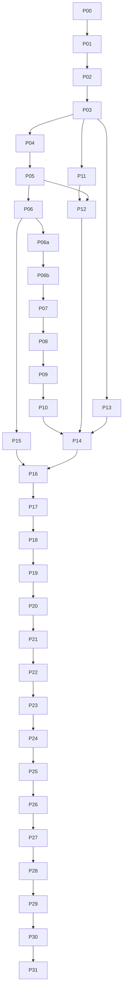

# v3 未完成功能执行计划

日期：2026-09-17。核对源码：`63f7d8e13319d57e946e46d5766703e55d75c9a3`。
状态：供审阅和后续实施的详细计划；本次交付不改变运行中的服务，不代表功能或设备验收通过。

## 1. 执行范围、事实与完成定义

本文件细化 [M00—M07](05-tasks-and-acceptance.md)，只覆盖 SelfModelSwitch 模型服务。
视频业务、FFmpeg、人物/声线、影片数据库、视频质量和外部报告均不在范围内。
[根 README](../README.md) 描述当前服务；历史文档中的命令或“已通过”不自动成为本轮指令或证据。
本计划内标为“新增”的文件、命令、字段均须由指定任务交付后才能使用。

### 1.1 已完成与未完成的边界

| 项目 | 核对结论 | 后续动作 |
|---|---|---|
| M00 首个 Qwen2.5-VL/Orin 探测 | [m00-envelope.md §9—10](m00-envelope.md) 已记录真实探测通过；本轮未 SSH 重验原始材料 | 保留结论，P00 核对材料完整性；不重复建设探测器，不外推到新镜像/设备/模型 |
| M01 注册契约第一片 | `contracts_v2.py` 已提交，21 个现有测试通过 | 补齐 P01 的缺口；它尚未接入生产配置、runner 或 scheduler |
| 控制协议测试 | 工作区有未跟踪 `tests/test_control_protocol_v1.py`，对应模块不存在，收集时报 ImportError | P02 接续并评审此草稿；本次不覆盖、不删除、不代为提交 |
| 旧服务 | 固定四 ID，chat/embedding/rerank、切换、取消、存储恢复与旧部署工具已有实现 | 增量复用，不能宣称 M02—M07 从零开始，也不能将旧实现当成 v3 通过 |
| M02—M05 | 动态注册运行接线、通用会话、Blob、通用执行/控制接口缺失 | P04—P20 |
| M06 | 有旧 renderer、report 校验与打包工具；无 v3 原始证据重算闭环 | P03、P21—P28 |
| M07 | 没有最终 v3 candidate 的 S/B/O 全集验收 | P29—P31 |

`plan/05-tasks-and-acceptance.md` 的“全部待办”和 `plan/validation.md` 的“M00仍待”是旧快照；
本计划采用较新的逐项证据。当前未跟踪设计文件和已修改根 README 属用户现有工作，实施前单独确认基线归属。

### 1.2 本次本地核对记录

使用现有 `.venv/bin/python`，版本 **3.13.5**，不是发布要求的 Python 3.12：

| 命令 | 实际结果 |
|---|---|
| `.venv/bin/python -m pytest tests/test_contracts_v2.py -q` | 21 passed，exit 0 |
| `.venv/bin/python -m pytest tests/test_control_protocol_v1.py --collect-only -q` | 缺少 `control_protocol_v1`，exit 2 |
| `.venv/bin/python -m pytest tests -m 'not thor' --ignore=tests/test_control_protocol_v1.py -q` | 226 passed、1 deselected、2 dependency deprecation warnings，exit 0 |
| `.venv/bin/python -m ruff check .` | exit 0 |
| `.venv/bin/python run.py --check-config` | schema_version=1、旧四 ID，exit 0 |

排除草稿的 226 项只用于说明已有实现基线；不等于完整测试集通过。P02 之后不得沿用此 ignore。
本次没有构建、部署、启动模型或重验硬件，不能生成 `software_verified` / `device_backend_ready` 报告。

### 1.2.1 本轮修复基线（RP00，2026-09-22）

本轮修复（RP00—RP17）的事实复核基线是提交 `79d44d22b225e955e3fb2083c6d2982ec8c83ab7`（短 `79d44d2`）；
本节所在的执行计划与契约冻结基线是 `c1d547aa42d37adb13d58ac02dc3bc86b8a33688`（短 `c1d547a`，只新增 `check/` 文档）。
本节记录的 3.13.5 不是发布要求的版本；RP00 已核验独立解释器
`/Users/monster/.local/share/uv/python/cpython-3.12.11-macos-aarch64-none/bin/python3.12`（Python 3.12.11），
RP01 起的 `$PY` 使用它并在每条验证记录里写明实际版本。

工作区另有**用户未提交**的两个文件。它们不属于任何 RP 的交付，不 reset、不覆盖、不混入无关提交，
由 RP04 以有界策略整合：

| 文件 | 工作区 blob（`git hash-object`） | `git diff` 的 SHA-256 |
|---|---|---|
| `model_scheduler/backend_control.py` | `a6c0b0744af631cf4cb03d46854cdde3b525f7b5` | `45de54f485d0fe8c98191eb45b18860338f2a353a886b65fdb89bb311d196a30` |
| `tests/test_backend_control.py` | `05cfb29b50ab02d6dfa6d7e0d9555392fffb24f2` | `1ffaad7d3b189eb6043c8ff8eaf8ff1c9282b0ccc2bb3cdb3e6e1e04072d243e` |

归属：把加载路径的单次观察改为轮询见证（`ManagedLifecycle._verify_running`）及其测试，等价于被 `a6497fd`
回退的 `142746c`。它与本轮 K1 的重合部分由 RP04 重写，不直接沿用其循环与时钟。

原审查意见见 [`check/20260922-v3plan-review-verification.md`](../check/20260922-v3plan-review-verification.md)。
**该文档整体不是需求**：只有映射到 RP00—RP17 的条目才是本轮范围，映射表见
[`check/20260922-v3plan-execution-plan.md`](../check/20260922-v3plan-execution-plan.md) 第 4 节。

### 1.3 每个实施任务的统一交付规则

1. 在开发机编辑，使用发布 Python 3.12。先写能揭露违约的测试，再实施；测试不得仅复述内部实现。
2. 每任务最多约 5 个文件；下表文件均为明确落点，新增文件须先创建。若实际超出，先拆同 ID 的后缀任务并写明依赖。
3. 运行该任务指定测试，以及第 7 节通用检查。记录完整 SHA、命令、exit code、解释器、证据目录。
4. 审查并原子提交任务文件，不将工作区其他变更打包。未通过检查不得在任务状态表勾选完成。
5. 按 [AGENTS.md](../AGENTS.md) 将目标干净 checkout fast-forward 到同一提交；硬件行为任务还须目标测试证据。
   无目标条件时标 `software_only`，不是该硬件任务完成。
6. 接口任务产出 schema + 正反例 + 消费者测试；模型任务产出正式 API 到停止证据的闭环。
7. 文档数字是约束或输入，不是通过记录；`blocked` 必须写缺少的具体材料及恢复动作。

## 2. 本计划固定的接口与行为约束

以下是本轮实施采用的设计决定；它们不声称已实现。与旧文件冲突处须由相应任务同步原章节和测试。
不能用“实现时再定”跳过下面的约束。只读 facts 无法确定的设备值必须走第 6 节输入门禁。

### C01：注册、runtime 与范围

- v2 注册 ID 沿用 `contracts_v2` 的小写 1—63 字符规则；使用全字符串匹配，拒绝末尾换行/NUL。
  端口 10001—19999，部署内唯一。配置读取时确定模型集合，不增加在线修改注册表 API。
- `assets` 是逐文件表，按 `path` 唯一；同一 role 可有多文件以支持分片。
  adapter profile 规定角色基数：首个 GGUF profile 恰一 model，vision 恰一 projector；HF 分片格式可登记，
  未有 profile/fixture/实测时不得启动或宣称支持。路径检查须涵盖所有父目录、TOCTOU、regular file 和挂载身份。
- 当前可执行 capability 闭集：`chat|vision|embeddings|rerank`。audio、Torch、ORT 是后续扩展，
  新增前必须补自己的 M00、profile、DTO、fixture、evaluator 和 B 场景；不能因接受 runtime_id 就宣称任意 runtime 可用。
- 每个 RuntimeSpec 新增必填 `profile_id`；profile 是代码注册的有限集合，绑定程序/镜像入口、允许参数、
  取值域、ready/terminal 协议和资产角色基数。未知 profile 422；runtime_id 只作部署内身份。
- `startup_args` 保留为“启用的受支持 flag 名称集合”，不能承载值或 shell 文本。
  profile 给每个 flag 定义值来源：固定常量、配置 envelope、已核验资产、固定端口；没有值来源即拒绝渲染。
  M00 的 profile 固定 `--load-mode auto`，不生成 `--no-mmap`；更换加载模式是新候选。
- 配置 schema v2、control protocol v1、candidate/report v3 相互独立。新增 control 请求要求
  `X-SMS-Protocol-Version: 1`，缺失/不支持返回 400 `unsupported_protocol`，响应回显版本。

### C02：内存只加一次裕量，物理驻留另设门槛

现有 `Book.required_for()` 对 v1 reserved_bytes 再乘 margin；v2 的 `reserved_bytes` 已是 R。
二者不能直接混用。内部统一 `effective_reserved_bytes`，v1 在兼容转换处乘原 margin 一次，v2 原样使用。

```python
# v2 精确整数公式，避免 float 在边界上的取整差异
reserved_bytes = (measured_peak_bytes * 115 + 99) // 100
new_bytes = 0 if instance_already_reserved else reserved_bytes
admit = (
    storage_ready and identity_known and slot_available and sample_valid
    and committed_bytes + new_bytes <= model_budget_bytes
    and mem_available_bytes >= new_bytes + free_floor_bytes
)
```

- 已有 R=6106148045 B，对应 measured_peak=5309693952 B；不再乘 1.15。
  样本 `0 <= now_mono - sampled_at <= 2s`；边界等号通过，差 1 byte 拒绝。
- B 不超过 `MemTotal - system_reserve`；默认 reserve=8 GiB、F=2 GiB；实时不再扣 reserve。
  READY 执行 `new_bytes=0`，仍检查 envelope、槽、freshness、F。
- M00 的约 10.5 GiB 驻留总量是估计，不是可填入生产配置的测量值；其中权重描述也与逐文件 bytes 不完全一致。
  P21 必须从原始采样及实际资产重算，禁止相加一个估计后标 measured。
- v2 ModelSpec 增加 `measurement_ref`（测量材料摘要）、`physical_resident_peak_bytes`（未测为 null）；
  登记可未测，生产候选必须为正整数且绑定材料。定义它为运行窗口中该模型及 adapter 的
  不重复计数物理占用上界；采集方法、统一内存重复计数处理随 policy 固定。
- 增加静态物理门槛：每个未 STOPPED 实例计一次
  `physical_reserved_bytes = ceil(physical_resident_peak_bytes * 1.15)`，总和不得超过 B。
  这是对 MemAvailable 增量低估的独立保护，不能替换实时门槛。
  若采集器不能给出可信物理上界，生产不开放该模型；calibration 用显式临时预算、独占维护环境。
- 首版物理测量方法固定为保守 `system_nonfree_upper_bound_v1`：同运行窗口逐样本取
  `MemTotal - MemFree`，每轮取最大、三轮再取最大，原始样本同时保留这两个字段。
  该上界包含OS、page cache及其他进程，不减基线，不把CUDA指标再加一次；它不是“模型净占用”。
  P21须验证目标统一内存的受管计算占用包含于此Linux口径；无法验证则该方法不适用、生产阻塞。
  跨模型相加可能保守重复计入背景占用，此为首版接受的容量代价；更精确的方法必须新增method版本、材料和候选，不能临时扣除估计值。
- UNKNOWN/ERROR/BLOCKED 保留两套预留；请求结束只还执行槽，实例 STOPPED 才还模型预留。
  内存低于 F 关闭新执行并启动受管计算清理；停止后重新采样，最多等 10s，仍不足保持不可准入。

### C03：身份、端口与异步回写

InstanceIdentity = `(container_id, started_at, deployment_id, model_id, runtime_id,
candidate_digest, image_digest)`；started_at 必须为带 UTC 时区的有效时间。
回写 Fence = `(boot_id, model_id, generation, operation_id, execution_id, attempt)`；
非 execution 操作的最后两项为 null，execution 的 attempt 从 1 起且首版不自动重试。
owner/token 不是实例身份替代品；所有异步完成、超时、取消、observer 更新必须检查自己的 Fence。
P03同时固定 Clock（monotonic/UTC）、MemorySample、LaunchOperation 和 EventSink 端口；
EventSink事件含schema_version/event_id/sequence/UTC/monotonic/Fence/type/payload，sequence在boot内递增。
P06起产生结构化事件，P22只实现落盘collector；observer不得反向读取scheduler内存推断启动者是否退出。

拟新增 `ports_v3.py` 定义以下结构化端口；这些签名固定职责，具体 DTO 在 P03 完成：

```python
class BackendPort(Protocol):
    async def load(self, spec: RegisteredModel, fence: Fence, deadline: float) -> Observation: ...
    async def execute(self, request: ExecutionRequest, fence: Fence, deadline: float) -> ExecutionHandle: ...
    async def cancel(self, handle: ExecutionHandle, deadline: float) -> CancelAck: ...
    async def stop(self, identity: InstanceIdentity, fence: Fence, deadline: float) -> StopAck: ...

class ObserverPort(Protocol):
    async def observe(self, target: ObservationTarget, deadline: float) -> Observation: ...
```

CancelAck/StopAck 只表示命令已处理。Observation 必须带采样时间、完整实例身份（存在时）、
端口状态、启动操作/子进程状态和 `RUNNING|STOPPED|UNKNOWN`。执行终结证据另含完整 Fence、
InstanceIdentity、backend 终结原因、设备同步事实及 `compute_quiescent=true`。
本地未 dispatch 请求可直接终结，使用 `dispatch_state=not_started`，不得伪造容器身份。

STOPPED 的唯一计算：已确认容器退出/不存在 AND 启动操作终结 AND 启动子进程退出 AND 固定端口无监听。
不存在必须来自成功的容器清单/结构化 not-found，不能将任意 `docker inspect` 非零解释为不存在。
停止前用不可变 container ID 及标签全身份核对，禁止按名称杀未知容器。端口被未知进程占用时保持 UNKNOWN。
启动用受控、可观察的子进程组；cancel Future 不等于启动子进程退出。重启按 deployment 标签枚举旧实例和启动者，
核验属于本 deployment 后清理，禁止 `runtime.build_scheduler()` 在观察前批量 bootstrap_stopped。

#### C03 增量：本轮修复冻结的 K1—K5（RP00，2026-09-22 同步）

真源是 [`check/20260922-v3plan-execution-contracts.md`](../check/20260922-v3plan-execution-contracts.md) 的
K1—K5。本节只记录对上面 C03 的**增量**、旧/新行为与兼容边界；C03 其余条款不变，C02 公式不改。
所有代码块中的 `...` 仅表示省略的实现体，签名以源码为准。

| 议题 | 旧行为（现有源码） | 新行为（本轮固定） | 兼容边界 |
|---|---|---|---|
| 身份所有者 | `ManagedLifecycle._instances` 私有字典（`backend_control.py:112`），bridge 自写 | 唯一已接受身份是 `Book.Runtime.instance`；`_instances` 删除，bridge `instance()` 只调用注入的只读 `instance_lookup` | adapter 的 identity 回调仍经同一入口取值；不得新增 prepared/committed 身份缓存或待提交映射 |
| 结果字段 | `contracts.Observation` 为 `presence/instance_id/healthy/observed_at` + `detail_code=None`（`contracts.py:74`） | 末尾新增 `instance=None`、`valid_until=None` 两个带默认值字段 | 原五个位置参数构造不变；纯 DTO，不新增 HTTP 字段、不改 control-v1 schema |
| 加载见证 | HEAD 上加载只采样一次（`142746c` 已被 `a6497fd` 回退） | K1 内部 `LifecyclePolicy`（`ports_v3.py`，RP02 已交付）固定 10/0.5/2/2/60；UNKNOWN→RUNNING 精确轮询，截止后零次新观察 | 该组是**软件初值**，不是 C02 硬件已验证参数；测试显式注入短值；不新增环境变量/CLI 开关 |
| 已证停止的加载 | 无此状态 | K3 新增 `Runtime.load_stopped_generation`（本代 marker），转 ERROR 且 `reservation=0`、`admission_blocked=True`、`instance=None`、`last_error=load_proven_stopped` | 普通 `acquire` 在 ERROR 仍抛 `ModelUnavailable`；`warm/preload` 沿用 `load_retry_limit` 消费 marker 后有限重试 |
| UNKNOWN 策略 | adapter 返回 UNKNOWN 后仍可能进入见证轮询 | 只有 adapter 返回 **RUNNING** 才轮询；UNKNOWN/STOPPED/控制异常直接保守保预算，交恢复或受控 cleanup | 不顺带重新设计 adapter readiness 重试；控制超时/取消/StopAck 都不是 STOPPED |
| 新鲜度与截止 | `SAMPLE_MAX_AGE_SECONDS=2.0` 只用于内存样本（`ports_v3.py:47`） | `sampled_at_monotonic` 是采集**开始**时间；RUNNING/STOPPED 需 `0<=now-sampled_at<=max_age` 且 `now<valid_until` | 三级绝对截止 `caller_deadline`→`verify_deadline`→`sample_deadline`，各 I/O 阶段共用，不逐阶段重置；UTC 只用于证据 |
| 模式判定 | 依赖 `getattr(adapter,"release",None)`（`backend_control.py:156`） | `ModelScheduler(..., require_instance_identity=...)` 显式区分；managed 装配固定 True，无弱校验 fallback | 禁止用 `getattr(result,"instance",...)` 或有无某方法猜模式；禁止反射跳过 `release` |
| 恢复 | scheduler 默认 `recovery=None`；`RunContextV2.recovery`（`run.py:72`）是同步 `DeploymentRecovery`（`control_recovery.py:173`） | 新增异步适配器（K5）满足**既有** `ControlRecoveryPort`（`contracts.py:106`），60s 总预算；先关准入→冻结 epoch→排空→才调用 | 删除“drain 超时直接 `book.release(ABORTED)`”作为恢复手段；启动 reconcile 与运行时 recover 用不同接口、同一受限 helper |

**launch 终结事实的已核实来源（K4）**。类型与生产者：`ports_v3.LaunchOperation`（`ports_v3.py:78`，
`is_terminal` 即 `state != "starting"`，`state ∈ {starting, completed, failed}`）由
`model_runner.SupervisedLaunch`（`model_runner.py:45`）产生；消费方是 `DockerProcessObserver.observe` 的可选
`launch_lookup`（`process_observer.py:309`），结果进入 `stopped_is_proven(launch_operation_terminal=...)`
（`process_observer.py:350`）。已核实两处缺口：

1. `launch_lookup` 默认是 `None`，原 `process_observer.py:348` 在 `launch is None` 时取
   `launcher_terminal = True`——即“没有启动记录”被等同于“启动已终结”。生产装配 `run.py:139-142` 只传
   `deployment_id, model_id, port` 三个位置参数，因此恒为 `launch is None`。
   **RP02 已修**：区分“没有来源”与“来源说没有”——未注入 `launch_lookup` 时 `Observation.launch_resolved=False`
   且永不能证 STOPPED；注入后返回 `None` 才是“本 boot 未派发”的正面证据。未注入来源的生产装配因此按设计失败封闭，
   RP04a 的 managed 装配必须显式提供。
2. v2 managed 加载路径 `LlamaCppAdapter.load`（`llama_cpp.py:299-317`）经 HTTP 派发给控制面，不创建
   `SupervisedLaunch`，返回的 `launch_operation` 恒为 `None`（`llama_cpp.py:316`）。
   `SupervisedLaunch` 当前只被 `deploy/model-runner.py:106` 与 `scripts/capture_control_fixture.py:251` 使用。
   **未修**，属另立的控制协议能力任务。

结论：**当前固定控制协议（control-v1 的 load/unload HTTP）不能提供 launch 终结证明**。该分支因此固定为
**失败封闭**，并规定可测试的失败行为：

- 未派发——本 boot 从未对该 target 发起启动**且观察者能正面确认**——才可证明“无 launch”；
- 派发后失联必须保持 `launch_unresolved` → UNKNOWN。**禁止**用 `asyncio.Task.done()` 代替：它只说明协程结束，
  不说明启动子进程或容器启动已退出（同 C03 现有“cancel Future 不等于启动子进程退出”）；
- 该分支下 bridge 不得返回 STOPPED，`DeploymentRecoveryPort.recover` 必须 `ok=False`；
- RP04 断言该分支返回 UNKNOWN + `launch_unresolved` 且 STOPPED 次数为 0；RP07 断言该分支 `ok=False`。

让控制面暴露逐 load 的启动操作状态（或让 managed 加载改走 `SupervisedLaunch` 监督路径）是**新的控制协议
能力**，另立任务；本轮不得伪造接口实现，也不得默认 `terminal=True`。

**采样时刻与取消边界（RP02 已交付）**：一次观察是一个有界工作单元。`ps`、`inspect`、进程探测与端口探测共用同一个
`sample_deadline = min(caller_deadline, sampled_at + observation_timeout_seconds)`，在同一 worker 线程内串行执行；
任一段耗尽窗口即返回不完整事实，**不以其他事实补猜**。返回后在消费前复核：`now >= deadline` 或
`now - sampled_at > observation_max_age_seconds` 的结果一律不得携带终态。`sampled_at_monotonic` 是本次采集
**开始**时刻，不是结束时刻。`probe_loopback` 的连接超时取 `min(0.5s, 剩余时间)`，截止已过时一次不连。
截止限制的是**新工作派发与结果接受**：超时后的子进程回收仍须完成并记录，不得在未回收完成时声称资源静默；
`task.cancel()` 不等于子进程退出，也不能当作 launch 终结事实。

**恢复 helper 的「下令停止」与「采集到停止」（RP06 已交付）**：`DeploymentRecovery` 的 listing、inspect、stop
与复查四个阶段全部走 `DeadlineDocker`，共用同一个绝对 deadline，且每一段派发**之前**各自检查剩余预算——不再只在
循环外判断。`docker stop --time` 取**剩余预算**（不超过既有的 30s 宽限），因此 helper 不会比整体期限等得更久。
语义边界必须分清：`stop` 的退出码 0 只是**下令停止**，只有复查（或结构化 not-found）才**采集到停止**；
复查做不出来时按未知结果保守失败，绝不因为命令已发出就记为已停止。helper 只操作本 deployment 的容器，
旧 identity 不得重定向到新容器。

**异步恢复端口的输入与信任边界（RP07 已交付）**：`DeploymentRecoveryPort`（`control_recovery.py`）是调度器在
准入已关闭、旧动作排空之后唯一可调用的运行时恢复入口，满足**既有** `ControlRecoveryPort` 形状——只有
`async def recover(self, deadline: float) -> RecoveryResult`。输入只有调用方的绝对 deadline，加上构造时注入的
`DeploymentRecovery`、逐模型 `ObserverPort` 映射与 `LifecyclePolicy`；它**不持有** `Book`、不接收写回回调，也不自行
关闭准入（`reconcile` 的 `close_admission` 在端口内是 no-op——关闭准入是调度器先做的事）。输出是**事实报告**而非
裁决：`ok=True` 要求 helper 证明本 deployment 每个容器都已停止，且每个登记模型都被独立见证为 STOPPED、launch 维度
已解析、身份属于被问的模型、样本在接受时仍在 `observation_max_age_seconds` 内且未越过总 deadline；`stopped_models`
是模型 ID 的**全集**（不是 container id 集合），缺一项即 `ok=False`。端口从不下令 `docker rm`：已停止但未删除的
容器是合格结果。失败一律 `phase="failed"` 加有限内部码（`recovery_timeout`、helper 的 `stop_failed` /
`container_listing_failed` 等、`observation_unknown`、`launch_unresolved`、`observation_identity_mismatch`、
`observation_stale`、`observer_failed`、`recovery_failed`）；helper 或 observer 抛出的未知异常保守折算为失败，
不向上传播、也不虚报成功。同步 helper 在**受跟踪**的 worker 线程中执行：取消端口调用不会丢弃仍在运行的线程句柄
（`pending_workers()` 可查，完成后清理），且一个总 deadline 贯穿 helper 与全部模型观察。

**控制阶段的边界（RP03 已交付）**：`ManagedAdapterPort`（`ports_v3.py`）显式声明 `load/stop/release`，
`release` 是声明的能力而不是靠 `getattr` 猜出来的。三条控制调用都取调用方的绝对 deadline：已过期一次 HTTP 都不发；
执行中用剩余时间收敛，超时/未回执一律返回**不可证**——load 返回 UNKNOWN 且 `launch_resolved=False`（**不是** STOPPED，
也不许伪装成“未派发”，因为命令可能已经发出），stop 返回 `StopAck(accepted=False)`。取消直接向上抛，不折算成“被拒绝”。
adapter 从不监督 launcher，因此它给出的 Observation 恒为 `launch_resolved=False`：启动是否终结只能由观察侧证明。
正常模型协议与 legacy 客户端路径不变。遗留缺口：bridge 仍以单参数调用 `release(model_id)`，
`deadline` 因此暂留默认值，RP04 改桥接时一并去掉。

**ERROR0 与两个维度（RP05 已交付）**：`Book.load_stopped(op, now, code="load_proven_stopped")` 把「本代加载已被证
停止」写成 ERROR + `reservation=0` + `admission_blocked=True` + `instance=None` + `stopped_at=now` + marker
`load_stopped_generation = 当前 generation`。**错误与准入是两个独立维度**：ERROR0 仍是错误，普通 `acquire` 照旧抛
`ModelUnavailable`；两个 committed（逻辑预留与静态物理）各下降一次，但那只是预算回来了，不代表模型可用。
反向约束同样重要：**不能**只凭「ERROR 且零预留」或历史 `stopped_at` 认定本代可重试——`failed`、`begin_load`、
`begin_recovery` 都清 marker，`begin_recovery` 后旧停止证据不得跨 epoch 授权重试。
`Book.retry_stopped_load(model_id, *, expected_epoch, expected_generation)` 只消费本代 marker，不发 Docker 卸载；
warm/preload 的额度在**同一把锁内**重查并计数，两个并发 warm 不会各自花掉一份。

### C04：会话与执行状态机

| 对象 | 状态/转换 | 约束 |
|---|---|---|
| session | `preparing -> active -> draining -> closed`；preparing 可转 draining；draining 可转 blocked；blocked 确認停止后转 closed | 排队是 preparing 的 `phase=queued`，另有 draining_existing/loading；不新造 ready 状态 |
| execution | `queued -> running -> succeeded|failed`；queued/running 可转 cancelling，后续转 cancelled 或 failed | 无可信停止/终结则保持 cancelling，不超时伪造 terminal |
| model | 复用 unknown/unloaded/loading/ready/evicting/error | 只有 unloaded 可开始 load 并增加 generation |

- 单个 ACTIVE 通用会话独占整个模型服务；会话内最多 `envelope.max_parallel` 个 execution，
  其余进入有界队列。旧交互接口原并发语义保留；会话冻结阶段暂停其新准入，已有 lease 正常完成。
- session queue 容量128、等待1800s；priority 来自服务端 owner 配置，默认0、范围0..1000，客户端不能提交。
  排序键 `(-priority - floor(wait_seconds / 30), sequence)`，sequence 在同一 boot 中严格递增。
- 尝试授予时在同一锁内冻结交互准入，最多 drain 30s；超时解除冻结、保留 waiter 原 sequence/入队时间，
  30s 后才可再尝试，不杀已有 lease；不能重置总等待1800s。pinned/preload 任意冲突返回409。
- `prepare_deadline=min(grant_started+900s, hard_deadline)`；等待队列不计入准备900s。
  hard deadline 从会话创建算起，`session_hard_timeout_seconds` 是配置正整数1..86400，首个 profile 默认3600s。
  queued 阶段截止为 min(created+1800s, hard_deadline)；清理60s是截止后独立清理窗口。
- ACTIVE 起 `expires_at=min(now+30s, hard_deadline)`；建议客户端每10s心跳。
  now>=expires_at 时 heartbeat/submit 必须409，不能续活；心跳不改变 hard_deadline。
- preparing阶段未启用ACTIVE TTL，view的expires_in_ms=0、hard_remaining_ms正常倒计时；
  heartbeat返回409 busy，客户端用GET查询，不因该0值在服务端触发ACTIVE过期清理。
  排队中close只撤销自己的waiter/未派发操作；未持有独占权、无所属实例/启动者/lease时直接closed，绝不停止另一会话的模型。
- close/TTL/hard deadline 在锁内先禁止 submit/renew，然后 cancel 等10s、stop grace30s、总清理60s。
  无法证明停止转 BLOCKED，health503，每5s对账；未清干净不得授予下一会话。
- 同模型尚有其他 lease 时，请求取消先冻结新准入，等待其他有效 lease 结束再停止实例。
  session close 可以取消本 session 全部 execution；独占保证不存在其他 owner 的有效 lease。
- 锁内只改内存状态；生命周期 load/stop 由一个 worker 串行消费。推理可按槽并发，不占住生命周期队列。
  等待执行完成、hash、Docker、sleep、HTTP、磁盘 I/O 全部在锁外，结果按 Fence 回写。

### C05：协议 DTO、错误与幂等

保留 [03-api](03-api.md) 路由；新增接口用严格 JSON，拒绝重复 key、未知字段、非有限数、bool 冒充整数。
嵌套任意字符串必须合法 UTF-8、无 NUL。禁止宿主路径/远程 URL、argv、端口、预算、job/stage/pipeline 输入。

| DTO | 精确约束 |
|---|---|
| SessionCreate | model_id、idempotency_key 必填，correlation_id 可选；key 1..128 UTF-8 字节，correlation 1..128；不接受 owner/priority/deadline |
| SessionView | session_id、state、phase、boot_id、model_id、expires_in_ms、hard_remaining_ms、owner_token、error；剩余值为非负整数；closed token=null |
| ExecutionCreate | session_token、operation、input、parameters、idempotency_key 必填；operation 必须在模型能力表；parameters 规范 JSON <=8192 bytes且按 operation 白名单解析 |
| ExecutionInput | 恰含 inline 或 blob；inline 是非空对象，规范 JSON <=4 MiB；blob 是 BlobRef |
| BlobRef | blob_id、owner、sha256、size_bytes、media_type；sha256 小写64hex，size 1..1 GiB，media_type 小写 type/subtype 无参数；owner必须与服务元数据相等 |
| ExecutionView | execution_id、state、dispatch_state、compute_quiescent、result、error、instance、fence；非terminal的quiescent/result/error为null |
| terminal | succeeded 必须 result、无 error；failed/cancelled 必须 error、无 result；已dispatch必须instance/fence完整且quiescent=true；not_started可无instance，但带Fence且证明未送后端 |

P02 扩展现有草稿测试以覆盖新字段；不得为了保留测试而接受不完整终结证据。
外部 ID 为服务生成的不透明小写 ID；每boot生成随机256bit服务密钥，token固定为
`boot_id + "." + base64url(HMAC-SHA256(boot_key, canonical(boot_id, session_id, model_id, owner)))`。
密钥仅存本进程内存，重启换key；服务存token摘要用于验证，GET可由绑定字段重算同token，解决摘要不可逆问题。
日志/status/持久元数据永不输出token或boot_key。
GET session 只向 owner 返回有效 token；其他 owner 一律404，避免透露对象存在。

幂等索引键 `(boot_id, owner, route_kind, idempotency_key)`；同 key 比较独立的规范 payload hash，
相同返回原对象，不同409 `idempotency_conflict`。hash 不含 token 原文，但以解析得到的 session_id/boot 代替其绑定，
不能把 payload_hash 放进索引主键而漏掉冲突。活跃对象不清理；终结后保留86400s。客户端不得依赖跨重启幂等。
会话/执行重启失效返回409 `stale_token`；对象查询在旧 boot 返回404，不能接管重放。
POST第一次202，幂等重放返回对象现态且不重复副作用；close/cancel 未完202、已完200。

| HTTP | 固定 error.code（retryable） |
|---|---|
| 400 | malformed_json、unsupported_protocol（false） |
| 403 | peer_forbidden（false，仅建连接/无对象操作） |
| 404 | not_found（false） |
| 409 | stale_token、session_expired、idempotency_conflict（false）；busy、blob_in_use（true） |
| 410 | reference_expired（false） |
| 413 / 415 | payload_too_large / unsupported_media_type（false） |
| 422 | contract_violation、envelope_exceeded、capability_mismatch（false） |
| 429 | queue_full、quota_exceeded（true） |
| 502 | backend_failed（false，执行是否已发生不确定，不自动重试） |
| 503 | instance_unknown、storage_unavailable、resource_unavailable、temporarily_unavailable（true） |
| 504 | queue_timeout（true）、execution_timeout（false） |

retryable 表示状态可能恢复；只有确认 not_started 或查询原幂等对象后才能决定重试，服务端不盲重发推理。
通用错误体沿用03-api；request_id 长度1..128字节。队列满不是 health 失败，BLOCKED/UNKNOWN/storage fault 是。

### C06：能力输入和 envelope

- control v1 的 chat/vision inline 使用 `messages`，与受支持 OpenAI chat 消息格式一致；
  Blob 输入对 chat/embeddings/rerank 是 `application/json` 且内容等价 inline。
  vision 的 Blob 输入可为 image/png 或 image/jpeg，parameters 中 text 必填，adapter 构造一条用户消息。
- parameters 闭集按能力定义：chat=`max_tokens,temperature,top_p,seed`；vision 同上加 text（只用于 image Blob）；
  embeddings=`encoding_format`（首版仅 float）；rerank=`top_n,return_documents`。
  正整数/有限数及范围由 schema 写死；temperature 0..2、top_p (0,1]、seed 0..2^31-1。
  max_tokens 默认4096但取 min(4096,模型max_output_tokens)；rerank top_n 默认文档数、不得大于文档数。
- embeddings inline=`input`（非空字符串或非空字符串数组）；rerank=`query,documents`（非空字符串数组）。
  batch/document 上限作为能力 profile 必填正整数，绑定 candidate；没有实测值不得生产开放该能力。
- 文本 token 包含 chat template、特殊 token、全部消息及视觉 token；必须用同 runtime tokenizer/template
  或有证明的保守上界检查，不能用字符数估计。先做有界格式/尺寸验证，再受限计数，最后 dispatch；
  runtime 无法预先确定图像 token 时按登记最坏1280计入输入预算。
- Qwen envelope：每槽ctx32768、输入<=28672、输出<=4096、输入+输出<=ctx、每请求图像<=1、
  每边<=1024、视觉token<=1280、并发<=2；新增 `max_images=1` 明确消除原 schema 漏项。
  其他模型的 max_images 非vision为0；图像按解码后像素检查，压缩体积小不绕过尺寸限制。
- control 的输出统一为 BlobRef：文本/embedding/rerank 为 application/json、保留对应协议 shape；
  SSE 只存在旧chat接口。能力不匹配422，未知模型404；没有新增音频专用路由。

### C07：Blob 持久元数据与暂存生命周期

- POST /internal/blobs 使用二进制 body、Content-Type 和必填 `X-Content-SHA256`；支持有界分块接收，
  Content-Length 可选但若有必须一致；只接受能力表登记的 application/json、image/png、image/jpeg。
  成功201+BlobRef。GET200；过期410；DELETE未持有时204（已删除同owner仍204），执行持有时409。
- owner 由 peer UID 映射，不接受自报身份；上传逐块hash、临时文件独占创建、校验后原子发布。
  `input` BlobRef 中 owner/hash/size 不可信，执行时必须和数据库、打开的文件一致。
- 使用服务独占 SQLite 元数据：blob_id/owner/hash/size/type/state/created_at/expires_at/path；
  仅blob归属/配额/过期元数据持久化，不保存客户端业务任务。完成元数据与文件用恢复日志协调，
  崩溃点测试覆盖文件已rename但事务未提交、事务已提交但文件丢失。
- 输入上传成功起24h过期；输出执行终结起24h过期；执行读取租约内禁止删除/GC，过期后禁止新引用。
  超过过期时刻的活跃租约继续保护文件；最后一个租约释放后清理，保留owner tombstone 24h返回410。
- 默认单owner 4 GiB、全局16 GiB、磁盘余量2 GiB；部署可显式修改并进入candidate摘要。
  upload在接收前预留声明大小，chunked无长度预留1 GiB；输出dispatch前预留profile输出上限。
  并发写入按“已发布+临时+已预留”原子检查配额/余量，不能各自读df后超卖。
- 输出上限来自 profile，最大1 GiB；超限不发布部分结果。取消先标不可提交，晚到结果只清理暂存。
  文件名只用服务生成ID，目录逐级no-follow，拒绝symlink/非regular/逃逸；worker只能访问指定输入和自己的输出目录。
- 启动重新校验已发布文件/元数据hash后开放读取；未完成upload和旧执行输出隔离清理；
  若旧实例未停止，保留相应读取保护直到观察到STOPPED。禁止先清理它仍在使用的文件。

### C08：Unix 身份与单进程双入口

loopback HTTP 和 control.sock 必须共享一个 Scheduler/Book/BlobStore/boot_id/instance_lock。
不允许启动第二个调度进程或两份 lifespan。控制路由不得注册到普通 TCP listener。
control.sock 权限0660，服务账号所有、登记客户端组；owner=`uid:<decimal>`，每个允许UID唯一owner。
本机进程同UID属于同owner；首版不声称提供同UID内部隔离。

control listener 适配器必须从 accepted Unix socket 读取 Linux SO_PEERCRED，将可信 UID 注入服务端 scope；
不能从 X-Owner、X-UID、request body、反向代理头或普通 ASGI client 地址取得身份。
采用同事件循环的 TCP ASGI listener + 独立 Unix HTTP listener 适配器，协议解析复用依赖中的 HTTP 实现；
实现前 P17 的真实 Linux 契约测试必须证明 peer credential 可达 handler，失败则阻塞，不退化为相信请求头。
仅接受HTTP/1.1有界请求，禁止upgrade/proxy；关闭时两入口先停止接收，共享清理只执行一次。

#### C08 增量：准备/开放分离与唯一 lifespan（K7，RP00 同步）

真源是执行契约 K7；下面接口当前均不存在，由 RP13/RP14 交付。现有 `ControlServer`（`control_server.py:149`）
只有 `start()`/`stop()`。增量：

- 准备与开放分离：`prepare()` 只 bind 不 accept，并在 chmod/chown 成功后返回；`activate()` 仅能在 prepare
  成功后调用；`stop()` 幂等且只清理本次启动拥有的资源。`start()` 保留为 `prepare(); activate()` 的兼容便利入口，
  **正式双入口装配不得调用**。
- 新增进程内共享 `ServingGate`：`ready` 是进程内对象，不能由客户端 header/body 控制。两个业务入口的 ASGI
  包装都在 **dispatch 前**检查 gate；未 open 时业务请求返回现有 503 格式，不读 body、不创建 Blob、不排队/加载；
  TCP `/live` 可作存活诊断，`/health` 必须 503 且不触发业务。
- 新增薄 `TcpServerAdapter`，以 `ready: asyncio.Future` 等 Uvicorn startup 的真实结果（当前锁定 0.53.0）；
  禁止固定 sleep 推测就绪，禁止其他模块直接读/改 Uvicorn 内部 server 列表。
- `serve_v2` 是唯一 owner：gate 关闭→准备 TCP 原生 socket 与 Unix listener（`start_serving=False`）→验证组并
  完成权限→启动 reconcile→进入 TCP 应用**唯一** lifespan（Uvicorn `lifespan="off"`，control app 不跑 lifespan）
  →启动 TCP 适配器→Unix activate→`gate.open()`。任一 bind 失败不启动 preload；任一失败走统一 finally。
- 停止顺序固定：gate.close→两入口停止 accept→按截止排空/取消入口连接→退出唯一 lifespan 并执行共享
  scheduler shutdown **一次**→回收自有 socket/clients。不能先关共享 Book/Blob 再让另一入口继续请求。
- 0660 与登记客户端组是文件权限层，UID 白名单是连接层：非白名单连接仍在 HTTP 解析前关闭，不改成 403。
  清理只 unlink 仍属于本次 bind 的 inode，不删除已有 live listener 的 socket。

### C09：候选与证据身份

M01 的部署登记digest不是 v3 candidate digest。新增严格文档：

| 文档 | 必填字段族 |
|---|---|
| CandidateV3 | schema_version=3、deployment_id、source_archive_sha256、config_sha256、device、runtime_stack、runtimes、models、measurement_refs、fixture_refs、policy、collector_sha256、evaluator_sha256 |
| Device | machine_id_sha256、architecture、device_tree_sha256、mem_total_bytes、OS/kernel、GPU identity、driver/JetPack、容器版本、电源/时钟模式、模型盘/暂存盘UUID |
| ArtifactRef | relative_path、size_bytes、sha256；不得symlink、绝对路径、重复路径或逃逸 |
| CaseAttempt | case_id、run_id、attempt、candidate_sha256、device_digest、started_at、ended_at、boot_id、events/raw_refs、collector/evaluator身份、exit_code |
| AcceptanceReportV3 | schema_version=3、candidate_sha256、device_digest、run_id、started_at、ended_at、case_attempt_refs、每case最终attempt引用、artifact_manifest；summary不作为判定依据 |

必测集合精确取 [06-acceptance](06-acceptance.md)：S01..S06、每模型六类B、每cap一个B、O01..O06。
允许同case保留失败attempt，但最终映射每case恰一个，所有attempt必须可追溯，不能删掉失败记录。
重复最终结论、未知case、缺case或缺fixture/evaluator一律拒绝。

摘要规范：sort_keys、紧凑分隔、UTF-8、不转义非ASCII、禁NaN、展开默认值；无语义顺序的
模型/runtime/assets表分别按ID/path排序；有语义顺序的输入数组不排序。
配置摘要只去顶层 candidate_sha256；candidate本体不含自身摘要、运行结果、宿主绝对路径、证据输出目录、生成时间。
资产相对路径及fixture/measurement逻辑artifact key是语义输入，必须纳入摘要；外部材料的宿主定位另由manifest映射。
`candidate_sha256=sha256(canonical(candidate_body))`，再回填配置；hash链不能反向引用report。
源码归档用明确清单，只含运行/采集/评价/测试/锁文件，排除生成配置、plan归档、evidence、bundle、模型、凭据。
最终bundle另有file manifest，不回填candidate。改运行代码/配置/runtime/设备/预算/policy/evaluator须新candidate。
纯源码归档由P22独立的 `acceptance source` 生成，不调用需要deployment的旧build-release，避免形成发布循环。
归档输入是clean commit中的 `app.py`、`run.py`、`model_scheduler/`、`scripts/`、`deploy/`、`tests/`、
`pyproject.toml`、`requirements.in`、`requirements-dev.in`、`requirements.lock`、`requirements-dev.lock`；
目录仅收已跟踪regular文件，排除其中任何生成证据/权重/凭据。固定prefix为source、字典序文件清单、
uid/gid/mtime=0、gzip mtime=0；不嵌入commit时间或归档自身摘要，源码字节不变则归档hash不变。

#### C09 增量：候选材料范围与多模型链（K6 分阶段，RP00 同步）

真源是执行契约 K6。本轮**不改**上表字段族与摘要规范，只补充输入范围与分阶段边界：

- 第一阶段（RP10）：`--measurements DIR` 单目录模式只允许**配置中恰好一个模型且已测**。全未测、混测、
  已测但缺物理峰值或材料错配，一律输入错误 exit2，不写 candidate、不覆盖已有输出、不删历史候选。
  现有 `build_candidate`（`acceptance/candidate.py:195`）的 `measurements_dir` 是必填 `Path`，改为
  `Path | None = None` 并新增 `measurements_index`，两者互斥且必须恰好一个。
- 第二阶段（RP11/RP12）：**仅当最终生产模型数 > 1 时必需**。新增 `--measurements-index` 严格 JSON，
  按 `model_id` 索引材料目录，目录相对 index 父目录且不进入语义摘要；artifact key 统一为
  `measurements/<model_id>/<原相对路径>`。每个模型的 `measurement_ref` 仍按加 namespace **之前**的局部清单
  计算以保持校准原摘要语义，全局 candidate 摘要绑定加 namespace 后的引用。flat 与 namespace 不可混用。
- 拒绝未知键、重复 JSON 键、重复 model_id、绝对路径、`..`、symlink 及所有路径逃逸；材料模型集合必须等于
  配置模型集合。缺材料/改 bytes/hash/错 namespace 退出 2；材料完整但测量语义失败退出 3。
- 逐模型复用 `require_production_openable`——实际位置是 `contracts_v2.py:568`（不在 `candidate.py`）。
- C02 物理门槛与 O01 不放宽；candidate 摘要中的 `passed` 只作构建前置输入，不能替代正式 evaluator 重算。
  不满足多模型时，不能靠从配置删掉模型来伪装完成原发布范围。

## 3. 依赖图与检查点

下表“依赖”是硬前置；任务只读准备可提前，未满足依赖不能把实现合并为已完成。
每个检查点运行第7节G检查；原M02/M04/M06/M07检查点保留，不以中间checkpoint代替。



| 检查点 | 任务结束位置 | 必须能演示的行为 |
|---|---|---|
| K0 | P00—P02 | 基线差异可解释；注册和控制DTO正反例通过，草稿不再阻断收集 |
| K1 | P03—P05 | schema/ports/hash链固定；配置显式迁移后所有资产可核验 |
| K1a | P06—P06b | 真实llama-swap控制契约、动态lab配置与受限启动可用 |
| CP1 / M02 | P07 | 受限启动、身份、迟到启动、独立停止完整闭环 |
| K2 | P08—P10 | 资源单次预留；公平会话；TTL与取消不提前清账 |
| K3 | P11—P13 | Blob上传/重启/删除闭环；幂等无重复副作用 |
| K4 | P14—P16 | 真实协议adapter接线；可信终结与取消/停止证明 |
| CP2 / M04 | P17—P18 | 两UID通过Unix控制完成create→execute→cancel/close，身份隔离成立 |
| K5 / M05 | P19—P20 | 旧API/SSE回归，动态模型和vision envelope生效 |
| K6 | P21—P23 | 实测输入→candidate→真实B执行器，材料可逐项定位 |
| K7 | P24—P26 | O执行器、离线重算、production render/preflight拒绝伪通过 |
| CP3 / M06 | P27—P28 | 锁文件/CI/独立发布包/回滚流程完整，仍不宣称真机通过 |
| CP4 / M07 | P29—P31 | 最终candidate S/B/O全集与现场preflight/发布冒烟通过 |

模块导入方向：纯contracts → config/ports → runner/observer/storage/adapters → scheduler服务编排 → HTTP/CLI composition。
Book/session/execution 是共享锁下的纯状态对象，不调用HTTP/Docker；adapter不导入app/scheduler；
acceptance executor通过正式API使用服务，evaluator只读材料，不依赖活的scheduler。BlobStore通过端口注入execution服务。

**构建顺序与最终运行分开：** P22—P28先交付工具实现及fixture/依赖注入测试，不能要求P22已有P25生产evaluator，
也不能要求P24已有P26/P27最终部署。该阶段使用明确标记test-only的材料测试契约，不生成可发布通过记录。
P28完成后，P29重做source/candidate，绑定全部最终实现hash，才真实执行全集。
O05测试P26的“现场身份核验原语+篡改拒绝”，不要求包含O05自身的最终报告；P31再执行完整production preflight。
O06使用同最终源码的隔离lab release对演练切current、备份/恢复Blob元数据和回滚，记录两份材料身份；
“没有已验收生产旧版时必须拒绝生产回滚并保持停机”是另一个必测分支，不伪造一份旧版通过报告。

## 4. 有序实施任务

所有勾选框初始未完成。Estimated scope：S=1—2文件、M=3—5文件；设备任务按材料集合计，不修改目标源码。
以下 `python` 必须是Python3.12；测试文件标“新增”的命令只在该任务创建文件后执行。

### P00 — 固定可复现基线和可用输入（M00收尾）

**Primary owner:** backend；**Collaborators:** arch；**Dependencies:** 无；**Estimated scope:** S。
**Description:** 保存当前dirty文件清单和hash，核对M00记录的源commit/runtime/资产/原始证据目录；不重跑已通过探测。
**Files likely touched:** `plan/08-execution-plan.md`（执行记录）、`plan/validation.md`（仅追加本轮记录）。
**Acceptance criteria:**
- [x] 单独列出已提交、未提交草稿、旧事实冲突；不将用户草稿误判为已实施。
- [x] Python3.12环境可用；目标硬件按AGENTS命令核验；M00材料在目标或只读副本可核对hash及3轮停止记录。
- [x] 缺材料则标待核验并列恢复来源，不把文档转写成原始证据；不重新触发模型试验。
**Verification:** `git status --short`、`git rev-parse HEAD`、`python --version`；完整测试集预期仅已知草稿收集失败，保存输出。
**本轮执行记录（2026-09-17）:** status=complete；source_commit=`63f7d8e13319d57e946e46d5766703e55d75c9a3`；
python=3.12.11（`/Users/monster/.local/share/selfmodelswitch/venv312`，原 `.venv` 为 3.13.5 不满足 `requires-python`）；
target_commit=`63f7d8e13319d57e946e46d5766703e55d75c9a3`（`/home/jtzn/SelfModelSwitch`，工作区干净）；
M00 通过轮 run1—run3 均 `quiescent=true`，模型资产与 runtime 自校验复核一致；未重跑模型试验。
未提交草稿、旧事实冲突、命令 exit code、基线 manifest 与待核验项见 [validation.md](validation.md) 的 P00 记录。

### P01 — 补齐动态登记契约（M01）

**Primary owner:** arch；**Collaborators:** backend；**Dependencies:** P00；**Estimated scope:** M。
**Description:** 在已有v2契约上实现C01/C02/C06缺项，保留v1运行行为。
**Files likely touched:** `model_scheduler/contracts_v2.py`、`tests/test_contracts_v2.py`、`plan/04-deployment.md`、`plan/02-scheduler.md`。
**Acceptance criteria:**
- [x] 同role分片按path唯一；GGUF profile基数单独校验；新增profile_id、max_images、测量引用和物理峰值字段。
- [x] 所有字符串全匹配、path拒绝NUL/父路径；JSON `1e999`、嵌套非有限值、未知字段均拒绝。
- [x] v2 reserved精确整数计算，无二次margin；measurement为空只能登记/隔离校准，不能生产开放。
**Verification:** `python -m pytest tests/test_contracts_v2.py -q`；补分片、duplicate path、尾换行ID、1-byte和未测生产拒绝案例。
**本轮执行记录（2026-09-17）:** status=complete；起点 commit `62c0036`；python=3.12.11；
`pytest tests/test_contracts_v2.py -q` = 35 passed（实现前 18 项失败）；
`pytest tests -m 'not thor' --ignore=tests/test_control_protocol_v1.py -q` = 240 passed, 1 deselected；
`ruff check .` exit 0；`run.py --check-config` 仍为旧四 ID，v1 运行行为未变。
新增契约：`PROFILES`（`llama-cpp-gguf-v1` 可执行、`hf-sharded-v1` 仅登记）、`RuntimeSpec.profile_id`、
`Envelope.max_images`、`ModelSpec.measurement_ref`/`physical_resident_peak_bytes`、`reserved_bytes_from_peak`、
`physical_reserved_bytes_from_peak`、`effective_reserved_bytes`（v2 原样、v1 兼容处只乘一次原 margin）、
`require_startable_profile`、`require_production_openable`、按 path 唯一的 asset 表。
文档同步：04-deployment §1、02-scheduler §5。未解决：`hf-sharded-v1` 无自身 fixture/实测因而不可启动
（argv 渲染属 P06，测量与 fixture 属 P15/P21）；本任务不产生硬件证据也无此项。目标 checkout 已同步到同一提交。

### P02 — 完成控制协议v1 DTO与错误表（M01）

**Primary owner:** arch；**Collaborators:** backend；**Dependencies:** P01；**Estimated scope:** M。
**Description:** 以C03—C06消除现有测试草稿对应实现缺失，导出可供独立客户端使用的schema。
**Files likely touched:** `model_scheduler/control_protocol_v1.py`（新增）、`tests/test_control_protocol_v1.py`、`schemas/control-v1.json`（新增）、`plan/03-api.md`。
**Acceptance criteria:**
- [x] parser/schema状态、字段、字节限制、版本、错误码一致；succeeded无result/不静止/缺Fence全部拒绝。
- [x] queued取消用not_started证据合法；不得要求伪造未创建的container；扩展草稿中缺失字段测试。
- [x] inline/blob互斥、parameters能力白名单、所有int/bool/NaN/未知字段正反例完备；schema生成可重现。
  新命令 `python -m model_scheduler.control_protocol_v1 export-schema --output schemas/control-v1.json` 只从DTO生成；测试重导出并按字节比较。
**Verification:** `python -m pytest tests/test_control_protocol_v1.py tests/test_contracts_v2.py -q`；全tests收集不再ImportError。到K0。
**本轮执行记录（2026-09-17）:** status=complete；起点 commit `5a8e2d9`（GitHub 推送记录）；
实现提交 `c17eb7b`；python=3.12.11（`/Users/monster/.local/share/selfmodelswitch/venv312`）；
`pytest tests/test_control_protocol_v1.py -q` = 31 passed（草稿期 3 项因缺少新必填字段失败，扩展后全覆盖）；
`pytest tests/test_control_protocol_v1.py tests/test_contracts_v2.py -q` = 66 passed；
`pytest tests -m 'not thor' -q` = 271 passed, 1 deselected（不再需要 ignore，K0 达成）；`ruff check .` exit 0；
`run.py --check-config` 仍为旧四 ID，v1 运行行为未变。
新增 `model_scheduler/control_protocol_v1.py`（严格 DTO、错误表、每能力参数闭集、schema 导出）与 `schemas/control-v1.json`
（16969 B，测试重导出按字节比较）；测试覆盖 terminal 证据（result/error/quiescent/必填 fence、fence 必须指向该 execution）、
dispatch/instance 配对（not_started 不得携带容器身份）、会话视图全字段与 owner_token 恰在 closed 为 null、
参数范围与非有限/bool 拒绝、字节与 UTF-8/NUL 限制、24 码错误表逐项一致。
`plan/03-api.md` 新增 §5 并标注 §2 的已固定部分。HTTP 路由、身份接线与 Blob 存储仍待 M04；本任务不产生硬件证据。

### P03 — 固定内部端口与candidate/report结构（M01）

**Primary owner:** arch；**Collaborators:** backend；**Dependencies:** P02；**Estimated scope:** M。
**Description:** 实现C03/C09的纯类型/严格解析器及材料字段，使下游不通过互相导入业务模块获得类型。
**Files likely touched:** `model_scheduler/ports_v3.py`、`model_scheduler/evidence_contracts.py`、`tests/test_ports_v3.py`、`tests/test_evidence_contracts.py`（均新增）、`plan/06-acceptance.md`。
**Acceptance criteria:**
- [x] observation/terminal/fence可以表达启动中、未知和未dispatch终结；每消费者有fake端口契约测试。
- [x] CandidateV3/CaseAttempt/Report与必测集合唯一映射可解析；结构合法不等于passed。
- [x] canonical/default展开/hash无环有golden例；绝对/逃逸/重复artifact路径拒绝；hash不包含report生成时间。
**Verification:** `python -m pytest tests/test_ports_v3.py tests/test_evidence_contracts.py -q`。
**本轮执行记录（2026-09-17）:** status=complete；起点 commit `0bb8298`；实现提交 `8974a10`；python=3.12.11；
`pytest tests/test_ports_v3.py tests/test_evidence_contracts.py -q` = 28 passed（ports 16 + evidence 12）；
`pytest tests -m 'not thor' -q` = 299 passed, 1 deselected；`ruff check .` exit 0；`run.py --check-config` 仍为旧四 ID。
新增 `ports_v3.py`：Observation（running/stopped/unknown 加端口、启动操作、子进程事实）、LaunchOperation（starting 无终结时间、
terminal 必须有）、MemorySample 与 C02 `0..2s` freshness 边界、EventRecord（sequence 从 1、UTC aware）、ExecutionRequest
（inline/blob 互斥）、ExecutionHandle、CancelAck/StopAck（只表示命令已处理）、TerminationEvidence（dispatched 必须有完整
实例身份与 execution fence；not_started 不得携带容器身份）、BackendPort/ObserverPort/Clock/EventSink 四个 runtime_checkable
端口及 fake 契约测试（含缺方法必须不满足协议），以及唯一 STOPPED 计算 `stopped_is_proven`（容器不存在+启动操作终结+
子进程退出+端口无监听；未知进程占用端口保持 UNKNOWN）。
新增 `evidence_contracts.py`：CandidateV3/DeviceFact/RuntimeStackFact/PolicyV3/CaseAttempt/CaseFinal/AcceptanceReportV3
严格解析（复用 contracts_v2 的模型/runtime 解析器）；必测集合由候选派生（S01—S06、O01—O06、每模型六类 B、每能力 B），
每 case 恰一个可追溯 final、失败 attempt 永久保留、未知/缺 case/重复最终结论/伪造 summary 拒绝、报告起止必须等于
最早/最晚 attempt 时间；policy 只可比 06-acceptance 门槛更严（1800s、100 请求、0.1 错误率等）；candidate/device/artifact
摘要使用规范 JSON（字段全展开、无自摘要、无 report、无生成时间、无宿主路径），artifact 路径拒绝绝对/逃逸/控制字符/重复。
`plan/06-acceptance.md` 补充 schema v3 来源与 case id 语法。HTTP 接线与真实执行仍待后续任务；本任务不产生硬件证据。

### P04 — 配置v2读入与显式v1迁移（M02）

**Primary owner:** backend；**Collaborators:** arch；**Dependencies:** P03；**Estimated scope:** M。
**Description:** 让check-config理解动态登记及运行策略；转换旧四ID，禁止隐式猜测runtime/hash/预算。
**Files likely touched:** `model_scheduler/config.py`、`model_scheduler/migration_v2.py`（新增）、`model_scheduler/deploy.py`、`tests/test_config.py`、`tests/test_migration_v2.py`（新增）。
**Acceptance criteria:**
- [x] 顶层v2必填schema_version、registration、server、scheduler、resources、storage、gateway、control、blobs；
  仅额外允许顶层派生candidate_sha256（草案null，绑定候选后64hex）；registration复用v2登记解析器。
- [x] 保留旧scheduler/heat/thrash/preload/pinned值；新增C04/C07/C08字段有显式类型/默认；candidate回填字段按C09处理。
- [x] 新命令 `python -m model_scheduler.deploy migrate-v2 --input OLD --inventory INVENTORY --output NEW` 不覆盖OLD/已存在NEW；缺项exit2并输出missing字段JSON，不输出可启动的半成品。
- [x] 完整inventory产出配置并通过check-config；旧四ID不重命名，v1仍可检查，迁移不会静默取消pinned/preload。
**Verification:** `python -m pytest tests/test_config.py tests/test_migration_v2.py -q`；对临时v1 fixture完整/缺项迁移并 `python run.py --config NEW --check-config`。
**本轮执行记录（2026-09-17）:** status=software_only；起点 commit `8d4edcd`；python=3.12.11
（`/Users/monster/.local/share/selfmodelswitch/venv312`）；
`pytest tests/test_config.py tests/test_migration_v2.py -q` = 41 passed（实现前 `AppConfigV2` 与 `migration_v2`
均不存在，两个测试文件收集即失败）；`pytest tests -m 'not thor' -q` = 331 passed, 1 deselected（P03 基线 299）；
`ruff check .` exit 0；`run.py --check-config` 仍输出 `schema_version=1` 与旧四 ID，v1 运行行为未变。
`config.py` 新增 `AppConfigV2`：`registration` 直接交由 `contracts_v2.parse_deployment` 解析（未知 profile、
重复 port、资产基数和未测组合仍由登记解析器裁决），模型 port 不得复用 server port，`scheduler.pinned_models`
必须是 `preload_models` 子集且均已登记；C04 会话、C08 控制与 C07 传输各有显式类型/范围/默认（会话默认值取自
`contracts_v2.SESSION_LIMITS`，`hard_timeout_seconds` 默认 3600s），`control.allowed_uids` 与 `blobs.root`
不给默认——分别属身份与站点决策，`resources.model_budget_bytes` 同样必须显式；新增 `config_digest()`
以规范 JSON 计算且排除顶层派生 `candidate_sha256`，满足 C09 回填无环，并拒绝非 JSON 原生值与非有限数。
`load_config` 从此按 `schema_version` 分派，并保持 `AppConfig`/v1 解析路径零改动，`run.py --check-config`
对 v1/v2 均可用（v2 打印 `schema_version=2` 与动态模型集合）。
新增 `migration_v2.py` 与 `python -m model_scheduler.deploy migrate-v2`：只有 v1 输入可迁移，输出已存在即拒绝；
runtime/profile/镜像/adapter/lock/argv、逐文件 asset size/hash、envelope、timeout、是否实测及其测量材料、
`resources.model_budget_bytes`、`control.allowed_uids`、`blobs.root` 全部来自 inventory，缺一项即 exit 2 并输出
`{"missing": [...], "conflicts": [...]}` JSON 且不落盘；asset path/sha256 与 v1 的 file/sha256 不一致，或
`envelope.max_parallel` 与 v1 `max_concurrency` 不一致，或 inventory 声明 v1 不存在的模型，均为 conflicts；
派生且确定的只有 model_id、capability、port（来自 v1 upstream_url）和 `reserved_bytes`（对 v1 原始值按
`effective_reserved_bytes` 乘一次 `resource_safety_margin`），pinned/preload 原样进入
`scheduler.pinned_models/preload_models`，不在两者之一则视为静默取消。
真实端到端核对：以仓库 `config.yaml` 的临时副本为 v1 fixture，`migrate-v2` 产出同名四 ID 的 v2 配置，
`python run.py --config NEW --check-config` exit 0 且 `schema_version=2`；同一 v1 副本 `--check-config` 仍 exit 0；
缺项 inventory（删 `models.qwen-large.timeout_seconds`、`resources.model_budget_bytes`、`blobs.root` 并篡改
asset sha256）返回 exit 2、报告四项 missing/conflicts 且未生成输出文件；重复输出到同一路径返回 exit 2。
**Files touched:** `model_scheduler/config.py`、`model_scheduler/migration_v2.py`（新增）、
`model_scheduler/deploy.py`、`tests/test_config.py`、`tests/test_migration_v2.py`（新增）。
未解决：per-model v1 `priority`/`ttl_seconds` 未带入 v2（v3 的整形 priority 为服务端 owner 配置，属 C04/P09 范围），
迁移前后并发语义只由 `envelope.max_parallel` 保证；产物为草案配置，`candidate_sha256=null`，未绑定任何候选，
也不构成任何硬件或 B/O 证据。
**同步状态（2026-09-17）:** 本地提交 `cea36ca`（作者/远端核对：`origin` 仍为
`https://github.com/GodSealS/SelfModelSwitch.git`）在本环境无法推送：`git push` 报
`fatal: could not read Username for 'https://github.com': Device not configured`，`credential.helper=osxkeychain`
在此 shell 不可达且不能交互输入凭据。按 [AGENTS.md](../AGENTS.md) 标 **待同步**：该提交尚未发布到共享远端，
目标 clean checkout 未 fast-forward 到同一 SHA，因此本次结论为 `software_only`，不能作为最终交付或 M02 完成依据；
待凭据可用后重新执行 §1.3 第 4—5 步的推送与干净 checkout 同步，不得改用其他远端路径、金钥或向目标复制 tracked 文件绕过。

### P05 — 多资产及挂载身份核验（M02）

**Primary owner:** backend；**Dependencies:** P04；**Estimated scope:** M。
**Description:** 从单文件模型校验改为逐文件全量启动核验和1s metadata监测，保持故障关准入。
**Files likely touched:** `model_scheduler/storage_monitor.py`、`model_scheduler/asset_store.py`（新增）、`tests/test_storage.py`、`tests/test_asset_store.py`（新增）。
**Acceptance criteria:**
- [x] 启动/恢复/发布全量hash；运行期1s核挂载UUID、inode/size/mtime，不每秒重复读所有模型hash。
- [x] directory fd逐级no-follow，前后fstat一致；父symlink、文件替换、根盘同名目录、UUID错配、读取阻塞全部关准入。
- [x] hash总deadline为配置 `storage.verify_timeout_seconds`（默认900s），超时工作不能继续打开新资产；保留UNKNOWN。
**Verification:** `python -m pytest tests/test_storage.py tests/test_asset_store.py -q`；Linux用临时挂载命名空间/临时文件制造路径与超时，不动实际模型盘。到K1。
**本轮执行记录（2026-09-17）:** status=software_only；起点 commit `218e7c0`（P04 提交 `cea36ca`，仍在本地待推送）；
python=3.12.11（`/Users/monster/.local/share/selfmodelswitch/venv312`）；
`pytest tests/test_storage.py tests/test_asset_store.py -q` = 35 passed（实现前 `model_scheduler.asset_store` 不存在，
两文件收集失败）；`pytest tests -m 'not thor' -q` = 359 passed, 1 deselected（P04 基线 331）；
`ruff check .` exit 0；`run.py --check-config` 仍输出 `schema_version=1` 与旧四 ID。
新增 `model_scheduler/asset_store.py`：`AssetStore.verify()` 为启动/恢复/发布的全量通过——单次 `verify_timeout_seconds`
全程截止，逐个资产以 directory fd 逐级 `O_DIRECTORY|O_NOFOLLOW` 打开父目录、`O_NOFOLLOW` 打开文件，
hash 前后两次 fstat（并与打开前 lstat）必须一致，否则判 `asset_replaced`；尺寸/hash 与登记不符分别判
`asset_size_mismatch`/`asset_hash_mismatch`；缺失文件 `asset_unavailable`，symlink 文件 `asset_symlink`，
父级 symlink 与 `..`/绝对路径/控制字符一律 `asset_path_unsafe`；findmnt 的 target 不等于挂载点（含根盘同名目录）
判 `mount_not_found`，UUID/fstype 错配判 `mount_identity_mismatch`，模型目录为 symlink 判 `model_directory_unsafe`。
`AssetStore.observe()` 只核对挂载身份与每个文件的 inode/size/mtime_ns，**不重新 hash**（测试用计数 hasher 证明第二次
观察不再读盘），漂移即 `asset_changed` 并使基线失效，下一次进入入口必须重新全量hash。
`StorageMonitor` 改为把逐-file 工作交给 store：`check()` 首次或登记变化时全量hash、其后回到 metadata 观察，
`verify_all()` 供启动/恢复/发布强制全量；新增 `verify_timeout_seconds`（默认 900=P04 的 `storage.verify_timeout_seconds`）、
`clock`、`hasher` 注入参数，v1 的 `StorageSnapshot`/`ModelFile`/错误名“model_file_changed”等契约仅把“内容变化”的
reason 统一改为 `asset_changed`，其余快照结构、`StorageAdmissionGuard` 与既有 preflight 路径保持不变。
结果不再是布尔：normalize 阶段之外的一切均落到 `AssetState.VERIFIED|FAULT|UNKNOWN`——超时
（含读取卡住时每 chunk 检查一次 deadline）判 **UNKNOWN**、reason `asset_verify_timeout`，
并在打开下一个资产前先检查 deadline，因此超时后不会再打开任何新资产，也不会把旧基线当作可信。
**Files touched:** `model_scheduler/asset_store.py`（新增）、`model_scheduler/storage_monitor.py`、
`tests/test_asset_store.py`（新增）、`tests/test_storage.py`。
未在本机（macOS，Python 3.12）执行的部分：真正的 mount namespace/bind mount 隔离、ext4 上的挂载身份复算，
以及与 P06 起的真实 llama-swap/lab 布置联调——这些按计划在目标 Orin 上以临时挂载和临时文件验证，
本轮不动实际模型盘，也没有任何设备侧证据。另：`verify_timeout_seconds` 目前只在 Monitor 构造参数处生效，
尚未由运行时组合处从配置注入（属 P08/P17 范围）。
**同步状态:** 与 P04 相同——本环境无法向 `origin` 推送（首次 `could not read Username ... Device not configured`，
重试为 `Failed to connect to github.com port 443`），P04/P05 提交 `cea36ca`、`dbdab2a` 仅存在于本地 main，
远端与目标 clean checkout 均未同步，因此本任务结论仍为 `software_only`，不是设备侧通过。

### P06 — 受控runtime启动与动态后端路由（M02）

**Primary owner:** backend；**Collaborators:** arch；**Dependencies:** P05；**Estimated scope:** M。
**Description:** 用profile生成argv，按runtime选择adapter；每个load注册可观察的启动操作。
**Files likely touched:** `model_scheduler/model_runner.py`、`model_scheduler/backend_router.py`、`model_scheduler/runtime_profiles.py`（后二者新增）、`tests/test_model_runner.py`、`tests/test_backend_router.py`（新增）。
**Acceptance criteria:**
- [x] 无固定四ID端口表；主模型/projector按验证资产只读挂载，禁止Docker socket/宿主根、任意entrypoint/extra_args。
- [x] M00参数值可重现；未知flag/profile/能力拒绝；restart=no、无自动换模；不同runtime身份互不串用。
- [x] P06/P15真实执行只在隔离lab维护环境；生产profile必须绑定同镜像/参数/envelope的P21测量和最终B证据。
- [x] 启动操作具有PID/process group、Fence、开始/终结状态；timeout后启动者未退出仍不报告STOPPED。
**Verification:** `python -m pytest tests/test_model_runner.py tests/test_backend_router.py -q`；目标使用无权重测试镜像检查只读挂载、信号转发和身份标签。
**目标核验补记（2026-09-18，目标 `jtzn-desktop`）:** 按验收第 1、2 项在目标上用无权重镜像核验，发现并修复一个真实缺陷。
- 缺陷：本目标 Docker 29 + NVIDIA hook runtime **直接拒绝 `--gpus all`**
  （`invoking the NVIDIA Container Runtime Hook directly (e.g. specifying the docker --gpus flag) is not supported;
  please use ... --runtime=nvidia`），而 P06 渲染器沿用了旧的 `--gpus all`。
- 修复（提交 `9f52ad1`）：`render_container_launch` 新增必填部署输入 `container_runtime`（全串校验 `[a-z0-9][a-z0-9_.-]{0,63}`），
  渲染为 `--runtime=<name>`；结构性复核显式拒绝任何 `--gpus`/`--gpus=`；测试新增 `--gpus all` 作为 runtime 名被拒、
  `--gpus` 不得出现、runtime 名缺失/非法被拒等用例。`pytest tests -m 'not thor' -q` = 380 passed；`ruff check .` exit 0；
  `run.py --check-config` 仍为 v1 四 ID。
- 目标身份核验证据（镜像 `sha256:8e572bb99c19defa9218f8c07b7ab30379040f3ead87d64b3e241213597c1bc8`，即 P06a 首候选 lab 镜像）：
  用渲染出的 argv `docker create`（container `4fa3253c59348a4caa610bb6082ad8f0aea554fe65cbc92e2b1e4e6708f88dc8`）后 `docker inspect`：
  `runtime=nvidia`；六个身份标签（deployment/runtime/profile/model/mode/config-sha256）与渲染值完全一致；
  `Mounts=[{Type:"bind",Source:"/media/jtzn/sandisk-ext4/models",Target:"/models",ReadOnly:true}]` 无其它挂载；
  `PortBindings 127.0.0.1:18081→8080`；`RestartPolicy=no`；`Privileged=false`；`Cmd` 与 profile 渲染的 server 参数逐项一致；
  随后 `docker rm`，**未启动容器、未加载模型**。证据目录 `/home/jtzn/self-model-switch-evidence/image-build-20260917T234436Z/`。
- 尚未核验：信号转发（需 P06b 把 `SupervisedLaunch` 接入 runner 入口）与 `stopped_is_proven` 的目标侧闭环，属 P06b/P07。
**本轮执行记录（2026-09-18）:** status=software_only；起点 commit `41656cc`（P05 记录提交，本地 main 仍领先 origin/main 4 个提交）；
python=3.12.11（`/Users/monster/.local/share/selfmodelswitch/venv312`）；
`pytest tests/test_model_runner.py tests/test_backend_router.py -q` = 28 passed（实现前 `model_scheduler.runtime_profiles`、
`model_scheduler.backend_router` 与 `model_runner.SupervisedLaunch` 均不存在，两个测试文件先收集失败）；
`pytest tests -m 'not thor' -q` = 379 passed, 1 deselected（P05 基线 359）；`ruff check .` exit 0；
`run.py --check-config` 仍输出 `schema_version=1` 与旧四 ID，v1 运行行为未变。
新增 `model_scheduler/runtime_profiles.py`：`render_container_launch(registration, model_id, ...)` 只从同一份已解析登记中
取 model+runtime（不接收二者配对参数），按 profile 的 `flag_sources` 渲染启用 flag，值来源为固定常量（`--load-mode auto`、
`--n-gpu-layers 99`、`--flash-attn auto`、`--no-warmup`、`--no-webui`、容器内 `--host 0.0.0.0`/`--port 8080`）或登记 envelope
（`--parallel`、`--kv-unified-per-slot`/`--ctx-size`、`--image-max-tokens`）；M00 登记的 flag→值集合与
`scripts/m00_envelope_probe.py` 的 `build_server_command` 逐项相等，且不生成 `--no-mmap`。enabled 但无值来源的 flag
（如 `--threads`）、必需 envelope flag 缺失（`--host/--port/--parallel/--kv-unified-per-slot`）、非 vision 模型启用
`--image-max-tokens`、无 `--embedding/--pooling` 值来源的 embeddings/rerank、registration-only profile（`hf-sharded-v1`）
全部拒绝渲染。挂载只有 `type=bind,src=<model_directory>,dst=/models,readonly`，容器路径由 asset 逐文件生成；
`--entrypoint`/`--privileged`/`--volume`/docker.sock/非只读 mount 在渲染后被结构性复核拒绝。loopback 端口取
`ModelSpec.port`（测试用 10077 证明未走旧四 ID 端口表），标签含 deployment/runtime/profile/model/mode/config-sha256，
镜像取该 runtime 的 `image_digest`，容器名前缀 `sms-<deployment>-<model>`；`restart=no`、前台子进程、无自动换模入口。
production 分支要求 `require_production_openable`（measured=true 且绑定 measurement_ref 与 physical_resident_peak_bytes），
lab 分支必须显式传入临时 budget 并保留 `mode=lab` 标签；生产携带临时 budget、未知 mode、相对/`/`/含逗号模型目录、
非法 deployment id 与 config 摘要均拒绝。
新增 `model_scheduler/backend_router.py`：`BackendRouter(runtimes, models)` 只接受已登记 runtime，注册时执行
`require_startable_profile`，拒绝重复 runtime、声明了其他 runtime 身份的 adapter、复用到第二个 runtime 的同一 adapter 对象
以及不满足 `BackendPort` 的对象；`backend_for(model_id)` 只返回该模型自身 runtime 的 adapter，无 adapter 时显式拒绝而
不回退到其他 runtime。
`model_runner.py` 新增 `SupervisedLaunch`：以注入的 `popen`/`monotonic`/`killpg` 启动一次性前台子进程，产出的
`LaunchOperation` 带 operation_id/Fence/PID/进程组（`start_new_session` 时 pgid=pid）、开始时间与 starting 状态，
退出码决定 completed/failed 并只写一次终结时间；`wait(timeout)` 超时返回 None 且保持 starting，因此
`stopped_is_proven` 在启动者未退出时不可能为真（测试用超时→未终结→子进程退出后才可证明的顺序验证）；
`terminate()`/`signal_group()` 对记录下的进程组发信号，未启动时拒绝。旧 `docker_run_argv`、
`run_child_with_signal_forwarding`、`docker_stop_argv` 等 v1 入口零改动。
未解决/边界：`model_runner._PORTS` 固定四 ID 表仍只服务于 v1 `docker_run_argv` 兼容路径（P06b 要求旧 schema1 入口继续
通过原测试），新动态渲染器不读取它；`--batch-size`/`--ubatch-size`/`--threads` 有意保留为"无值来源"以拒绝猜测，
embeddings/rerank 需各自 profile、flag 值来源与 fixture 后才能启动。本轮未接线路由与渲染器到 runtime/deploy 入口
（属 P06b/P07/P16/P17），未构建镜像、未启动模型、未产生任何设备或 B 证据；production 正式门禁仍由 P26/P31 实现。
**同步状态（2026-09-18）:** 与 P04/P05 相同。本任务提交 `26e9d6c`（`expected_sha=26e9d6c9e8a41610c8d666847f6b9cf2155fdbe0`）后尝试推送
`origin`（`https://github.com/GodSealS/SelfModelSwitch.git`）失败：`fatal: could not read Username for 'https://github.com':
Device not configured`；`git ls-remote origin refs/heads/main` 仍为 `8d4edcd496423cbeaefe2e94d2f5cd75080d7823`，
即本地 main 有 5 个提交（`cea36ca`、`dbdab2a`、`218e7c0`、`41656cc`、`26e9d6c`）未发布。只读 SSH 核对目标
（`jtzn-desktop`，L4T R36.4.7，aarch64）：`/home/jtzn/SelfModelSwitch` 工作区干净且 HEAD=`8d4edcd4…`，与远端一致、
无法 fast-forward 到本任务提交，因此本轮不执行目标 lab 测试，结论为 `software_only`，不是设备侧通过。
待凭据可用后按 §1.3 第 4—5 步重新推送并同步，不得改用其他远端路径或向目标复制 tracked 文件绕过。

### P06a — 固定llama-swap真实控制契约（M02）

**Primary owner:** backend；**Dependencies:** P06；**Estimated scope:** M。
**Description:** 将当前明确不完整的v217 fixture补齐，并实现run.py要求的CONTROL_CONTRACT；此任务必须早于真实服务闭环。
**Files likely touched:** `model_scheduler/llama_swap_contract.py`（新增）、`tests/fixtures/llama_swap_contract.json`、`tests/test_llama_swap_fixture.py`、`scripts/capture_control_fixture.py`、`tests/test_capture_control_fixture.py`（后二者新增）。
**Acceptance criteria:**
- [x] 核实固定ARM64二进制版本/hash；受控维护探测分别保存running空/非空、真实模型load、unload的request/status/content-type/body与实例证据。
- [x] `python scripts/capture_control_fixture.py --config V2_CONFIG --output EVIDENCE_DIR` 仅访问配置中的loopback端点和登记模型，失败保留材料，不下载资产。
  探测脚本直接调用P06 profile/runner，在独占临时目录生成探测用llama-swap配置与manifest，
  包含部署/镜像/资产/端口/argv；不依赖P06b或v3生产renderer，不写系统安装目录。
- [x] CONTROL_CONTRACT的load路径/响应解析来自真实fixture，现有load_probe=404不能充当成功；未停止不标通过。
- [x] 更新当前“fixture必须不完整”的测试为真实协议正反例；推理流量仍绕过llama-swap自动路由。
**Verification:** `python -m pytest tests/test_llama_swap_fixture.py tests/test_llama_swap_client.py tests/test_capture_control_fixture.py -q`；目标受控探测并记录停止证据。
**本轮执行记录（2026-09-18）:** status=blocked（未开始实现，先做只读材料核对）；起点 commit `2a9ec8b`（P06 记录提交）。
已核实事实（本机 + 目标只读 SSH，未改动目标）：
- 本机：`origin` 取回仍为 `https://github.com/GodSealS/SelfModelSwitch.git`；HTTPS 写通道不可用（`git push` 报
  `could not read Username ... Device not configured`），但 GitHub **SSH 认证已配置且可用**（`ssh -T git@github.com` → `Hi GodSealS!`）。
  已按用户决定把 `remote.origin.pushurl` 设为 `git@github.com:GodSealS/SelfModelSwitch.git`（取回 URL 不变），推送成功：
  `8d4edcd..6ad8b89`，并以 `git ls-remote` 核对远端 main = 本地 HEAD = `6ad8b8912c479dbb57ff3bd3776c8cbce9543d41`。
- 目标 `jtzn@192.168.55.1`：`jtzn-desktop`，L4T R36.4.7，aarch64；`/home/jtzn/SelfModelSwitch` 干净且 HEAD=`8d4edcd4…`（与远端一致，无法 fast-forward）；
  `python3`=3.10.12（`/opt/self-model-switch/toolchains/` 另有 cpython-3.12.14）；docker CLI/Server 29.2.1 可用但 **`docker images` 为空**；
  `/opt/self-model-switch` 下只有 `probes/llama.cpp-4bc272fd729bd094c0422e4b8353da8d2fec91f8` 与 `toolchains/`，**全盘未安装 llama-swap**
  （无二进制、无 `llama-swap_217_linux_arm64.tar.gz` 归档、无 systemd unit、无 `/etc/llama-swap`、无 `/etc/self-model-switch`）；
  模型盘 `/media/jtzn/sandisk-ext4`（`/dev/sda1`，ext4）已挂载；根盘余量 21G；`/home/jtzn/self-model-switch-evidence/` 保留 M00 各轮材料。
缺少的具体材料与恢复动作：
1. **共享远端写权限**（阻塞所有任务的"已发布提交 → 目标 fast-forward → 同 SHA 证据"要求）：由仓库所有者在开发机完成一次 GitHub 认证
   （例如在其自身终端执行一次 `git push` 让 keychain 记录，或配置 token/credential helper）。禁止把凭据写入 URL、脚本或命令历史。
2. **固定 ARM64 llama-swap 发行物**（验收第 1 项）：fixture 记录的 `llama-swap_217_linux_arm64.tar.gz`（sha256 `36c58c…`）在目标上不存在。
   需由维护方按受控流程在目标安装该固定版本，记录版本字符串与二进制 sha256；工具只核对、不自动下载资产。
3. **首候选容器镜像 digest**（本任务探测 manifest 与 P06b lab 渲染的输入；§6 表列为"P06/P15受控runtime构建产物"）：目标无任何镜像。
   需先决定承载上游的固定镜像并构建（含依赖 lock/adapter hash）；若改以已核验的原生 `/opt/self-model-switch/probes/llama.cpp-4bc272…/llama-server`
   作为受控 lab 上游，必须同步修订本任务与 P06b 的 manifest/身份约定，不能两套并存。
4. **独占维护窗口**（探测需真实 load/unload 与停止证据）与后续 P29 切换验收所需的第二个真实模型。
未开始实现的原因：本任务核心交付（`CONTROL_CONTRACT` 的 load 路径与响应解析）必须来自真实 fixture，计划已固定
"现有 `load_probe=404` 不能充当成功"且"不得延后补实现"；在材料 1—3 缺失时编写 contract 或回填 fixture 等于伪造证据，
因此本轮只记录阻塞与恢复动作，不产出任何 contract/fixture 变更。
解除阻塞后的立即动作：① 实现 `scripts/capture_control_fixture.py` 与 `tests/test_capture_control_fixture.py`（仅访问配置内 loopback 端点、
失败保留材料、不下载资产、不写系统安装目录），推送并同步目标；② 目标受控维护环境执行探测，保存 running 空/非空、真实模型 load、
unload 的 request/status/content-type/body 与实例证据；③ 按原始材料回填 fixture 与 `model_scheduler/llama_swap_contract.py`，
并把"fixture 必须不完整"的测试改为真实协议正反例。
**材料核对更新（2026-09-18，第二次只读核对 + 交付链恢复）:**
- **交付链已恢复并验证**：SSH 推送后远端 main = `6ad8b89…`。目标 `origin` 实为其本机裸仓库镜像
  `/home/jtzn/git/SelfModelSwitch.git`（无上游、此前停在 `8d4edcd4…`，与 AGENTS.md 的"两端确认远端 URL"不一致）；本轮把**已发布**的
  同一提交以 git 传输推入该镜像（不复制 tracked 文件），目标 checkout 再 `git fetch` + `git pull --ff-only`，
  `actual_sha=6ad8b891…`、工作区干净（`TARGET_SYNC_VERIFIED`），并可看到 P06 新模块文件。该镜像的更新时间点/责任方需在 M02 检查点复核。
- **目标环境事实**（只读）：docker CLI/Server 29.2.1，`/etc/docker/daemon.json` 已注册 `nvidia` runtime（`nvidia-container-cli` 1.16.2）；
  根盘余 21G、模型盘余 385G；**无外网**（`https://github.com` 与 `registry-1.docker.io` 均超时，无 proxy env）；无 Go 工具链；
  `/opt/self-model-switch` 仅 `probes/llama.cpp-4bc272…` 与 `toolchains/cpython-3.12.14`。
- **首候选镜像（按 §6，用户已选择构建固定镜像）**：因两机均无外网、目标无任何基础镜像，唯一可行路径是**在目标本地离线构建**
  `FROM scratch` 镜像：内容 = 已核验 M00 runtime 的 `RUNTIME-SHA256` 十项文件（逐项 `sha256sum -c` 通过，未列出的常规文件为零）
  \+ 宿主 glibc/libstdc++/openssl/libgomp（路径按 `ldd` 的 NEEDED 布局 `/lib/aarch64-linux-gnu/…`，含 `/lib/ld-linux-aarch64.so.1`），
  `ENTRYPOINT ["/opt/llama-cpp/llama-server"]`，`--network=none` 构建；冒烟项为 `--version`、`--gpus all --list-devices`、
  只读挂载 `/media/jtzn/sandisk-ext4/models` 后被指向 `/models/<缺失文件>` 的报错。构建上下文与命令已定稿，
  但目标侧构建命令本轮三次因**交互审批超时被取消**（`Execution Cancelled: permission request timed out`），因此
  **image digest 尚未产生**，P06a 探测 manifest 与 P06b lab 仍缺该输入。目标 checkout 已同步到 `397a401`。
  可复现命令（在目标上执行，全部写入 `/home/jtzn/` 下，无 sudo、无网络）：

  ```bash
  R=/opt/self-model-switch/probes/llama.cpp-4bc272fd729bd094c0422e4b8353da8d2fec91f8
  B=/home/jtzn/self-model-switch-build/runtime-image-4bc272f-v1
  mkdir -p "$B/rootfs/opt/llama-cpp" "$B/rootfs/lib/aarch64-linux-gnu" \
           "$B/rootfs/usr/lib/aarch64-linux-gnu" "$B/rootfs/usr/local/cuda/targets/aarch64-linux/lib" "$B/rootfs/tmp"
  sha256sum -c "$R/RUNTIME-SHA256"                      # 必须全部 OK
  cp -a "$R/." "$B/rootfs/opt/llama-cpp/"
  rm -f "$B/rootfs/opt/llama-cpp/RUNTIME-SHA256" "$B/rootfs/opt/llama-cpp/BUILD-METADATA"
  for f in libc.so.6 libm.so.6 libstdc++.so.6.0.30 libgcc_s.so.1 libssl.so.3 libcrypto.so.3 \
           libgomp.so.1.0.0 libdl.so.2 libpthread.so.0 librt.so.1; do
    cp -a "/usr/lib/aarch64-linux-gnu/$f" "$B/rootfs/lib/aarch64-linux-gnu/$f"; done
  cp -aL /usr/lib/aarch64-linux-gnu/ld-linux-aarch64.so.1 "$B/rootfs/lib/ld-linux-aarch64.so.1"
  ln -sf libstdc++.so.6.0.30 "$B/rootfs/lib/aarch64-linux-gnu/libstdc++.so.6"
  ln -sf libgomp.so.1.0.0 "$B/rootfs/lib/aarch64-linux-gnu/libgomp.so.1"
  printf 'FROM scratch\nCOPY rootfs/ /\nENV LD_LIBRARY_PATH=/opt/llama-cpp\nENTRYPOINT ["/opt/llama-cpp/llama-server"]\n' > "$B/Dockerfile"
  docker build --network=none -t sms-llama-cpp:4bc272f "$B"
  docker inspect --format '{{.Id}}' sms-llama-cpp:4bc272f      # 记录 image digest
  docker run --rm sms-llama-cpp:4bc272f --version
  docker run --rm --gpus all sms-llama-cpp:4bc272f --list-devices
  docker run --rm --gpus all --mount type=bind,src=/media/jtzn/sandisk-ext4/models,dst=/models,readonly \
    sms-llama-cpp:4bc272f --model /models/does-not-exist.gguf  # 证明只读挂载可见
  ```

  镜像内容必须同时满足：`RUNTIME-SHA256` 中的每一项逐项通过，且 runtime 目录内不存在未列入该清单的常规文件；
  `--version`、`--gpus all --list-devices`、只读模型挂载三项冒烟全部通过后才可把 digest 作为 P06a 探测/P06b lab 的输入。
- **llama-swap 发行物：本环境无法取得**。开发机与目标均无 HTTPS 出口（`curl https://github.com` / release 下载均超时；
  GitHub 不通过 SSH 提供 release 资产），两机本地与 Spotlight 缓存内均无 `llama-swap_217_linux_arm64.tar.gz`，目标无 Go 无法自建。
  恢复动作：由仓库所有者提供该固定发行物（例如放至开发机 `~/Downloads/llama-swap_217_linux_arm64.tar.gz`），
  我将按 fixture 记录的 sha256 `36c58c…` 核对后再带入目标安装与探测；在它到位前 P06a 保持 `blocked`，P06b—P31 按 §3 硬前置不动。
**材料到位与探测前置条件（2026-09-18，用户在目标机授权下载与配置）:**
- **固定 llama-swap v217 已核实并安装**：目标机直接下载官方发行物 `llama-swap_217_linux_arm64.tar.gz`（6,805,577 B），
  sha256 = `36c58cf69f1422e999acba0b7bff0d47d5b955cb95e8d3875c461d814a74cc29`，**与 fixture 记录逐位一致**；
  二进制为静态链接 aarch64，`--version` = `217 (636b53e70ff7c834e92a97ef2bb556ee60ca2f85)`，sha256 `0f86f5869d167b406c9e81bdc4b268f23dd96a4983ea57b8f2b561ac8bb82e80`，
  已安装到 `/opt/self-model-switch/bin/llama-swap`（root:root 0755）。证据：
  `/home/jtzn/self-model-switch-evidence/llama-swap-217-<UTC>/`（发行物副本、sha256sums、version.txt、material.json）。
  注：此前"两机无外网"的判断**不成立**——实测目标机 DNS 正常且 443 可达（失败源于 curl 走 IPv6/中间盒），
  开发机的 HTTPS 出口仍不稳定，故下载在目标机执行。
- **首候选 lab 镜像已在目标本地离线构建**（`FROM scratch`、`docker build --network=none`）：
  `image_id=sha256:8e572bb99c19defa9218f8c07b7ab30379040f3ead87d64b3e241213597c1bc8`，197,663,169 B，rootfs 27 个文件，
  rootfs manifest sha256 `008c2ef5a0016da4d3d429247b7f87b881abbbc0c3dab01aafe6553f887b8887`；
  内容 = M00 `RUNTIME-SHA256` 十项已核验文件（无未列入清单的常规文件）+ 宿主 glibc/openssl/libgomp
  + `/sbin/ldconfig.real`（NVIDIA CSV hook 的注入前提）+ CUDA 用户态 12.6（`libcudart`/`libcublas`/`libcublasLt`，与 L4T R36.4.7 同源）。
  GPU 通路目标实测结论：`--gpus all` 不被支持、必须 `--runtime=nvidia`；`docker run --rm --runtime=nvidia sms-llama-cpp:4bc272f
  --list-devices` → `CUDA0: Orin (62840 MiB, 57700 MiB free)`；`--runtime=nvidia` 下只读模型挂载与 `--model` 解析正常。
  证据：`/home/jtzn/self-model-switch-evidence/image-build-20260917T234436Z/`（image.json、image-inspect.json、rootfs-files.txt）。
- **仍待办**：`scripts/capture_control_fixture.py` 与 `tests/test_capture_control_fixture.py`（本轮尚未实现），
  随后在目标受控维护环境执行探测并回填 fixture 与 `model_scheduler/llama_swap_contract.py`。因此 P06a 仍为 `blocked`（未完成），
  但已不再是"缺材料"，而是"未实施 + 未探测"。
**本轮执行记录（2026-09-18）:** status=complete（目标受控探测已捕获，契约按原始材料生成）。
实现与提交：`550370e`（采集工具）、`1c30d21`（`--listen` 从命令行取，弃用 `logRequests`）、`739c83f`（按实测解析 `/running` 对象数组）、
`02aa359`（fixture 回填 + `model_scheduler/llama_swap_contract.py` + 测试改造）；python=3.12.11（开发机）/3.12.14（目标 toolchain）；
`pytest tests/test_llama_swap_fixture.py tests/test_llama_swap_client.py tests/test_capture_control_fixture.py -q` = 21 passed；
`pytest tests -m 'not thor' -q` = 393 passed, 1 deselected；`ruff check .` exit 0；`run.py --check-config` 仍为 v1 四 ID
（真实 v2 服务仍未接线，属 P06b/P17）。
探测（目标受控维护，`scripts/capture_control_fixture.py`）：证据目录
`/home/jtzn/self-model-switch-evidence/llama-swap-control-20260918T002718Z/`（capture.json、manifest.json、llama-swap.probe.yaml、
llama-swap.log）；`result=captured`，停止证据 `exit_code=0`、`port_in_use=false`。实测协议事实（已写入 fixture 与契约）：
1. `/health` → `200 text/plain; charset=utf-8`，body `OK`；`/running` 空态 → `200 application/json`，body `{"running":[]}`；
2. **load 路径 = `/upstream/{model_id}/health`**（首个请求启动上游并阻塞至就绪，实测 5.26s；冷加载更长），
   响应 `200 application/json; charset=utf-8`，body `{"status":"ok"}`；
3. `/running` 非空态是**上游对象数组**（键 `cmd/description/model/name/proxy/state/ttl`，`state=ready`、`proxy=http://localhost:5800`），
   旧的"字符串数组"假设被推翻；
4. `POST /api/models/unload/{model_id}` → `200 text/plain; charset=utf-8`，body `OK`（实测 0.926s）；
5. 旧 `GET /props?model={model_id}` → **404**，作为 `rejected_load_probe` 负例保留，`counts_as_success=false`，不得当作成功；
6. v217 的监听地址来自命令行 `--listen`（配置里的 `port` 键被忽略），`logRequests` 已弃用不得写入；
   llama-swap 以 `${PORT}` 替换模型命令中的发布端口并代理到该端口（探测中为 5800）。
失败轮保留：`llama-swap-control-20260918T002328Z`（探测到达前未就绪：`port` 键被忽略 + 无就绪等待）、
`…T002427Z`（就绪等待缺失）、`…T002524Z`（`/running` 解析按旧假设），三轮材料均在，未删除。
未解决：fixture 的 `running_loaded.body_sha256` 记为 `not_recorded_in_this_fixture_revision`（该轮只保留了字节长度与条目结构，
未保留完整 body 的 hash），如需完整 body hash 应在下一次受控探测中补记；"推理流量绕过 llama-swap 自动路由"由 P15/P19 的
gateway/adapter 接线保证，本任务不生成任何自动换模参数，未在此声明已验收。

### P06b — 动态lab渲染与runner入口接线（M02）

**Primary owner:** backend；**Dependencies:** P06a；**Estimated scope:** M。
**Description:** 提前交付后续目标测试所需的lab配置/启动入口，避免P16必须等待P26生产renderer的隐性循环。
**Files likely touched:** `model_scheduler/deploy.py`、`deploy/model-runner.py`、`model_scheduler/runtime.py`、`tests/test_deploy_render.py`、`tests/test_runtime.py`。
**Acceptance criteria:**
- [x] 新增 `python -m model_scheduler.deploy render --config V2_CONFIG --mode lab --output LAB_DIR`，生成动态scheduler/llama-swap/runner manifest；不覆盖非空输出。
- [x] lab manifest绑定配置hash/runtime/profile/资产，显式标记lab；其digest只作测试实例身份，不是production candidate。
- [x] deploy/model-runner与runtime能加载多个动态ID/profile、只读资产及P06a控制契约；旧schema1入口仍通过原测试。
- [x] lab只允许隔离维护启动，有临时预算和现场身份检查；缺测不能通过production分支，P26再实现正式门禁。
**Verification:** `python -m pytest tests/test_deploy_render.py tests/test_runtime.py tests/test_model_runner.py -q`；目标lab配置启动/停止测试实例。到K1a。
**本轮执行记录（2026-09-18）:** status=complete；实现提交 `65877c5`（起点 `4a5733b`）；python=3.12.11（开发机）/3.12.14（目标 lab venv）；
`pytest tests/test_deploy_render.py tests/test_runtime.py tests/test_model_runner.py -q` = 49 passed；`pytest tests -m 'not thor' -q` = 397 passed, 1 deselected；
`ruff check .` exit 0；`run.py --check-config` 仍为 v1 四 ID（v2 服务接线属 P17）；旧 schema1 入口与其原测试全部保持通过。
- `model_scheduler/deploy.py` 新增 `render_lab(config_path, output, deployment_id, container_runtime, mode="lab")`：解析 schema-v2 配置 → 用 P06 渲染器为每个登记模型生成 argv
  → 写出 `manifest.json`（`mode=lab`、`lab_only=true`、`config_sha256`=配置文件字节摘要、`registration_digest`=规范化登记摘要、
  `runtimes{profile_id,image_digest}`、逐模型 `{container_name,registered_port,argv,argv_sha256,probe_argv,image_digest,runtime_id,profile_id,measured,assets}`）、
  `scheduler-v2.json`（配置副本）与 `llama-swap.yaml`（`${PORT}` 探测形态）；非空输出目录拒绝。CLI 为计划规定的
  `python -m model_scheduler.deploy render --config V2 --mode lab --output LAB_DIR --deployment-id ID [--container-runtime nvidia]`，
  旧 `--input` 路径不变；`--mode production` + `--config` 直接拒绝（正式门禁属 P26）。
- `model_scheduler/runtime.py` 新增 `load_lab_manifest(path, config_path=...)` 与 `lab_launch_argv(manifest, model_id)`：强制 `mode=lab`/`lab_only`、
  逐模型校验 `argv_sha256`、可选与配置文件字节摘要比对；未知模型或非 lab 渲染一律拒绝。它是交叉校验器，不替代 P08 的动态账本。
- `deploy/model-runner.py` 新增 lab 分支：`--lab-manifest` + `--temporary-budget-bytes`（缺失即 `parser.error` 退出 2）+ 可选 `--config-sha256`；
  `_lab_start` 先要求可导入的 P06a `CONTROL_CONTRACT`（缺失即拒绝），再校验 manifest、容器名与预算，然后用 P06 的 `SupervisedLaunch` 前台受监督启动；
  `_lab_stop` 走既有身份标签核验的 `docker stop`。旧入口仍只接受固定四 ID。
- **目标核验（`jtzn-desktop`）**：先建 lab venv `/home/jtzn/self-model-switch-build/venv312`（3.12.14 + `requirements.txt`，含 PyYAML/httpx/psutil），
  然后 ①`render --mode lab` 成功；②`deploy/model-runner.py start qwen25vl-7b-q4 --lab-manifest … --temporary-budget-bytes 16000000000`
  启动真实实例：容器 `sms-lab-orin-qwen25vl-7b-q4` Up、llama-server 在容器内 `listening on http://0.0.0.0:8080`（模型已加载）；
  ③`deploy/model-runner.py stop … --lab-manifest …` 返回 0 → 容器消失（计数 0）、端口 18081 无监听、llama-server 日志 `cleaning up before exit...`。
  证据目录 `/home/jtzn/self-model-switch-evidence/lab-run-20260918T004852Z/`（lab manifest、runner-start.log、lab-run.json）。
- 未解决：目标 lab venv 的依赖安装是本轮新增的环境供给（P27 需把它规范成发布 venv 与锁文件安装）；lab 启动为前台受监督进程
  （供 llama-swap 拉起并代理），手工维护时的后台化由操作者负责；`SupervisedLaunch` 仍需在 P07/P16 接入 observer 与停止证据闭环。到 K1a。

### P07 — 独立停止观察与启动恢复（M02）

**Primary owner:** backend；**Dependencies:** P06b；**Estimated scope:** M。
**Description:** 将C03停止条件接入observer/recovery和组合入口，消除启动时盲目bootstrap。
**Files likely touched:** `model_scheduler/process_observer.py`、`model_scheduler/control_recovery.py`、`model_scheduler/runtime.py`、`tests/test_process_observer.py`、`tests/integration/test_process_lifecycle.py`。
**Acceptance criteria:**
- [x] stopped容器未删除也可凭exit/启动者退出/空端口证明；Docker失败、未知占端口返回UNKNOWN。
- [x] 启动先关准入、核验旧deployment实例并以container ID清理；跨deployment不触碰；旧identity不能停止新实例。
- [x] 人为延迟启动到超时之后：停止证据不得提前成功；后续观察实际停止才能清账。
**Verification:** `python -m pytest tests/test_process_observer.py tests/test_control_recovery_port.py tests/integration/test_process_lifecycle.py -q`；目标保留容器ID、PID、端口和退出材料。到CP1。

**本轮执行记录（2026-09-18）:** status=complete；起点 commit `22934b4`（P06b 记录提交）；实现提交 `296577a`；
python=3.12.11（开发机 `/Users/monster/.local/share/selfmodelswitch/venv312`）/3.12.14（目标 lab venv）。
`pytest tests/test_process_observer.py tests/test_control_recovery_port.py tests/integration/test_process_lifecycle.py -q` = 36 passed（实现前三个文件收集即失败）；
`pytest tests -m 'not thor' -q` = 421 passed, 1 deselected（P06b 基线 397）；`ruff check .` exit 0；`run.py --check-config` 仍输出 `schema_version=1` 与旧四 ID。
新增 `process_observer.DockerProcessObserver`：按 `deployment`+`model` 双 label 过滤 `docker ps --all --quiet --no-trunc`，逐 id `docker inspect` 严格解析
（`parse_inspect_payload` 拒绝非数组、缺 id、缺 image、非字符串 label、非 bool Running、缺 Status/ExitCode/StartedAt）；
RUNNING 需容器 running、登记标签齐全（deployment/model/runtime/config-sha256 等）且固定 loopback 端口 listening；
STOPPED 只来自 `ports_v3.stopped_is_proven`（容器已退出或不存在、启动操作终结、启动者进程不再存在、端口 closed）；
docker 列举/解析失败、重复实例、端口 listening 或 unknown、启动操作仍 starting 一律保持 UNKNOWN，`container_absent` 只由成功列举得出。
`canonical_utc` 将 docker 的纳秒 `StartedAt` 规范化成同一 UTC 拼写（`…Z`、去尾零；`+08:00` 等价实例同值），供 `InstanceIdentity` 比较。
新增 `control_recovery.DeploymentRecovery`：`reconcile(close_admission, deadline)` **先**调用关准入回调再执行任何 docker I/O，
按 deployment label 列举本 deployment 容器，逐个核对 inspect 的 `Id` 与 deployment label 后才 `docker stop --time 30 <完整容器ID>`（从不按名字），
再 inspect 复核 not-running；跨 deployment（label 不符）或 stop 失败/无法复核一律进 `remaining_container_ids` 且 `ok=False`；
`stop_instance(identity)` 仅在容器 ID、deployment/model label、`StartedAt` 全部匹配时停止，旧 identity 返回 `stale_identity` 且不发 stop，
`No such object` 结构化 not-found 才算"已不存在"，其他 docker 失败返回 `docker_unavailable`。
新增 `runtime.reconcile_startup(book, recovery, observers, deadline)`：`book.begin_recovery()` 关闭准入 → reconcile 旧实例 → 逐模型观察，
仅当容器级清理成功且每个模型都被独立观察为 STOPPED 时才 `finish_recovery` 清账；`build_scheduler(confirmed_stopped=…)` 取代盲目 bootstrap
（`None` 保留 v1 行为；传入集合时只 bootstrap 有停止证据的模型，其余保持 UNKNOWN，任何 load 都无法准入）。
**目标核验（`jtzn-desktop`，L4T R36.4.7，干净 checkout fast-forward 到 `296577a`）**：证据目录 `/home/jtzn/self-model-switch-evidence/p07-20260918T0140Z/`
（`p07-evidence.json`、`exited-inspect.json`、`running-inspect-after-stop.json`、`container-logs.txt`、探测脚本）：
1. deployment `p07-evidence-exited` 的容器 `5a77ca2e…`（`docker run --runtime=nvidia … --version`，不 `--rm`）以 ExitCode 0 退出后保留 → 观察 `stopped`（port closed、启动者 absent）；
2. deployment `p07-evidence-live` 的真实实例 `5d2e3c92…`（镜像 `sha256:8e572bb99c19defa9218f8c07b7ab30379040f3ead87d64b3e241213597c1bc8`，StartedAt `2026-09-18T01:44:54.625625682Z`，18098→8080）
   加载 `Qwen_Qwen2.5-VL-7B-Instruct-Q4_K_M.gguf`（sha256 `3f451333…`，与本记录前核对一致）后 → 观察 `running`（port listening），instance identity 完整（container/started_at/runtime/candidate_digest/image_digest）；
3. 同容器 ID 但 `StartedAt` 提前的旧 identity → `stale_identity`、`accepted=false`，容器仍在运行（未发 stop）；
4. 真实 identity `stop_instance` → 只按容器 ID `docker stop`，前台启动者退出 143（SIGTERM），容器保留为 `exited (143)`、18098 端口释放 → 再观察 `stopped`；
5. `reconcile` → `ok=true`、`stopped_container_ids=[5d2e3c92…]`、关准入回调先于 docker 调用，另一 deployment 的容器 `5a77ca2e…` 未被触碰（不在停止集合，Id 不变）；
6. 收尾 `docker info ContainersRunning=0`、`docker ps -q` 为空；MemAvailable 52576829440 B → 52582227968 B（+5.4 MiB，未泄漏）。
目标全量 `pytest tests -m 'not thor' -q` = 418 passed、3 failed：均为 `tests/test_release.py` 硬编码 `.venv/bin/python`
（目标 checkout 的 3.12 环境在 `/home/jtzn/self-model-switch-build/venv312`），属 P28 的发布/CI 范围，与 P07 无关。
未解决/边界：①目标探测脚本未登记启动操作，因此容器创建前的首个采样读作 `stopped`（`readiness_observations` 首项为 `stopped`）；
受管路径由 P06 `SupervisedLaunch` 消除，`tests/integration/test_process_lifecycle.py::test_a_timed_out_launch_never_clears_the_books_early`
以真实子进程证明"超时后仍 starting → 不得 STOPPED"，启动期另有 deployment 独占（P17 instance_lock）兜底；
②本任务触碰 6 个文件（多出 `tests/test_control_recovery_port.py`，因为 `DeploymentRecovery` 的单元测试落在其既有文件），略超"约 5 个"；
③v1 `ProcessObserver` 与根 helper `ControlRecoveryClient` 保留未改，旧四 ID 运行行为不变；新 observer/recovery 尚未接入 HTTP/控制路由与 v2 composition（P17/P18）。到 CP1。

### P08 — 动态模型账本和双内存准入（M03）

**Primary owner:** backend；**Dependencies:** P07；**Estimated scope:** M。
**Description:** 统一legacy/v2内部规格并落实C02；Book保持纯同步状态，资源采样独立注入。
**Files likely touched:** `model_scheduler/model_registry.py`、`model_scheduler/resource_monitor.py`、`model_scheduler/runtime.py`、`tests/test_registry.py`、`tests/test_resources.py`。
**Acceptance criteria:**
- [x] v1原行为不变，v2margin只算一次；UNKNOWN/ERROR/未终结启动计入两套账本。
- [x] B/F/physical/新模型/READY的等号和1-byte边界、样本2s边界及未来时间全部测试。
- [x] STOPPED后才释放模型预算；低F关新执行、触发清理及10s重新采样；不把线程cancel当工作已停。
**Verification:** `python -m pytest tests/test_registry.py tests/test_resources.py tests/test_runtime.py -q`。

**本轮执行记录（2026-09-18）:** status=complete；起点 commit `336e461`（P07 记录提交）；实现提交 `4fe3c86`；
python=3.12.11（开发机）/3.12.14（目标 lab venv）。`pytest tests/test_registry.py tests/test_resources.py tests/test_runtime.py -q` = 35 passed（实现前收集失败）；
`pytest tests -m 'not thor' -q` = 436 passed, 1 deselected（P07 基线 421）；`ruff check .` exit 0；`run.py --check-config` 仍为 v1 四 ID。
`Book` 现在把每个模型折成唯一内部规格 `LedgerSpec`：`effective_reserved_bytes` 走 `contracts_v2.effective_reserved_bytes`——
v2 登记的 `reserved_bytes` 已是 R（`ceil(peak*1.15)`）原样使用，v1 legacy peak 在该兼容边界按原 margin 精确乘一次（`ceil(100*1.15)=115`，不再二次放大），
`physical_reserved_bytes=ceil(physical_resident_peak*1.15)`（未测为 null）；Book 自身的槽位、pinned/evictable/preload/TTL/priority 判断全部改读该内部规格，
`specs` 仍保留原登记对象供 v1 调用方读取（scheduler/eviction_policy 的 v2 迁移留待 P14/P16）。
新增第二本账：`physical_committed` 只统计 `reservation>0`（即未证实停止）的模型；`physical_enforced` 仅在至少一个登记带测量物理峰值时为真，
此时未测模型一律不准入（不猜数值），pure-v1 账本不启用物理门槛从而保持原行为；`physical_admissible()` 排除候选自身避免重复计入。
`can_load` 增加两条 C02 门槛：物理上限（`others+figure<=B`）与"样本必须晚于上次已证实停止"（`sample.sampled_at>stopped_at`）；
`stopped(operation, now)` 记录停止时刻，`stop_settled(model_id, now)` 暴露 10s 回收窗口（`STOP_RESAMPLE_GRACE_SECONDS`）；
停止未证实（任务失败/取消）时两套账本都不释放。`resource_monitor` 增加 C02 事实采样 `memory_sample()`（total/free/available，拒绝 free>total 等不可能值）、
`system_nonfree_upper_bound_v1()`（同窗口逐样本 `MemTotal-MemFree` 取最大）与 v1 兼容映射 `admission_sample()`；`runtime.ledger_specs_from()` 是唯一登记入口
（v1 config 或 v2 registration 二选一，重复 model_id 与引用未知 runtime 被拒绝），`build_scheduler` 改用它。
测试覆盖：v1 margin 只乘一次、v2 不再乘 margin、UNKNOWN/ERROR/未终结 LOADING 计入两套账本、失败停止不释放、B 与物理门槛的等号/1-byte 边界、
未测模型在物理门槛下拒绝、样本 2s 等号与未来时间戳、停止后必须用更新样本、10s 窗口边界。
**目标核验**：干净 checkout fast-forward 到 `4fe3c86`；`pytest tests/test_registry.py tests/test_resources.py tests/test_runtime.py -q` = 35 passed；
全量 `pytest tests -m 'not thor' -q` = 434 passed、3 failed（仍是 `tests/test_release.py` 的 `.venv/bin/python` 环境假设，P28 范围，与 P08 无关）。
未解决：①低 F 时"触发清理"的调度动作与 10s 重采样等待属于 scheduler/queue 行为，本任务只交付 Book 侧判据与常量，接线在 P09/P10；
②`scheduler.py`/`eviction_policy.py` 仍从 `book.specs` 读取 v1 登记字段（capabilities/reserved_bytes 展示值），v2 登记接入时需一并迁移（P14/P16）。到 K2。

### P09 — 公平独占会话准入（M03）

**Primary owner:** backend；**Dependencies:** P08；**Estimated scope:** M。
**Description:** 将会话队列、冻结、drain、加载和槽管理接入同一调度权威。
**Files likely touched:** `model_scheduler/session_manager.py`（新增）、`model_scheduler/scheduler.py`、`model_scheduler/request_queue.py`、`tests/test_sessions.py`（新增）、`tests/test_queue.py`。
**Acceptance criteria:**
- [x] preparing phase/优先级aging/128容量/1800s/30s退让符合C04，重试不刷新序列和截止。
- [x] 同锁决定交互与session授予；持有交互lease不会被杀；pinned/preload冲突409；等待繁忙health仍200。
- [x] 生命周期IO串行且锁外；推理槽按max_parallel；两个客户端竞争不能同时ACTIVE。
**Verification:** `python -m pytest tests/test_sessions.py tests/test_queue.py tests/test_scheduler_lifecycle.py -q`；用fake clock和barrier重现竞争，不靠sleep碰运气。

**本轮执行记录（2026-09-18）:** status=complete；起点 commit `f55faf5`（P08 记录提交）；实现提交 `58ab00c`；
python=3.12.11（开发机）/3.12.14（目标 lab venv）。
`pytest tests/test_sessions.py tests/test_queue.py tests/test_scheduler_lifecycle.py -q` = 52 passed（实现前新文件/新 API 不存在，即 RED）；
`pytest tests -m 'not thor' -q` = 457 passed, 1 deselected（P08 基线 436）；`ruff check .` exit 0；`run.py --check-config` 仍为 v1 四 ID。
新增 `session_manager.SessionManager`（纯同步状态机，时间与队列由调用方传入）：PREPARING/ACTIVE/DRAINING/CLOSED/BLOCKED；
`create` 取 `wait_deadline=min(now+1800, now+hard)`、`prepare_deadline=min(now+900, now+hard)`、`hard_deadline=now+hard`，并以 `WaitKind.SESSION` 进入同一队列；
`heartbeat` 只刷新 soft TTL（`expires_at=min(hard, activity+30s)`，永不延长 hard）；`mark_active` 在已有 ACTIVE 时抛 `SessionConflict`（两个客户端不可能同时 ACTIVE）；
`yield_prepare` 置 `retry_at=now+30s` 且保持 PREPARING；`mark_blocked` 保留记录与槽位、`reconcile_at=now+5s`；`mark_closed` 幂等且是唯一释放槽位的相位；
`candidate()` 要求无任何持有者（ACTIVE/DRAINING/BLOCKED）且未过准备/等待/hard 期限；`view()` 输出 phase、in_flight、soft/hard 剩余。
`request_queue` 增加 `WaitKind`、`requeue()`（重试不刷新 sequence/enqueued_at/deadline，只回到 WAITING）与按 kind 过滤的 `head/is_head`；C04 的 `(-priority-floor(wait/30), sequence)` 键对两类 waiter 一致。
`scheduler` 把交互与会话授予放在同一把 condition 下决定，并新增单一 `_run_session_lifecycle()` worker：所有 load/drain/stop IO 都在锁外、串行执行；
`open_session/heartbeat_session/close_session/session_view` 是控制 API 的入口（P17/P18 映射 HTTP）；
授予流程为"冻结交互准入 → 等已有 lease 自然结束（≤30s，绝不 revoke）→ 停其他模型确认 → 加载目标 → ACTIVE"，
drain 超时则撤销冻结、保留 waiter、30s 后重试；关闭/到期走同一清理路径（取消执行等 10s、stop grace 30s、总 60s），
未确认则 BLOCKED 并每 5s 重试，只有确认 STOPPED 才 CLOSED 并释放预算；`acquire(..., session_id=…)` 只接受 ACTIVE 会话且按 ledger 的 `max_concurrency` 限槽（槽满立即拒绝），
`_exclusive_conflict()` 对任何 pinned/preload 登记直接拒绝（不暗中删配置）；`shutdown()` 会把未结束会话置 DRAINING 后交同一 worker 清理；
`status()` 增加 `sessions`（active_id/frozen/pending views），等待期间不持锁。
测试用 fake clock + 有界状态轮询（0.01s，最多 3s）断言：会话独占与停其他模型、持有 lease 不被杀 + drain 超时让步且队列位置不变、
两客户端竞争只有一个 ACTIVE、推理槽按 max_parallel、pinned/preload 拒绝、等待期间 status 可用、stop 未确认 BLOCKED 保预算并 5s 后 reconcile 清账。
**目标核验**：干净 checkout fast-forward 到 `58ab00c`；P09 三个测试文件 52 passed；全量 454 passed、3 failed（仍是 `tests/test_release.py` 的 `.venv/bin/python` 环境假设，P28 范围）。
未解决：①`/health` 与 409/503 状态码映射属 HTTP 层（P18），本任务只交付调度器判据与 `SessionConflict/ModelUnavailable`；
②会话的 execution/cancel 协议与 blob 传输在 P14，本任务只把槽位、lease 归属与生命周期清理打通；
③为让时钟可注入，`scheduler` 内部"当前时间"统一改用注入 `clock`（默认仍是 `time.monotonic`，生产行为不变）。到 K2。

### P10 — TTL、关闭、取消与Fence清账（M03）

**Primary owner:** backend；**Dependencies:** P09；**Estimated scope:** M。
**Description:** 接入session/execution清理状态，修正当前release在ABORTED时先删lease的风险。
**Files likely touched:** `model_scheduler/session_manager.py`、`model_scheduler/scheduler.py`、`model_scheduler/model_registry.py`、`tests/test_sessions.py`、`tests/test_cancellation.py`。
**Acceptance criteria:**
- [x] 到期瞬间submit/heartbeat拒绝；10/30/60s清理、5s对账；BLOCKED保槽/预算且health503。
- [x] 断线/异常/取消不提前释放执行lease；其他有效lease完成前不杀共享实例。
- [x] 旧boot/generation/operation/attempt晚回写无副作用；close幂等；恢复重hash、不自动推理重放。
**Verification:** `python -m pytest tests/test_sessions.py tests/test_cancellation.py tests/test_scheduler_lifecycle.py -q`；覆盖close×heartbeat×late load三方竞争。到K2。

**本轮执行记录（2026-09-18）:** status=complete；起点 commit `8d9941d`（P09 记录提交）；实现提交 `7959fcb`、`2ed163c`；
python=3.12.11（开发机）/3.12.14（目标 lab venv）。
`pytest tests/test_sessions.py tests/test_cancellation.py tests/test_scheduler_lifecycle.py -q` = 59 passed（新增测试先失败，即 RED）；
`pytest tests -m 'not thor' -q` = 480 passed, 1 deselected（P09 基线 457）；`ruff check .` exit 0；`run.py --check-config` 仍为 v1 四 ID。
到期语义：`SessionManager.is_live()` 以 `now < expires_at` 判定存活（soft TTL 与 hard deadline 取小）；到期瞬间 `heartbeat()` 抛 `session_expired`（不能复活），
`acquire(..., session_id=…)` 对非 ACTIVE/非存活会话分别抛 `session_not_active`/`session_expired`（submit 拒绝）；等待期的 PREPARING 会话不被当作 live。
清理与对账：10s 取消等待、30s stop grace、60s 总清理、BLOCKED 保槽位与预算并每 5s 对账（P09 交付，本轮补到期与取消路径测试）；health503 由 HTTP 层在 P18 映射。
取消与断线：`Book.begin_cancel()` 只标记，lease/槽位/预留全部保留（`begin_eviction` 因仍有 lease 被拒），`release()` 才是释放点且 ABORTED 仍转 ERROR 保预留，
只有确认 STOPPED 才清零；`tests/test_cancellation.py` 新增断线（ABORTED）后预算保留、shutdown 确认停止才清零的断言；drain 路径从不 revoke lease（P09 的 30s 让步测试 + 本轮交互冷切换 30s drain 测试）。
Fence 与幂等：`control_protocol_v1.writeback_decision()` 是唯一写回判据（同 boot/model/generation/operation、execution_id 一致、attempt 不得回退），
拒绝时 `WritebackDecision` 保留原始 fence 供事件与证据（`fence_document()`），`scheduler` 在迟到 load/stop 被 `StaleOperation` 拒绝时发出 `writeback_rejected` 事件；
`stopped()` 重复调用抛 `StaleOperation`，`begin_cleanup` 对同一模型只允许一次批，close 幂等；会话在加载途中被关闭/到期时，迟到加载成功只触发清理、不会复活会话（`_prepare_session` 在非 PREPARING 时停模型并 CLOSED）；
`storage_recovered()` 先重新校验（guard 调用）再 recover，测试断言不自动重放任何推理（`backend.loads` 不增长、无残留 lease），新请求仍可正常准入。
**目标核验**：干净 checkout fast-forward 到 `2ed163c`；P10 测试文件 59 passed；全量（P09 记录同批）471→ 见下：目标机 `tests/test_control_protocol_v1.py tests/test_registry.py tests/test_scheduler_lifecycle.py` 102 passed（`7959fcb`），
`tests/test_sessions.py tests/test_cancellation.py tests/test_scheduler_lifecycle.py` 59 passed（`2ed163c`）；两次全量均为 3 项 `tests/test_release.py` 环境失败（`.venv/bin/python`，P28 范围）。
未解决：①health503 与 409/410 状态码映射属 P18；②execution 级 attempt/终止证据由 P14 使用同一 `writeback_decision` 与 `TerminationEvidence`；
③写回判据是服务端纯函数，未纳入 P03 的 wire schema；④本任务额外触碰 `control_protocol_v1.py`/`tests/test_control_protocol_v1.py`（fence 定义处）与 `tests/test_registry.py`，
计划列出的 `tests/test_sessions.py`/`tests/test_cancellation.py` 亦已覆盖，共 8 个文件，超出"约 5 个"。到 K2。

### P11 — Blob上传、读取及租约（M04）

**Primary owner:** backend；**Dependencies:** P03；**Estimated scope:** M。
**Description:** 先交付可独立验证的BlobStore端口，应用C07 owner、配额和文件规则。
**Files likely touched:** `model_scheduler/blob_store.py`、`model_scheduler/blob_metadata.py`、`tests/test_blobs.py`、`tests/test_blob_paths.py`（均新增）。
**Acceptance criteria:**
- [x] 边接收边hash、原子发布、owner隔离；已发布+临时+预留统一原子计费，超限不残留可读半成品。
- [x] GET在已核验fd读取，DELETE持有时409；过期410；文件全部父目录no-follow、拒绝TOCTOU换文件。
- [x] SQLite事务不阻塞事件循环；cancel/disconnect中止上传并回收临时配额。
**Verification:** `python -m pytest tests/test_blobs.py tests/test_blob_paths.py -q`；并发两次写入刚好越配额、checksum错、chunked超限、owner伪造。

**本轮执行记录（2026-09-18）:** status=complete；起点 commit `e0e29ef`（P10 记录提交）；实现提交 `8cdea75`；
python=3.12.11（开发机）/3.12.14（目标 lab venv）。
`pytest tests/test_blobs.py tests/test_blob_paths.py -q` = 15 passed（新文件，先 RED）；
`pytest tests -m 'not thor' -q` = 495 passed, 1 deselected（P10 基线 480）；`ruff check .` exit 0；`run.py --check-config` 仍为 v1 四 ID。
新增 `blob_metadata.BlobMetadata`：单表 `blobs(blob_id/owner/sha256/size_bytes/media_type/state/created_at/expires_at/path)` + `leases`；
状态机 reserved→staging→published→deleted(tombstone)/corrupt；`reserve()` 在一个 `BEGIN IMMEDIATE` 事务内按 owner/全局配额与磁盘余量原子检查（失败回滚，不留半成品），
`publish()` 一个事务完成元数据发布，`delete()` 在有 lease 时返回 held（409）、同 owner 重复删除返回 deleted（204，幂等），
`expire()` 只清理已过期且无 lease 的行（活跃租约继续保护文件），`purge_tombstones()` 清理 tombstone，`mark_corrupt()` 使 hash 错配的 blob 不可读。
新增 `blob_store.BlobStore`：上传逐块 sha256、`O_EXCL|O_NOFOLLOW` 独占暂存文件、fsync 后一次 `os.replace` 原子发布；
目录与文件全部 `O_NOFOLLOW`（owner 目录、staging、发布文件），标识符只接受服务生成的严格 ID（拒绝 `..`/绝对路径/逃逸）；
读取前用 fd 自身 fstat 校验 regular file 与已发布 size，并对 fd 全量重算 hash 与元数据比对，任何不一致 → 标记 corrupt 且不吐一个字节；
`lease()` 期间禁止删除（409），过期后新引用 410；所有 SQLite 调用经 `asyncio.to_thread` 且连接 `check_same_thread=False` + 锁串行；
上传失败/取消/异常（含 checksum 错、超限、断线）都会删除暂存文件并 `abort()` 归还临时配额；
`verify_published()` 为重启重新校验提供入口（返回 ok/unreadable）。
测试：边收边 hash 与原子发布、checksum 错与超限不留可读残留且配额归零、两个并发上传不能各自读配额然后超卖（一个 published 一个 quota_exceeded）、
owner 隔离与跨 owner 删除为 missing、lease 期间 DELETE 409 且释放后可 204 幂等、过期 410 与活跃租约保护、阻塞事务期间事件循环仍在推进、
取消上传归还预留；路径测试覆盖 `..`/绝对路径、符号链接 owner 目录与 blob 文件、同长度换文件（TOCTOU）、FIFO 非 regular、暂存独占（重复 blob_id 拒绝）。
**目标核验**：干净 checkout fast-forward 到 `8cdea75`；`tests/test_blobs.py tests/test_blob_paths.py -q` = 15 passed（Linux ext4 上同样通过）。
未解决：①恢复日志（文件已 rename 但事务未提交、事务已提交但文件丢失两个崩溃点）与启动 GC/隔离清理属 P12；
②`POST/GET/DELETE /internal/blobs` 的 HTTP 路由与 peer UID 身份属 P17/P18；③配额/余量的部署覆盖字段进入 candidate 摘要是 P26/P27。

### P12 — Blob重启恢复与执行输出提交（M04）

**Primary owner:** backend；**Dependencies:** P11、P05；**Estimated scope:** M。
**Description:** 补齐24h生命周期、崩溃恢复、模型未停时的读取保护和晚到输出丢弃。
**Files likely touched:** `model_scheduler/blob_store.py`、`model_scheduler/blob_metadata.py`、`tests/test_blob_recovery.py`、`tests/test_blob_outputs.py`（后二者新增）。
**Acceptance criteria:**
- [x] C07每个rename/commit/fsync崩溃点恢复结果确定；重启前后owner不变，hash错blob不可读。
- [x] GC绝不删活跃lease文件；重启须等旧实例STOPPED才解除旧读取保护；input/output各自24h起点和tombstone正确。
- [x] 取消先置不可提交，输出发布与cancel按同一Fence裁决；磁盘满不产生成功结果，预留最终可回收。
**Verification:** `python -m pytest tests/test_blob_recovery.py tests/test_blob_outputs.py -q`；真实临时SQLite/文件，进程kill后重启测试。

**本轮执行记录（2026-09-18）:** status=complete；起点 commit `c541f31`（P11 记录提交）；实现提交 `32e1f0a`；
python=3.12.11（开发机）/3.12.14（目标 lab venv）。
`pytest tests/test_blob_recovery.py tests/test_blob_outputs.py -q` = 11 passed（新文件，先 RED）；四个 Blob 测试文件合计 26 passed；
`pytest tests -m 'not thor' -q` = 506 passed, 1 deselected（P11 基线 495）；`ruff check .` exit 0；`run.py --check-config` 仍为 v1 四 ID。
新增恢复日志（`recovery` 表，步骤 `staging`/`publish_pending`/`published`）与 `BlobStore.recover(instances_running, boot_id)`：
- `reserve` 但未结束的行 → 删除暂存并归还预留（配额回收）；
- `publish_pending` 且已发布文件 hash/size 与日志一致 → 补提交发布（rename 已完成但事务未提交的崩溃点，结果确定）；
- 已发布但文件丢失或 hash 不一致 → `release_missing()`（状态转 tombstone/corrupt、size 归零）→ blob 不可读且字节可回收，同 owner 仍得 410；
- 无元数据行的 `.part` 暂存孤儿 → 扫描 `.staging`（fd+O_NOFOLLOW）并清理；
- `instances_running=True` 时对每个已发布 blob 加 `restart:<boot_id>` 租约（读保护），只有 `release_restart_protection(boot_id)`（观察到旧实例 STOPPED 后）才解除；GC/过期继续跳过任何持有租约的文件。
`publish(..., now, retention_seconds)` 让保留期从各自起点计算：输入 = 上传成功 + 24h，输出 = 执行终结 + 24h；tombstone 24h 后由 `purge_tombstones()` 清理。
新增执行输出 API：`reserve_output(..., limit_bytes, fence)`（dispatch 前按 profile 上限预留，含磁盘余量检查）、
`cancel_output(reservation, fence)` 用与执行同一个 `writeback_decision` 裁决（异 fence/旧 fence 无法取消）、
`write_output(...)`（被取消或迟到的结果只清理暂存，绝不发布）、`abandon_output(...)`（归还预留）。
测试：rename 未提交的崩溃点补提交且 owner 不变、未完成上传与孤儿暂存被清理且配额归还、文件丢失/被篡改一律不可读且字节回收、重启读保护要等旧实例 STOPPED（有保护时 GC 不删）、
输入/输出 24h 起点与 tombstone/purge 正确、重启后 owner 不变且其他 owner 仍被拒、输出按上限预留与越限不发布、取消后迟到输出只清理、异 fence 取消被拒、磁盘满不产生成功结果且预留可回收。
**目标核验**：干净 checkout fast-forward 到 `32e1f0a`；四个 Blob 测试文件在目标机（ext4）26 passed。
未解决：①`/internal/blobs` 路由与 peer UID 身份属 P17/P18；②执行终结证据（`TerminationEvidence`/attempt）与输出发布的接线属 P14；
③profile 输出上限进入 candidate 摘要属 P26/P27。

### P13 — owner身份与幂等仓库（M04）

**Primary owner:** backend；**Dependencies:** P03；**Estimated scope:** M。
**Description:** 在不依赖HTTP的服务层实现授权/幂等，防止路由或重试绕过状态机。
**Files likely touched:** `model_scheduler/control_identity.py`、`model_scheduler/idempotency.py`、`tests/test_control_identity.py`、`tests/test_idempotency.py`（均新增）。
**Acceptance criteria:**
- [x] owner来自可信PeerIdentity；token绑定boot/session/model/owner，摘要比较；交叉owner读取/修改404。
- [x] HMAC输入编码固定，GET重算token与创建值相同；boot_key不落盘、重启token失效，比较采用恒定时间函数。
- [x] 同key并发只创建一次；不同payload409；route命名空间隔离；活跃对象不可被24h清理。
- [x] 重启旧token无效；对象/索引失效不能重放推理；日志和status没有token原文。
**Verification:** `python -m pytest tests/test_control_identity.py tests/test_idempotency.py -q`。到K3（P11/P12也必须完成）。

**本轮执行记录（2026-09-18）:** status=complete；起点 commit `cd67c8c`（P12 记录提交）；实现提交 `f2b8c3e`；
python=3.12.11（开发机）/3.12.14（目标 lab venv）。
`pytest tests/test_control_identity.py tests/test_idempotency.py -q` = 13 passed（新文件，先 RED）；
`pytest tests -m 'not thor' -q` = 519 passed, 1 deselected（P12 基线 506）；`ruff check .` exit 0；`run.py --check-config` 仍为 v1 四 ID。
新增 `control_identity`：`PeerIdentity(uid)` → `owner="uid:<decimal>"`，`owner_from_peer()` 只接受可信 peer（缺失即 403 `peer_forbidden`），
`check_owner()` 对交叉 owner 返回 `not_found`（404）；`TokenAuthority` 用启动时生成的 32 字节 boot key（不落盘）签发 `v1.<claims_b64>.<hmac>`，
claims 固定为 `boot_id/owner/model_id/session_id/execution_id/expires_at` 的规范化 JSON，`verify()` 先恒定时间比较签名再逐字段比对绑定关系，
任何不匹配或过期都抛 `stale_token`；`fingerprint()` 只暴露 16 位不可逆引用，测试断言 token 原文不出现在 claims 与指纹中。
新增 `idempotency`：`fingerprint(route, owner, key, payload)` = HMAC(boot_key, 规范化(route/owner/key) + 0x00 + 规范化 payload)，
因此同一请求在 GET 时重算与创建值一致、不同 route/owner/key 天然隔离；`begin()` 对同 key 同 payload 的并发重试返回 `busy`（首次仍在跑）、
完成后返回同一记录供重放、payload 不同抛 `idempotency_conflict`（409）；`complete()` 记录 status/resource_id/body 与 token 指纹（不存原文）、
`fail()` 释放 key 允许重试、`sweep()` 跳过仍有活跃对象的记录（`active_until` 保护），`replay()` 在重放前重算指纹。
测试覆盖：peer 独占 owner 与交叉 owner 404、token 绑定五项与过期边界（10s 边界：9.999 通过 / 10.0 拒绝）、
同一 claims 两次签发字节一致、重启（换 boot key/boot_id）后旧 token 与旧索引都不能重放、篡改 payload/签名/版本一律 `stale_token`、
同 key 并发只创建一次、不同 payload 409、route/owner/key 命名空间隔离、24h 清理不删活跃对象、失败重试、记录里只有 token 指纹。
**目标核验**：干净 checkout fast-forward 到 `f2b8c3e`；`tests/test_control_identity.py tests/test_idempotency.py -q` = 13 passed。到 K3（P11/P12/P13 全部完成）。
未解决：①HTTP 层的身份注入（`SO_PEERCRED` → scope）与错误码映射属 P17/P18；②token 与幂等记录接入 session/execution 路由属 P14/P18；
③幂等记录是每 boot 的内存索引，跨重启只保证"不重放"，持久化重放窗口由 P14 的执行服务决定。

### P14 — execution队列与结果提交服务（M04）

**Primary owner:** backend；**Dependencies:** P10、P12、P13；**Estimated scope:** M。
**Description:** 把session授权、Blob读取租约、队列和输出发布组成通用执行纵向切片。
**Files likely touched:** `model_scheduler/execution_service.py`（新增）、`model_scheduler/session_manager.py`、`model_scheduler/scheduler.py`、`tests/test_executions.py`（新增）。
**Acceptance criteria:**
- [x] 每session execution队列容量128，等待deadline=min(enqueue+1800s,session hard deadline)，未dispatch取消无需假身份。
- [x] 只有ACTIVE可submit；dispatch前再验Fence/envelope/槽/资源；只获得一个lease、一个Blob引用保护。
- [x] succeeded须结果发布和可信terminal同时具备；cancel/超时后晚到输出不发布，失败保留清理跟踪。
**Verification:** `python -m pytest tests/test_executions.py tests/test_sessions.py tests/test_cancellation.py -q`；fake BackendPort做乱序/重复回调测试。

**本轮执行记录（2026-09-18）:** status=complete；起点 commit `f149d37`（P15 目标结果记录提交）；实现提交 `c512fcde6c47c9eab03dd6df1e64e29f78c26752`；
python=3.13.5（开发机 `.venv`，本轮开发机上无 3.12 解释器，如实记录）/3.12.14（目标 lab venv，已复验）。
`pytest tests/test_executions.py tests/test_sessions.py tests/test_cancellation.py -q` = 35 passed（实现前新模块不存在，收集 ImportError，即 RED）；
`pytest tests/test_executions.py -q` = 20 passed；`pytest tests -m 'not thor' -q` = 556 passed, 1 deselected（P15 基线 536）；`ruff check .` exit 0；`run.py --check-config` 仍为 v1 四 ID。
新增 `model_scheduler/execution_service.py`：`ExecutionService` 把 P10 会话授权、P11/P12 Blob 端口、P13 身份与幂等接成通用执行纵向切片。
每 session 一个 FIFO 队列（容量 `EXECUTION_QUEUE_CAPACITY=128`，满则 `queue_full`），等待 deadline=`min(enqueue+1800s, session hard deadline)`；只有 ACTIVE 且 live 可 submit（先 token/幂等/归属，后退避期与容量校验）。
dispatch 前重验会话、能力、协议字节上限与 generation（fence 随 lease 重签），经 `scheduler.acquire(session_id=…)` 只取一个 lease、Blob 输入只开一个 `blobs.lease` 读保护、输出先 `reserve_output` 登记上限；
succeeded 必须"发布成功 + `writeback_decision` 接受的 `TerminationEvidence`"同时成立（两半任意顺序，缺一不结算）；未 dispatch 的取消/排队过期用 `not_started` 证据直接终结、不携带容器身份；
已 dispatch 的取消/超时/后端异常进入 `cancelling` 持有 lease 等证据（不伪造 terminal），晚到输出丢弃不发布，失败/取消的输出预留留在 `pending_cleanup` 直到 `abandon_output` 完成。
回写以 `writeback_decision` 为唯一判据：旧 boot/generation/operation、foreign execution、attempt 回退全部拒绝且无副作用，重复终结为幂等 no-op（不重复发布/释放）。
`NotDispatched` 为 adapter"证明未送达后端"的显式断言；P02 规则"非 terminal 视图不得带 error"由 `terminal_code/terminal_message` 延迟物化实现。
`scheduler.py` 新增 `execution_hook`：`close_session`/到期/`shutdown` 在锁外通知服务，排队执行原地取消、已派发执行走取消-等证据路径（会话清理不再被饿死）；`session_manager.py` 未改（授权判据已足够）。
**Files touched:** `model_scheduler/execution_service.py`（新增）、`model_scheduler/scheduler.py`、`tests/test_executions.py`（新增），共 3 个（计划 4 个，`session_manager.py` 无需改）。
**推送/目标复验：** 首次推送时两机对 github.com:443 短暂超时；稍后重试成功，`f149d37..282a6a3` 已推 origin/main。
目标机 `origin` 实际指向本地裸仓 `/home/jtzn/git/SelfModelSwitch.git`（无 remote，与指南"两台机器都指向 GitHub"不符，未改目标机配置），
改为显式从共享远端 URL fetch：干净树守卫下 fast-forward 到 `282a6a3d8b1ad198fdfa1c4b0c15ba43318b565f`，前后工作区均为空。
目标机（python 3.12.14，lab venv）：`pytest tests/test_executions.py tests/test_sessions.py tests/test_cancellation.py -q` = 35 passed；
全量 `pytest tests -m 'not thor' -q` = 553 passed + 3 项既有 `tests/test_release.py` 环境失败（`.venv/bin/python` 依赖，P10/P13/P15 同款，P28 范围），无回归。
未解决：①HTTP 路由、peer UID 注入与错误码映射（P17/P18）；②真实 adapter/observer 走同一账本的完整接线与 StopAck 后容器仍活不释放（P16，`NotDispatched`/晚到 handle 在此接线）；
③`scheduler/eviction_policy` 读 v1 `book.specs` 字段的 v2 迁移（P14/P16 遗留，随 v2 登记接线处理）；④`storage_lost`/重启下在途执行的结算由 P16 重放语义确认（当前 fail-closed：预留与 lease 不提前清账）。

### P15 — llama.cpp能力adapter与可信终结（M04）

**Primary owner:** backend；**Dependencies:** P06、P03；**Estimated scope:** M。
**Description:** 第一个真实adapter使用登记profile实现C06，保留llama-swap只控生命周期的边界。
**Files likely touched:** `model_scheduler/adapters/llama_cpp.py`、`tests/test_llama_adapter.py`、`tests/fixtures/llama_cpp_v1.json`（均新增）、`model_scheduler/backend_router.py`、`model_scheduler/gateway.py`。
**Acceptance criteria:**
- [x] 输入按登记协议消费，输出shape/有限值验证；token/image计数失败时拒绝，不盲dispatch；不跟随重定向访问外部URL。
- [x] HTTP响应完成不自动等于设备静止：若固定runtime有可信同步/slot终结协议，fixture绑定并验证；
  否则以独立STOPPED作为终结回退，明确其停止/重载成本，不能造quiescent=true。
- [x] 新runtime无profile直接拒绝；scheduler进程依赖不含Torch/ORT；adapter无业务job/stage。
**Verification:** `python -m pytest tests/test_llama_adapter.py tests/test_gateway.py -q`；目标记录真实协议fixture及同步/停止证据，fixture含敏感输入时先脱敏并保留hash关联。

**本轮执行记录（2026-09-18）:** status=software_only；起点 commit `dfb8ec1`（P13 记录提交）；实现提交 `74d3f63385b8ec27a0ec92f4e63e3a9080b8bcc9`；记录提交 `6f902d8504585ecc6099e9fff3a2d3fb93c7e0e3`；
python=3.12.11（开发机）/3.12.14（目标 lab venv）。
`pytest tests/test_llama_adapter.py tests/test_gateway.py -q` = 30 passed（实现前 adapter 模块不存在，14 项失败，即 RED）；
`pytest tests/test_llama_adapter.py tests/test_gateway.py tests/test_backend_router.py -q` = 37 passed；
`pytest tests -m 'not thor' -q` = 536 passed, 1 deselected（P13 基线 519）；`ruff check .` exit 0；`run.py --check-config` 仍为 v1 四 ID。
新增 `model_scheduler/adapters/llama_cpp.py`：`LlamaCppAdapter` 绑定 `llama-cpp-gguf-v1`，实现 `BackendPort`。chat/vision 走 `/v1/chat/completions`，embeddings 走 `/v1/embeddings`，rerank 走 `/reranking`；dispatch 前用 `/apply-template` 再 `/tokenize` 计文本 token，未确定的图像按登记 `max_image_tokens` 计入，超 envelope、远程 URL、边长/图像数越限一律拒绝且不发推理请求；输出拒绝非有限 JSON 与错误 shape。HTTP 3xx 不跟随。`/slots` 的 `is_processing=false` 只作为请求空闲事实，`claims_device_quiescence()` 恒为 false，终结回退为独立 STOPPED，fixture 记录冷加载 18.07s 与 stop grace 30s。llama-swap 只作为注入的 load/unload 控制。
`backend_router.register` 拒绝 adapter 声明的 `profile_id` 与 runtime 不一致；`gateway.open` 显式 `follow_redirects=False`。`requirements.in`/`requirements.lock` 不含 torch/onnxruntime；adapter 源码无 job/stage。
新增 `tests/fixtures/llama_cpp_v1.json`：路径与 M00 探测一致（`/health`、`/slots`、`/tokenize`、`/apply-template`、`/v1/chat/completions`），`trusted_for_device_quiescence=false`，`fallback_termination=independent_STOPPED`。fixture 不含媒体原文。
**Files touched:** `model_scheduler/adapters/__init__.py`（新增）、`model_scheduler/adapters/llama_cpp.py`（新增）、`tests/test_llama_adapter.py`（新增）、`tests/fixtures/llama_cpp_v1.json`（新增）、`model_scheduler/backend_router.py`、`model_scheduler/gateway.py`、`tests/test_gateway.py`。
**目标核验**：干净 checkout fast-forward 到 `6f902d8`；`pytest tests/test_llama_adapter.py tests/test_gateway.py -q` = 30 passed（Python 3.12.14）。未启动模型、未重采活 llama-server body hash。
未解决：①本轮未在目标机对活的 llama-server 重采协议 body hash，也未做真实推理/停止证据（fixture 目前为 M00 路径钉扎，`acceptance_status=protocol_pinned_from_m00`）；②execution 服务接线属 P14/P16；③vision 的 Blob 输入与完整 envelope 边界属 P20。

### P16 — backend load/execute/cancel/stop完整接线（M04）

**Primary owner:** backend；**Dependencies:** P14、P15、P07；**Estimated scope:** M。
**Description:** 让真实adapter、observer与execution服务走同一资源账本，消除fake中看不出的终结空隙。
**Files likely touched:** `model_scheduler/backend_control.py`、`model_scheduler/runtime.py`、`model_scheduler/execution_service.py`、`tests/integration/test_managed_execution.py`（新增）。
**Acceptance criteria:**
- [x] 完整load→execute→cancel→stop→reload；每步实例/Fence一致；StopAck后容器仍活则不释放。
- [x] 无单请求同步证明且还有别的lease时冻结新请求，等待已有请求协议终结后停止共同实例，避免互等lease形成死锁。
  “响应已结束但待STOPPED证明”的请求单独标记awaiting_quiescence，不算仍在计算的等待对象。
- [x] 因终结回退STOPPED后session仍ACTIVE且保留独占权，模型转UNLOADED；下一execution重新准入/load并提升generation。
  reload等待受session TTL/hard deadline约束，旧generation终结不复用；回退期间禁止新dispatch、可继续heartbeat。
- [x] 模型ready失败、Docker断开、backend断流均保留账本直到独立停止；不从部分输出构造成功。
**Verification:** `python -m pytest tests/integration/test_managed_execution.py tests/test_backend_control.py -q`；目标真实推理/取消一轮，记录停止与内存回收。到K4。

**本轮执行记录（2026-09-18）:** status=software_only；起点 commit `92ed283`（P14 目标复验记录提交）；实现提交 `f5a3c5b`、`a36a17c`、`f5dfc74`、`511fec9`；
python=3.13.5（开发机 `.venv`）。`pytest tests/integration/test_managed_execution.py tests/test_backend_control.py -q` = 15 passed（实现前 ManagedLifecycle/managed_termination 不存在，RED）；
`pytest tests -m 'not thor' -q` = 571 passed, 1 deselected（P14 基线 556）；`ruff check .` exit 0；`run.py --check-config` 仍为 v1 四 ID；managed 文件重复 5 次无抖动。
新增 `backend_control.ManagedLifecycle`：v1 scheduler 后端形态到 v3 adapter/ObserverPort 的桥——load 先经 adapter（llama-swap 启动 + /health + /slots），
再**独立观察**核对结构化 `InstanceIdentity` 才写回账本（health 谎报 → UNKNOWN，实例身份不入库）；stop 按已验证身份发 unload，
StopAck 不算证明，轮询 C03 四事实，RUNNING→账本不释放、UNKNOWN（docker 断开）→同样不释放。`LlamaCppAdapter` 的 identity 改为可解析 provider（reload 后自动换身份），
新增 `take_result`（验证过的完整响应按 execution 一次性交付）与 `current_identity`。
`ExecutionService` 新增 managed termination：handle 返回（响应协议终结）后按 `claims_device_quiescence()` 分流——可信请求级协议直接构造
`request_protocol_terminated` 证据；llama.cpp 回退路径标记 `awaiting_quiescence`，per-model quiescer：仍有计算/准入中的请求（含 claimed，防"第二个请求未开始就停"）→
冻结新 dispatch（heartbeat、排队过期不受影响）；计算全部协议终结后一次性释放 batch lease（awaiting 不算等待对象，预算留在 book）、
经 `scheduler.unload` 单账本路径停实例（四事实证明 → `Book.stopped` 清预算），晚到的 STOPPED 为每个 record 组装自身 fence 的
`independent_STOPPED` dispatched 证据并结算（结果发布/取消/失败各归其位；publish 互斥加 in-flight 锁，重复 handle/双 publish 竞态已封闭）；
证明不了停止 → 记录不结算、账本保留、quiescer 在 grace 后放弃（fail-closed，drain→BLOCKED 是 P10 既有语义），reload 由 acquire 自然走冷加载
（generation+1、fence 重签、旧代证据必拒）。`runtime.build_managed_execution` 为 P17 生产装配入口（deployment×book×swap×observers×blobs×service，
per-model adapter 身份经桥解析）。`DockerProcessObserver._match` 修复 reload 盲区：无显式 container 目标时以本 boot 的 running 实例为准，
历史 exited 容器不再造成 AMBIGUOUS（两个 running 仍 AMBIGUOUS）；显式 id 语义不变。E2E 用真实 `LlamaCppAdapter`（脚本化 llama-server over httpx transport）+
真实 `DockerProcessObserver`（fake docker CLI，load 落新带标签容器/unload 退出）跑通 boot→execute→STOPPED 终结→发布→reload(gen2,新身份)→cancel→stop 与断流不发布。
**Files touched:** `model_scheduler/backend_control.py`、`model_scheduler/adapters/llama_cpp.py`、`model_scheduler/execution_service.py`、`model_scheduler/runtime.py`、
`model_scheduler/process_observer.py`、`tests/test_backend_control.py`、`tests/test_llama_adapter.py`、`tests/integration/test_managed_execution.py`（新增），共 8 个，超出"约 5 个"，
理由：桥/终结循环/装配各层都不可单测成环，E2E 需同时钉真实 adapter 与真实 observer。
**目标核验**：目标机 `origin` 仍指本地裸仓（与指南不符，同 P14 处理）——显式从 GitHub fetch，干净树守卫下 fast-forward 到 `fe4c1fbe481d41e77f6b29d097b9d1c843ca79cb`，前后工作区为空；
python 3.12.14（lab venv）：`pytest tests/integration/test_managed_execution.py tests/test_backend_control.py -q` = 17 passed；
全量 `pytest tests -m 'not thor' -q` = 568 passed + 3 项既有 `test_release` 环境失败（P10/P13/P14/P15 同款，P28 范围），无回归。
真实推理/取消一轮与停止/内存回收证据：本轮未启动模型（需 llama-swap 与模型在线，属 K4 场景验收，见未解决）。
未解决：①`book.specs` 仍读 v1 字段，v2 登记直通 Book 的迁移未做（P14/P16 遗留说明，随 P17/P20 接线定形）；②`NotDispatched` 的 adapter 侧接线（llama 适配器目前以 AdapterError 抛出，
mid-stream 失败与预派发拒绝在 P17/P16 后续不区分 → 走 awaiting-stop 保守路径，行为安全但多付一次 stop）；③quiescer 放弃后（grace 超时未证明停止）恢复仅靠 recover/shutdown，
不提供自动重试循环（避免与 drain worker 抢 stop 权）；④reload 的 `awaiting_quiescence` 视图仍显示 running/dispatched（协议无该状态，P02 闭集），排查靠事件 `termination_unproven`。

### P17 — Unix peer credential与双入口生命周期（M04）

**Primary owner:** backend；**Collaborators:** arch；**Dependencies:** P16；**Estimated scope:** M。
**Description:** 先用真实socket证明C08身份传递，再接入控制路由，不依赖伪造HTTP头测试。
**Files likely touched:** `model_scheduler/control_server.py`（新增）、`run.py`、`app.py`、`tests/integration/test_control_socket.py`（新增）。
**Acceptance criteria:**
- [x] 两listener共享同一boot/Book，lifespan启动和清理各一次；TCP/internal/*返回404。
- [x] run.py明确v1/v2分支：解析→唯一锁→创建一次运行上下文→旧实例reconcile→Blob恢复→开放入口；
  仅依赖llama-swap的profile导入CONTROL_CONTRACT，v2不走旧四模型专用build_backend分支。
- [x] Linux两UID真实连接：允许UID可访问、非允许UID拒绝；伪X-UID无效；socket0660/目录权限符合部署配置。
- [x] 单worker/instance_lock；第二进程明确拒绝；半包、超大头、body timeout、断线不泄漏task/FD。
**Verification:** `python -m pytest tests/integration/test_control_socket.py tests/test_instance_lock.py -q`；Linux 真实 UID 门禁需 root 执行（已在目标机完成，见下），Mac skip 不能计该项通过。

**本轮执行记录（2026-09-18）:** status=complete（AC3 两真实 UID 门禁于当日补验，见下）；起点 commit `2e27543`（P16 目标复验记录提交）；实现提交 `efb19f5`、`c1ba156`、`f096213`；
python=3.13.5（开发机）。`pytest tests/integration/test_control_socket.py tests/test_instance_lock.py -q` = 14 passed, 1 skipped（实现前 control_server 不存在，收集 ImportError，即 RED）；
全量 `pytest tests -m 'not thor' -q` = 585 passed, 1 skipped, 1 deselected（P16 基线 571）；`ruff check .` exit 0；`run.py --check-config` 仍 v1 四 ID。
新增 `model_scheduler/control_server.py`：`peer_uid_of`（Linux `SO_PEERCRED` / macOS `LOCAL_PEERCRED`，socketpair 自证真实内核凭据）；
`ControlServer`=`asyncio.start_unix_server` + h11 **只做请求解析**（h11 0.16 无公开出站 API；响应为小体积显式序列化，避免依赖 uvicorn/h11 私有接口——C08"失败则阻塞，不退化为相信请求头"的正解）；
allow-list 在解析任何字节前拒绝（连接静默关闭，无 HTTP 应答）；只收 HTTP/1.1 GET/POST，CONNECT/TRACE/HTTP1.0/Upgrade/Proxy-Connection/chunked/超大头（16KiB 帽）一律关闭不断线泄漏；
scope 注入 `sms.peer=PeerIdentity(uid)`+`sms.request_id`，`client=None`（ASGI client 永不是身份）；`stop()` 先停 accept→cancel+gather 在途连接→删自己的 socket（活 socket 拒绝接管）。
`build_control_app`：仅 `/internal/peer` 证明 C08 传递（owner/boot_id/via），其余 404 走 C05 错误体；正式路由属 P18。
`build_tcp_skeleton_app`：TCP 侧唯一 lifespan（计数器断言启动/清理各一次）+ 不注册 `/internal`（TCP 404 by construction）。
`run.py`：`startup_plan`（v1/v2、锁路径、needs_swap）；v2 分支 `lock→build_v2_context→reconcile_startup→blobs.recover→uvicorn serve + ControlServer`（lifespan 由 TCP 唯一持有，finally 关控制侧）；
v2 永不 `build_backend`（测试注入炸弹断言）；`CONTROL_CONTRACT` 仅 llama-swap profile 需要时函数内 import（hf-only 计划断言 sys.modules 无该模块）；reconcile 不 ok → 拒绝开放（准入保持 closed）而非半成品服务；
站点输入 `SELFMODEL_SWITCH_DEPLOYMENT_ID`/`SELFMODEL_SWITCH_SWAP_CONTROL_URL` 缺失即 fail-closed（schema 归属定形 P18/P20，避免本任务偷改 v2 配置闭集）；v1 路径逐行为保留（原 61 行逻辑、monkeypatch 面不变）。
`deploy/model-scheduler.service.in`：`RuntimeDirectory=model-scheduler self-model-switch` + `RuntimeDirectoryMode=0750`（渲染断言）；`docs/operations.md` 新增"Control socket and client group"
（0660/group/chmod 失败=启动拒绝、同 uid=同 owner、两真实 UID 属 S 门禁、skip 不计通过）。
**Files touched:** `model_scheduler/control_server.py`（新增）、`run.py`、`tests/integration/test_control_socket.py`（新增）、`deploy/model-scheduler.service.in`、`docs/operations.md`、`tests/test_deploy_render.py`，共 6 个（计划 4 个，多出文档/模板/渲染断言各一，理由：AC3 的部署契约与渲染回归需同时钉住）。
**目标核验**：目标机（Linux aarch64，python 3.12.14，lab venv）显式从 GitHub fast-forward 到 `1f5936a4cc59a52d4b110b9b2014488aa1493277`，前后工作区为空。
`pytest tests/integration/test_control_socket.py tests/test_instance_lock.py -q` = 15 passed, 1 skipped ——**Linux `SO_PEERCRED` 真路径全执行**（允许 uid 访问、名单外 uid 拒绝、伪头无效、0660、帧层滥用不泄漏）；skip 仅两真实 UID 门禁项（需 root/第二 uid 的 S 流程）。
复验曾抓到两处真实平台差异并修复（`fix: ...raced reset...` 等两提交）：Linux 对"读毕即关"回 RST 而非 FIN，拒绝类断言现同时接受 EOF/ECONNRESET——属测试面修正，服务端行为未改。
全量 `pytest tests -m 'not thor' -q` = 582 passed, 1 skipped + 3 项既有 `test_release` 环境失败（P10/P13/P14/P16 同款，P28 范围），无回归。
**AC3 补验（2026-09-18，目标机 root 两真实 UID）:** 起点 `f89b0f8`；测试面修复提交 `e65908b`（让门禁真的执行）与 `a2789d3`（让名单外 UID 真实到达 socket 并被 allow-list 拒绝）。
目标机（Linux aarch64，python 3.12.14）`pytest tests/integration/test_control_socket.py tests/test_instance_lock.py -q`：root = `16 passed`（门禁项计入、无 skip），jtzn = `15 passed, 1 skipped`；目标树前后为空。
门禁细节：socket 0660 且组属 `nogroup`、目录 0750 组可穿越（保持非 world-accessible，`ControlServer` 拒绝 0o007 父目录）——allowed 客户端（uid 0）经真实 socket 得到 `200`/`owner=uid:0`；nobody（65534）在**真实 connect 成功**后只写出自身的 `connected` 标记、零 HTTP 应答，证明身份取自在 accepted socket 上读到的内核 `SO_PEERCRED`，allow-list 是唯一拒绝来源。
修复前该门禁为假通过（`drive()` 是 async 却从未被 await，`RuntimeWarning: coroutine was never awaited`）；真实执行后又暴露服务端事件循环内同步 `subprocess.run` 的自饥饿（allowed 客户端 10s 超时）；两处均为测试面修正，服务端行为未改。
同步：`e65908b`→`a2789d3`→`b2d38ee` 均推送 GitHub 并校验；目标机对 GitHub 访问中断后，经其既有裸仓 origin fast-forward 至 `b2d38ee` 并同 SHA 复验（root `16 passed`、树为空）——目标机 origin 与指南不一致的拓扑问题待用户确认（P14 遗留）。
未解决：①真实部署的客户端组/UID 由部署输入渲染、两 UID 的 create→execute→cancel/close 黑盒闭环属 P18/P27（CP2），本任务只证明身份传递本身；
②TCP 侧旧 API（/v1/*、SSE、/api/*）的 v2 完整回归属 P19；③`/internal/*` 正式路由与错误映射属 P18；④控制口 body 流式（1 GiB 上传）在 P18 扩 ControlServer 时处理，当前 buffered ≤4 MiB（inline 帽）。

### P18 — 控制HTTP路由闭环（M04）

**Primary owner:** backend；**Dependencies:** P17；**Estimated scope:** M。
**Description:** 暴露session/execution/blob正式API并确保服务层约束不可通过路由绕过。
**Files likely touched:** `model_scheduler/control_api.py`（新增）、`model_scheduler/control_server.py`、`tests/test_control_api.py`、`tests/integration/test_control_roundtrip.py`（后二者新增）。
**Acceptance criteria:**
- [x] C05/C07所有路由状态码、版本和错误体符合schema；submit/close/cancel并发结果可复现。
- [x] Unix客户端上传→session→execute→读结果→close→确认STOPPED；相同key重复提交无第二次推理。
- [x] 非owner查询/取消/blob读取404；过期410；token/超限/不支持媒体负例；disconnect不误判GPU释放。
**Verification:** `python -m pytest tests/test_control_api.py tests/integration/test_control_roundtrip.py -q`；目标跑同一Unix客户端闭环。到CP2。

**本轮执行记录（2026-09-18）:** status=complete；起点 commit `e074af9`（P17 记录提交）；实现提交 `23d8e0b`（路由骨架 + 流式 Blob）、`5a9e766`（session 生命周期）、`fcb77c5`（execution 生命周期）、`b1e6999`（v2 接线 + 端到端闭环）、`1b8ac3f`（peer/限额负例）；python=3.13.5（开发机 `.venv`）/3.12.14（目标 lab venv）。
新增 `model_scheduler/control_api.py`（`ControlAPI`，ASGI）：版本网关（`/internal/*` 除 peer 外一律要求 `X-SMS-Protocol-Version: 1`，缺失/不支持 400 `unsupported_protocol`）；C05 封闭错误表映射（`_Refused`/`ContractError`/`BlobStoreError`/`ExecutionError`/`IdentityError`/`SessionConflict`/`SessionNotFound`/`ModelUnavailable`/`IdempotencyError`），响应一旦开始绝不再发第二个；严格 JSON（未知字段/非有限数/bool 冒充整数由 P02 解析器拒绝，重复 key 由 `object_pairs_hook` 拒绝）；`/internal/blobs` POST/GET/DELETE（媒体白名单 415、必填小写 64hex `X-Content-SHA256`、declared ≤1 GiB 否则 413、逐块 sha256 不符 422 且零发布、tombstone 410、读租约持有 409 `blob_in_use`、同 owner 重复/未知 DELETE 204）；`/internal/sessions` POST（202 + token 绑定视图；`session.create` 幂等：同 key 同 payload 重放原对象、异 payload 409、拒绝时释放 key）、GET/heartbeat/close（owner 不符 404、token 409 `stale_token`、close 202→200、closed 时 `owner_token=null`）；`/internal/executions` POST/GET/cancel（session token 经指纹映射定位会话，未知/跨 boot 409 `stale_token`；cancel 未终结 202、已终结 200）。会话 token 只存内存摘要，GET 由绑定字段 `issued_at/expires_at` 重算同一 token；状态映射 `preparing→queued/loading`（`holding_id`）、`draining→draining_existing`、blocked 原因码化进 error。
`model_scheduler/control_server.py`：请求体流式化（64 KiB 块、`Content-Length` 与 `chunked` 均可、两者并存即拒绝、`receive()` 多次投递至 `EndOfMessage`、单连接上限 1 GiB、`http.disconnect` 语义）；方法集加 `DELETE`；`send_json` 公开；`build_control_app(boot_id, api=...)`（peer 路由保留，其余交 API）；204/304 不写 `content-length`。
`model_scheduler/scheduler.py`：新增公开 `register_session`（注册即返回 PREPARING 视图、不等待加载——路由 202 语义），`open_session` 复用它后照旧等待 ACTIVE（P13 行为不变）。
`run.py`：`build_v2_context` 把共享 `IdempotencyStore` 放入 `extras`；`serve_v2` 以同一 boot/scheduler/service/tokens/blobs 构造 `ControlAPI` 并交给 `build_control_app(api=...)`；TCP 侧仍 404 `/internal/*`，两入口共享唯一 lifespan。
测试：`tests/test_control_api.py`（26 项 ASGI 直调：版本网关、403 `peer_forbidden`、404/410/413/415/422、5 MiB 流式 blob、幂等与并发、会话/执行路由）；`tests/integration/test_control_roundtrip.py`（10 项真实 AF_UNIX + 真实 SessionManager/ModelScheduler/BlobStore/ExecutionService + 假 BackendPort：5 MiB 往返、chunked 无长度上传、版本门、session 闭环、排队取消带 `not_started` 证据、同 key 只推理一次、上传→执行→读结果→close 且模型 STOPPED、过期 410、断连不发布、并发提交可复现）；`test_control_socket.py` 增补 v2 装配断言（`service._tokens is context.tokens`、共享 idempotency）。
开发机：`pytest tests/test_control_api.py tests/integration/test_control_roundtrip.py -q` = 36 passed；全量 `pytest tests -m 'not thor' -q` = 621 passed, 1 skipped, 1 deselected（P17 基线 585）；`ruff check .` exit 0。
目标机（Linux aarch64，python 3.12.14，`1b8ac3f796aaa576fd4437ecb2ff2b3c7308d1a8`）`pytest tests/test_control_api.py tests/integration/test_control_roundtrip.py tests/integration/test_control_socket.py tests/test_instance_lock.py -q`：jtzn = `51 passed, 1 skipped`（skip=P17 两真实 UID 门禁），root = `52 passed`；树前后为空。P17+P18 至此满足 CP2 的"两 UID 经 Unix 控制完成 create→execute→cancel/close、身份隔离成立"（两 UID 门禁见 P17 记录；本任务证明同一 socket 上的路由闭环）。
未解决：①真实部署的客户端组/UID 由部署输入渲染（P27）；TCP 旧 API/SSE 的 v2 完整回归属 P19；②1 GiB 上限以常量与 413 断言锁定，真实传输只验证到 5 MiB 流式路径；③vision/embedding/rerank 的 parameters 闭集与 envelope 检查属 P20（本任务路由层只做传输与 C05 契约，能力校验沿用 service 层）；④断连在路由层只证明"上传中断零发布"，GPU/实例释放不误判由 P16 `awaiting_quiescence` 语义与其测试覆盖。

### P19 — 旧HTTP/SSE与动态模型兼容（M05）

**Primary owner:** backend；**Dependencies:** P18；**Estimated scope:** M。
**Description:** 用新运行接线承载旧API，保留既有消息、错误、SSE和取消约定。
**Files likely touched:** `app.py`、`model_scheduler/api_models.py`、`model_scheduler/gateway.py`、`tests/test_chat_api.py`、`tests/test_admin_api.py`。
**Acceptance criteria:**
- [x] /v1/models、/api/models来自动态配置且查询不加载；status含boot/state/execution/预留/reason，无token。
- [x] 未知模型404、能力不符422、有lease/session卸载409；普通队列忙不影响health，BLOCKED503。
- [x] SSE保持顺序、错误不伪造DONE；disconnect走C04清理；原chat透传兼容不被新control未知字段规则误伤。
**Verification:** `python -m pytest tests/test_chat_api.py tests/test_admin_api.py tests/integration/test_http_disconnect.py tests/integration/test_direct_socket.py -q`。

**本轮执行记录（2026-09-18）:** status=complete；起点 commit `125f87f`（P18 记录提交）；实现提交 `74b5009`（v2 兼容面接线）；python=3.13.5（开发机）/3.12.14（目标 lab venv）。
`app.py`：新增 `_CatalogModel`/`_model_catalog`（v1 直用登记；v2 由注册 port 派生 upstream、capabilities 与 `scheduler.preload_models`）与 `_lifecycle_timeouts`（v2 无 llama-swap 段，load/unload 预算取 `scheduler.memory_reclaim_timeout_seconds`）；所有路由改读 catalog（`/v1/models`、`/api/models`、chat/embeddings/rerank 的模型与能力、unload 存在性、health 的 preload 集）——列表查询从不 acquire/加载；**能力不符 400→422**（chat 与 json 路由两处，对齐 03-api §1）；`/api/status` 增补 `boot_id`（可注入）、`executions`（可注入计数 total/active/pending_cleanup，绝不含 token）与 `readiness_reason`（由 admission 事实导出）；`create_app` 新增 `boot_id`/`execution_stats` 注入点。
`run.py`：`build_v2_context` 的 extras 增加 `control`（llama-swap 客户端）；新增 `_execution_stats`、`v2_health_checks`（队列压力不影响 health；recovering/shutting_down/storage fault 或 control 不可达 → 503）与 `build_v2_tcp_app`（旧 API 全量 + `/internal/*` 永不注册 → TCP 404 by construction）；`serve_v2` 用它替换 P17 的骨架 app（双入口仍共享唯一 lifespan）。
`model_scheduler/scheduler.py`：`status()` 的逐模型行重构为 `_model_status`，经**统一账本**（`book.ledger`）读 priority/evictable/pinned/preload/max_concurrency/ttl_seconds 并兼容字符串 capabilities——修复 v2 路径首次调用 `/api/status` 即 `AttributeError` 的真实接线缺陷（v1 输出逐值不变）。
测试：`test_chat_api.py`（v2 注册驱动同一 chat 面：未知 404、能力 422、正常 200；legacy chat 未知字段仍透传，未被 C05 严格规则误伤）、`test_admin_api.py`（v2 的 /v1/models、/api/models 与 boot_id/executions/reason、无 token；BLOCKED 503 且队列压力不入 checks；卸载持有时 409）、`test_embedding_rerank_api.py`（json 路由能力不符 422 且不取租约）、`test_control_socket.py`（`build_v2_tcp_app` 真实 context：动态模型列表、boot_id、executions=0、`/internal/*` 404、无探针时 health 保守 503）。
开发机：`pytest tests/test_chat_api.py tests/test_admin_api.py tests/integration/test_http_disconnect.py tests/integration/test_direct_socket.py -q` = 37 passed；全量 `pytest tests -m 'not thor' -q` = 628 passed, 1 skipped, 1 deselected（P18 基线 621）；`ruff check .` exit 0。
目标机（Linux aarch64，`74b50099a7ce667f9f9a4459e6ef4b6b73f02d19`）兼容面（含 embedding_rerank）= `44 passed`；控制面回归 = `53 passed`；树为空。
未解决：①v2 的 `pinned_models`/`preload_models` 仍只在配置层与 app/health 读取、**未落入 `book.ledger`**——`_exclusive_conflict` 会把任何 pinned/preload 判为与 C04 独占会话冲突，落地与共存规则需单独定形（与 P27 部署/会话语义一并处理）；因此当前 v2 health 会因 preload 未满足而保守 503（fail-closed）；②vision/embedding/rerank 的 parameters 闭集与 envelope 检查属 P20；③`/api/status` 的 executions 计数来自内存账本（无持久化），重启后归零。

### P20 — vision输入与embedding/rerank能力envelope（M05）

**Primary owner:** backend；**Dependencies:** P19；**Estimated scope:** M。
**Description:** 将C06运行前输入检查覆盖到兼容API与通用接口，fixture验证实际消费输入。
**Files likely touched:** `model_scheduler/adapters/llama_cpp.py`、`model_scheduler/envelope_validator.py`（新增）、`app.py`、`tests/test_envelopes.py`（新增）、`tests/test_embedding_rerank_api.py`。
**Acceptance criteria:**
- [x] text/template/image总token、每边尺寸、图像数、batch和并发组合限制一致；精确边界通过，+1拒绝且无dispatch。
- [x] vision只接data URL/已登记Blob，禁止远程URL；恶意解码尺寸、NaN embeddings、非法rank shape拒绝。
- [x] 不新增音频/视频路由；每能力fixture映射完整，无fixture的模型不能出现在生产candidate。
**Verification:** `python -m pytest tests/test_envelopes.py tests/test_embedding_rerank_api.py tests/test_llama_adapter.py -q`。到K5。

**本轮执行记录（2026-09-18）:** status=complete；起点 commit `e2b115b`（P19 记录提交）；实现提交 `21892f3`（C06 输入检查共享化）；python=3.13.5（开发机）/3.12.14（目标 lab venv）。
新增 `model_scheduler/envelope_validator.py`：C06 输入检查的单一实现——`data:` URL 解码（PNG/JPEG 头解析得**解码后像素**、拒绝 `http(s)://` 且从不抓取）、图像数/每边尺寸、token 与 ctx 预算（input ≤ max_input_tokens、output ≤ max_output_tokens、input+output ≤ ctx_size）、`max_tokens` 裁剪、embeddings batch / rerank documents 上限（保守默认 256，实测值只能收紧）、`fixture_coverage`（无输入 fixture 的能力不得进入生产 candidate，C09）。超限一律 422 `envelope_exceeded`（对齐 m00-envelope §3）；不支持的图像媒体 415；其余契约错误 422。设计要点：**token 计数必须注入**（同 runtime 的 `/apply-template`+`/tokenize`，模块本身不做字符估计）。
`model_scheduler/adapters/llama_cpp.py`：删除私有图片/预算函数，全部复用 validator（行为逐项不变，17 项既有测试通过）；新增公开 `count_chat_input(messages, image_count, deadline)` 供兼容 API 注入计数。
`app.py`：`_CatalogModel` 携带 v2 的 `envelope`；chat 路由接受 `chat` 或 `vision` 能力；有 envelope 的模型在 **acquire/gateway 之前**执行格式+图像+预算检查，注入 runtime 计数时含 token 预算；计数失败 → 503（"不能证明合规"就不盲目 dispatch）；embeddings/rerank 的 batch/document 与空白检查统一走 validator（超限 422 `envelope_exceeded`，形态错误 422 `contract_violation`）；新增 `token_counter` 注入点。
`run.py`：新增 `_v2_token_counter`（经 `extras["runtime"].adapters[model_id]` 调用 adapter 的 runtime 计数，deadline 取 `gateway.inference_timeout_seconds`）并注入 `build_v2_tcp_app`。
测试：`tests/test_envelopes.py`（13 项：四能力 fixture 与 `fixture_coverage`；token 边界=28672 通过/+1 拒绝且 counter 真实收到 fixture；ctx=input+output；PNG 1024 通过 / 1025 拒绝 / 2 图拒绝；JPEG 真实 marker 尺寸；远程与畸形图拒绝；batch/document 256/257 与"只能收紧"；compat chat 在边界 200 且 gateway 被调用、+1 时 422 且**零 lease 零 dispatch**；无 vision 能力的模型带图 422；路由集合无 audio/video）；`test_embedding_rerank_api.py` 增 257 → 422；`test_llama_adapter.py` 回归；`test_control_socket.py` 的 v2 app 测试断言 compat chat 的计数确实走 adapter（不可达端口 → 503）。
开发机：P20 Verification = 38 passed；全量 `pytest tests -m 'not thor' -q` = 642 passed, 1 skipped, 1 deselected（P19 基线 628）；`ruff check .` exit 0。目标机（Linux aarch64，`21892f3b75b2717e3db57d270edc9c0c66484b12`）：Verification = 38 passed；兼容面+控制面回归 = 60 passed；树为空。
未解决：①batch/document 的"实测上限绑定 candidate"属 P22/P23，当前 256 为接口层保守默认；②compat 的 token 计数依赖模型运行时在线（计数失败 → 503），真实 server 联调属 K5；③Envelope 契约未新增 batch 字段（若 P22 的 candidate 需要独立登记 batch 上限，再按 C09 扩展）；④输出侧校验（NaN embeddings/rank shape）仍由 app 与 adapter 各自实现（P17/P15 已测），本轮只共享输入侧。

### P21 — 现场facts、校准和物理内存口径（M06）

**Primary owner:** backend；**Collaborators:** arch；**Dependencies:** P20；**Estimated scope:** M。
**Description:** 将M00输入转为可追溯measurement，补C02物理上界，不能只用summary复制一个数。
**Files likely touched:** `model_scheduler/acceptance/collect.py`、`model_scheduler/acceptance/calibrate.py`、`model_scheduler/acceptance/__main__.py`、`tests/test_calibration.py`（均新增）、`plan/m00-envelope.md`（追加，不抹失败）。
**Acceptance criteria:**
- [x] collect记录C09设备/栈/盘事实；calibrate关闭生产准入、独占、显式临时budget，所有出口均记录停止或UNKNOWN。
- [x] 3轮采样间隔<=100ms、gap<=500ms、前后10s、基线中位数、delta>0、基线差<=256MiB；swap/OOM不通过。
  目标 fresh 校准（2026-09-19）由原始行证明：3/3 轮各 298 样本、cadence 0.101 s（≤100 ms 协议）、>500 ms 缺口 0、无 swap、前后 10 s 窗、delta 1.95—2.25 GiB、基线差 4.8—10.6 MB（≤256 MiB），`verdict=passed`；证据 `…/p21-calibration/fresh/calibration-2/`。
- [x] 按C02 `system_nonfree_upper_bound_v1` 原始MemTotal/MemFree重算物理上界，并确认目标GPU统一内存纳入口径；
  不扣估计背景、不与CUDA字节重复相加；不能证明则阻塞生产、保留软件任务结果。
  Fresh 校准已证明：`physical_resident_peak_bytes = 29,675,012,096 B`（逐轮原始 MemTotal−MemFree 的窗口最大值 29357883392/29521555456/29675012096，三轮再取最大），采样器同步记录含 MemFree 的 7 列原始材料；目标 Orin 为统一内存（无独立显存），该上界取自 `/proc/meminfo` 故天然包含 GPU 侧占用，**未用 CUDA 计数重复相加**、未扣任何估计背景。"缺 MemFree 即阻塞"的语义也已实测（exit 3、结果保留）。
- [x] 当前probe image-token允许1.05误差不沿用为正式验收放宽；正式fixture须证明不超过登记envelope。
**Verification:** `python -m pytest tests/test_calibration.py tests/test_m00_envelope_probe.py -q`；目标calibrate按第5节，保存全部原始材料。

**本轮执行记录（2026-09-18）:** status=partial（工具完成 + 目标阻塞验证；新采集校准待受控 runner/镜像）；起点 commit `557baf5`（P20 记录提交）；实现提交 `152c1e8`（collect + CLI）、`92d6c07`（calibrate 核心）、`6e58313`（blocked 退出码与 facts 归一化）、`d925a15`（§5 缺口判据 + ≤100ms 采样器）；python=3.13.5（开发机）/3.12.14（目标 lab venv）。
新增 `model_scheduler/acceptance/`：`collect.py`（C09 设备/栈/盘 facts，16 条皆带 `file:`/`command:`/`platform:` 来源与读值 sha256；缺项 exit 2 不猜；`--config` 可派生 model/scratch 盘路径）、`calibrate.py`（维护前置实时复核：单实例锁、受管容器、登记端口、控制 socket；§5 判据从**原始行**重算；C02 `system_nonfree_upper_bound_v1` 逐轮取最大、三轮再取最大；`--from-evidence` 重算既有材料；缺 MemFree/缺窗口 → 该轮 unverified、结论 blocked、exit 3，材料保留；`MemorySampler` 以 ≤100 ms 记录 MemTotal/MemFree/MemAvailable/SwapFree 的 7 列 CSV）、`__main__.py`（§5 CLI 合同：collect/calibrate，未实现的 candidate/run/merge/verify 显式拒绝；0/2/3 退出码；拒绝覆盖非空输出）。
测试：`tests/test_calibration.py` 21 项（facts 逐字段与来源、严格解析回环、缺项/空 UUID/坏 MemTotal 拒绝、CLI 输入错误、§5 各失败例、无窗口/无 MemFree → blocked 且 exit 3、AC4 精确边界 1280 通过 1281 拒绝、维护记录的"声明不等于放行"、采样器 7 列原始行、端到端 measurements + raw 复制）。
开发机：P21 Verification（test_calibration + test_m00_envelope_probe）= 43 passed；全量 `pytest tests -m 'not thor' -q` = 664 passed, 1 skipped, 1 deselected（P20 基线 642）；`ruff check .` exit 0。
目标机（Linux aarch64，`d925a150190dcc6a648f09f670cbfa7473934480`）：`collect` 成功（exit 0，真实 Orin facts）；`calibrate --from-evidence m00-…055502Z` = **exit 3 / blocked**（3 轮各 6087—6091 原始样本；cadence 0.101 s、0 缺口、无 swap、三轮 stop quiescent、图像 token 1227 ≤ 1280 精确通过；物理上界 null、§5 窗口判据不可重算）；材料与逐轮理由见 `…/p21-calibration/calibration-final/measurements.json`，`plan/m00-envelope.md` 第 11 节已追加（不抹失败）。
未解决：①**fresh 校准未执行**——需要 §6 的受控 runtime 镜像/runner 接线（当前 `calibrate` 在新采集路径显式 exit 3，不假装已校准）；②目标统一内存纳入口径的确认（AC3 前半）随 fresh 校准一并完成；③probe 保存材料缺 MemFree 与单调窗口属 M00 harness 的材料口径问题，已由 P21 采样器修正，不回改既有证据；④p95/p99/冷加载等 policy 阈值属 P22 的显式 policy 输入，本任务只产出可追溯观测。

**补记（2026-09-19，fresh 校准完成）**：起点 commit `cdcb662`（P29 记录）；实现提交 `8ab7a38`（live 路径：官方 lab 启动 + ≤100 ms 采样 + 图像事实 + 带证明的停止）、`e783ae1`（目标首跑抓到并修掉"Protocol 不可实例化"的真实缺陷）。
目标机 `e783ae15d962b3407aef2a6a6b0ff27e149bce1e`：`calibrate`（无 `--from-evidence`）走真实路径——镜像 `sms-llama-cpp@sha256:8e572bb9…`（容器内 llama-server `0.4.1-dev`/commit `4bc272f`，与 M00 运行时身份一致）、profile `llama-cpp-gguf-v1`、真实资产（`3f451333…` 4,683,072,320 B + `d1c7588c…` 1,354,162,912 B，与 M00 §9.2 逐位一致）、临时 budget 12e9（来源：M00 §9.2 实测常驻 ≈10.5 GiB + 余量）、`nvidia` runtime。3 轮结果：cadence 0.101 s、0 缺口、无 swap、3/3 `stop_quiescent`、图像 token 实测 1247 ≤ 1280（**精确**）、`measured_peak=2253750272`、`reserved=2591812813`、`physical_resident_peak_bytes=29675012096`、`budget_exceeds_physical_bound=false`、`verdict=passed`、`model_id=qwen-small`；结束后 `docker ps` 为空。
开发机：P21 Verification = test_calibration 27 passed + test_m00_envelope_probe 17 passed；全量 `pytest tests -m 'not thor' -q` = 764 passed, 1 skipped, 1 deselected；`ruff check .` exit 0。
新增未解决：⑤本结果只覆盖 qwen-small；其他登记模型各自需要一次 fresh 校准；⑥本 live 路径不替代 P29 的 S/B/O 层执行（`run --layers` 仍显式 exit 3）。

### P22 — 候选构建和原始事件采集（M06）

**Primary owner:** backend；**Dependencies:** P21；**Estimated scope:** M。
**Description:** 固定policy/fixtures/测量后生成candidate；实现与executor解耦的collector。
**Files likely touched:** `model_scheduler/acceptance/candidate.py`、`model_scheduler/acceptance/collector.py`、`tests/test_candidate.py`、`tests/test_collector.py`（均新增）、`model_scheduler/acceptance/__main__.py`。
**Acceptance criteria:**
- [x] C09摘要可重算、同输入可重现；无hash循环；未测/runtime缺fixture/evaluator/policy缺值拒绝。
- [x] `acceptance source --root REPO --output SOURCE_TAR` 独立生成纯源码归档；脏的允许清单文件拒绝，计划文档变化不改变源码hash。
- [x] 事件包含monotonic和UTC、run/case/attempt/Fence/instance/设备归属；原始采样非布尔gpu_verified。
- [x] 文件逐项size/hash；失败材料不删除；collector版本/hash固定进入candidate。
**Verification:** `python -m pytest tests/test_candidate.py tests/test_collector.py tests/test_evidence_contracts.py -q`。

**本轮执行记录（2026-09-18）:** status=complete；起点 commit `d3cbb79`（P21 记录提交）；实现提交 `3fc27fa`；python=3.13.5（开发机）/3.12.14（目标 lab venv）。
新增 `model_scheduler/acceptance/candidate.py`：`source` 用**显式白名单**（`app.py`、`run.py`、`model_scheduler/`、`scripts/`、`deploy/`、`tests/`、`pyproject.toml`、requirements 四件）只收 `git ls-files` 的已跟踪 regular 文件，脏的白名单文件直接拒绝，`.env`/权重/凭据/`__pycache__` 排除并**列在 `excluded` 里可见**；tar.gz 固定 `source/` 前缀、字典序、uid/gid/mtime=0、gzip mtime=0，不嵌 commit 时间或自身摘要 → 源码字节不变则 hash 不变。
`candidate` 冻结 facts/measurements/policy/fixtures/source：facts 重解析、模型资产在 `storage.model_directory` 下逐个 size+sha256 复验、fixture 与 evaluator 文件复验、**measurement manifest digest 必须等于登记的 `measurement_ref`**、物理峰值必须等于测量值、collector sha256 取自**源码归档成员**；未测/缺 fixture 能力/evaluator 缺值/policy 缺值/被阻塞测量全部拒绝；`candidate_sha256=sha256(canonical(body))`，body 不含自身摘要，回填配置后 `config_digest` 不变（`V2_DERIVED_KEYS` 已排除 `candidate_sha256`）→ 无 hash 环。
`collector.py`：`FileCollector` 实现 `EventSink`，事件行带 `persisted_monotonic/persisted_utc` + run/case/attempt/instance/candidate/device + 完整 fence；`sequence` 每 boot 严格递增（乱序/重复拒绝、不重排）；无 case 上下文的事件拒绝；原始采样按 kind 落 `samples/<kind>.jsonl`（保留原文），设备归属**只从原始采样推导**（GR3D 峰值、CUDA 库映射），无原始采样时拒绝而不是断言布尔；失败材料只追加不删除；`close()` 写逐项 size/sha256 manifest（不含自身）。
CLI：`source`、`candidate` 接线（0/2/3 与"拒绝覆盖非空输出"沿用 P21 规则）。**刻意偏离 §5 示例一处**：`candidate` 新增必填 `--deployment-id`——`CandidateV3.deployment_id` 是身份字段，示例命令行无法提供它，而本计划禁止猜测；`run/merge/verify` 仍显式 exit 2（属 P23—P25）。
测试：`tests/test_collector.py` 7 项（事件双时钟/上下文/实例、乱序与缺上下文拒绝、失败保留、原始归属非布尔、无采样拒绝、EventSink 协议、collector 自身 hash）；`tests/test_candidate.py` 14 项（归档确定性/元数据/脏文件拒绝/缺 collector 成员、候选可重现+可解析+无自摘要、回填后 config digest 不变、未测/阻塞测量/measurement_ref 不符/缺 fixture 能力/缺 evaluator/坏 fixture hash/资产不符各自拒绝、CLI 端到端与不可覆盖）。
开发机：P22 Verification = 38 passed；全量 `pytest tests -m 'not thor' -q` = 685 passed, 1 skipped, 1 deselected（P21 基线 664）；`ruff check .` exit 0。
目标机（Linux aarch64，`3fc27fa807633a34c18be7ca96e604915650dc0f`，真实仓库真实材料）：`source` 两次构建 → **同一 sha256**（`a8f39ad9…90b35`）、118 个成员、含 collector、含 tests、**不含 plan**；`candidate`（配置 `measured: false`）→ exit **2**"a model that is not measured cannot enter a production candidate"；`candidate`（配置声称已测 + P21 真实 blocked 材料）→ exit **2**"the measurement does not prove a physical bound … (C02)"；两次均未产出候选文件，目标树为空。
未解决：①本任务只交付工具与依赖注入测试（计划 §3：P22—P28 用 test-only 材料，不生成可发布通过记录）；真实 `acceptance run --layers B/O` 属 P23/P24，最终 source/candidate 在 P28 后由 P29 重做；②多模型测量材料需按模型分别提供（当前工具在多个 `measured=true` 时显式拒绝并说明）；③fresh 校准（P21 遗留）仍待受控 runner/镜像，故真实候选在 P29 之前不可能生成——这正是 C02 的预期阻塞。

### P23 — 每模型B场景真实执行器（M06）

**Primary owner:** backend；**Dependencies:** P22；**Estimated scope:** M。
**Description:** 执行器只通过正式API施加动作，逐模型/能力产生B证据，不直接改registry。
**Files likely touched:** `model_scheduler/acceptance/backend_cases.py`、`model_scheduler/acceptance/fixtures.py`、`tests/test_backend_cases.py`（均新增）、`model_scheduler/acceptance/__main__.py`。
**Acceptance criteria:**
- [x] 每模型load/infer/envelope/cancel/stop/reload六类及每cap；>=3独立冷启动和3轮完整重载。
- [x] 最大输入同轮达到已声明组合边界，不能将文本/视觉/并发拆开替代；provider+归属设备活动+实际输出三者齐备。
- [x] executor crash也留下attempt和清理记录；未知不能转换为passed；fixture不包含视频质量评估。
**Verification:** `python -m pytest tests/test_backend_cases.py -q`验证执行器逻辑；真实最终 `acceptance run --layers B` 在P29执行，不能把本任务fixture计B通过。到K6。

**本轮执行记录（2026-09-18）:** status=complete（执行器逻辑与 fixture；真实 `run --layers B` 仍属 P29）；起点 commit `8b12b51`（P22 记录提交）；实现提交 `6fddcdc`；python=3.13.5（开发机）/3.12.14（目标 lab venv）。
新增 `model_scheduler/acceptance/fixtures.py`：按声明能力生成**单请求**即达组合边界的确定性 fixture——`chat`（`max_input_tokens` 文本 + `max_output_tokens` + `max_parallel`）、`vision`（`max_image_edge_pixels` 的确定性 PNG × `max_images` + 剩余文本预算 + 输出 + 并发）、`embeddings`/`rerank`（接口层 batch/document 上限 256）；filler 与 PNG 固定种子、无时钟，`fixture_bytes` 可复现；`boundary_shortfalls()` 逐维报出单轮未达项；`audio/video/transcription/voiceprint/face` 显式拒绝（本计划从不声称音视频质量）；每能力无 fixture 或未知能力即拒。
新增 `model_scheduler/acceptance/backend_cases.py`：`CaseExecutor` 只通过 `CaseDriver`（正式 API：load/start/execute/cancel/stop/cleanup，reload 由执行器按 stop→cold load 编排）施加动作；逐模型跑 load×3 冷启动、infer、envelope、cancel、stop、reload×3 轮、每能力 cap 案例；**归属判据**按案例类别：推理类需 provider+可归属设备活动（原始采样，非布尔）+真实输出，load 需实例事实，stop 需 `stop_proven`，cancel 需 `cancelled`；envelope 用 `boundary_shortfalls` 校验**同一请求**内的全部声明维度；问题分类为 failed（自身契约短欠/输出非有限/无输出）或 **unknown（无法归属）**，且 passed 只由无问题产生——未知永不转 passed；异常留 failed attempt **并**调用 cleanup 记录（cleanup 自身失败也入材料）；可用 P22 `FileCollector` 落 cases/events/failures 材料。`__main__.py` 新增 `run --layers` 脚手架：层集合校验（仅 S/B/O、不重复）+ 拒绝覆盖非空输出，编排未接线前显式 exit 3 且**不产生任何部分 run 输出**。
测试：`tests/test_backend_cases.py` 13 项（矩阵与 3 冷启动/3 重载计数、envelope 单请求组合边界与短欠失败、无设备活动 → unknown 且汇总不通过、crash → failed+cleanup+失败材料、cleanup 失败入材料、embeddings/rerank 形状与有限性、cancel/stop 证据、<3 冷启动或重载即拒、fixture 确定性与边界、音视频拒绝、fixture 材料 size/hash、`run` 层校验与拒绝）。
开发机：P23 Verification = 13 passed；全量 `pytest tests -m 'not thor' -q` = 698 passed, 1 skipped, 1 deselected（P22 基线 685）；`ruff check .` exit 0。
目标机（Linux aarch64，`6fddcdcd1fc53f08d42121c70cc902574bb0b7f1`）：`pytest tests/test_backend_cases.py -q` = 13 passed；用 M00 真实 envelope（28672/4096/parallel 2/1280 image tokens/1024 px/1 图）生成 fixture：chat 边界 `{input_tokens: 28672, output_tokens: 4096, parallel: 2}`（材料 286927 B）、vision 边界 `{input_tokens: 28672, output_tokens: 4096, images: 1, image_edge_pixels: 1024, parallel: 2}`（材料 1310730 B），两次生成字节一致 `deterministic: True`；`run --layers B` → exit **3**、无部分输出；目标树为空。
未解决：①真实 `CaseDriver`（控制 API 客户端 + 真实 load/execute/cancel/stop 接线）与 `run --layers B` 编排属 P24/P29——本任务按计划只交付执行器逻辑与 fixture，**不把本任务 fixture 计为 B 通过**；②capability 的输出契约只覆盖协议/shape/有限值/范围，不声称转写/人脸/声纹/视频质量（与 06-acceptance §3 一致）；③embeddings/rerank 的 batch/document 上限沿用 P20 的接口层保守默认 256，实测上限绑定候选仍待 P29。

### P24 — O01—O06运维执行器（M06）

**Primary owner:** backend；**Dependencies:** P23；**Estimated scope:** M。
**Description:** 形成真实混合负载、受限故障与恢复/回滚场景，故障隔离到本deployment。
**Files likely touched:** `model_scheduler/acceptance/operational_cases.py`、`model_scheduler/acceptance/workload.py`、`tests/test_operational_cases.py`、`tests/test_workload.py`（均新增）。
**Acceptance criteria:**
- [x] O01实际请求>=1800s、arrival>=100、每模型>=3、间隙<=15s、发送偏差<=1000ms；结尾队列/lease/session空、实例STOPPED。
- [x] O02模型盘故障用本deployment私有mount namespace隔离，不卸载整机共享盘；暂存满用专用小配额文件系统，不填满根盘。
- [x] O03—O06覆盖Docker通道不可达/陌生端口/stop超时/重启旧token/preflight核验原语篡改/优雅停机及恢复；不破坏其他容器。
  O05不调用依赖最终O05报告的完整production gate，O06隔离lab演练及无已验收旧版拒绝分支按第3节执行。
- [x] p95/p99 nearest-rank，成功请求含排队+加载+执行；429/504各比例分母是全部发送请求，上限均<=0.1；OOM/非预期500/不安全淘汰/残留为0。
**Verification:** `python -m pytest tests/test_operational_cases.py tests/test_workload.py -q`；此处注入preflight/rollback端口验证编排；P30真实执行，缺条件标not_run。

**本轮执行记录（2026-09-18）:** status=complete（编排逻辑 + 注入端口测试 + 目标核验；真实 O01—O06 执行属 P30）；起点 commit `3552fd4`（P23 记录提交）；实现提交 `46c1436`（首版）、记录轮另含"结尾实例 STOPPED"零容忍项补入；python=3.13.5（开发机）/3.12.14（目标 lab venv）。
新增 `model_scheduler/acceptance/workload.py`：`build_arrival_plan`（轮转分布、每模型计数、计划间隙）在构造期即拒绝"请求数过少/间隙>15s/时长不足"的输入；`validate_arrival_plan` 逐条对照 §4 下限（1800s、100 请求、每模型≥3、间隙≤15s）；`run_workload` 按计划时点发送并逐条记录**发送偏差**（对计划，不四舍五入），429/504/500/异常各自归类；`nearest_rank` 按 §4 定义（1-based ceil）；`evaluate_workload` 输出成功请求的 queue+load+execute 总时延 p95/p99（含每模型）、429/504/错误率（**分母为全部发送请求**）、发送偏差最大值，并校验 policy **只可更严**；结尾状态必须逐项报告且为零：OOM、非预期 500、不安全淘汰、残留实例、队列深度、lease、session、实例仍在运行（missing 即"无法证明为零"，不假定 0）。
新增 `model_scheduler/acceptance/operational_cases.py`：O01（真实到达计划 + 指标判定，缺 policy → **not_run** 而非占位通过）、O02（私有 mount namespace、**拒绝整机共享盘卸载**、专用小配额文件系统、root 盘零写入、恢复后重 hash）、O03（Docker 不可达/陌生实例/stop 超时：health 503 + 保留预算 + 不波及其他容器）、O04（重启清理残留、旧 token 拒绝且带原因、清理后可准入、不得重放推理）、O05（正确候选接受、**每个篡改场景都必须被拒且拒绝发生在 load 之前**、只用 P26 原语并拒绝 production gate、无场景即失败）、O06（优雅停机、日志容量/脱敏、备份→恢复摘要一致、回滚；**无已验收证据的旧版回滚必须被拒并给出原因**）；任一步骤崩溃 → failed 且保留 failure 记录；`CaseResult` 自检禁止"passed 带问题"。
测试：`tests/test_workload.py` 9 项 + `tests/test_operational_cases.py` 10 项（计划下限/间隙/最少到达、发送偏差 1.2s 触发失败、nearest-rank 定义、成功时延=排队+加载+执行、比率分母=全部发送、policy 只可更严、零容忍项缺报/非零、collector 逐条落盘；O01 干净 1800s 通过/缺 policy not_run/429 超限失败、O02—O06 各自的**规则破坏变体**必须失败、不可用即 not_run、步骤崩溃留 failure）。
开发机：P24 Verification = 19 passed；全量 `pytest tests -m 'not thor' -q` = 717 passed, 1 skipped, 1 deselected（P23 基线 698）；`ruff check .` exit 0。
目标机（Linux aarch64，`46c1436`）：`pytest tests/test_workload.py tests/test_operational_cases.py -q` = 19 passed；真实模型集（embedding、qwen-small）1800s/120 请求计划 `validate_arrival_plan == []`、每模型 60 次、最大间隙 15.0s（恰在闸门）；用真实 policy 对 120 条干跑记录评估 → `verdict=passed`、`queue_full_rate=0.0083`、`p95=0.6s`；目标树为空。
未解决：①真实故障注入（docker 通道/挂载命名空间/配额文件系统/重启与回滚演练）与 O01 的 1800s 真实混合负载属 P30；本任务按计划注入端口验证编排，缺条件一律 `not_run`；②O02 的 mount namespace 与配额文件系统实现需宿主特权，端口契约已固定但真实实现待 P30/P27；③O05 仅调用 P26 的 preflight 原语（不依赖 O05 自身报告），完整 production gate 由 P31 执行。

### P25 — 独立evaluator与离线verify（M06）

**Primary owner:** backend；**Collaborators:** arch；**Dependencies:** P24；**Estimated scope:** M。
**Description:** 从原始事件、采样、输出重算结论，不能相信summary、手填passed或GPU布尔。
**Files likely touched:** `model_scheduler/acceptance/evaluator.py`、`model_scheduler/acceptance/verify.py`、`tests/test_verify.py`、`tests/test_evaluator.py`（均新增）、`model_scheduler/acceptance/__main__.py`。
**Acceptance criteria:**
- [x] 必测集合全集唯一；失败历史保留；每场景结果从材料计算；缺失/重复/未知/hash错/path逃逸/evaluator缺失拒绝。
- [x] 报告时间等于case最早/最晚；UTC未来偏差<=5min，从开始起7天，恰到7天过期；重打包不刷新。
- [x] 离线verify不访问模型、Docker或网络；exit0通过、exit2缺材料/结构错、exit3完整材料语义失败。
- [x] 改一个原始值后即使重填summary也失败；case绑定设备/候选/工具版本不匹配失败。
**Verification:** `python -m pytest tests/test_verify.py tests/test_evaluator.py -q`；对真实失败/通过材料副本分别离线verify。

**本轮执行记录（2026-09-18）:** status=complete（evaluator + 离线 verify + merge；真实 S/B/O 材料生成属 P29）；起点 commit `1d0891c`（P24 记录提交）；实现提交 `e11f06e`；python=3.13.5（开发机）/3.12.14（目标 lab venv）。
新增 `model_scheduler/acceptance/evaluator.py`：**不读任何存储结论**（忽略 `status`/`passed`/`gpu_verified`/summary）——设备归属只从 `samples/tegrastats.jsonl`、`samples/proc_maps.jsonl` 原始行重算；B 类按 P23 同源判据（provider/实例/停止/取消 + 组合边界 + 能力输出 shape/有限值）+ 重算的归属；O01 从原始工作负载行用 `workload.evaluate_workload` 重算；O02—O06 用 `operational_cases.recompute_objections`（与编排器同表判据，未知 case 拒绝）；S01—S06 由声明观测重算，S03 的 C02 算术（`reserved=ceil(peak×1.15)`、边界等式与差 1 byte）从原始数字重算；缺规则/缺材料一律失败，绝不通过。
新增 `model_scheduler/acceptance/verify.py`：`verify_evidence` 只做文件 I/O（无 socket、无 subprocess、无模型）——先parse候选/报告，再逐项核对 artifact 的存在/非符号链接/size/hash（→ exit 2），再校验报告身份（candidate/device digest）与工具绑定（每个 attempt 的 collector/evaluator hash 必须等于候选）与有效期（未来偏差 ≤5min、**自 started_at 起 7 天、恰到 7 天即过期、重打包不刷新**）（→ exit 3），最后逐 case 复算（任一失败 → exit 3）；`merge_runs` 只合并同候选/同设备的 run，逐文件重校 hash、按 case 唯一 final、保留材料内部结构（`case.json` 与 `samples/` 同层），报告起止**重算**而不刷新有效期。CLI 增 `merge`/`verify`（0/2/3；拒绝覆盖非空输出），至此 §5 的 acceptance 子命令全部落地、无存根。
测试：`tests/test_evaluator.py` 9 项（原始采样重算归属、删采样/低于边界即使文档自称 passed 也失败、能力输出 NaN、O01 从原始行重算比率与结尾状态、O0x 事实重算与未知 case 拒绝、S03 边界/差 1 byte/缺数字、S 类观测缺失或被否定、材料属他 case、缺材料）＋`tests/test_verify.py` 10 项（完整 26 case 证据通过；缺文件/改字节 → exit 2；语义失败 → exit 3；有效期 6 天通过/7 天与 8 天过期/未来超限；身份与工具 hash 绑定；缺 final → exit 2；**重填 summary 后原始值仍决定结论**；离线证明——把 socket/subprocess 全部替换为"禁止"仍 exit 0；merge 两 run → 合并后可 verify 通过、重复 attempt 拒绝；CLI verify/merge 接线与不可覆盖）。
开发机：P25 Verification = 19 passed；全量 `pytest tests -m 'not thor' -q` = 735 passed, 1 skipped, 1 deselected（P24 基线 717）；`ruff check .` exit 0。
目标机（Linux aarch64，`e11f06e`）：Verification = 19 passed；用真实文件系统构造 26 个必测 case 的完整证据 → `verify_exit=0, verdict=passed`；随后**删掉原始设备活动行并把 manifest 的 size/hash 一并重填**（模拟"重填 summary"）→ `verify_exit=3`，原因 `B:qwen-small:cap:vision: ['the raw samples show no attributable device activity']`；目标树为空。
未解决：①真实 S/B/O 材料（P29/P30）尚未产生，本任务以合成材料验证复算与拒绝路径；②`evaluator_sha256` 的候选绑定在 P22 由 fixtures 声明的 evaluator 材料提供，P29 重做 source/candidate 时应改为绑定本任务交付的 `acceptance/evaluator.py` 源码 hash；③merge 的 run 拆分/合并策略（S+B 与 O 分批）在 P29/P30 按真实时长落地。

### P26 — production render和现场preflight（M06）

**Primary owner:** backend；**Dependencies:** P25；**Estimated scope:** M。
**Description:** 旧deploy入口新增v3模式，只使用同candidate已验证材料，旧报告不能冒充新证据。
**Files likely touched:** `model_scheduler/deploy.py`、`model_scheduler/preflight_v3.py`（新增）、`tests/test_deploy_render.py`、`tests/test_preflight_v3.py`（新增）、`deploy/model-runner.py`。
**Acceptance criteria:**
- [x] production render先离线verify；缺材料不输出可启动目录，目标非空拒绝；lab输出明显标记不可生产。
- [x] preflight分两层：无load的verify_environment核对现场身份；production_gate再校验最终S/B/O全集。
  O05只调用前者及完整gate的缺材料/篡改拒绝路径；完整gate的正向验收在P31，避免证据自引用。
  preflight重核源码/配置/模型逐文件/镜像/实际设备/栈/模式/证据及期限；错配在模型启动前阻断，无force。
- [x] runtime runner每次load验证本次manifest身份；禁止替换已验收镜像/tag；生成路径不硬编码旧模型盘位置。
**Verification:** `python -m pytest tests/test_deploy_render.py tests/test_preflight_v3.py -q`；目标核验原语及篡改副本验证，确认无模型启动；生产完整通过在P31。到K7。

**本轮执行记录（2026-09-18/19）:** status=complete（v3 render + 两层 preflight + runner 身份校验；生产完整通过在 P31）；起点 commit `d22a23b`（P25 记录提交）；实现提交 `d7ff362`；python=3.13.5（开发机）/3.12.14（目标 lab venv）。
新增 `model_scheduler/preflight_v3.py`：`manifest_identity`/`require_manifest_identity` 给出**防篡改身份块**（覆盖 schema/mode/deployment/candidate/source/config/device 与每个模型的 image digest+container name；自身摘要不在被覆盖字段内，无 hash 环）；`verify_environment`（层 1）**不加载任何模型**（返回 `loaded_models=0`）并逐项比对现场：设备身份 7 项、config/source 摘要、文件系统、每个模型镜像在本机是否存在、每个资产在本地的 size+sha256、模式（lab 不得当作生产）、证据有效期（未来 ≤5min、自 start 7 天过期），并拒绝任何 `force`；`production_gate`（层 2）先跑层 1 再调用 P25 离线 verify 复算全集证据（缺材料/篡改 → 拒绝）。
`deploy.py` 新增 `render_v3`：production 模式**先离线 verify**，不通过就**不写任何可启动目录**（输出目录保持空/不存在）；目标非空拒绝；lab 模式需显式 `--temporary-budget-bytes`，manifest 标 `mode=lab/production=false` 并写 `NOT-PRODUCTION` 标记文件；模型目录是**显式输入**（`--model-directory`，缺失即拒绝，绝不硬编码旧模型盘）；逐模型用 P06 的 `render_container_launch` 渲染 argv/labels/name，manifest 内嵌 `identity_sha256`。CLI：`render --candidate/--evidence/--model-directory`、`preflight --manifest [--candidate --evidence]` 路由到 v3 两层（v3 命令错误统一 2、语义 3；legacy 路径不变）。`deploy/model-runner.py` 新增 `_require_v3_identity`：schema v3 的 manifest 在**每次 start 前**重算身份块，镜像被替换或字段被编辑即拒绝（legacy manifest 不受影响）。
测试：`tests/test_deploy_render.py` **追加** 5 项（生产渲染冻结身份、未验证材料拒渲染且不写目录、非空目标拒绝、lab 标记不可生产、CLI 路由并要求 model-directory）＋新增 `tests/test_preflight_v3.py` 7 项（层 1 匹配通过且 0 加载、9 类现场错配逐项阻断+镜像缺失+资产 hash 篡改+证据过期、lab manifest 不得当生产、身份块防篡改（改镜像 → exit 3 / 删 identity / 未知模型）、层 2 复算全集与缺材料拒绝、runner 每次 load 校验身份、CLI 层 1 与 gate）。
**事故与纠正（如实记录）**：本轮以 `write_to_file` 覆盖了**已存在**的 `tests/test_deploy_render.py`（P06b/P17 遗留 18 项测试），导致全量测试数一度从 736 掉到 731。已用 `git checkout HEAD --` 恢复原文件并把 P26 的测试**追加**进去（帮助函数改名 `_p26_*` 避免冲突）；最终 `git diff --numstat` 为 `142 0`（纯增补、零删除），全量回到 747 passed。教训：本任务清单里 `tests/test_deploy_render.py` 并非新增文件，凡"Files likely touched"未标（新增）的测试文件必须先读后改。
开发机：P26 Verification = 30 passed；全量 `pytest tests -m 'not thor' -q` = 747 passed, 1 skipped, 1 deselected（P25 基线 735）；`ruff check .` exit 0。
目标机（Linux aarch64，`d7ff362`）：Verification = 30 passed；真实文件系统上 production 渲染成功（`production=True`、模型 qwen-small）；`live_site()` 读真实 `/proc/device-tree` 后跑层 1 → `ok=False`、`loaded_models=0`、12 条现场错配（设备身份 7 项 + 摘要 + 镜像等），**未启动任何模型**；把 manifest 的 image digest 替换为另一摘要 → `require_manifest_identity` 以 exit 3 拒绝（"the manifest identity digest does not match its content"）；目标树为空。
未解决：①`live_site` 目前返回 v1 形状的硬件身份（`_read_hardware_identity`）并留空 `images`，与 v3 站点字段的适配（`machine_id_sha256`/`device_tree_sha256`/`arch`/`mem_total`/盘 UUID、`docker image inspect` 存在性、模型文件逐文件 hash）待 P27/P29 完成——层 1 的比较逻辑与拒绝语义已就绪；②生产完整通过（真实 S/B/O 全集）在 P31；③O05 调用层 1 与 gate 的拒绝路径，正向 gate 不依赖 O05 自身报告。

### P27 — 服务部署、优雅停机与回滚（M06）

**Primary owner:** backend；**Dependencies:** P26；**Estimated scope:** M。
**Description:** 部署单一调度进程、双listener和Blob元数据，记录可执行安装/停机/回滚步骤。
**Files likely touched:** `deploy/model-scheduler.service.in`、`deploy/llama-swap.service.in`、`deploy/INSTALL.md`、`docs/operations.md`、`tests/test_deploy_render.py`。
**Acceptance criteria:**
- [x] service用户、客户端UID/组、socket0660、Blob盘配额/UUID、只读模型映射均可从部署输入渲染；不生成video unit。
- [x] stop准入→排空→证明旧实例停止→切独立release/venv→preflight→启动→冒烟；未停止不切current。
- [x] rollback恢复已验收旧代码/配置及相容Blob元数据；元数据升级前备份，downgrade不相容则恢复备份；无可用旧候选则停机修复。
**Verification:** `python -m pytest tests/test_deploy_render.py -q`；目标隔离lab空载安装/停止/元数据恢复演练，记录systemd/PID/socket状态；正式安装在P31。

**本轮执行记录（2026-09-19）:** status=complete（渲染 + 切换/回滚序列 + 目标 `systemd-analyze` 校验；隔离 lab 安装演练与正式安装在 P31）；起点 commit `cb3cc34`（P26 记录提交）；实现提交 `203720f`、`36c4f2e`（systemd 段修正）、`d21b5e2`（测试期望修正）；python=3.13.5（开发机）/3.12.14（目标 lab venv）。
`deploy.py` 新增 `ServiceInputs` + `render_service_units`：service 用户/组、客户端 UID/组、控制 socket 路径与 **0660**（`SMS_CONTROL_SOCKET*` 环境）、Blob 根/盘 UUID/配额、模型盘 mount 与挂载单元、release 根、配置路径全部来自显式输入；模板里的 `@SSD_MOUNT_UNIT@`、`/mnt/model-ssd`、`/opt/self-model-switch/current`、`User=/Group=`、`RuntimeDirectory=`、监听地址逐一改写；模型目录以 `ReadOnlyPaths=` **只读**挂载；`sudoers.model-scheduler` 以 **0440** 落盘；`service-facts.json` 记录 `video_units=0`。**视频/媒体单元永不生成**：`video_unit=True` 输入直接拒绝，模板目录里出现 `video*/media*/transcode*/av1*/nvenc*` 的 `.service.in` 也拒绝，写盘前再次按名单过滤。输入校验：socket 非 0660、相对路径、非法盘 UUID、非正配额/UID、非空输出目录全部拒绝。
同一文件新增 `OpsPort` + `switch_release`：**准入关闭 → 排空（queue/leases/sessions 必须为 0）→ 证明旧实例停止 → 新 release preflight → 才切 `current` → 启动 → 冒烟 → 重开准入**；任何一步未证明即中止且**绝不移动 `current`**（测试断言 `switch_current` 从未被调用），并重开准入；切换之后失败则返回 `switched=True` + `repair_required=True` + 可回滚的上一 release 与元数据备份名。`rollback_release`：恢复已验收旧 release 与配置；downgrade 与元数据不兼容时必须用**升级前备份**恢复，缺失则在切换前中止；**无可用旧候选 → `stopped_for_repair`**（不猜、不切换、不启动）。
文档：`deploy/INSTALL.md` 增渲染示例与切换/回滚顺序，`docs/operations.md` 增升级/回滚/元数据操作步骤（均要求记录 systemd/PID/socket 状态）。
测试：`tests/test_deploy_render.py` **追加** 8 项（单元渲染逐值、视频单元双重拒绝、输入校验 5 例与非空输出、切换顺序与"未证明不切 current"、排空未空/preflight 拒绝即中止、切换后冒烟失败报修复、回滚恢复旧 release 与元数据/相容时不动备份、无旧候选停机修复与缺备份拒绝）。
开发机：P27 Verification = 31 passed（该文件）；全量 `pytest tests -m 'not thor' -q` = 755 passed, 1 skipped, 1 deselected（P26 基线 747）；`ruff check .` exit 0。
目标机（Linux aarch64，`203720f`，真实文件系统）：渲染真实服务单元（client_uid=1000/jtzn、模型盘 `/media/jtzn/sandisk-ext4`、Blob 盘 UUID `25e77400-…`、quota 17179869184）→ 三个产物 + `video_units=0`，只读挂载/0660/盘 UUID/挂载单元四项逐一核对存在；`systemd-analyze verify` exit 0，但**发现真实缺陷**：渲染器把 `RequiresMountsFor` 又写进 `[Service]` 段（systemd 报 "Unknown key name ... ignoring"）——该键属 `[Unit]`（模板原本就有），已删除多余行（`36c4f2e`）并修正测试期望为挂载点（`d21b5e2`）；目标树为空。
未解决：①目标隔离 lab 的**空载安装/停止/元数据恢复演练**（systemd/PID/socket 状态记录）与正式安装在 P31，本轮只做渲染 + `systemd-analyze` 静态校验；②`OpsPort` 的真实实现（systemctl/切换软链/备份恢复）待 P31/P27 现场接线；③Blob 元数据备份的具体载体（sqlite/json 快照）由 P27 现场步骤确定，接口已固定为 `restore_blob_metadata(backup)`。

### P28 — 发布归档、Python3.12/ARM64锁与CI门禁（M06）

**Primary owner:** backend；**Dependencies:** P27；**Estimated scope:** M。
**Description:** 发布包只含模型服务和绑定材料；CI分软件/真实设备门禁，禁止把mock硬件结果计B/O。
**Files likely touched:** `scripts/build-release.py`、`tests/test_release.py`、`.github/workflows/test.yml`、`requirements.lock`、`requirements-dev.lock`。
**Acceptance criteria:**
- [x] 运行锁和开发锁在Python3.12 ARM64以require-hashes安装；控制listener若需新直接依赖，先独立拆P28a更新requirements.in及锁，不突破五文件边界。
- [x] P06a固定的ARM64 llama-swap版本、真实控制fixture和CONTROL_CONTRACT随包可安装；不存在则阻止发布，不能在此才首次实现真实控制协议。
- [x] 源码archive清单与C09一致；bundle含manifest/证据哈希，不含权重/凭据/视频实现；缺文件拒绝打包。
- [x] CI执行G，Linux peer UID测试通过；保留thor marker兼容命令，不在此隐式改名；硬件job单独报告。
**Verification:** `python -m pytest tests/test_release.py tests/test_llama_swap_fixture.py -q`；ARM64干净venv安装锁并运行G。到CP3。

**本轮执行记录（2026-09-19）:** status=complete（发布完整性 + 门禁拆分 + 目标核验；CI 实际执行与干净 venv 全量安装在 P29/G 侧继续）；起点 commit `6c67f30`（P27 记录提交）；实现提交 `c2b9bcd`；python=3.13.5（开发机）/3.12.14（目标 lab venv）。
`scripts/build-release.py`：新增 `_verify_v3_manifest`（schema v3 的 deployment 必须**自证身份**——`identity_sha256` 重算校验；`mode=lab`/`production!=True` 一律拒绝；必须带 evidence 引用且 `report_sha256` 存在）、`_verify_forbidden`（权重 `.gguf/.safetensors/.onnx/.pt/.bin`、凭据 `.env/.pem/.key/.crt/id_rsa/credentials.json/.netrc`、以及任何路径含 `video/media_pipeline/transcode` 的实现一律拒绝打包）与**必随包清单**（`model_scheduler/llama_swap_contract.py`、`tests/test_llama_swap_fixture.py` 缺失即阻止发布，不允许"在此才首次实现真实控制协议"）；输出新增 `bundle.json`（release id、archive 摘要、逐文件 size+sha256、`manifest_sha256`、`candidate_sha256`、evidence 块）。
`tests/test_release.py`：把子进程解释器从硬编码 `.venv/bin/python` 改为 `sys.executable`——**修复了长期存在的 3 项环境假设失败**；追加 3 项 v3 测试（发布含 manifest/证据哈希与两个 P06a 文件、lab 渲染与编辑过的 manifest 都不得发布、权重/凭据/视频材料被拒）。
`.github/workflows/test.yml`：拆成三个 job——`software-gate`（G：ruff + `pytest -m 'not thor'`，marker **未改名**，保留兼容选择器）、`peer-uid-gate`（Linux 上以 root 跑 `tests/integration/test_control_socket.py` 的两真实 UID 门禁，另跑普通用户对照）、`hardware`（self-hosted arm64 jetson、仅 workflow_dispatch，且明示"硬件证据由 P29/P30/P31 产出，绝不从该 job 推断"）。
开发机：P28 Verification = 13 passed；全量 `pytest tests -m 'not thor' -q` = 758 passed, 1 skipped, 1 deselected（P27 基线 755）；`ruff check .` exit 0。
目标机（Linux aarch64，`c2b9bcd`）：Verification = 13 passed（含原先失败的 3 项）；两把锁 `python -m pip install --require-hashes --dry-run -r requirements{,-dev}.lock` 均 **exit 0**（hash 校验通过、依赖可解析）；目标树为空。
未解决：①GitHub Actions 的**真实 CI 执行**需远端 runner，本轮只验证工作流定义与本机等价命令；②ARM64 **干净 venv 全量安装两把锁并运行 G** 属 P29/G 的落地步骤（目标机已具备 3.12 venv 与锁文件）；③P06a fixture 若未来需要随包安装脚本，仍按 P28a 独立拆分处理 requirements.in/锁，不突破本任务文件边界。到 CP3。

### P29 — 最终候选冻结与全量S/B验收（M07）

**Primary owner:** backend；**Collaborators:** arch；**Dependencies:** P28；**Estimated scope:** S。
**Description:** 在真实Orin上冻结最终镜像/资产/config/policy，重新执行最终candidate测试，M00不能替代。
**Files likely touched:** `plan/validation.md`、`docs/operations.md`（证据索引，不写设备凭据）。
**Acceptance criteria:**
- [ ] 目标干净checkout与本地release源码SHA一致，硬件/设备树/SM/盘核实；全部登记模型/能力有fixture及性能阈值。
  *本项**部分可证**：目标干净 checkout 与本地 release 源码 SHA 一致（`f60149a…`）、C09 facts 真实采集成功；但"全部登记模型/能力有 fixture 及性能阈值"需绑定一个**已冻结候选**，而候选因 C02 被阻塞（见下），故整项不勾。*
- [ ] S在发布解释器通过；B每模型六类/每cap全部通过，3冷启动/3重载/组合最大envelope证据完整。
  *本项 `not_run`：`acceptance run --layers B` 在目标实测 exit 3（真实 CaseDriver/编排未接线，P23/P24 交付的是注入式执行器逻辑）。*
- [ ] 任一修复更改candidate，重建并重跑其完整S/B/O，不拼接其他candidate历史通过。
  *规则已在 P25/P26 落实为机制（候选摘要绑定、证据离线复算、merge 拒绝跨候选 run）；本轮无候选可重跑，故不勾。*
**Verification:** 第5节collect/candidate/run命令；保留环境、每资产SHA、CUDA/runtime、命令exit、耗时、峰值、stop/quiescence。

**本轮执行记录（2026-09-19）:** status=blocked（前置条件未满足；按 06-acceptance §4「缺真实设备、资产、fixture或性能值则 not_run/输入不完整，不填写占位通过值」记为 `not_run`，不勾任何 AC）；起点 commit `f60149a`（P28 记录提交）；实现提交：本轮无（只交付证据索引与阻塞记录）；python=3.13.5（开发机）/3.12.14（目标 lab venv）。
目标机真实前置审计（Linux aarch64，`f60149a251d59886eb58420132a5c7f90508f323`，树空）：

| 步骤 | exit | 结果 |
|---|---|---|
| 干净 checkout 与远端 main 一致 | 0 | `target_sha=f60149a…` 与本地 release 源码一致 |
| `acceptance collect`（fresh C09 facts） | 0 | 真实 Orin facts 写盘（`…/p29/facts.json`） |
| `acceptance source --root .` | 0 | 归档 sha256 `43708bc77d8ecb622c708f02a2a5c451c2c0920ec47ac5cd6c8c3c308dcb294b` |
| `acceptance candidate …`（P21 真实材料 + P22 policy/fixtures） | **2** | `the measurement does not prove a physical bound: production candidates need a passed calibration with a proven bound (C02)`；**未写出候选** |
| `acceptance run --layers B` | **3** | 编排未接线，无部分 run 输出 |

**阻塞链（三条独立原因，均有实测）**：①C02——P21 的 3 轮材料缺 MemFree 与单调窗口，物理上界无法证明，`candidate` 因此拒绝（这是设计要求的阻塞，不是缺陷）；②fresh 校准需 §6 的受控 runtime 镜像/runner 接线，当前新采集路径显式 exit 3；③真实 `run` 需要真实 `CaseDriver`（控制 API 客户端）与 S 层执行器，P23/P24 交付的是注入式执行器逻辑，`run --layers B` 按设计 exit 3 且不写部分输出。
**本任务实际交付**：`docs/operations.md` 新增**证据索引**（目标机各证据目录、内容、离线复核命令；不含任何设备凭据）与本节记录；P29 的三条 AC 全部保持未勾。
**恢复路径（依赖顺序）**：①按 §6 构建并固定 ARM64 runtime 镜像（P06a 已有 fixture/CONTROL_CONTRACT，需镜像 digest 入库）→ ②用 P21 的 `MemorySampler` 做一次 **fresh** 3 轮校准（产出含 MemFree 与单调窗口的原始材料，`physical_resident_peak_bytes` 由 null 升级为实测值）→ ③接线真实 `CaseDriver` 与 `run --layers` 编排 → ④重跑 P22 candidate 与 P23 `run --layers B`（新建候选、完整 S/B/O，绝不拼接历史通过）→ ⑤P29 三条 AC 方可勾选。到 M07 的 P30/P31 同样依赖该链。

**进展（2026-09-19）**：①已完成（镜像按 digest 写入登记：`sms-llama-cpp@sha256:8e572bb9…`，容器内 llama-server `4bc272f`）；②已完成（fresh 校准 passed，`physical_resident_peak_bytes=29,675,012,096 B`）；③④未做。

**④ B 层真机推进（2026-09-19，第二轮实施；目标 `ce75997`→`6411d29`，每步都重建候选）**

lab 布置本身修了三处（都不是产品缺陷，是站点输入/布置错误）：

| 项 | 事实 | 处理 |
|---|---|---|
| `model_budget_bytes` | 13.4 GiB < `ceil(29,675,012,096×1.15)=34,126,263,911 B`，C02 静态物理门槛在 load 完成后正确拒绝并卸载、会话 `prepare_unconfirmed`→BLOCKED | 站点预算按已测物理上界改为 `36,000,000,000 B`（副本 `scheduler-v2-candidate.yaml.bak-budget`） |
| 容器标签 | `render_lab` 的 `config-sha256` 绑定配置字节；改配置后必须重渲染（`deploy render --mode lab`），llama-swap 的 `cmd` 用同一 manifest 渲染并固定 `proxy` 到登记端口 | 每轮重渲染 `lab-b8/b10` 等布置并重启 llama-swap |
| 登记 envelope | 容器收到 `--ctx-size 32768`，实际每槽 `n_ctx=16384`（`--parallel 2` 下统一 KV 的口径，`/slots` 实测）；`max_input_tokens` 28672 不可达 | `ctx_size` 保持 32768（服务端口径），`max_input_tokens` 8192、`max_output_tokens` 4096（8192+4096≤16384，留模板/图像余量） |

实测 token 口径（目标模型自己的 tokenizer，`/tokenize` 与 `usage`）：`tok000123` 单元 **7.000 token**、`a` 单元 **1.000 token**（100/1000 单元均稳定）；聊天模板固定 **19 token**；1024×1024 图像 **1227 token**（M00 记录，校准轮 1247）。这些数字写入 `p22/fillers.json`，由 `run --fixtures-root` 读取。

代码交付（本轮 5 个切片，均已推送并同步目标）：`44176e4`（真实驱动归因：输出 Blob、provider、执行窗口设备采样）、`86ec8eb`（按实测 token 比例构造文本边界，运行期只认候选点名的 fixture 材料）、`ce75997`（token 比例独立成 `fillers.json`，不收窄候选 schema）、`b1dd17a`（`observed` 取本轮真实 usage 与图像头）、`6cbacfe`（未证终结保留真实异常类型/消息）、`497070b`（声明预算含模板开销）、`6411d29`（vision 图像从同一输入预算中扣除）。

真机结果（最新一轮 `…/fresh/run-b15`，候选 `eb2925de…`，代码 `3761c0c`；case 材料现已落盘 `status/facts/problems/failure`，可离线解释失败，无需重跑）：**8 个 case 中 2 个真实通过**——`B:qwen-small:infer`、`B:qwen-small:envelope`（后者在**同一请求**内达到声明边界，`observed` 来自真实 `usage`）。未通过项及其准确原因：

- `cap:chat`：**边界已达到**（`observed={input_tokens: 8192, output_tokens: 4096, parallel: 2}`，`ignore_eos` 经控制 API 实测生效：同一请求 33→4096 token），唯一问题是 `chat: the response carries no non-empty content`——8192 个填充单元 + 无任何指令的提示词本身不是一次真实请求，模型只回空白。修法：填充后追加一条**实测过 token 成本**的短指令，使边界轮同时是一次真实、有回答的请求。
- `cap:vision`：仍 `AdapterError: input tokens exceed envelope.max_input_tokens`。文本预算按 `max_images × max_image_tokens`（1×1280）扣除、模板按**文本模板实测的 19** 扣除后仍超限——**vision 模板（含 `vision_start/image_pad/vision_end` 标记）的开销大于文本模板**。修法：按能力分别测量模板开销（用 fixture 自己的 1024×1024 图像做一次探测，得到"模板+图像占位"的合计），并按该值扣除文本预算。
- `load`×3、`cancel`、`stop`、`reload`×3：`unknown`——真实驱动对非推理 case 拿不到 provider/实例事实（控制 API 的 session 视图不携带实例身份；stop/cancel 也没有 provider 来源）。这是需要决策的一步：或给只读的实例视图（协议新增），或按 P15/P16 既有做法**只读观察**受管容器标签。

**⑤ S 层实施说明书（2026-09-20 勘察结论，照此实现即可，无需再侦察）**

材料契约（`acceptance/evaluator.py` 已固定，勿改判定）：每个 S case 一个目录，内含 `case.json`，
`observations` 的每个键必须**恰好为 `true`** 才算"有证据"；`S_CASE_OBSERVATIONS` 给出每 case 的键集合，
缺键/非 true 一律失败；`S03` 另有从原始数字的复算（预算等式、差 1 byte 拒绝、采样新鲜度、不重复计账）。

实施形状（建议）：

1. 新模块 `model_scheduler/acceptance/software_cases.py`：`run_software_case(case_id, *, candidate, config_path=None, output=Path) -> dict`，
   每个 observation 由**真实调用**得出，禁止直接写 `True`。落盘 `case.json`（含 `observations` 与逐项 `evidence`）与 S03 的原始数字。
2. `observations` 的来源（全部离线、不需要模型）：
   - `S01`：**需要一个新的显式输入 `--inventory <path>`**——`migration_v2` 的 inventory 强制要求每个 runtime 提供
     `profile_id/image_digest/adapter_sha256/lock_sha256/startup_args`，其中 `adapter_sha256`/`lock_sha256` 是构建产物事实，
     候选与配置都不携带（现场只能从真实构件取哈希：adapter 模块文件与依赖 lock 文件）。因此 S01 的
     `legacy_config_migrated` 只能在一份**有来源的 inventory 材料**下成立；缺该输入时该 observation 必须为 false，
     绝不能用空哈希或猜测值填 `true`。其余三项不需要 inventory。
     `runtime_registered`＝用 `contracts_v2.parse_deployment` 解析候选登记且 `require_startable_profile` 通过；
     `strict_schema_enforced`＝对登记/协议 DTO 施以正反例（未知字段、NaN、尾换行 ID、重复 path）并确认全部被拒；
     `legacy_config_migrated`＝`migration_v2.migrate_v2` 对 v1 fixture + 完整 inventory 产出 v2 并通过 `run.py --check-config`；
     `no_business_coupling`＝扫描 `model_scheduler/` 的 import，确认无视频/FFmpeg/人脸/声纹等业务模块。
   - `S02`：`load_failure_recorded`/`late_load_rejected`/`old_boot_rejected`/`stop_returned_instance_alive_recorded`/`unknown_keeps_budget`
     ＝用 `ports_v3` 的 fake 端口驱动 `ModelScheduler`/`Book`（P07/P10 的既有测试路径），每个观察对应一个断言结果。
   - `S03`：`boundary_equality_holds` 等＝`Book.can_load`/`physical_admissible` 在 C02 边界与差 1 byte 上的实际返回值，
     连同原始整数（peak、budget、free floor、MemAvailable）写入 `case.json`，供 evaluator 复算。
   - `S04`：`interactive_priority_holds`/`drain_keeps_lease`/`ttl_enforced`/`hard_deadline_enforced`/`cancel_observed`/`idempotency_enforced`
     ＝`SessionManager` + `RequestQueue` + `IdempotencyStore` 的行为断言（P09/P10 既有测试的同一场景）。
   - `S05`：`compat_api_accepts`/`blob_owner_enforced`/`blob_hash_enforced`/`quota_enforced`/`expiry_enforced`/`restart_discovery_works`/`late_output_rejected`
     ＝`BlobStore` 与兼容面（P11/P12/P19/P20）的行为断言；`restart_discovery_works` 用临时根目录做一次真实的 recover。
   - `S06`：六个 `tampered_*`/`forged_*` 观察＝`evidence_contracts.parse_*` 与 `preflight_v3` 对已篡改副本的拒绝（P03/P26 既有测试路径）。
3. `__main__._run`：`--layers S` 走 `run_s_layer`（逐 case 产出材料 + 报告），**未交付的 case 仍显式拒绝**（不得用 `passed=true` 占位）；
   与 B 相同：输出目录非空即拒、异常退出不留部分 run。
4. 报告：S 层同样绑定 `candidate_sha256`/`device_digest`/`run_id`，`merge` 只合并同候选/设备的完整 run。
5. 测试：每 observation 一个正例 + 一个反例（观察在真实检查失败时必须为 false 而不是被写成 true）。

**③ 接线设计（2026-09-19 侦察结论，供下一次实施；本轮不写半成品代码）**
- **协议面已定位**：`model_scheduler/control_api.py` 暴露 `POST/GET /internal/sessions/{id}`（create/read）、`/heartbeat`、`/close`；`POST/GET /internal/executions/{id}`、`/cancel`；`POST/GET/DELETE /internal/blobs/{id}`。传输是 **Unix socket 上的 HTTP**（由 `control_server.build_control_app(boot_id, api)` 组装；peer 身份取自 socket，不信任 header）。
- **`CaseDriver` 映射**（协议定义在 `acceptance/backend_cases.py`，`CaseExecutor` 逻辑已完整）：`load(cold=True)`→session create（冷启动语义必须在会话创建时体现，不能用"先 stop 再 start"替代）；`execute`→execution create（请求内联或 blob 引用）；`cancel`→execution cancel；`stop`→session close + 实例停止证明；`cleanup`→blob delete。归属事实（provider、设备活动、实际输出）取执行响应与 P17/P18 既有字段；executor crash 也须留下 attempt 与清理记录。
- **层定义**（06-acceptance 第 3 节）：S 层 = `S01`—`S06` 软件验证（动态模型/runtime/多资产、严格 schema、旧配置迁移、无业务耦合）；B 层 case id = `B:<model_id>:<load|infer|envelope|cancel|stop|reload>`；O 层 = `O01`—`O06`（`operational_cases.py` 的 DiskFault/Fault/Recovery/Preflight/LabRelease 端口 + `workload.ArrivalPlan`）。材料由 `FileCollector` 落盘、`acceptance/evaluator.py` 复算；`merge`/`verify` 已强制"同候选、同设备、原始材料可复算"。
- **运行前置（关键）**：B/O 层必须打到**运行中的 deployment**（活控制 socket）。P27 只渲染了 systemd 单元、正式安装属 P31，因此 `run` 必须：①没有活控制 socket 时**拒绝执行**（不假装、不写部分 run）；②**绝不自行启动生产实例**——lab 场景由操作者按 `docs/operations.md` 启动；③报告与 run 内材料绑定 `candidate_sha256`。
- **实施顺序**：①~~先落 `acceptance/driver.py`~~ **已完成（2026-09-19）**：`ControlApiCaseDriver` + `UnixControlTransport`（Unix socket 上的 HTTP/1.1，带协议版本头；driver 只调 API，绝不自行启停 deployment）+ 7 项单测（请求序列与幂等键、终态轮询与超时拒绝、未 load 即 execute 拒绝、API 4xx 原样上报、二次 load 拒绝与 stop/cleanup、cancel 路径、真实 transport 的 HTTP 收发）；②再接 `__main__._run` 的层编排；③最后在目标 lab 启动 deployment 跑真实 B 层并回填 P29 AC2。
- **③ 真机 bring-up 记录（2026-09-19，lab）**：按用户授权在目标机拉起 lab 部署，结论如下。
  - **起得来**：`llama-swap`（`/opt/self-model-switch/bin/llama-swap` v217）以 lab 配置运行——`cmd` **由官方 `render_container_launch` argv 生成**（镜像 `sms-llama-cpp@sha256:8e572bb9…`、身份标签、`--publish 127.0.0.1:10002:8080`），并需显式 `proxy`（llama-swap 要求 proxy 与 `${PORT}` 约定一致）；`/health` 200。
  - `run.py --config …`（v2）在 `SELFMODEL_SWITCH_DEPLOYMENT_ID=sms-orin-lab`、`SELFMODEL_SWITCH_SWAP_CONTROL_URL=http://127.0.0.1:8080` 下起来，TCP 8090 与 Unix 控制 socket 同时可用。真机暴露两个部署前置：①控制 socket 的父目录必须私有（否则 `ControlServerError`）→ lab 用 `/home/jtzn/sms-lab-jtzn/control`（0700）；②`control.peer_group: sms-client` 需要系统组存在（P31 建组），lab 置空仅用 `allowed_uids`。
  - **链路已通到模型**：`GET /internal/peer` 返回 boot_id；`POST /internal/sessions` → 会话 5.7 s 内 `active`；`qwen-small` 在记账中 `state=ready`（generation 4）；llama-swap 日志显示 `GET /upstream/qwen-small/health` 200 `{"status":"ok"}`、模型容器真实启动并在 stop 前保持运行。
  - **真机进展（续，2026-09-19）**：修复上述三个产品缺陷后，链路推进到"执行被受理"；并于**加载后直接问模型**验证模型可用：`/v1/chat/completions` **0.5 s 返回真实答案**、`/tokenize` 与 `/apply-template` 均可用。故阻塞不在模型、不在驱动、不在准入。
  - **当前唯一阻塞**：会话 ACTIVE 时，经控制 API 提交的执行**停在 `queued` 不派发**（120–180 s 无进展），同时 `/api/status` 显示 `qwen-small.state=unloaded`、`in_flight=0`、`waiting_requests=0`、`queue_size=0`、`sessions.active_id=null`——**调度根本没有为这次执行发起加载，队列里也没有它**。
  - **决定性观测（同日，进程内打点）**：执行**确实被派发**——记录从 `queued` 变为 `running`（`dispatch_started/claimed=True`），但同时 `ExecutionService._quiescing` 立刻出现 `['qwen-small']`，随后执行一直 `running`、会话过期后转 `cancelling`。即：**分发没问题，问题是生命周期在派发瞬间判定该实例需要兜底停止（quiesce）**，使执行无法完成。根因方向：**受管观察者无法确认 llama-swap 拉起的容器**（身份标签/端口/健康/启动者之一不匹配），于是把实例视为"未验证"并欠一次 stop。
  - **两个结论（同日，重启后复测）**：
    1. **卡住的 quiescer 会冻结后续派发**（产品问题）：`ExecutionService._dispatch_loop` 遇 `entry.model_id in self._quiescing` 直接跳过，因此长跑进程一旦进入 quiesce 且未清除，之后所有执行都停在 `queued`。重启后同一条请求立即从 `queued` 变为 **`running`** → 需给 quiescer 加超时/清理路径并补单测（"quiesce 卡死不得永久冻结派发"）。
  - **突破（同日）**：模型容器日志证明**推理真的完成了**——
    `slot launch_slot_: id 1 | task 1 | processing task` → `prompt eval 235.99 ms / 20 tokens` →
    `eval 364.31 ms / 10 tokens` → `total time = 600.30 ms / 30 tokens` → `release: stop processing`。
    即：**受管链路已走到模型并拿到回答**，卡在**结果结算/发布**（`_after_execute` → 输出 Blob 写入/发布 → 终态）而非推理本身。
  - **根因定位（同日）**：`execution_service._after_execute` 的受管分支（`execution_service.py:729-744`）——后端若**不声明设备静默**（`backend.claims_device_quiescence()` 为假/不存在），则 `record.awaiting_quiescence=True` 并 `_ensure_quiescer(model_id)`：**必须先拿到"实例已停止"的证明才允许结算**（P15：HTTP 结束 ≠ 设备空闲）。模型确实在容器内答完了（30 tokens），但静默证明始终没到达 → 执行停在 `running`，quiescer 挂住，并进一步**冻结后续派发**（见上）。
  - **已解决（2026-09-19，第四个真机缺陷）**：`scheduler.unload` 读 `spec.pinned`（与 `priority` 同类：v2 登记没有该字段）→ `AttributeError` 让 quiescer 的 `unload` 抛错 → 静默证明永远不到 → 执行不结算并冻结派发。改为从 **ledger** 读 `pinned`（`326623f`，回归测试覆盖"v2 登记下 acquire 与 unload 都走 ledger"）。
  - **真机实测（成功）**：`load: active` → `chat: succeeded`（`compute_quiescent=True`，输出 Blob 688 B application/json）→ `vision: succeeded`（输出 Blob 1113 B）→ `stop: closed`，结束后**无残留容器**。这是首次**经官方控制 API 完成的真实受管执行**（文本与图像两类）：控制面 → 调度 → 受管生命周期 → llama-swap → 受控容器镜像 → 模型 → 输出 Blob 与静默证明，全链路闭合。
  - **修正方向（明确）**：两条路二选一并补单测——①让受管适配器在真正拿到设备静默时 `claims_device_quiescence()` 返回真（P15 的证据来自实例停止：容器消失 + 端口关闭 + 无残留进程）；②或让 llama-swap 的 unload 可被观察者证明（当前日志里 unload 返回 200，但观察者的停止证明链未闭合）。同时给 quiescer 加超时/失败路径（不得永久冻结派发）。
  - **据此修正方向**：不必再查适配器的调用超时（模型已答），下一步打点 `_after_execute` 与 `_publish_and_settle`：确认卡在 `report_output`/Blob 写入、quiescence 确认，还是终态发布；并补单测（"后端有响应时执行必须结算，不得停在 running"）。
  - **最后一层观测（同日）**：提交后 25 s 打点，活动协程里**没有** `_run`/`_execute`/`_admit`（只有 `_dispatch_loop` 与 `_run_session_lifecycle`），而记录停在 `running` 且 `dispatch_claimed=True`——即：**记录被认领后执行任务已退出或从未创建，但状态机没有超时兜底**（`_on_timeout` 未生效），执行因此永久停在 `running`。下一步：核对 `ExecutionService._run` 的异常/提前返回路径与 `_on_timeout` 的定时器（缺失或未被 await），补单测（"认领后无活任务必须在时限内终态，不得永远 running"）。
    2. **执行进入 `running` 后仍不终态**（150 s）：模型本身 0.5 s 就能回答（直连已证），故卡在受管 adapter 的调用/结果发布环节（`ExecutionService._execute`）。下一步用同样的 `task.get_stack()` 打出该执行协程的栈，确认卡在哪个 await。
  - **再收缩（同日）**：观察者本身能确认实例（会话期间 `/api/status` 曾显示 `qwen-small.state=ready`，`_identity` 所需的 deployment/model/runtime/config-sha256 标签齐备）。真正触发 quiesce 的是**模型被卸载**——llama-swap 日志里反复出现 `POST /api/models/unload/qwen-small`，模型在派发前后就消失了，生命周期因此判定需兜底停止。下一步：查清卸载来源（受管 lifecycle 的空闲/TTL 策略 vs llama-swap 自身的空闲卸载），让模型在会话/执行期间保持常驻（或让派发等待重新加载完成），并补单测。
  - **下一步（明确）**：对比 `process_observer.DockerProcessObserver` 的确认条件与真实容器（`docker inspect` 的 labels/端口/健康）逐项核对，找出不匹配的那一维；修好后执行应进入 `succeeded`。
  - **进一步收缩（同日）**：执行服务有每会话的派发循环（`_ensure_dispatcher` → `_dispatch_loop`，由 `submit` 触发），因此不缺泵。卡点应在 `_run` 内部：**`_open_input_lease`（Blob 输出预留：受 `blobs.root`/配额影响）或 `_admit`（`scheduler.acquire`）**；`/api/status` 显示 `queue_size=0` 说明 acquire 连入队都没发生，更像是租约阶段就卡住。下一步先查 lab 配置的 `blobs`（root 可写、配额充足），再打点确认 `_run` 停在哪一步。
  - **结论与下一步（明确）**：`ExecutionService.submit` 之后需要一个后台泵去调 `scheduler.acquire`（`acquire` 自带 enqueue→`is_head`→触发 load 的等待循环），而 v2 进程的 `serve_v2` 只做了 reconcile → blobs.recover → control.start → uvicorn.serve，`app.lifespan` 只起了 storage watch 与 preload——**v2 分支没有启动执行服务的派发任务**。下一步：`serve_v2` 里显式启动执行服务的派发/泵（或由 `ManagedExecutionRuntime` 暴露并驱动），并加单测（提交后执行必须进入 `running` 并终态）；修好后回到上面的 B 层实现。
  - ~~**当前唯一阻塞**：会话 ACTIVE 时 `POST /internal/executions` **连接被静默关闭（0 字节、0.0 s）**~~（已修复，见上）——同一路由在会话未 ACTIVE 时正常回 `503 temporarily_unavailable: only an ACTIVE session may submit`，说明路由与校验正常，异常发生在 `service.submit(...)` 的真实分发路径且**未被 `ControlAPI.__call__` 的异常映射覆盖**（`ExecutionError`/`SessionConflict`/`ModelUnavailable`/`KeyError` 都在映射表内，故应为其它运行时异常）。
  - **下一步诊断（明确）**：在目标机进程内复现 `service.submit`（`build_v2_context` + `register_session` + `submit`）以打印真实栈；据栈决定是修映射（把该异常纳入 `_refuse`）还是修分发路径——不论哪种，都属于 P18/P20 的真实缺陷修复，须连带单测。
- **② 实施说明书（2026-09-19 侦察结论，逐字段已核对；下一步照此实现即可，无需再侦察）**
  - **入口与前置**：`run --candidate candidate.json --layers S,B --output run-sb`。控制 socket 无 CLI 参数，按 P27 部署单元的约定从**环境变量 `SMS_CONTROL_SOCKET`** 读取；未设置或 socket 不活 → 立即 exit 3，**不写任何部分 run**。candidate 用 `evidence_contracts.parse_candidate_v3` 解析并以 `candidate_digest(body)` 得到绑定摘要（candidate 文档自身无语义摘要）。
  - **执行**：`CaseExecutor(driver=ControlApiCaseDriver(UnixControlTransport(socket)), collector=FileCollector(output, run_id=…, candidate_sha256=…, device_digest=…))`；逐模型 `run_model(model_id=spec.model_id, capabilities=spec.capabilities, envelope=spec.envelope)`（`CandidateV3.models` 即 `contracts_v2.ModelSpec`，已含 envelope）；`run_id` 一次运行一个、`device_digest` 由 `evidence_contracts.device_digest(candidate.device)`。
  - **材料与报告**：`FileCollector` 的 `begin_case/end_case/record_failure/attribution/manifest/close` 负责逐 case 事件与样本；报告按 `AcceptanceReportV3{schema_version, candidate_sha256, device_digest, run_id, started_at, ended_at, attempts, finals, artifacts}` 组装——每个 case 的 `CaseAttempt{case_id, run_id, attempt, candidate_sha256, device_digest, started_at, ended_at, boot_id, event_refs, collector_sha256, evaluator_sha256, exit_code}`（`boot_id` 取会话视图；`event_refs` 取该 case 的事件文件；`collector_sha256`/`evaluator_sha256` 取 `collector.collector_sha256()` 与 evaluator 模块摘要），`finals` 为每 case 最后一次 attempt，`artifacts` 取 `collector.manifest()`；写盘后必须能通过 `parse_acceptance_report` 回环，否则视为未产出。
  - **fixtures**：`CaseExecutor.run_model` 内部用 `fixtures_for(model_id, capabilities, envelope)`；因此运行前必须按 candidate 的 `fixture_refs` 装载 fixtures 目录（P23 的 fixtures 模块），缺失即拒绝——**不能只靠包内默认 fixture**。
  - **层范围**：S 层（`S01`—`S06` 软件验证）与 O 层（`O01`—`O06`，端口对象在 `operational_cases.py`）需要各自的编排与前置，本轮只设计 B 层；S/O 在实现前保持显式拒绝。

**⑥ S 层实施与材料契约修复（2026-09-20，已交付并真机验证；两个切片同一提交）**

代码（本地 commit `e87b7e1`、`73d14f7`、`1f7245f`，均已推送 GitHub 与目标裸仓）：

- **P29-⑤a 材料契约**：新增 `acceptance/materials.py` 的 `CaseMaterialStore`，每 attempt 一个目录
  （`cases/<case>/attempt-<n>/case.json` + `samples/<kind>.jsonl`）——正是 `evaluator.load_case_material`
  读取、`verify.merge_runs` 取 `event_refs[0].parent` 作材料根的形状；case 自己的 facts（含 envelope 的
  declared boundary）在 `case.json` 顶层。`runner.run_layers` 用同一 store 统一 S/B 编排与一份 v3 报告；
  B 层材料由此从**扁平 `cases.jsonl`**（此前 `verify` 一旦走到 evaluator，每个 B case 都会因缺
  `case.json` 失败）改为可复算的 per-case 目录。
- **P29-⑤b S 层**：新增 `acceptance/software_cases.py`：S01 用候选自己的登记重解析 + 严格 schema 反例
  + 显式 inventory 的 `migrate_v2`（并以 `run.py --check-config` 核对）+ 服务 import 扫描；S02 用 fake
  端口驱动真实 `ModelScheduler`/`Book`；S03 用 Book 的边界算术（等号/差 1 byte/新鲜度/不重复计账）并写原始
  `numbers`；S04 用真实 `SessionManager`/`RequestQueue`/`Book`/`IdempotencyStore`；S05 用 compat 输入契约
  + 真实 `BlobStore`（owner/hash/quota/expiry/restart/late output）；S06 用真实 parser/verify/preflight 的
  篡改拒绝。显式输入缺失（`--inventory`、candidate 文档）时该 observation 为 false，绝不填占位。
- **driver**：load/stop/cancel 也采样，且采样窗口至少跨一个采样间隔——cancel 微秒返回会让材料没有
  `samples/`，离线复算因此拒绝（修正前的 `run-b21` 保留为该失败证据）。
- **CLI**：`run --layers S`（与 `S,B`）接线，新增 `--inventory`/`--legacy-config`；O 层仍显式拒绝。

目标机（Linux aarch64，`1f7245f`，lab venv 3.12.14；证据
`/home/jtzn/self-model-switch-evidence/p29-s-layer-20260920T040254Z/`）：

| 步骤 | 结果 |
|---|---|
| `pytest tests -m 'not thor' -q`（目标机） | `831 passed, 1 skipped` |
| 候选重建（`source-s3.tar.gz` `ba1ab1f2…`） | candidate `50f17407…`；`config_sha256=4f5d76c4…`（与 b20 相同）、`collector_sha256=89c56711…`（未变） |
| `run --layers S --inventory inventory.json` | 6/6 passed（`run-s3`，run_id `82a557ff…`） |
| `run --layers B --fixtures-root p22` | 12/12 passed、8 cases（`run-b22`，run_id `4191d9d9…`，约 13 分钟） |
| 离线复算（evaluator 逐 case） | S 6/6、B 12/12、merge 后 18/18 全部通过；改写 observation 的副本被拒 |
| `merge --runs run-s3 run-b22` | 18 attempts / 14 cases（`final-sb`） |
| `verify` | **exit 2**，唯一缺口 `O01—O06`（O 层未交付；S+B 身份、映射与材料均通过） |
| 运行后现场 | 0 容器、MemAvailable 回落、无残留 |

**本轮未做 / 遗留**：①O 层编排（P24 端口对象已就绪）与 O01—O06 真实执行；②第二个真实模型
（M07 切换验收要求 ≥2 个模型，当前候选只登记 `qwen-small`）；③B 层运行的服务端进程是本日 02:33 UTC
启动的 `c3661db` 代码（客户端 `1f7245f`）——本轮证据用于材料契约验证，P29 的 S/B/O 全集验收须在两端
同版本下重跑；④`verify` 的完整通过要等 O 层交付后对同一候选重跑。

### P30 — 真实混合负载、故障恢复及离线复核（M07）

**Primary owner:** backend；**Dependencies:** P29；**Estimated scope:** S。
**Description:** 执行O全集，并在不运行模型的环境重算最终证据。
**Files likely touched:** `plan/validation.md`（证据索引）。
**Acceptance criteria:**
- [ ] O01真实>=1800s且流量分布达标；O02—O06失败/恢复路径与停止材料齐备；未测/unknown/skipped都不是通过。
- [ ] 离线verify exit0；篡改副本exit2/3；候选/报告7天有效期与设备绑定复核通过。
- [ ] 最终容器/启动进程/端口/lease/session全部结束，内存与GPU活动回落证据可查。
**Verification:** `acceptance run --layers O` 后独立 `acceptance verify`；不得用测试进程退出代替模型停止。

**本轮执行记录（2026-09-20）:** status=blocked：O 层编排已交付并在目标机执行，但 O01 被一个真实产品缺陷挡住，O02—O06 的端口尚未接线；三条 AC 均不勾。

代码（提交 `3a0e8ce`；前置提交 `e87b7e1`…`544caee`）：

- `run --layers O` 接线：`runner.run_o_layer` 驱动 O01—O06；未接线或报告自身不可用的端口给出 `not_run`（缺失条件写入材料），绝不填占位通过。
- `acceptance/operational_ports.py`：O01 的兼容面负载驱动（客户端端到端时延；控制视图没有分段时延，`queue/load` 记 0 并标注来源）、零容忍终态探针（`/api/status` 的 queue/lease/session + 受管容器清单 + `/proc/vmstat` 的 oom_kill 增量 + 服务日志的 500 计数；读不到的字段保持 `None`）、O05 的 P26 preflight 原语 + 四个篡改场景（asset hash / device / image digest / 过期证据）、`NotWiredPort`。
- 冻结的 operational policy（100 请求 / 1800 s）无法构造满足 §4 的计划（18 s 间隔 > 15 s 上限）→ O01 以该理由 failed 并落盘；需要 ≥120 请求的策略。

目标机（`3a0e8ce`，lab venv 3.12.14；证据 `…/p29-s-layer-20260920T040254Z/`）：

| 步骤 | 结果 |
|---|---|
| 候选重建（`policy-o1.json`：`arrival_requests` 100→120，来源记录在 `context.txt`） | candidate `eb09c9b183c02de36c8d7b1728f8e39dda87696eb3983880e26286bb5b8f81bf` |
| `run --layers O --config … --inference-url http://127.0.0.1:8090` | **未产出 `report.json`**：输出目录在运行中被改名（操作失误，见下）；材料逐 case 保留 |
| O01 | **failed**：120/120 请求 503 `The input could not be counted against the envelope`；`error_rate=1.0`；终态八项全 0（无残留） |
| O02 / O03 / O04 / O06 | `not_run`（端口未接线；材料里写明具体缺失条件） |
| O05 | **failed**：正确候选被拒 `device_tree_sha256 does not match` —— 现场口径与 `acceptance collect` 不一致（已修：`read_device_facts` 改为复用同一采集实现，待重跑） |

**本轮发现的产品缺陷（阻塞 O01，需修复）**：兼容 API 的 envelope 计数发生在 `scheduler.acquire` **之前**（`app.py` 的 chat 路由），而计数需要一个在线的 runtime tokenizer；模型未加载时计数必然失败 → 503，而加载只在 `acquire` 里发生 → **冷启动死锁**，没有 preload 的部署兼容面不可用（lab 的 `preload_models: []`，`/health` 的 preload 检查同时为 false）。两条路径：①按 C06 的语义先加载（`acquire`+`release` 预热，加载不是 dispatch）再计数再 dispatch——产品修复，需回归 P19/P20；②站点配置 preload——lab 需要重启服务，本轮工具层要求授权而用户不在场，未执行。

**本轮未做**：O02（私有 mount namespace 探针）、O03（docker socket 故障）、O04（重启/残留/旧 token/再准入）、O06（release 演练与 blob 元数据备份恢复）的真实端口；报告落盘被打断（运行中改目录名是操作失误；材料完整但无 `report.json`，`run-o1`/`run-o1-all-503` 两个目录都保留）。

**第二轮执行记录（2026-09-20，O02 端口 + 两个产品缺陷）:** status=blocked（O02 端口已交付且真机跑通；按 lab 当前配置仍只能 `not_run`，O01 的修复待 lab 重启复验）；提交 `92347a2`（O02 私有 mount namespace 端口 + 9 项测试）、`04cf9cf`（findmnt UUID 列）、`b575225`（故障基线）、`6f36265`（冷启动预热）；python=3.13.5（开发机）/3.12.14（目标 lab venv）；目标 `b5752258…` 树前后为空。

- `acceptance/o02_probe.py` + `operational_ports.NamespaceDiskFaultPort`：`unshare --user --map-root-user --mount --propagation private` 起一个子进程，逐行接收动作；模型盘用 **bind 遮蔽**（从不卸载整机共享盘），暂存故障跑在专用 tmpfs 配额上（从不填满根盘），每次写入都用 `findmnt` 复核落在 tmpfs；故障与恢复的判定全部来自产品自己的 `StorageMonitor`（完整重 hash）。命名空间建不起来 → 该步骤 `available=false` → case `not_run`。
- **产品缺陷（已修）**：`AssetStore._check_mount` 的 `findmnt --json` 默认不带 UUID 列（util-linux 2.37.2），`entry["uuid"]` 恒为 `None` → 真实机永远 `mount_identity_mismatch`，存储身份永远无法证明。改为显式 `--output TARGET,SOURCE,FSTYPE,UUID` 并补回归测试。
- **归因要求（已修）**：`isolate` 先做一次完整 hash 作为基线，基线不成立即 `not_run`——不允许把"配置本来就校验失败"当成"磁盘故障"。
- 真机 O02 探针（`/home/jtzn/self-model-switch-evidence/p30-o02-20260920T071325Z/`）：`private_mount_namespace=true`、`unmounted_shared_disk=false`、`baseline_ready=true`（真 hash）、故障 `model_disk_unavailable=true`、`root_disk_writes=0`、专用配额写满、恢复 `recovered=true`+`rehashed=true`、宿主侧挂载与文件未受影响、11 s。
- **现场配置缺陷（站点待修，不是产品问题）**：lab 在用的 `scheduler-v2-candidate.yaml` 把 `storage.mount_path` 写成 `/media/jtzn/sandisk-ext4/models`（不是挂载点），且登记了盘上不存在的 `embedding` 资产；因此按现有配置 O02 只能 `not_run`。
- **O01 冷启动死锁（已修，待复验）**：新增 `ModelScheduler.warm(model_id, deadline)`（复用 `_preload_one`，不给用户租约，加载不是 dispatch）；chat 路由计数失败时先 warm 再计数，仍失败才 503；422 的真实超限路径完全不变。
- **本轮未做**：lab 服务重启（破坏性现场动作，需授权）、O01/O05 重跑、O03/O04/O06 真实端口；站点配置修正。

**第三轮执行记录（2026-09-20，站点修正 + S/B/O 同候选真机执行）:** status=blocked（S/B/O01/O02/O05 真机通过；O03/O04/O06 未接线，离线 verify exit 3）；提交 `0bd6298`（O 层进报告 + O01 结尾证明释放）；两端 `0bd6298…`，目标树前后为空；候选 `35c4af59…`。

- lab 站点修正并重启（授权后）：旧服务 SIGTERM 2 s 退出、端口释放、无残留容器；`mount_path` 改为真实挂载点、`model_directory` 改为其直接子目录、资产带 `qwen25vl-7b-q4/`、去掉盘上不存在的 `embedding` 登记；`--check-config` 通过。
- **冷启动修复真机复验**：无 preload 的部署，模型 `unloaded` 时一次 chat 请求 11 s 内 warm+加载并返回真实回答，`/api/status` 转 `ready`（此前 120/120 全部 503）。
- 三层同候选：`run --layers S` **6/6 passed**；`run --layers B` **12/12 passed**（含 `cap:vision`）；`run --layers O` 写出 `report.json`，**O01 passed**（120/120、`error_rate=0`、p95 0.439 s、p99 0.453 s、偏差 0.701 ms、结尾八项全 0 且带 `released/stopped` 证据）、O02 passed、O05 passed、O03/O04/O06 `not_run`。
- `merge` → 20 case / 24 attempt；`verify` **exit 3**，问题恰好是 O03/O04/O06（未接线 → 复算拒绝），其余全部由原始材料复算为 passed——不因缺测而宣称通过。
- **本轮未做**：O03/O04/O06 真实端口；第二个真实模型（盘上只有 `qwen-small` 有资产）。

**P27/P30 补记（2026-09-20，跨机器访问）:** `server.host` 被产品限制为 loopback（`config.py:400/:509`）且兼容面无鉴权，因此跨机器访问做成部署能力：新增 `deploy/gateway.py`（Bearer 认证、只转发 `/v1/*`、流式、不传调用方凭据）、`deploy/sms-gateway.service.in`（**由网关单元**执行 `deploy/open-firewall.sh`，幂等且只开网关端口）、`ServiceInputs` 的 `allow_cidr/allow_public/scheduler_port/gateway_host/gateway_port/gateway_token_file`（提交 `b3f4b4b`/`3bc42ac`/`71f5c0f`，24 项新测试）。目标机验证：调度器仍 `127.0.0.1:8090`，网关 `192.168.55.1:8091`；只对 `192.168.55.0/24` 与 `192.168.1.0/24` 开放 8091；无 token 401、带 token 200，**从开发机跨机器调用成功**；`/health` 经网关 404（按设计）。同轮发现未修：`/health` 的 preload 检查恒假（模型已在服务仍 503），使 O03 的 health 判据失去区分度；登记 qwen3.6 需按 C02/P21 重做测量与 fixtures。

**P30 补记二（2026-09-21，两个"永久 503"缺陷与加载重试）:** 承接上一条补记（冷启动死锁已修并复验），本轮把"服务在跑但模型永久 503"的剩余路径补齐。提交 `b5f230f`/`b3fa035`/`51ddcd1`，开发机、GitHub 与目标机裸仓库三处同 SHA，目标 checkout 守卫式 ff-only 到 `51ddcd1…`；本地 `pytest tests -m 'not thor' -q` = 897 passed、`ruff check .` 通过。真机两轮 8/8 全部 200（7B 15.0–15.7 t/s、27B 3.95–4.18 t/s），详见 `plan/validation.md` 同日一节。

- **A 账本 `ready` 而运行时消失**：`_preload_one` 对 `ready` 直接返回、从不看运行时；容器无声消失（llama-swap 日志可证无人发过 unload）后 `warm` 空转，计数继续失败 → 永久 503。现改为：`ready` 时先让后端见证运行时，见证为 stopped 就经 `begin_eviction`+`stopped` 把账本收回再重载；见证既非 running 也非 stopped 则拒绝而不是猜（C02）；拿不到见证的后端保持原行为。
- **B 加载失败即终端**：`ERROR` 被直接抛出，一次瞬时失败在进程余下生命周期内都是 503。现改为：经 `begin_cleanup` 受控回收后重载，**首次 + 最多 `load_retry_limit` 次重试（默认 3，0 = 原终端行为）**，`READY` 清零计数；单次回收的停止窗口被 `switch_retry_seconds` 夹住，避免一次请求被卡死的停止吃光 deadline。
- **C 孤儿容器**：`instance_unverified` 一类失败会留下"从未记录身份"的容器，`ManagedLifecycle.stop` 因 `identity is None` 不发卸载，容器既不能用也不能停。新增 `LlamaCppAdapter.release(model_id)`（llama-swap 的卸载端点是按模型名的）与 `stop` 的无身份回退；**停止证据仍必须由观测提供**，回收路径没有放宽任何一条 C02 判据。
- **两套后端形态**：`ManagedLifecycle.observe(model_id, deadline)` 返回 v3 词汇（`state`），`LlamaSwapBackend.observe(model_id)` 返回 contracts 词汇（`presence`/`healthy`）。`b5f230f` 按单参调用，在生产路径抛 `TypeError` 并被折成拒绝；`b3fa035` 归一化两者并补了驱动 managed 形态的测试。
- **共存事实**：纯 docker 隔离实验下 7B + 27B 合计约 36 GiB 可行（`-ngl` 99/80/64/48 四档 27B 均存活，7B 全程 200），**不需要降卸载或换更小量化**；上一轮那条 `NvMap error 12` 是隔离实验自身留下同名容器导致的 `docker run` exit 125，不是内存上限。
- **未做**：`load_retry_limit` 未接进配置 schema；`pinned_models`/`preload_models` 落账本仍未做（切换延迟因此仍是 25–46 s）；C02 物理上界口径决策仍未做。

### P31 — 发布包现场preflight与安装验收（M07）

**Primary owner:** backend；**Dependencies:** P30；**Estimated scope:** M。
**Description:** 生成同candidate发布包，现场preflight和正式API冒烟，记录发布与回滚身份。
**Files likely touched:** `README.md`、`plan/validation.md`、`plan/05-tasks-and-acceptance.md`。
**Acceptance criteria:**
- [ ] production render/preflight通过；包SHA、candidate、报告、设备一致；安装前旧实例已静止。
- [ ] 正式TCP兼容接口及Unix上传/会话/推理/关闭冒烟；单worker、预加载、恢复配置生效；日志无媒体/token。
- [ ] 有旧版时回滚目标为仍有效已验收candidate、演练通过；没有旧版时必须验证拒绝生产回滚并保持停机修复，
  同时P30隔离lab备份/恢复演练必须通过；不因缺旧版伪造历史报告。
- [ ] 只在以上成立时记录device_backend_ready，更新M01—M07完成状态；视频项目状态不参与结论。
**Verification:** 第5节render/preflight/build-release及P27部署步骤，记录每命令exit和最终stop证据。到CP4。

## 5. CLI交付合同（当前多数不存在）

下列是P21—P28必须实现的统一命令，不可现在执行后宣称已经支持。
所有命令拒绝覆盖非空输出；输入严格按schema校验。路径来自本次运行的显式参数，不自动搜索“最近成功”。
公共参数用绝对路径；所有模型动作前必须目标身份核验。已有旧CLI参数兼容保留。

```bash
# P21：只采现场事实，不启动模型
python -m model_scheduler.acceptance collect --output facts.json
# P21：maintenance文件来自已停止生产准入/实例的检查结果，工具仍须现场重验
python -m model_scheduler.acceptance calibrate --config scheduler-v2.yaml --facts facts.json --maintenance maintenance.json --budget-bytes 16000000000 --runs 3 --output calibration
# P22：独立导出纯源码，不依赖候选、验收或deployment
python -m model_scheduler.acceptance source --root . --output source.tar.gz
# P22：纯构建，policy/fixtures不可缺值；source是已生成的纯源码归档
python -m model_scheduler.acceptance candidate --config scheduler-v2.yaml --facts facts.json --measurements calibration --policy policy.json --fixtures fixtures.json --source source.tar.gz --output candidate.json
# P23/P24：可分层执行，但final report必须绑定同candidate且显式merge
python -m model_scheduler.acceptance run --candidate candidate.json --layers S,B --output run-sb
python -m model_scheduler.acceptance run --candidate candidate.json --layers O --output run-o
python -m model_scheduler.acceptance merge --candidate candidate.json --runs run-sb run-o --output final-evidence
# P25：不启动模型；0通过，2缺材料/结构错误，3语义失败
python -m model_scheduler.acceptance verify --candidate candidate.json --evidence final-evidence
# P26：新参数分支，拒绝把旧hardware-report作为v3材料
python -m model_scheduler.deploy render --candidate candidate.json --evidence final-evidence --mode production --output build/deploy
python -m model_scheduler.deploy preflight --manifest build/deploy/manifest.json
# P28：沿用当前打包入口，内部增加v3完整性检查
python scripts/build-release.py --deployment build/deploy --output build/release --release-id RELEASE_ID
```

上例临时budget只是CLI格式示例，**不能作为实际校准输入**；P00/P21根据现场空闲内存和维护policy填值并记录来源。
维护文件是检查记录而非放行凭据，工具须实时确认单实例锁、无生产准入和无其他受管实例。
merge为P25的一部分：只合并同candidate/设备的完整run，case最终attempt需显式唯一；
S/B/O证据目录引用移入统一相对目录并核对原hash，报告起止重新按所有case最早/最晚计算，禁止刷新有效期。

candidate在生成时检查runtime image digest与模型资产已存在；工具不自动pull镜像/下载模型。
collect/calibrate/candidate/run/merge/render/preflight统一：0成功、2输入/材料错误、3执行或语义失败；
run的failed/not_run/unknown必须落盘，异常退出后清理无法确认则非零且报告UNKNOWN。
preflight不load；只要错配，模型启动计数必须为0。

## 6. 不能通过代码猜测的输入与阻塞处理

| 输入 | 获取任务/来源 | 缺失时的确定行为 |
|---|---|---|
| 目标仓库路径、远端、release Python3.12 | P00只读SSH查看进程/systemd/checkout并记录 | 不猜路径，不在错误checkout部署；其他纯契约任务可准备，硬件任务blocked |
| 首候选实际镜像digest/依赖lock/adapter hash | P06/P15受控runtime构建产物 | M00原生binary不是镜像通过；构建新镜像后P21校准/P29最终验收 |
| 其他模型/新的runtime | 管理员登记的资产清单+各自M00 | 不承诺audio/Torch/ORT；只为已登记且完成输入的模型生成candidate |
| 物理驻留可信上界 | P21现场测量及collector算法 | null保留，禁止生产；不得使用约10.5GiB代填 |
| p95/p99/冷加载/推理/最大输入阈值 | P21校准后形成显式policy，在P22运行前冻结 | 输入缺项exit2；不根据正式验收结果倒填宽松阈值 |
| 全部旧四模型的资产与envelope | 迁移inventory | 软件兼容仍需全回归；生产只包含candidate明确登记集合；不得删除用户要求保留的模型来伪装全通过 |
| 第二个真实模型用于切换 | 候选登记+独立探测 | 一个模型只能验load/reload，不能宣称多模型切换；M07切换验收至少两个不同模型，缺失则blocked |
| 固定llama-swap控制协议 | P06a固定ARM64版本+真实HTTP fixture | 无CONTROL_CONTRACT不得启动依赖它的服务；P28仅验证打包，不得延后补实现 |
| 客户端UID/组、Blob根/盘UUID | 部署输入，P17/P27现场检查 | 非允许UID拒绝；无正确盘不写根盘占位目录 |

风险闭合：改变模型、镜像、加载模式、设备、envelope、预算、代码、policy或evaluator就生成新candidate。
同型号换机也必须重测。模型盘现场为 `/media/jtzn/sandisk-ext4`，不能从旧模板的 `/mnt/model-ssd` 推断已迁移。
仅硬件构建且本次核验确为Orin SM8.7时用相应CUDA架构；不复用Thor构建，不改驱动/fstab/磁盘格式。

## 7. 通用验证、提交与证据模板

G（每个实现检查点及发布候选执行）：

```bash
python --version
python -m pytest tests -m 'not thor' -q
python -m ruff check .
python run.py --check-config
git diff --check
git status --short
```

v2任务另对生成的v2 fixture执行 `python run.py --config FIXTURE --check-config`；不能只检查仓库v1示例。
禁止通过ignore/删除失败测试达成G；现有草稿由P02补齐。Python3.13结果仅作开发参考。
不用单元测试假装真机B/O通过；Linux peer UID、ARM64依赖、真实模型分别保留执行环境身份。

提交前审阅diff中的凭据、模型权重、无关改动，只stage本任务文件，原子commit。
目标先查看 `git status --short`，有改动保留并定位；仅干净时 `git pull --ff-only`，核对完整SHA。
没有推送通路时明确标“待同步”，不能reset/复制修改目标tracked文件绕过精确提交要求。

每任务执行记录至少：

```json
{
  "task_id": "Pxx",
  "status": "not_started|software_only|blocked|complete",
  "source_commit": "full commit SHA",
  "candidate_sha256": null,
  "python_version": "actual version",
  "commands": [{"argv": ["python", "-m", "pytest"], "exit_code": 0}],
  "target_commit": null,
  "evidence_directory": null,
  "unresolved": []
}
```

模板字符串必须替换为真实值；它不是验收报告。硬件任务额外记录模型路径/逐文件hash、runtime/CUDA、
设备身份、elapsed/peak、实例ID、进程退出、端口释放、计算静止和最终预留账本。
证据存 `/home/jtzn/self-model-switch-evidence/<task>-<UTC>-<unique>/`；失败轮保留，不在Git保存模型或凭据。

## 8. 计划审阅与开工规则

- 上游 [ADR与Grill Review](adr/decisions.md) 已完成项目拆分和M00前置决策；本计划沿用这些决定。
- 本轮补充决定C01—C09是具体实施合同，尤其物理内存门槛、未dispatch终结和Unix身份接线须在对应任务同步测试/规范。
- 架构检查重点：类型单向依赖、单一Book、生命周期串行但推理并发、observer独立、无停止证据不清账、证据hash无环。
- cs-planning要求的架构fan-out已由独立只读审阅完成（本环境无专用cs-architect工具，子agent承担同职责）：
  已采纳基础ports前置、启动者观察、UNKNOWN启动、内存两种口径、Unix真实UID、幂等索引冲突检查、
  可信terminal、逐profile探测、校准→候选→报告单向链和任务拆分建议；不将该技术审阅写成人工批准。
- 实际计划二轮审阅还修正了token摘要无法恢复、ACTIVE会话STOPPED后重载、源码归档依赖deployment、
  O05验证自身报告、工具开发依赖尚未完成工具、固定控制契约交付过晚等执行歧义。
- 任务全部有owner/依赖/文件/验收/验证；检查点每2—3任务；P28若需要新依赖按规定拆P28a。
- 人工审阅状态：待审阅。本次请求授权生成计划；不把文档生成等同于批准部署或全部实施。
  后续明确要求实施时从P00开始，按依赖推进；若仅要求某任务，则只执行其已满足依赖的范围。
- 本文件交付检查：34个任务均有必填字段，依赖按拓扑顺序且无环，每任务文件清单不超过5项；
  7个本地链接、代码围栏、尾随空白和R的精确整数公式已通过本地脚本检查。

最终功能完成必须以CP4的最终candidate与设备证据为准。此文件及任意勾选本身不证明实现或验收。
