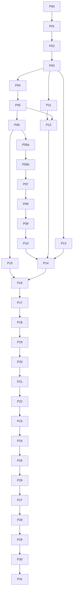

# v3 未完成功能执行计划

日期：2026-09-17。核对源码：`63f7d8e13319d57e946e46d5766703e55d75c9a3`。
状态：供审阅和后续实施的详细计划；本次交付不改变运行中的服务，不代表功能或设备验收通过。

## 1. 执行范围、事实与完成定义

本文件细化 [M00—M07](05-tasks-and-acceptance.md)，只覆盖 SelfModelSwitch 模型服务。
视频业务、FFmpeg、人物/声线、影片数据库、视频质量和外部报告均不在范围内。
[根 README](../README.md) 描述当前服务；历史文档中的命令或“已通过”不自动成为本轮指令或证据。
本计划内标为“新增”的文件、命令、字段均须由指定任务交付后才能使用。

### 1.1 已完成与未完成的边界

| 项目 | 核对结论 | 后续动作 |
|---|---|---|
| M00 首个 Qwen2.5-VL/Orin 探测 | [m00-envelope.md §9—10](m00-envelope.md) 已记录真实探测通过；本轮未 SSH 重验原始材料 | 保留结论，P00 核对材料完整性；不重复建设探测器，不外推到新镜像/设备/模型 |
| M01 注册契约第一片 | `contracts_v2.py` 已提交，21 个现有测试通过 | 补齐 P01 的缺口；它尚未接入生产配置、runner 或 scheduler |
| 控制协议测试 | 工作区有未跟踪 `tests/test_control_protocol_v1.py`，对应模块不存在，收集时报 ImportError | P02 接续并评审此草稿；本次不覆盖、不删除、不代为提交 |
| 旧服务 | 固定四 ID，chat/embedding/rerank、切换、取消、存储恢复与旧部署工具已有实现 | 增量复用，不能宣称 M02—M07 从零开始，也不能将旧实现当成 v3 通过 |
| M02—M05 | 动态注册运行接线、通用会话、Blob、通用执行/控制接口缺失 | P04—P20 |
| M06 | 有旧 renderer、report 校验与打包工具；无 v3 原始证据重算闭环 | P03、P21—P28 |
| M07 | 没有最终 v3 candidate 的 S/B/O 全集验收 | P29—P31 |

`plan/05-tasks-and-acceptance.md` 的“全部待办”和 `plan/validation.md` 的“M00仍待”是旧快照；
本计划采用较新的逐项证据。当前未跟踪设计文件和已修改根 README 属用户现有工作，实施前单独确认基线归属。

### 1.2 本次本地核对记录

使用现有 `.venv/bin/python`，版本 **3.13.5**，不是发布要求的 Python 3.12：

| 命令 | 实际结果 |
|---|---|
| `.venv/bin/python -m pytest tests/test_contracts_v2.py -q` | 21 passed，exit 0 |
| `.venv/bin/python -m pytest tests/test_control_protocol_v1.py --collect-only -q` | 缺少 `control_protocol_v1`，exit 2 |
| `.venv/bin/python -m pytest tests -m 'not thor' --ignore=tests/test_control_protocol_v1.py -q` | 226 passed、1 deselected、2 dependency deprecation warnings，exit 0 |
| `.venv/bin/python -m ruff check .` | exit 0 |
| `.venv/bin/python run.py --check-config` | schema_version=1、旧四 ID，exit 0 |

排除草稿的 226 项只用于说明已有实现基线；不等于完整测试集通过。P02 之后不得沿用此 ignore。
本次没有构建、部署、启动模型或重验硬件，不能生成 `software_verified` / `device_backend_ready` 报告。

### 1.3 每个实施任务的统一交付规则

1. 在开发机编辑，使用发布 Python 3.12。先写能揭露违约的测试，再实施；测试不得仅复述内部实现。
2. 每任务最多约 5 个文件；下表文件均为明确落点，新增文件须先创建。若实际超出，先拆同 ID 的后缀任务并写明依赖。
3. 运行该任务指定测试，以及第 7 节通用检查。记录完整 SHA、命令、exit code、解释器、证据目录。
4. 审查并原子提交任务文件，不将工作区其他变更打包。未通过检查不得在任务状态表勾选完成。
5. 按 [AGENTS.md](../AGENTS.md) 将目标干净 checkout fast-forward 到同一提交；硬件行为任务还须目标测试证据。
   无目标条件时标 `software_only`，不是该硬件任务完成。
6. 接口任务产出 schema + 正反例 + 消费者测试；模型任务产出正式 API 到停止证据的闭环。
7. 文档数字是约束或输入，不是通过记录；`blocked` 必须写缺少的具体材料及恢复动作。

## 2. 本计划固定的接口与行为约束

以下是本轮实施采用的设计决定；它们不声称已实现。与旧文件冲突处须由相应任务同步原章节和测试。
不能用“实现时再定”跳过下面的约束。只读 facts 无法确定的设备值必须走第 6 节输入门禁。

### C01：注册、runtime 与范围

- v2 注册 ID 沿用 `contracts_v2` 的小写 1—63 字符规则；使用全字符串匹配，拒绝末尾换行/NUL。
  端口 10001—19999，部署内唯一。配置读取时确定模型集合，不增加在线修改注册表 API。
- `assets` 是逐文件表，按 `path` 唯一；同一 role 可有多文件以支持分片。
  adapter profile 规定角色基数：首个 GGUF profile 恰一 model，vision 恰一 projector；HF 分片格式可登记，
  未有 profile/fixture/实测时不得启动或宣称支持。路径检查须涵盖所有父目录、TOCTOU、regular file 和挂载身份。
- 当前可执行 capability 闭集：`chat|vision|embeddings|rerank`。audio、Torch、ORT 是后续扩展，
  新增前必须补自己的 M00、profile、DTO、fixture、evaluator 和 B 场景；不能因接受 runtime_id 就宣称任意 runtime 可用。
- 每个 RuntimeSpec 新增必填 `profile_id`；profile 是代码注册的有限集合，绑定程序/镜像入口、允许参数、
  取值域、ready/terminal 协议和资产角色基数。未知 profile 422；runtime_id 只作部署内身份。
- `startup_args` 保留为“启用的受支持 flag 名称集合”，不能承载值或 shell 文本。
  profile 给每个 flag 定义值来源：固定常量、配置 envelope、已核验资产、固定端口；没有值来源即拒绝渲染。
  M00 的 profile 固定 `--load-mode auto`，不生成 `--no-mmap`；更换加载模式是新候选。
- 配置 schema v2、control protocol v1、candidate/report v3 相互独立。新增 control 请求要求
  `X-SMS-Protocol-Version: 1`，缺失/不支持返回 400 `unsupported_protocol`，响应回显版本。

### C02：内存只加一次裕量，物理驻留另设门槛

现有 `Book.required_for()` 对 v1 reserved_bytes 再乘 margin；v2 的 `reserved_bytes` 已是 R。
二者不能直接混用。内部统一 `effective_reserved_bytes`，v1 在兼容转换处乘原 margin 一次，v2 原样使用。

```python
# v2 精确整数公式，避免 float 在边界上的取整差异
reserved_bytes = (measured_peak_bytes * 115 + 99) // 100
new_bytes = 0 if instance_already_reserved else reserved_bytes
admit = (
    storage_ready and identity_known and slot_available and sample_valid
    and committed_bytes + new_bytes <= model_budget_bytes
    and mem_available_bytes >= new_bytes + free_floor_bytes
)
```

- 已有 R=6106148045 B，对应 measured_peak=5309693952 B；不再乘 1.15。
  样本 `0 <= now_mono - sampled_at <= 2s`；边界等号通过，差 1 byte 拒绝。
- B 不超过 `MemTotal - system_reserve`；默认 reserve=8 GiB、F=2 GiB；实时不再扣 reserve。
  READY 执行 `new_bytes=0`，仍检查 envelope、槽、freshness、F。
- M00 的约 10.5 GiB 驻留总量是估计，不是可填入生产配置的测量值；其中权重描述也与逐文件 bytes 不完全一致。
  P21 必须从原始采样及实际资产重算，禁止相加一个估计后标 measured。
- v2 ModelSpec 增加 `measurement_ref`（测量材料摘要）、`physical_resident_peak_bytes`（未测为 null）；
  登记可未测，生产候选必须为正整数且绑定材料。定义它为运行窗口中该模型及 adapter 的
  不重复计数物理占用上界；采集方法、统一内存重复计数处理随 policy 固定。
- 增加静态物理门槛：每个未 STOPPED 实例计一次
  `physical_reserved_bytes = ceil(physical_resident_peak_bytes * 1.15)`，总和不得超过 B。
  这是对 MemAvailable 增量低估的独立保护，不能替换实时门槛。
  若采集器不能给出可信物理上界，生产不开放该模型；calibration 用显式临时预算、独占维护环境。
- 首版物理测量方法固定为保守 `system_nonfree_upper_bound_v1`：同运行窗口逐样本取
  `MemTotal - MemFree`，每轮取最大、三轮再取最大，原始样本同时保留这两个字段。
  该上界包含OS、page cache及其他进程，不减基线，不把CUDA指标再加一次；它不是“模型净占用”。
  P21须验证目标统一内存的受管计算占用包含于此Linux口径；无法验证则该方法不适用、生产阻塞。
  跨模型相加可能保守重复计入背景占用，此为首版接受的容量代价；更精确的方法必须新增method版本、材料和候选，不能临时扣除估计值。
- UNKNOWN/ERROR/BLOCKED 保留两套预留；请求结束只还执行槽，实例 STOPPED 才还模型预留。
  内存低于 F 关闭新执行并启动受管计算清理；停止后重新采样，最多等 10s，仍不足保持不可准入。

### C03：身份、端口与异步回写

InstanceIdentity = `(container_id, started_at, deployment_id, model_id, runtime_id,
candidate_digest, image_digest)`；started_at 必须为带 UTC 时区的有效时间。
回写 Fence = `(boot_id, model_id, generation, operation_id, execution_id, attempt)`；
非 execution 操作的最后两项为 null，execution 的 attempt 从 1 起且首版不自动重试。
owner/token 不是实例身份替代品；所有异步完成、超时、取消、observer 更新必须检查自己的 Fence。
P03同时固定 Clock（monotonic/UTC）、MemorySample、LaunchOperation 和 EventSink 端口；
EventSink事件含schema_version/event_id/sequence/UTC/monotonic/Fence/type/payload，sequence在boot内递增。
P06起产生结构化事件，P22只实现落盘collector；observer不得反向读取scheduler内存推断启动者是否退出。

拟新增 `ports_v3.py` 定义以下结构化端口；这些签名固定职责，具体 DTO 在 P03 完成：

```python
class BackendPort(Protocol):
    async def load(self, spec: RegisteredModel, fence: Fence, deadline: float) -> Observation: ...
    async def execute(self, request: ExecutionRequest, fence: Fence, deadline: float) -> ExecutionHandle: ...
    async def cancel(self, handle: ExecutionHandle, deadline: float) -> CancelAck: ...
    async def stop(self, identity: InstanceIdentity, fence: Fence, deadline: float) -> StopAck: ...

class ObserverPort(Protocol):
    async def observe(self, target: ObservationTarget, deadline: float) -> Observation: ...
```

CancelAck/StopAck 只表示命令已处理。Observation 必须带采样时间、完整实例身份（存在时）、
端口状态、启动操作/子进程状态和 `RUNNING|STOPPED|UNKNOWN`。执行终结证据另含完整 Fence、
InstanceIdentity、backend 终结原因、设备同步事实及 `compute_quiescent=true`。
本地未 dispatch 请求可直接终结，使用 `dispatch_state=not_started`，不得伪造容器身份。

STOPPED 的唯一计算：已确认容器退出/不存在 AND 启动操作终结 AND 启动子进程退出 AND 固定端口无监听。
不存在必须来自成功的容器清单/结构化 not-found，不能将任意 `docker inspect` 非零解释为不存在。
停止前用不可变 container ID 及标签全身份核对，禁止按名称杀未知容器。端口被未知进程占用时保持 UNKNOWN。
启动用受控、可观察的子进程组；cancel Future 不等于启动子进程退出。重启按 deployment 标签枚举旧实例和启动者，
核验属于本 deployment 后清理，禁止 `runtime.build_scheduler()` 在观察前批量 bootstrap_stopped。

### C04：会话与执行状态机

| 对象 | 状态/转换 | 约束 |
|---|---|---|
| session | `preparing -> active -> draining -> closed`；preparing 可转 draining；draining 可转 blocked；blocked 确認停止后转 closed | 排队是 preparing 的 `phase=queued`，另有 draining_existing/loading；不新造 ready 状态 |
| execution | `queued -> running -> succeeded|failed`；queued/running 可转 cancelling，后续转 cancelled 或 failed | 无可信停止/终结则保持 cancelling，不超时伪造 terminal |
| model | 复用 unknown/unloaded/loading/ready/evicting/error | 只有 unloaded 可开始 load 并增加 generation |

- 单个 ACTIVE 通用会话独占整个模型服务；会话内最多 `envelope.max_parallel` 个 execution，
  其余进入有界队列。旧交互接口原并发语义保留；会话冻结阶段暂停其新准入，已有 lease 正常完成。
- session queue 容量128、等待1800s；priority 来自服务端 owner 配置，默认0、范围0..1000，客户端不能提交。
  排序键 `(-priority - floor(wait_seconds / 30), sequence)`，sequence 在同一 boot 中严格递增。
- 尝试授予时在同一锁内冻结交互准入，最多 drain 30s；超时解除冻结、保留 waiter 原 sequence/入队时间，
  30s 后才可再尝试，不杀已有 lease；不能重置总等待1800s。pinned/preload 任意冲突返回409。
- `prepare_deadline=min(grant_started+900s, hard_deadline)`；等待队列不计入准备900s。
  hard deadline 从会话创建算起，`session_hard_timeout_seconds` 是配置正整数1..86400，首个 profile 默认3600s。
  queued 阶段截止为 min(created+1800s, hard_deadline)；清理60s是截止后独立清理窗口。
- ACTIVE 起 `expires_at=min(now+30s, hard_deadline)`；建议客户端每10s心跳。
  now>=expires_at 时 heartbeat/submit 必须409，不能续活；心跳不改变 hard_deadline。
- preparing阶段未启用ACTIVE TTL，view的expires_in_ms=0、hard_remaining_ms正常倒计时；
  heartbeat返回409 busy，客户端用GET查询，不因该0值在服务端触发ACTIVE过期清理。
  排队中close只撤销自己的waiter/未派发操作；未持有独占权、无所属实例/启动者/lease时直接closed，绝不停止另一会话的模型。
- close/TTL/hard deadline 在锁内先禁止 submit/renew，然后 cancel 等10s、stop grace30s、总清理60s。
  无法证明停止转 BLOCKED，health503，每5s对账；未清干净不得授予下一会话。
- 同模型尚有其他 lease 时，请求取消先冻结新准入，等待其他有效 lease 结束再停止实例。
  session close 可以取消本 session 全部 execution；独占保证不存在其他 owner 的有效 lease。
- 锁内只改内存状态；生命周期 load/stop 由一个 worker 串行消费。推理可按槽并发，不占住生命周期队列。
  等待执行完成、hash、Docker、sleep、HTTP、磁盘 I/O 全部在锁外，结果按 Fence 回写。

### C05：协议 DTO、错误与幂等

保留 [03-api](03-api.md) 路由；新增接口用严格 JSON，拒绝重复 key、未知字段、非有限数、bool 冒充整数。
嵌套任意字符串必须合法 UTF-8、无 NUL。禁止宿主路径/远程 URL、argv、端口、预算、job/stage/pipeline 输入。

| DTO | 精确约束 |
|---|---|
| SessionCreate | model_id、idempotency_key 必填，correlation_id 可选；key 1..128 UTF-8 字节，correlation 1..128；不接受 owner/priority/deadline |
| SessionView | session_id、state、phase、boot_id、model_id、expires_in_ms、hard_remaining_ms、owner_token、error；剩余值为非负整数；closed token=null |
| ExecutionCreate | session_token、operation、input、parameters、idempotency_key 必填；operation 必须在模型能力表；parameters 规范 JSON <=8192 bytes且按 operation 白名单解析 |
| ExecutionInput | 恰含 inline 或 blob；inline 是非空对象，规范 JSON <=4 MiB；blob 是 BlobRef |
| BlobRef | blob_id、owner、sha256、size_bytes、media_type；sha256 小写64hex，size 1..1 GiB，media_type 小写 type/subtype 无参数；owner必须与服务元数据相等 |
| ExecutionView | execution_id、state、dispatch_state、compute_quiescent、result、error、instance、fence；非terminal的quiescent/result/error为null |
| terminal | succeeded 必须 result、无 error；failed/cancelled 必须 error、无 result；已dispatch必须instance/fence完整且quiescent=true；not_started可无instance，但带Fence且证明未送后端 |

P02 扩展现有草稿测试以覆盖新字段；不得为了保留测试而接受不完整终结证据。
外部 ID 为服务生成的不透明小写 ID；每boot生成随机256bit服务密钥，token固定为
`boot_id + "." + base64url(HMAC-SHA256(boot_key, canonical(boot_id, session_id, model_id, owner)))`。
密钥仅存本进程内存，重启换key；服务存token摘要用于验证，GET可由绑定字段重算同token，解决摘要不可逆问题。
日志/status/持久元数据永不输出token或boot_key。
GET session 只向 owner 返回有效 token；其他 owner 一律404，避免透露对象存在。

幂等索引键 `(boot_id, owner, route_kind, idempotency_key)`；同 key 比较独立的规范 payload hash，
相同返回原对象，不同409 `idempotency_conflict`。hash 不含 token 原文，但以解析得到的 session_id/boot 代替其绑定，
不能把 payload_hash 放进索引主键而漏掉冲突。活跃对象不清理；终结后保留86400s。客户端不得依赖跨重启幂等。
会话/执行重启失效返回409 `stale_token`；对象查询在旧 boot 返回404，不能接管重放。
POST第一次202，幂等重放返回对象现态且不重复副作用；close/cancel 未完202、已完200。

| HTTP | 固定 error.code（retryable） |
|---|---|
| 400 | malformed_json、unsupported_protocol（false） |
| 403 | peer_forbidden（false，仅建连接/无对象操作） |
| 404 | not_found（false） |
| 409 | stale_token、session_expired、idempotency_conflict（false）；busy、blob_in_use（true） |
| 410 | reference_expired（false） |
| 413 / 415 | payload_too_large / unsupported_media_type（false） |
| 422 | contract_violation、envelope_exceeded、capability_mismatch（false） |
| 429 | queue_full、quota_exceeded（true） |
| 502 | backend_failed（false，执行是否已发生不确定，不自动重试） |
| 503 | instance_unknown、storage_unavailable、resource_unavailable、temporarily_unavailable（true） |
| 504 | queue_timeout（true）、execution_timeout（false） |

retryable 表示状态可能恢复；只有确认 not_started 或查询原幂等对象后才能决定重试，服务端不盲重发推理。
通用错误体沿用03-api；request_id 长度1..128字节。队列满不是 health 失败，BLOCKED/UNKNOWN/storage fault 是。

### C06：能力输入和 envelope

- control v1 的 chat/vision inline 使用 `messages`，与受支持 OpenAI chat 消息格式一致；
  Blob 输入对 chat/embeddings/rerank 是 `application/json` 且内容等价 inline。
  vision 的 Blob 输入可为 image/png 或 image/jpeg，parameters 中 text 必填，adapter 构造一条用户消息。
- parameters 闭集按能力定义：chat=`max_tokens,temperature,top_p,seed`；vision 同上加 text（只用于 image Blob）；
  embeddings=`encoding_format`（首版仅 float）；rerank=`top_n,return_documents`。
  正整数/有限数及范围由 schema 写死；temperature 0..2、top_p (0,1]、seed 0..2^31-1。
  max_tokens 默认4096但取 min(4096,模型max_output_tokens)；rerank top_n 默认文档数、不得大于文档数。
- embeddings inline=`input`（非空字符串或非空字符串数组）；rerank=`query,documents`（非空字符串数组）。
  batch/document 上限作为能力 profile 必填正整数，绑定 candidate；没有实测值不得生产开放该能力。
- 文本 token 包含 chat template、特殊 token、全部消息及视觉 token；必须用同 runtime tokenizer/template
  或有证明的保守上界检查，不能用字符数估计。先做有界格式/尺寸验证，再受限计数，最后 dispatch；
  runtime 无法预先确定图像 token 时按登记最坏1280计入输入预算。
- Qwen envelope：每槽ctx32768、输入<=28672、输出<=4096、输入+输出<=ctx、每请求图像<=1、
  每边<=1024、视觉token<=1280、并发<=2；新增 `max_images=1` 明确消除原 schema 漏项。
  其他模型的 max_images 非vision为0；图像按解码后像素检查，压缩体积小不绕过尺寸限制。
- control 的输出统一为 BlobRef：文本/embedding/rerank 为 application/json、保留对应协议 shape；
  SSE 只存在旧chat接口。能力不匹配422，未知模型404；没有新增音频专用路由。

### C07：Blob 持久元数据与暂存生命周期

- POST /internal/blobs 使用二进制 body、Content-Type 和必填 `X-Content-SHA256`；支持有界分块接收，
  Content-Length 可选但若有必须一致；只接受能力表登记的 application/json、image/png、image/jpeg。
  成功201+BlobRef。GET200；过期410；DELETE未持有时204（已删除同owner仍204），执行持有时409。
- owner 由 peer UID 映射，不接受自报身份；上传逐块hash、临时文件独占创建、校验后原子发布。
  `input` BlobRef 中 owner/hash/size 不可信，执行时必须和数据库、打开的文件一致。
- 使用服务独占 SQLite 元数据：blob_id/owner/hash/size/type/state/created_at/expires_at/path；
  仅blob归属/配额/过期元数据持久化，不保存客户端业务任务。完成元数据与文件用恢复日志协调，
  崩溃点测试覆盖文件已rename但事务未提交、事务已提交但文件丢失。
- 输入上传成功起24h过期；输出执行终结起24h过期；执行读取租约内禁止删除/GC，过期后禁止新引用。
  超过过期时刻的活跃租约继续保护文件；最后一个租约释放后清理，保留owner tombstone 24h返回410。
- 默认单owner 4 GiB、全局16 GiB、磁盘余量2 GiB；部署可显式修改并进入candidate摘要。
  upload在接收前预留声明大小，chunked无长度预留1 GiB；输出dispatch前预留profile输出上限。
  并发写入按“已发布+临时+已预留”原子检查配额/余量，不能各自读df后超卖。
- 输出上限来自 profile，最大1 GiB；超限不发布部分结果。取消先标不可提交，晚到结果只清理暂存。
  文件名只用服务生成ID，目录逐级no-follow，拒绝symlink/非regular/逃逸；worker只能访问指定输入和自己的输出目录。
- 启动重新校验已发布文件/元数据hash后开放读取；未完成upload和旧执行输出隔离清理；
  若旧实例未停止，保留相应读取保护直到观察到STOPPED。禁止先清理它仍在使用的文件。

### C08：Unix 身份与单进程双入口

loopback HTTP 和 control.sock 必须共享一个 Scheduler/Book/BlobStore/boot_id/instance_lock。
不允许启动第二个调度进程或两份 lifespan。控制路由不得注册到普通 TCP listener。
control.sock 权限0660，服务账号所有、登记客户端组；owner=`uid:<decimal>`，每个允许UID唯一owner。
本机进程同UID属于同owner；首版不声称提供同UID内部隔离。

control listener 适配器必须从 accepted Unix socket 读取 Linux SO_PEERCRED，将可信 UID 注入服务端 scope；
不能从 X-Owner、X-UID、request body、反向代理头或普通 ASGI client 地址取得身份。
采用同事件循环的 TCP ASGI listener + 独立 Unix HTTP listener 适配器，协议解析复用依赖中的 HTTP 实现；
实现前 P17 的真实 Linux 契约测试必须证明 peer credential 可达 handler，失败则阻塞，不退化为相信请求头。
仅接受HTTP/1.1有界请求，禁止upgrade/proxy；关闭时两入口先停止接收，共享清理只执行一次。

### C09：候选与证据身份

M01 的部署登记digest不是 v3 candidate digest。新增严格文档：

| 文档 | 必填字段族 |
|---|---|
| CandidateV3 | schema_version=3、deployment_id、source_archive_sha256、config_sha256、device、runtime_stack、runtimes、models、measurement_refs、fixture_refs、policy、collector_sha256、evaluator_sha256 |
| Device | machine_id_sha256、architecture、device_tree_sha256、mem_total_bytes、OS/kernel、GPU identity、driver/JetPack、容器版本、电源/时钟模式、模型盘/暂存盘UUID |
| ArtifactRef | relative_path、size_bytes、sha256；不得symlink、绝对路径、重复路径或逃逸 |
| CaseAttempt | case_id、run_id、attempt、candidate_sha256、device_digest、started_at、ended_at、boot_id、events/raw_refs、collector/evaluator身份、exit_code |
| AcceptanceReportV3 | schema_version=3、candidate_sha256、device_digest、run_id、started_at、ended_at、case_attempt_refs、每case最终attempt引用、artifact_manifest；summary不作为判定依据 |

必测集合精确取 [06-acceptance](06-acceptance.md)：S01..S06、每模型六类B、每cap一个B、O01..O06。
允许同case保留失败attempt，但最终映射每case恰一个，所有attempt必须可追溯，不能删掉失败记录。
重复最终结论、未知case、缺case或缺fixture/evaluator一律拒绝。

摘要规范：sort_keys、紧凑分隔、UTF-8、不转义非ASCII、禁NaN、展开默认值；无语义顺序的
模型/runtime/assets表分别按ID/path排序；有语义顺序的输入数组不排序。
配置摘要只去顶层 candidate_sha256；candidate本体不含自身摘要、运行结果、宿主绝对路径、证据输出目录、生成时间。
资产相对路径及fixture/measurement逻辑artifact key是语义输入，必须纳入摘要；外部材料的宿主定位另由manifest映射。
`candidate_sha256=sha256(canonical(candidate_body))`，再回填配置；hash链不能反向引用report。
源码归档用明确清单，只含运行/采集/评价/测试/锁文件，排除生成配置、plan归档、evidence、bundle、模型、凭据。
最终bundle另有file manifest，不回填candidate。改运行代码/配置/runtime/设备/预算/policy/evaluator须新candidate。
纯源码归档由P22独立的 `acceptance source` 生成，不调用需要deployment的旧build-release，避免形成发布循环。
归档输入是clean commit中的 `app.py`、`run.py`、`model_scheduler/`、`scripts/`、`deploy/`、`tests/`、
`pyproject.toml`、`requirements.in`、`requirements-dev.in`、`requirements.lock`、`requirements-dev.lock`；
目录仅收已跟踪regular文件，排除其中任何生成证据/权重/凭据。固定prefix为source、字典序文件清单、
uid/gid/mtime=0、gzip mtime=0；不嵌入commit时间或归档自身摘要，源码字节不变则归档hash不变。

## 3. 依赖图与检查点

下表“依赖”是硬前置；任务只读准备可提前，未满足依赖不能把实现合并为已完成。
每个检查点运行第7节G检查；原M02/M04/M06/M07检查点保留，不以中间checkpoint代替。



| 检查点 | 任务结束位置 | 必须能演示的行为 |
|---|---|---|
| K0 | P00—P02 | 基线差异可解释；注册和控制DTO正反例通过，草稿不再阻断收集 |
| K1 | P03—P05 | schema/ports/hash链固定；配置显式迁移后所有资产可核验 |
| K1a | P06—P06b | 真实llama-swap控制契约、动态lab配置与受限启动可用 |
| CP1 / M02 | P07 | 受限启动、身份、迟到启动、独立停止完整闭环 |
| K2 | P08—P10 | 资源单次预留；公平会话；TTL与取消不提前清账 |
| K3 | P11—P13 | Blob上传/重启/删除闭环；幂等无重复副作用 |
| K4 | P14—P16 | 真实协议adapter接线；可信终结与取消/停止证明 |
| CP2 / M04 | P17—P18 | 两UID通过Unix控制完成create→execute→cancel/close，身份隔离成立 |
| K5 / M05 | P19—P20 | 旧API/SSE回归，动态模型和vision envelope生效 |
| K6 | P21—P23 | 实测输入→candidate→真实B执行器，材料可逐项定位 |
| K7 | P24—P26 | O执行器、离线重算、production render/preflight拒绝伪通过 |
| CP3 / M06 | P27—P28 | 锁文件/CI/独立发布包/回滚流程完整，仍不宣称真机通过 |
| CP4 / M07 | P29—P31 | 最终candidate S/B/O全集与现场preflight/发布冒烟通过 |

模块导入方向：纯contracts → config/ports → runner/observer/storage/adapters → scheduler服务编排 → HTTP/CLI composition。
Book/session/execution 是共享锁下的纯状态对象，不调用HTTP/Docker；adapter不导入app/scheduler；
acceptance executor通过正式API使用服务，evaluator只读材料，不依赖活的scheduler。BlobStore通过端口注入execution服务。

**构建顺序与最终运行分开：** P22—P28先交付工具实现及fixture/依赖注入测试，不能要求P22已有P25生产evaluator，
也不能要求P24已有P26/P27最终部署。该阶段使用明确标记test-only的材料测试契约，不生成可发布通过记录。
P28完成后，P29重做source/candidate，绑定全部最终实现hash，才真实执行全集。
O05测试P26的“现场身份核验原语+篡改拒绝”，不要求包含O05自身的最终报告；P31再执行完整production preflight。
O06使用同最终源码的隔离lab release对演练切current、备份/恢复Blob元数据和回滚，记录两份材料身份；
“没有已验收生产旧版时必须拒绝生产回滚并保持停机”是另一个必测分支，不伪造一份旧版通过报告。

## 4. 有序实施任务

所有勾选框初始未完成。Estimated scope：S=1—2文件、M=3—5文件；设备任务按材料集合计，不修改目标源码。
以下 `python` 必须是Python3.12；测试文件标“新增”的命令只在该任务创建文件后执行。

### P00 — 固定可复现基线和可用输入（M00收尾）

**Primary owner:** backend；**Collaborators:** arch；**Dependencies:** 无；**Estimated scope:** S。
**Description:** 保存当前dirty文件清单和hash，核对M00记录的源commit/runtime/资产/原始证据目录；不重跑已通过探测。
**Files likely touched:** `plan/08-execution-plan.md`（执行记录）、`plan/validation.md`（仅追加本轮记录）。
**Acceptance criteria:**
- [x] 单独列出已提交、未提交草稿、旧事实冲突；不将用户草稿误判为已实施。
- [x] Python3.12环境可用；目标硬件按AGENTS命令核验；M00材料在目标或只读副本可核对hash及3轮停止记录。
- [x] 缺材料则标待核验并列恢复来源，不把文档转写成原始证据；不重新触发模型试验。
**Verification:** `git status --short`、`git rev-parse HEAD`、`python --version`；完整测试集预期仅已知草稿收集失败，保存输出。
**本轮执行记录（2026-09-17）:** status=complete；source_commit=`63f7d8e13319d57e946e46d5766703e55d75c9a3`；
python=3.12.11（`/Users/monster/.local/share/selfmodelswitch/venv312`，原 `.venv` 为 3.13.5 不满足 `requires-python`）；
target_commit=`63f7d8e13319d57e946e46d5766703e55d75c9a3`（`/home/jtzn/SelfModelSwitch`，工作区干净）；
M00 通过轮 run1—run3 均 `quiescent=true`，模型资产与 runtime 自校验复核一致；未重跑模型试验。
未提交草稿、旧事实冲突、命令 exit code、基线 manifest 与待核验项见 [validation.md](validation.md) 的 P00 记录。

### P01 — 补齐动态登记契约（M01）

**Primary owner:** arch；**Collaborators:** backend；**Dependencies:** P00；**Estimated scope:** M。
**Description:** 在已有v2契约上实现C01/C02/C06缺项，保留v1运行行为。
**Files likely touched:** `model_scheduler/contracts_v2.py`、`tests/test_contracts_v2.py`、`plan/04-deployment.md`、`plan/02-scheduler.md`。
**Acceptance criteria:**
- [x] 同role分片按path唯一；GGUF profile基数单独校验；新增profile_id、max_images、测量引用和物理峰值字段。
- [x] 所有字符串全匹配、path拒绝NUL/父路径；JSON `1e999`、嵌套非有限值、未知字段均拒绝。
- [x] v2 reserved精确整数计算，无二次margin；measurement为空只能登记/隔离校准，不能生产开放。
**Verification:** `python -m pytest tests/test_contracts_v2.py -q`；补分片、duplicate path、尾换行ID、1-byte和未测生产拒绝案例。
**本轮执行记录（2026-09-17）:** status=complete；起点 commit `62c0036`；python=3.12.11；
`pytest tests/test_contracts_v2.py -q` = 35 passed（实现前 18 项失败）；
`pytest tests -m 'not thor' --ignore=tests/test_control_protocol_v1.py -q` = 240 passed, 1 deselected；
`ruff check .` exit 0；`run.py --check-config` 仍为旧四 ID，v1 运行行为未变。
新增契约：`PROFILES`（`llama-cpp-gguf-v1` 可执行、`hf-sharded-v1` 仅登记）、`RuntimeSpec.profile_id`、
`Envelope.max_images`、`ModelSpec.measurement_ref`/`physical_resident_peak_bytes`、`reserved_bytes_from_peak`、
`physical_reserved_bytes_from_peak`、`effective_reserved_bytes`（v2 原样、v1 兼容处只乘一次原 margin）、
`require_startable_profile`、`require_production_openable`、按 path 唯一的 asset 表。
文档同步：04-deployment §1、02-scheduler §5。未解决：`hf-sharded-v1` 无自身 fixture/实测因而不可启动
（argv 渲染属 P06，测量与 fixture 属 P15/P21）；本任务不产生硬件证据也无此项。目标 checkout 已同步到同一提交。

### P02 — 完成控制协议v1 DTO与错误表（M01）

**Primary owner:** arch；**Collaborators:** backend；**Dependencies:** P01；**Estimated scope:** M。
**Description:** 以C03—C06消除现有测试草稿对应实现缺失，导出可供独立客户端使用的schema。
**Files likely touched:** `model_scheduler/control_protocol_v1.py`（新增）、`tests/test_control_protocol_v1.py`、`schemas/control-v1.json`（新增）、`plan/03-api.md`。
**Acceptance criteria:**
- [ ] parser/schema状态、字段、字节限制、版本、错误码一致；succeeded无result/不静止/缺Fence全部拒绝。
- [ ] queued取消用not_started证据合法；不得要求伪造未创建的container；扩展草稿中缺失字段测试。
- [ ] inline/blob互斥、parameters能力白名单、所有int/bool/NaN/未知字段正反例完备；schema生成可重现。
  新命令 `python -m model_scheduler.control_protocol_v1 export-schema --output schemas/control-v1.json` 只从DTO生成；测试重导出并按字节比较。
**Verification:** `python -m pytest tests/test_control_protocol_v1.py tests/test_contracts_v2.py -q`；全tests收集不再ImportError。到K0。

### P03 — 固定内部端口与candidate/report结构（M01）

**Primary owner:** arch；**Collaborators:** backend；**Dependencies:** P02；**Estimated scope:** M。
**Description:** 实现C03/C09的纯类型/严格解析器及材料字段，使下游不通过互相导入业务模块获得类型。
**Files likely touched:** `model_scheduler/ports_v3.py`、`model_scheduler/evidence_contracts.py`、`tests/test_ports_v3.py`、`tests/test_evidence_contracts.py`（均新增）、`plan/06-acceptance.md`。
**Acceptance criteria:**
- [ ] observation/terminal/fence可以表达启动中、未知和未dispatch终结；每消费者有fake端口契约测试。
- [ ] CandidateV3/CaseAttempt/Report与必测集合唯一映射可解析；结构合法不等于passed。
- [ ] canonical/default展开/hash无环有golden例；绝对/逃逸/重复artifact路径拒绝；hash不包含report生成时间。
**Verification:** `python -m pytest tests/test_ports_v3.py tests/test_evidence_contracts.py -q`。

### P04 — 配置v2读入与显式v1迁移（M02）

**Primary owner:** backend；**Collaborators:** arch；**Dependencies:** P03；**Estimated scope:** M。
**Description:** 让check-config理解动态登记及运行策略；转换旧四ID，禁止隐式猜测runtime/hash/预算。
**Files likely touched:** `model_scheduler/config.py`、`model_scheduler/migration_v2.py`（新增）、`model_scheduler/deploy.py`、`tests/test_config.py`、`tests/test_migration_v2.py`（新增）。
**Acceptance criteria:**
- [ ] 顶层v2必填schema_version、registration、server、scheduler、resources、storage、gateway、control、blobs；
  仅额外允许顶层派生candidate_sha256（草案null，绑定候选后64hex）；registration复用v2登记解析器。
- [ ] 保留旧scheduler/heat/thrash/preload/pinned值；新增C04/C07/C08字段有显式类型/默认；candidate回填字段按C09处理。
- [ ] 新命令 `python -m model_scheduler.deploy migrate-v2 --input OLD --inventory INVENTORY --output NEW` 不覆盖OLD/已存在NEW；缺项exit2并输出missing字段JSON，不输出可启动的半成品。
- [ ] 完整inventory产出配置并通过check-config；旧四ID不重命名，v1仍可检查，迁移不会静默取消pinned/preload。
**Verification:** `python -m pytest tests/test_config.py tests/test_migration_v2.py -q`；对临时v1 fixture完整/缺项迁移并 `python run.py --config NEW --check-config`。

### P05 — 多资产及挂载身份核验（M02）

**Primary owner:** backend；**Dependencies:** P04；**Estimated scope:** M。
**Description:** 从单文件模型校验改为逐文件全量启动核验和1s metadata监测，保持故障关准入。
**Files likely touched:** `model_scheduler/storage_monitor.py`、`model_scheduler/asset_store.py`（新增）、`tests/test_storage.py`、`tests/test_asset_store.py`（新增）。
**Acceptance criteria:**
- [ ] 启动/恢复/发布全量hash；运行期1s核挂载UUID、inode/size/mtime，不每秒重复读所有模型hash。
- [ ] directory fd逐级no-follow，前后fstat一致；父symlink、文件替换、根盘同名目录、UUID错配、读取阻塞全部关准入。
- [ ] hash总deadline为配置 `storage.verify_timeout_seconds`（默认900s），超时工作不能继续打开新资产；保留UNKNOWN。
**Verification:** `python -m pytest tests/test_storage.py tests/test_asset_store.py -q`；Linux用临时挂载命名空间/临时文件制造路径与超时，不动实际模型盘。到K1。

### P06 — 受控runtime启动与动态后端路由（M02）

**Primary owner:** backend；**Collaborators:** arch；**Dependencies:** P05；**Estimated scope:** M。
**Description:** 用profile生成argv，按runtime选择adapter；每个load注册可观察的启动操作。
**Files likely touched:** `model_scheduler/model_runner.py`、`model_scheduler/backend_router.py`、`model_scheduler/runtime_profiles.py`（后二者新增）、`tests/test_model_runner.py`、`tests/test_backend_router.py`（新增）。
**Acceptance criteria:**
- [ ] 无固定四ID端口表；主模型/projector按验证资产只读挂载，禁止Docker socket/宿主根、任意entrypoint/extra_args。
- [ ] M00参数值可重现；未知flag/profile/能力拒绝；restart=no、无自动换模；不同runtime身份互不串用。
- [ ] P06/P15真实执行只在隔离lab维护环境；生产profile必须绑定同镜像/参数/envelope的P21测量和最终B证据。
- [ ] 启动操作具有PID/process group、Fence、开始/终结状态；timeout后启动者未退出仍不报告STOPPED。
**Verification:** `python -m pytest tests/test_model_runner.py tests/test_backend_router.py -q`；目标使用无权重测试镜像检查只读挂载、信号转发和身份标签。

### P06a — 固定llama-swap真实控制契约（M02）

**Primary owner:** backend；**Dependencies:** P06；**Estimated scope:** M。
**Description:** 将当前明确不完整的v217 fixture补齐，并实现run.py要求的CONTROL_CONTRACT；此任务必须早于真实服务闭环。
**Files likely touched:** `model_scheduler/llama_swap_contract.py`（新增）、`tests/fixtures/llama_swap_contract.json`、`tests/test_llama_swap_fixture.py`、`scripts/capture_control_fixture.py`、`tests/test_capture_control_fixture.py`（后二者新增）。
**Acceptance criteria:**
- [ ] 核实固定ARM64二进制版本/hash；受控维护探测分别保存running空/非空、真实模型load、unload的request/status/content-type/body与实例证据。
- [ ] `python scripts/capture_control_fixture.py --config V2_CONFIG --output EVIDENCE_DIR` 仅访问配置中的loopback端点和登记模型，失败保留材料，不下载资产。
  探测脚本直接调用P06 profile/runner，在独占临时目录生成探测用llama-swap配置与manifest，
  包含部署/镜像/资产/端口/argv；不依赖P06b或v3生产renderer，不写系统安装目录。
- [ ] CONTROL_CONTRACT的load路径/响应解析来自真实fixture，现有load_probe=404不能充当成功；未停止不标通过。
- [ ] 更新当前“fixture必须不完整”的测试为真实协议正反例；推理流量仍绕过llama-swap自动路由。
**Verification:** `python -m pytest tests/test_llama_swap_fixture.py tests/test_llama_swap_client.py tests/test_capture_control_fixture.py -q`；目标受控探测并记录停止证据。

### P06b — 动态lab渲染与runner入口接线（M02）

**Primary owner:** backend；**Dependencies:** P06a；**Estimated scope:** M。
**Description:** 提前交付后续目标测试所需的lab配置/启动入口，避免P16必须等待P26生产renderer的隐性循环。
**Files likely touched:** `model_scheduler/deploy.py`、`deploy/model-runner.py`、`model_scheduler/runtime.py`、`tests/test_deploy_render.py`、`tests/test_runtime.py`。
**Acceptance criteria:**
- [ ] 新增 `python -m model_scheduler.deploy render --config V2_CONFIG --mode lab --output LAB_DIR`，生成动态scheduler/llama-swap/runner manifest；不覆盖非空输出。
- [ ] lab manifest绑定配置hash/runtime/profile/资产，显式标记lab；其digest只作测试实例身份，不是production candidate。
- [ ] deploy/model-runner与runtime能加载多个动态ID/profile、只读资产及P06a控制契约；旧schema1入口仍通过原测试。
- [ ] lab只允许隔离维护启动，有临时预算和现场身份检查；缺测不能通过production分支，P26再实现正式门禁。
**Verification:** `python -m pytest tests/test_deploy_render.py tests/test_runtime.py tests/test_model_runner.py -q`；目标lab配置启动/停止测试实例。到K1a。

### P07 — 独立停止观察与启动恢复（M02）

**Primary owner:** backend；**Dependencies:** P06b；**Estimated scope:** M。
**Description:** 将C03停止条件接入observer/recovery和组合入口，消除启动时盲目bootstrap。
**Files likely touched:** `model_scheduler/process_observer.py`、`model_scheduler/control_recovery.py`、`model_scheduler/runtime.py`、`tests/test_process_observer.py`、`tests/integration/test_process_lifecycle.py`。
**Acceptance criteria:**
- [ ] stopped容器未删除也可凭exit/启动者退出/空端口证明；Docker失败、未知占端口返回UNKNOWN。
- [ ] 启动先关准入、核验旧deployment实例并以container ID清理；跨deployment不触碰；旧identity不能停止新实例。
- [ ] 人为延迟启动到超时之后：停止证据不得提前成功；后续观察实际停止才能清账。
**Verification:** `python -m pytest tests/test_process_observer.py tests/test_control_recovery_port.py tests/integration/test_process_lifecycle.py -q`；目标保留容器ID、PID、端口和退出材料。到CP1。

### P08 — 动态模型账本和双内存准入（M03）

**Primary owner:** backend；**Dependencies:** P07；**Estimated scope:** M。
**Description:** 统一legacy/v2内部规格并落实C02；Book保持纯同步状态，资源采样独立注入。
**Files likely touched:** `model_scheduler/model_registry.py`、`model_scheduler/resource_monitor.py`、`model_scheduler/runtime.py`、`tests/test_registry.py`、`tests/test_resources.py`。
**Acceptance criteria:**
- [ ] v1原行为不变，v2margin只算一次；UNKNOWN/ERROR/未终结启动计入两套账本。
- [ ] B/F/physical/新模型/READY的等号和1-byte边界、样本2s边界及未来时间全部测试。
- [ ] STOPPED后才释放模型预算；低F关新执行、触发清理及10s重新采样；不把线程cancel当工作已停。
**Verification:** `python -m pytest tests/test_registry.py tests/test_resources.py tests/test_runtime.py -q`。

### P09 — 公平独占会话准入（M03）

**Primary owner:** backend；**Dependencies:** P08；**Estimated scope:** M。
**Description:** 将会话队列、冻结、drain、加载和槽管理接入同一调度权威。
**Files likely touched:** `model_scheduler/session_manager.py`（新增）、`model_scheduler/scheduler.py`、`model_scheduler/request_queue.py`、`tests/test_sessions.py`（新增）、`tests/test_queue.py`。
**Acceptance criteria:**
- [ ] preparing phase/优先级aging/128容量/1800s/30s退让符合C04，重试不刷新序列和截止。
- [ ] 同锁决定交互与session授予；持有交互lease不会被杀；pinned/preload冲突409；等待繁忙health仍200。
- [ ] 生命周期IO串行且锁外；推理槽按max_parallel；两个客户端竞争不能同时ACTIVE。
**Verification:** `python -m pytest tests/test_sessions.py tests/test_queue.py tests/test_scheduler_lifecycle.py -q`；用fake clock和barrier重现竞争，不靠sleep碰运气。

### P10 — TTL、关闭、取消与Fence清账（M03）

**Primary owner:** backend；**Dependencies:** P09；**Estimated scope:** M。
**Description:** 接入session/execution清理状态，修正当前release在ABORTED时先删lease的风险。
**Files likely touched:** `model_scheduler/session_manager.py`、`model_scheduler/scheduler.py`、`model_scheduler/model_registry.py`、`tests/test_sessions.py`、`tests/test_cancellation.py`。
**Acceptance criteria:**
- [ ] 到期瞬间submit/heartbeat拒绝；10/30/60s清理、5s对账；BLOCKED保槽/预算且health503。
- [ ] 断线/异常/取消不提前释放执行lease；其他有效lease完成前不杀共享实例。
- [ ] 旧boot/generation/operation/attempt晚回写无副作用；close幂等；恢复重hash、不自动推理重放。
**Verification:** `python -m pytest tests/test_sessions.py tests/test_cancellation.py tests/test_scheduler_lifecycle.py -q`；覆盖close×heartbeat×late load三方竞争。到K2。

### P11 — Blob上传、读取及租约（M04）

**Primary owner:** backend；**Dependencies:** P03；**Estimated scope:** M。
**Description:** 先交付可独立验证的BlobStore端口，应用C07 owner、配额和文件规则。
**Files likely touched:** `model_scheduler/blob_store.py`、`model_scheduler/blob_metadata.py`、`tests/test_blobs.py`、`tests/test_blob_paths.py`（均新增）。
**Acceptance criteria:**
- [ ] 边接收边hash、原子发布、owner隔离；已发布+临时+预留统一原子计费，超限不残留可读半成品。
- [ ] GET在已核验fd读取，DELETE持有时409；过期410；文件全部父目录no-follow、拒绝TOCTOU换文件。
- [ ] SQLite事务不阻塞事件循环；cancel/disconnect中止上传并回收临时配额。
**Verification:** `python -m pytest tests/test_blobs.py tests/test_blob_paths.py -q`；并发两次写入刚好越配额、checksum错、chunked超限、owner伪造。

### P12 — Blob重启恢复与执行输出提交（M04）

**Primary owner:** backend；**Dependencies:** P11、P05；**Estimated scope:** M。
**Description:** 补齐24h生命周期、崩溃恢复、模型未停时的读取保护和晚到输出丢弃。
**Files likely touched:** `model_scheduler/blob_store.py`、`model_scheduler/blob_metadata.py`、`tests/test_blob_recovery.py`、`tests/test_blob_outputs.py`（后二者新增）。
**Acceptance criteria:**
- [ ] C07每个rename/commit/fsync崩溃点恢复结果确定；重启前后owner不变，hash错blob不可读。
- [ ] GC绝不删活跃lease文件；重启须等旧实例STOPPED才解除旧读取保护；input/output各自24h起点和tombstone正确。
- [ ] 取消先置不可提交，输出发布与cancel按同一Fence裁决；磁盘满不产生成功结果，预留最终可回收。
**Verification:** `python -m pytest tests/test_blob_recovery.py tests/test_blob_outputs.py -q`；真实临时SQLite/文件，进程kill后重启测试。

### P13 — owner身份与幂等仓库（M04）

**Primary owner:** backend；**Dependencies:** P03；**Estimated scope:** M。
**Description:** 在不依赖HTTP的服务层实现授权/幂等，防止路由或重试绕过状态机。
**Files likely touched:** `model_scheduler/control_identity.py`、`model_scheduler/idempotency.py`、`tests/test_control_identity.py`、`tests/test_idempotency.py`（均新增）。
**Acceptance criteria:**
- [ ] owner来自可信PeerIdentity；token绑定boot/session/model/owner，摘要比较；交叉owner读取/修改404。
- [ ] HMAC输入编码固定，GET重算token与创建值相同；boot_key不落盘、重启token失效，比较采用恒定时间函数。
- [ ] 同key并发只创建一次；不同payload409；route命名空间隔离；活跃对象不可被24h清理。
- [ ] 重启旧token无效；对象/索引失效不能重放推理；日志和status没有token原文。
**Verification:** `python -m pytest tests/test_control_identity.py tests/test_idempotency.py -q`。到K3（P11/P12也必须完成）。

### P14 — execution队列与结果提交服务（M04）

**Primary owner:** backend；**Dependencies:** P10、P12、P13；**Estimated scope:** M。
**Description:** 把session授权、Blob读取租约、队列和输出发布组成通用执行纵向切片。
**Files likely touched:** `model_scheduler/execution_service.py`（新增）、`model_scheduler/session_manager.py`、`model_scheduler/scheduler.py`、`tests/test_executions.py`（新增）。
**Acceptance criteria:**
- [ ] 每session execution队列容量128，等待deadline=min(enqueue+1800s,session hard deadline)，未dispatch取消无需假身份。
- [ ] 只有ACTIVE可submit；dispatch前再验Fence/envelope/槽/资源；只获得一个lease、一个Blob引用保护。
- [ ] succeeded须结果发布和可信terminal同时具备；cancel/超时后晚到输出不发布，失败保留清理跟踪。
**Verification:** `python -m pytest tests/test_executions.py tests/test_sessions.py tests/test_cancellation.py -q`；fake BackendPort做乱序/重复回调测试。

### P15 — llama.cpp能力adapter与可信终结（M04）

**Primary owner:** backend；**Dependencies:** P06、P03；**Estimated scope:** M。
**Description:** 第一个真实adapter使用登记profile实现C06，保留llama-swap只控生命周期的边界。
**Files likely touched:** `model_scheduler/adapters/llama_cpp.py`、`tests/test_llama_adapter.py`、`tests/fixtures/llama_cpp_v1.json`（均新增）、`model_scheduler/backend_router.py`、`model_scheduler/gateway.py`。
**Acceptance criteria:**
- [ ] 输入按登记协议消费，输出shape/有限值验证；token/image计数失败时拒绝，不盲dispatch；不跟随重定向访问外部URL。
- [ ] HTTP响应完成不自动等于设备静止：若固定runtime有可信同步/slot终结协议，fixture绑定并验证；
  否则以独立STOPPED作为终结回退，明确其停止/重载成本，不能造quiescent=true。
- [ ] 新runtime无profile直接拒绝；scheduler进程依赖不含Torch/ORT；adapter无业务job/stage。
**Verification:** `python -m pytest tests/test_llama_adapter.py tests/test_gateway.py -q`；目标记录真实协议fixture及同步/停止证据，fixture含敏感输入时先脱敏并保留hash关联。

### P16 — backend load/execute/cancel/stop完整接线（M04）

**Primary owner:** backend；**Dependencies:** P14、P15、P07；**Estimated scope:** M。
**Description:** 让真实adapter、observer与execution服务走同一资源账本，消除fake中看不出的终结空隙。
**Files likely touched:** `model_scheduler/backend_control.py`、`model_scheduler/runtime.py`、`model_scheduler/execution_service.py`、`tests/integration/test_managed_execution.py`（新增）。
**Acceptance criteria:**
- [ ] 完整load→execute→cancel→stop→reload；每步实例/Fence一致；StopAck后容器仍活则不释放。
- [ ] 无单请求同步证明且还有别的lease时冻结新请求，等待已有请求协议终结后停止共同实例，避免互等lease形成死锁。
  “响应已结束但待STOPPED证明”的请求单独标记awaiting_quiescence，不算仍在计算的等待对象。
- [ ] 因终结回退STOPPED后session仍ACTIVE且保留独占权，模型转UNLOADED；下一execution重新准入/load并提升generation。
  reload等待受session TTL/hard deadline约束，旧generation终结不复用；回退期间禁止新dispatch、可继续heartbeat。
- [ ] 模型ready失败、Docker断开、backend断流均保留账本直到独立停止；不从部分输出构造成功。
**Verification:** `python -m pytest tests/integration/test_managed_execution.py tests/test_backend_control.py -q`；目标真实推理/取消一轮，记录停止与内存回收。到K4。

### P17 — Unix peer credential与双入口生命周期（M04）

**Primary owner:** backend；**Collaborators:** arch；**Dependencies:** P16；**Estimated scope:** M。
**Description:** 先用真实socket证明C08身份传递，再接入控制路由，不依赖伪造HTTP头测试。
**Files likely touched:** `model_scheduler/control_server.py`（新增）、`run.py`、`app.py`、`tests/integration/test_control_socket.py`（新增）。
**Acceptance criteria:**
- [ ] 两listener共享同一boot/Book，lifespan启动和清理各一次；TCP/internal/*返回404。
- [ ] run.py明确v1/v2分支：解析→唯一锁→创建一次运行上下文→旧实例reconcile→Blob恢复→开放入口；
  仅依赖llama-swap的profile导入CONTROL_CONTRACT，v2不走旧四模型专用build_backend分支。
- [ ] Linux两UID真实连接：允许UID可访问、非允许UID拒绝；伪X-UID无效；socket0660/目录权限符合部署配置。
- [ ] 单worker/instance_lock；第二进程明确拒绝；半包、超大头、body timeout、断线不泄漏task/FD。
**Verification:** `python -m pytest tests/integration/test_control_socket.py tests/test_instance_lock.py -q`；Linux真实UID测试属S门禁，Mac skip不能计该项通过。

### P18 — 控制HTTP路由闭环（M04）

**Primary owner:** backend；**Dependencies:** P17；**Estimated scope:** M。
**Description:** 暴露session/execution/blob正式API并确保服务层约束不可通过路由绕过。
**Files likely touched:** `model_scheduler/control_api.py`（新增）、`model_scheduler/control_server.py`、`tests/test_control_api.py`、`tests/integration/test_control_roundtrip.py`（后二者新增）。
**Acceptance criteria:**
- [ ] C05/C07所有路由状态码、版本和错误体符合schema；submit/close/cancel并发结果可复现。
- [ ] Unix客户端上传→session→execute→读结果→close→确认STOPPED；相同key重复提交无第二次推理。
- [ ] 非owner查询/取消/blob读取404；过期410；token/超限/不支持媒体负例；disconnect不误判GPU释放。
**Verification:** `python -m pytest tests/test_control_api.py tests/integration/test_control_roundtrip.py -q`；目标跑同一Unix客户端闭环。到CP2。

### P19 — 旧HTTP/SSE与动态模型兼容（M05）

**Primary owner:** backend；**Dependencies:** P18；**Estimated scope:** M。
**Description:** 用新运行接线承载旧API，保留既有消息、错误、SSE和取消约定。
**Files likely touched:** `app.py`、`model_scheduler/api_models.py`、`model_scheduler/gateway.py`、`tests/test_chat_api.py`、`tests/test_admin_api.py`。
**Acceptance criteria:**
- [ ] /v1/models、/api/models来自动态配置且查询不加载；status含boot/state/execution/预留/reason，无token。
- [ ] 未知模型404、能力不符422、有lease/session卸载409；普通队列忙不影响health，BLOCKED503。
- [ ] SSE保持顺序、错误不伪造DONE；disconnect走C04清理；原chat透传兼容不被新control未知字段规则误伤。
**Verification:** `python -m pytest tests/test_chat_api.py tests/test_admin_api.py tests/integration/test_http_disconnect.py tests/integration/test_direct_socket.py -q`。

### P20 — vision输入与embedding/rerank能力envelope（M05）

**Primary owner:** backend；**Dependencies:** P19；**Estimated scope:** M。
**Description:** 将C06运行前输入检查覆盖到兼容API与通用接口，fixture验证实际消费输入。
**Files likely touched:** `model_scheduler/adapters/llama_cpp.py`、`model_scheduler/envelope_validator.py`（新增）、`app.py`、`tests/test_envelopes.py`（新增）、`tests/test_embedding_rerank_api.py`。
**Acceptance criteria:**
- [ ] text/template/image总token、每边尺寸、图像数、batch和并发组合限制一致；精确边界通过，+1拒绝且无dispatch。
- [ ] vision只接data URL/已登记Blob，禁止远程URL；恶意解码尺寸、NaN embeddings、非法rank shape拒绝。
- [ ] 不新增音频/视频路由；每能力fixture映射完整，无fixture的模型不能出现在生产candidate。
**Verification:** `python -m pytest tests/test_envelopes.py tests/test_embedding_rerank_api.py tests/test_llama_adapter.py -q`。到K5。

### P21 — 现场facts、校准和物理内存口径（M06）

**Primary owner:** backend；**Collaborators:** arch；**Dependencies:** P20；**Estimated scope:** M。
**Description:** 将M00输入转为可追溯measurement，补C02物理上界，不能只用summary复制一个数。
**Files likely touched:** `model_scheduler/acceptance/collect.py`、`model_scheduler/acceptance/calibrate.py`、`model_scheduler/acceptance/__main__.py`、`tests/test_calibration.py`（均新增）、`plan/m00-envelope.md`（追加，不抹失败）。
**Acceptance criteria:**
- [ ] collect记录C09设备/栈/盘事实；calibrate关闭生产准入、独占、显式临时budget，所有出口均记录停止或UNKNOWN。
- [ ] 3轮采样间隔<=100ms、gap<=500ms、前后10s、基线中位数、delta>0、基线差<=256MiB；swap/OOM不通过。
- [ ] 按C02 `system_nonfree_upper_bound_v1` 原始MemTotal/MemFree重算物理上界，并确认目标GPU统一内存纳入口径；
  不扣估计背景、不与CUDA字节重复相加；不能证明则阻塞生产、保留软件任务结果。
- [ ] 当前probe image-token允许1.05误差不沿用为正式验收放宽；正式fixture须证明不超过登记envelope。
**Verification:** `python -m pytest tests/test_calibration.py tests/test_m00_envelope_probe.py -q`；目标calibrate按第5节，保存全部原始材料。

### P22 — 候选构建和原始事件采集（M06）

**Primary owner:** backend；**Dependencies:** P21；**Estimated scope:** M。
**Description:** 固定policy/fixtures/测量后生成candidate；实现与executor解耦的collector。
**Files likely touched:** `model_scheduler/acceptance/candidate.py`、`model_scheduler/acceptance/collector.py`、`tests/test_candidate.py`、`tests/test_collector.py`（均新增）、`model_scheduler/acceptance/__main__.py`。
**Acceptance criteria:**
- [ ] C09摘要可重算、同输入可重现；无hash循环；未测/runtime缺fixture/evaluator/policy缺值拒绝。
- [ ] `acceptance source --root REPO --output SOURCE_TAR` 独立生成纯源码归档；脏的允许清单文件拒绝，计划文档变化不改变源码hash。
- [ ] 事件包含monotonic和UTC、run/case/attempt/Fence/instance/设备归属；原始采样非布尔gpu_verified。
- [ ] 文件逐项size/hash；失败材料不删除；collector版本/hash固定进入candidate。
**Verification:** `python -m pytest tests/test_candidate.py tests/test_collector.py tests/test_evidence_contracts.py -q`。

### P23 — 每模型B场景真实执行器（M06）

**Primary owner:** backend；**Dependencies:** P22；**Estimated scope:** M。
**Description:** 执行器只通过正式API施加动作，逐模型/能力产生B证据，不直接改registry。
**Files likely touched:** `model_scheduler/acceptance/backend_cases.py`、`model_scheduler/acceptance/fixtures.py`、`tests/test_backend_cases.py`（均新增）、`model_scheduler/acceptance/__main__.py`。
**Acceptance criteria:**
- [ ] 每模型load/infer/envelope/cancel/stop/reload六类及每cap；>=3独立冷启动和3轮完整重载。
- [ ] 最大输入同轮达到已声明组合边界，不能将文本/视觉/并发拆开替代；provider+归属设备活动+实际输出三者齐备。
- [ ] executor crash也留下attempt和清理记录；未知不能转换为passed；fixture不包含视频质量评估。
**Verification:** `python -m pytest tests/test_backend_cases.py -q`验证执行器逻辑；真实最终 `acceptance run --layers B` 在P29执行，不能把本任务fixture计B通过。到K6。

### P24 — O01—O06运维执行器（M06）

**Primary owner:** backend；**Dependencies:** P23；**Estimated scope:** M。
**Description:** 形成真实混合负载、受限故障与恢复/回滚场景，故障隔离到本deployment。
**Files likely touched:** `model_scheduler/acceptance/operational_cases.py`、`model_scheduler/acceptance/workload.py`、`tests/test_operational_cases.py`、`tests/test_workload.py`（均新增）。
**Acceptance criteria:**
- [ ] O01实际请求>=1800s、arrival>=100、每模型>=3、间隙<=15s、发送偏差<=1000ms；结尾队列/lease/session空、实例STOPPED。
- [ ] O02模型盘故障用本deployment私有mount namespace隔离，不卸载整机共享盘；暂存满用专用小配额文件系统，不填满根盘。
- [ ] O03—O06覆盖Docker通道不可达/陌生端口/stop超时/重启旧token/preflight核验原语篡改/优雅停机及恢复；不破坏其他容器。
  O05不调用依赖最终O05报告的完整production gate，O06隔离lab演练及无已验收旧版拒绝分支按第3节执行。
- [ ] p95/p99 nearest-rank，成功请求含排队+加载+执行；429/504各比例分母是全部发送请求，上限均<=0.1；OOM/非预期500/不安全淘汰/残留为0。
**Verification:** `python -m pytest tests/test_operational_cases.py tests/test_workload.py -q`；此处注入preflight/rollback端口验证编排；P30真实执行，缺条件标not_run。

### P25 — 独立evaluator与离线verify（M06）

**Primary owner:** backend；**Collaborators:** arch；**Dependencies:** P24；**Estimated scope:** M。
**Description:** 从原始事件、采样、输出重算结论，不能相信summary、手填passed或GPU布尔。
**Files likely touched:** `model_scheduler/acceptance/evaluator.py`、`model_scheduler/acceptance/verify.py`、`tests/test_verify.py`、`tests/test_evaluator.py`（均新增）、`model_scheduler/acceptance/__main__.py`。
**Acceptance criteria:**
- [ ] 必测集合全集唯一；失败历史保留；每场景结果从材料计算；缺失/重复/未知/hash错/path逃逸/evaluator缺失拒绝。
- [ ] 报告时间等于case最早/最晚；UTC未来偏差<=5min，从开始起7天，恰到7天过期；重打包不刷新。
- [ ] 离线verify不访问模型、Docker或网络；exit0通过、exit2缺材料/结构错、exit3完整材料语义失败。
- [ ] 改一个原始值后即使重填summary也失败；case绑定设备/候选/工具版本不匹配失败。
**Verification:** `python -m pytest tests/test_verify.py tests/test_evaluator.py -q`；对真实失败/通过材料副本分别离线verify。

### P26 — production render和现场preflight（M06）

**Primary owner:** backend；**Dependencies:** P25；**Estimated scope:** M。
**Description:** 旧deploy入口新增v3模式，只使用同candidate已验证材料，旧报告不能冒充新证据。
**Files likely touched:** `model_scheduler/deploy.py`、`model_scheduler/preflight_v3.py`（新增）、`tests/test_deploy_render.py`、`tests/test_preflight_v3.py`（新增）、`deploy/model-runner.py`。
**Acceptance criteria:**
- [ ] production render先离线verify；缺材料不输出可启动目录，目标非空拒绝；lab输出明显标记不可生产。
- [ ] preflight分两层：无load的verify_environment核对现场身份；production_gate再校验最终S/B/O全集。
  O05只调用前者及完整gate的缺材料/篡改拒绝路径；完整gate的正向验收在P31，避免证据自引用。
  preflight重核源码/配置/模型逐文件/镜像/实际设备/栈/模式/证据及期限；错配在模型启动前阻断，无force。
- [ ] runtime runner每次load验证本次manifest身份；禁止替换已验收镜像/tag；生成路径不硬编码旧模型盘位置。
**Verification:** `python -m pytest tests/test_deploy_render.py tests/test_preflight_v3.py -q`；目标核验原语及篡改副本验证，确认无模型启动；生产完整通过在P31。到K7。

### P27 — 服务部署、优雅停机与回滚（M06）

**Primary owner:** backend；**Dependencies:** P26；**Estimated scope:** M。
**Description:** 部署单一调度进程、双listener和Blob元数据，记录可执行安装/停机/回滚步骤。
**Files likely touched:** `deploy/model-scheduler.service.in`、`deploy/llama-swap.service.in`、`deploy/INSTALL.md`、`docs/operations.md`、`tests/test_deploy_render.py`。
**Acceptance criteria:**
- [ ] service用户、客户端UID/组、socket0660、Blob盘配额/UUID、只读模型映射均可从部署输入渲染；不生成video unit。
- [ ] stop准入→排空→证明旧实例停止→切独立release/venv→preflight→启动→冒烟；未停止不切current。
- [ ] rollback恢复已验收旧代码/配置及相容Blob元数据；元数据升级前备份，downgrade不相容则恢复备份；无可用旧候选则停机修复。
**Verification:** `python -m pytest tests/test_deploy_render.py -q`；目标隔离lab空载安装/停止/元数据恢复演练，记录systemd/PID/socket状态；正式安装在P31。

### P28 — 发布归档、Python3.12/ARM64锁与CI门禁（M06）

**Primary owner:** backend；**Dependencies:** P27；**Estimated scope:** M。
**Description:** 发布包只含模型服务和绑定材料；CI分软件/真实设备门禁，禁止把mock硬件结果计B/O。
**Files likely touched:** `scripts/build-release.py`、`tests/test_release.py`、`.github/workflows/test.yml`、`requirements.lock`、`requirements-dev.lock`。
**Acceptance criteria:**
- [ ] 运行锁和开发锁在Python3.12 ARM64以require-hashes安装；控制listener若需新直接依赖，先独立拆P28a更新requirements.in及锁，不突破五文件边界。
- [ ] P06a固定的ARM64 llama-swap版本、真实控制fixture和CONTROL_CONTRACT随包可安装；不存在则阻止发布，不能在此才首次实现真实控制协议。
- [ ] 源码archive清单与C09一致；bundle含manifest/证据哈希，不含权重/凭据/视频实现；缺文件拒绝打包。
- [ ] CI执行G，Linux peer UID测试通过；保留thor marker兼容命令，不在此隐式改名；硬件job单独报告。
**Verification:** `python -m pytest tests/test_release.py tests/test_llama_swap_fixture.py -q`；ARM64干净venv安装锁并运行G。到CP3。

### P29 — 最终候选冻结与全量S/B验收（M07）

**Primary owner:** backend；**Collaborators:** arch；**Dependencies:** P28；**Estimated scope:** S。
**Description:** 在真实Orin上冻结最终镜像/资产/config/policy，重新执行最终candidate测试，M00不能替代。
**Files likely touched:** `plan/validation.md`、`docs/operations.md`（证据索引，不写设备凭据）。
**Acceptance criteria:**
- [ ] 目标干净checkout与本地release源码SHA一致，硬件/设备树/SM/盘核实；全部登记模型/能力有fixture及性能阈值。
- [ ] S在发布解释器通过；B每模型六类/每cap全部通过，3冷启动/3重载/组合最大envelope证据完整。
- [ ] 任一修复更改candidate，重建并重跑其完整S/B/O，不拼接其他candidate历史通过。
**Verification:** 第5节collect/candidate/run命令；保留环境、每资产SHA、CUDA/runtime、命令exit、耗时、峰值、stop/quiescence。

### P30 — 真实混合负载、故障恢复及离线复核（M07）

**Primary owner:** backend；**Dependencies:** P29；**Estimated scope:** S。
**Description:** 执行O全集，并在不运行模型的环境重算最终证据。
**Files likely touched:** `plan/validation.md`（证据索引）。
**Acceptance criteria:**
- [ ] O01真实>=1800s且流量分布达标；O02—O06失败/恢复路径与停止材料齐备；未测/unknown/skipped都不是通过。
- [ ] 离线verify exit0；篡改副本exit2/3；候选/报告7天有效期与设备绑定复核通过。
- [ ] 最终容器/启动进程/端口/lease/session全部结束，内存与GPU活动回落证据可查。
**Verification:** `acceptance run --layers O` 后独立 `acceptance verify`；不得用测试进程退出代替模型停止。

### P31 — 发布包现场preflight与安装验收（M07）

**Primary owner:** backend；**Dependencies:** P30；**Estimated scope:** M。
**Description:** 生成同candidate发布包，现场preflight和正式API冒烟，记录发布与回滚身份。
**Files likely touched:** `README.md`、`plan/validation.md`、`plan/05-tasks-and-acceptance.md`。
**Acceptance criteria:**
- [ ] production render/preflight通过；包SHA、candidate、报告、设备一致；安装前旧实例已静止。
- [ ] 正式TCP兼容接口及Unix上传/会话/推理/关闭冒烟；单worker、预加载、恢复配置生效；日志无媒体/token。
- [ ] 有旧版时回滚目标为仍有效已验收candidate、演练通过；没有旧版时必须验证拒绝生产回滚并保持停机修复，
  同时P30隔离lab备份/恢复演练必须通过；不因缺旧版伪造历史报告。
- [ ] 只在以上成立时记录device_backend_ready，更新M01—M07完成状态；视频项目状态不参与结论。
**Verification:** 第5节render/preflight/build-release及P27部署步骤，记录每命令exit和最终stop证据。到CP4。

## 5. CLI交付合同（当前多数不存在）

下列是P21—P28必须实现的统一命令，不可现在执行后宣称已经支持。
所有命令拒绝覆盖非空输出；输入严格按schema校验。路径来自本次运行的显式参数，不自动搜索“最近成功”。
公共参数用绝对路径；所有模型动作前必须目标身份核验。已有旧CLI参数兼容保留。

```bash
# P21：只采现场事实，不启动模型
python -m model_scheduler.acceptance collect --output facts.json
# P21：maintenance文件来自已停止生产准入/实例的检查结果，工具仍须现场重验
python -m model_scheduler.acceptance calibrate --config scheduler-v2.yaml --facts facts.json --maintenance maintenance.json --budget-bytes 16000000000 --runs 3 --output calibration
# P22：独立导出纯源码，不依赖候选、验收或deployment
python -m model_scheduler.acceptance source --root . --output source.tar.gz
# P22：纯构建，policy/fixtures不可缺值；source是已生成的纯源码归档
python -m model_scheduler.acceptance candidate --config scheduler-v2.yaml --facts facts.json --measurements calibration --policy policy.json --fixtures fixtures.json --source source.tar.gz --output candidate.json
# P23/P24：可分层执行，但final report必须绑定同candidate且显式merge
python -m model_scheduler.acceptance run --candidate candidate.json --layers S,B --output run-sb
python -m model_scheduler.acceptance run --candidate candidate.json --layers O --output run-o
python -m model_scheduler.acceptance merge --candidate candidate.json --runs run-sb run-o --output final-evidence
# P25：不启动模型；0通过，2缺材料/结构错误，3语义失败
python -m model_scheduler.acceptance verify --candidate candidate.json --evidence final-evidence
# P26：新参数分支，拒绝把旧hardware-report作为v3材料
python -m model_scheduler.deploy render --candidate candidate.json --evidence final-evidence --mode production --output build/deploy
python -m model_scheduler.deploy preflight --manifest build/deploy/manifest.json
# P28：沿用当前打包入口，内部增加v3完整性检查
python scripts/build-release.py --deployment build/deploy --output build/release --release-id RELEASE_ID
```

上例临时budget只是CLI格式示例，**不能作为实际校准输入**；P00/P21根据现场空闲内存和维护policy填值并记录来源。
维护文件是检查记录而非放行凭据，工具须实时确认单实例锁、无生产准入和无其他受管实例。
merge为P25的一部分：只合并同candidate/设备的完整run，case最终attempt需显式唯一；
S/B/O证据目录引用移入统一相对目录并核对原hash，报告起止重新按所有case最早/最晚计算，禁止刷新有效期。

candidate在生成时检查runtime image digest与模型资产已存在；工具不自动pull镜像/下载模型。
collect/calibrate/candidate/run/merge/render/preflight统一：0成功、2输入/材料错误、3执行或语义失败；
run的failed/not_run/unknown必须落盘，异常退出后清理无法确认则非零且报告UNKNOWN。
preflight不load；只要错配，模型启动计数必须为0。

## 6. 不能通过代码猜测的输入与阻塞处理

| 输入 | 获取任务/来源 | 缺失时的确定行为 |
|---|---|---|
| 目标仓库路径、远端、release Python3.12 | P00只读SSH查看进程/systemd/checkout并记录 | 不猜路径，不在错误checkout部署；其他纯契约任务可准备，硬件任务blocked |
| 首候选实际镜像digest/依赖lock/adapter hash | P06/P15受控runtime构建产物 | M00原生binary不是镜像通过；构建新镜像后P21校准/P29最终验收 |
| 其他模型/新的runtime | 管理员登记的资产清单+各自M00 | 不承诺audio/Torch/ORT；只为已登记且完成输入的模型生成candidate |
| 物理驻留可信上界 | P21现场测量及collector算法 | null保留，禁止生产；不得使用约10.5GiB代填 |
| p95/p99/冷加载/推理/最大输入阈值 | P21校准后形成显式policy，在P22运行前冻结 | 输入缺项exit2；不根据正式验收结果倒填宽松阈值 |
| 全部旧四模型的资产与envelope | 迁移inventory | 软件兼容仍需全回归；生产只包含candidate明确登记集合；不得删除用户要求保留的模型来伪装全通过 |
| 第二个真实模型用于切换 | 候选登记+独立探测 | 一个模型只能验load/reload，不能宣称多模型切换；M07切换验收至少两个不同模型，缺失则blocked |
| 固定llama-swap控制协议 | P06a固定ARM64版本+真实HTTP fixture | 无CONTROL_CONTRACT不得启动依赖它的服务；P28仅验证打包，不得延后补实现 |
| 客户端UID/组、Blob根/盘UUID | 部署输入，P17/P27现场检查 | 非允许UID拒绝；无正确盘不写根盘占位目录 |

风险闭合：改变模型、镜像、加载模式、设备、envelope、预算、代码、policy或evaluator就生成新candidate。
同型号换机也必须重测。模型盘现场为 `/media/jtzn/sandisk-ext4`，不能从旧模板的 `/mnt/model-ssd` 推断已迁移。
仅硬件构建且本次核验确为Orin SM8.7时用相应CUDA架构；不复用Thor构建，不改驱动/fstab/磁盘格式。

## 7. 通用验证、提交与证据模板

G（每个实现检查点及发布候选执行）：

```bash
python --version
python -m pytest tests -m 'not thor' -q
python -m ruff check .
python run.py --check-config
git diff --check
git status --short
```

v2任务另对生成的v2 fixture执行 `python run.py --config FIXTURE --check-config`；不能只检查仓库v1示例。
禁止通过ignore/删除失败测试达成G；现有草稿由P02补齐。Python3.13结果仅作开发参考。
不用单元测试假装真机B/O通过；Linux peer UID、ARM64依赖、真实模型分别保留执行环境身份。

提交前审阅diff中的凭据、模型权重、无关改动，只stage本任务文件，原子commit。
目标先查看 `git status --short`，有改动保留并定位；仅干净时 `git pull --ff-only`，核对完整SHA。
没有推送通路时明确标“待同步”，不能reset/复制修改目标tracked文件绕过精确提交要求。

每任务执行记录至少：

```json
{
  "task_id": "Pxx",
  "status": "not_started|software_only|blocked|complete",
  "source_commit": "full commit SHA",
  "candidate_sha256": null,
  "python_version": "actual version",
  "commands": [{"argv": ["python", "-m", "pytest"], "exit_code": 0}],
  "target_commit": null,
  "evidence_directory": null,
  "unresolved": []
}
```

模板字符串必须替换为真实值；它不是验收报告。硬件任务额外记录模型路径/逐文件hash、runtime/CUDA、
设备身份、elapsed/peak、实例ID、进程退出、端口释放、计算静止和最终预留账本。
证据存 `/home/jtzn/self-model-switch-evidence/<task>-<UTC>-<unique>/`；失败轮保留，不在Git保存模型或凭据。

## 8. 计划审阅与开工规则

- 上游 [ADR与Grill Review](adr/decisions.md) 已完成项目拆分和M00前置决策；本计划沿用这些决定。
- 本轮补充决定C01—C09是具体实施合同，尤其物理内存门槛、未dispatch终结和Unix身份接线须在对应任务同步测试/规范。
- 架构检查重点：类型单向依赖、单一Book、生命周期串行但推理并发、observer独立、无停止证据不清账、证据hash无环。
- cs-planning要求的架构fan-out已由独立只读审阅完成（本环境无专用cs-architect工具，子agent承担同职责）：
  已采纳基础ports前置、启动者观察、UNKNOWN启动、内存两种口径、Unix真实UID、幂等索引冲突检查、
  可信terminal、逐profile探测、校准→候选→报告单向链和任务拆分建议；不将该技术审阅写成人工批准。
- 实际计划二轮审阅还修正了token摘要无法恢复、ACTIVE会话STOPPED后重载、源码归档依赖deployment、
  O05验证自身报告、工具开发依赖尚未完成工具、固定控制契约交付过晚等执行歧义。
- 任务全部有owner/依赖/文件/验收/验证；检查点每2—3任务；P28若需要新依赖按规定拆P28a。
- 人工审阅状态：待审阅。本次请求授权生成计划；不把文档生成等同于批准部署或全部实施。
  后续明确要求实施时从P00开始，按依赖推进；若仅要求某任务，则只执行其已满足依赖的范围。
- 本文件交付检查：34个任务均有必填字段，依赖按拓扑顺序且无环，每任务文件清单不超过5项；
  7个本地链接、代码围栏、尾随空白和R的精确整数公式已通过本地脚本检查。

最终功能完成必须以CP4的最终candidate与设备证据为准。此文件及任意勾选本身不证明实现或验收。
