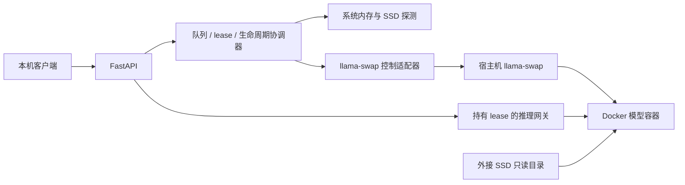

# 01 目标、架构与问题清单

## 1. 可交付目标

在单台 AGX Thor 上，按客户端提供的模型 ID，可靠地执行聊天、文本向量和文本重排序请求。
内存不足时等待或淘汰允许淘汰的空闲模型；不终止其他仍有效的请求；无法证明资源安全时拒绝准入。
支持流式输出、取消、队列超时、空闲 TTL、服务重启，以及外接 SSD 不可用时的确定行为。

“可用”同时要求：自动化错误路径测试通过、固定版本在 Thor 上 GPU 推理成功、外接盘及 systemd 恢复验收通过。
Python 能 import、HTTP /health 返回 200、镜像能 pull，均不能单独作为可用结论。

## 2. 边界

本次实际工作只在 `plan/` 输出文档、类型契约、核心参考代码和相关自检。
后续修复范围：现有 Python 服务、配置、测试、部署模板、操作文档；不新增 Web UI、数据库、云服务、模型下载站。
首版不包含多租户、公网服务、集群、多个调度器、Docker-in-Docker、Python 单文件打包、非 llama.cpp 后端。
不做自动磁盘格式化，不修改已有模型文件，不把巨型模型下载纳入安装脚本。

## 3. 审查缺陷与目标修复

| ID | 现有位置 | 问题 | 修复归属 |
|---|---|---|---|
| F01 | scheduler.py `_ensure_resources` | 提前选择多个淘汰候选，后续候选可能获得新请求 | 同一锁中原子标记整批 EVICTING |
| F02 | scheduler.py `ensure_model` | READY 快路径不校验后端，推理可触发上游自动重载 | 推理直连模型端口；后台对账；失败不自动重试 |
| F03 | scheduler.py 卸载 finally | 失败仍标记 UNLOADED | 只有有明确停止证据才能释放预算 |
| F04 | app.py unload | 绕过调度锁，未知 ID 变 500 | 所有手动卸载进入统一生命周期调度 |
| F05 | app.py chat / gateway.py | 取消不完整，连接失败可泄漏，流先发 200 再发现错误 | 显式 lease 所有权，先开上游，再提交客户端响应 |
| F06 | request_queue.py / config.py | 队列、deadline 没接入，状态总为 0 | 有界队列、老化优先级、绝对 deadline |
| F07 | lifecycle/pinned 配置 | TTL 未运行，pinned 不等于启动预热 | 定义 TTL、pinned、preload 的独立语义 |
| F08 | app.py 路由 | embeddings/rerank/model list 缺失 | 能力约束 + 明确适配接口 |
| F09 | app.py health/startup | 上游非 200 可导致本服务 HTTP 200；启动异常直接退出 | /live 与 /health 分离，依赖恢复循环 |
| F10 | resource_monitor.py | 不同资源口径混用；tegrastats 参数不确定 | psutil/Linux MemAvailable 主指标；GPU 仅诊断 |
| F11 | heat_tracker.py | touch 后再衰减；一次请求记两次请求权重 | 独立 last_updated；成功准入记一次，完成只记 token |
| F12 | config.py | 松散字典、负数、字符串布尔等配置可被接受 | 严格 schema、拒绝未知字段及重复 YAML key |
| F13 | 示例 Docker cmd | 浮动镜像、模型参数占位、非 loopback 发布 | 版本锁、模型 manifest、固定端口、能力参数验证 |
| F14 | repository | 无安装、systemd、版本锁、测试与发布证据 | 可复现发布目录和分层验收 |
| F15 | 内存中状态 | 多 worker 会有多份不一致计数 | 启动进程锁及 worker=1 |

F01—F03 在审查中已用模拟依赖复现；其余来自静态检查。尚无 Thor 端到端结果。

## 4. ADR：职责和依赖方向

- `config.py / contracts.py`：独立类型和验证，不导入 app 或 scheduler。
- `model_registry.py / request_queue.py / eviction_policy.py / heat_tracker.py`：纯状态和策略；不做 HTTP/Docker IO。
- `resource_monitor.py / storage_monitor.py / llama_swap_client.py / gateway.py / process_observer.py`：适配外部系统，不改 registry。
- `scheduler.py`：唯一状态写入所有者，使用上述模块，不导入 FastAPI。
- `app.py`：lifespan 创建和关闭依赖，将 HTTP 事件转为 scheduler 操作；不直接修改计数/状态或调用 unload。
- `run.py`：CLI、配置位置、进程锁、单 worker 启动；不包含模型调度策略。

## 5. ADR：推理直连，控制仍由 llama-swap 执行

保留推理全部经过 llama-swap，无法完全关闭“状态检查后、发请求前模型退出”的竞争窗口：
llama-swap 会按需重新加载，scheduler 无法原子控制其资源准入。
因此首版明确修改路径：只有 load 预热请求发给 llama-swap；推理发到配置中每模型独占的 `127.0.0.1:10001..10004`。
失效端口只能产生 502，不会启动模型。Gateway 不跟随重定向，不重试任何推理请求，不接受客户端提供的上游 URL。
下一次客户端请求是否重新加载，由调度器重新执行资源准入决定。

llama-swap 配置关闭所有自动 TTL、exclusive swap 和 preload；模型容器 `restart=no`，只有调度器发起的生命周期操作可启动。
运维绕过调度器直接 load/unload 不受支持。检测到身份变化或外部模型进程时降级并拒绝新冷加载，不覆盖现有有效 lease。

## 6. ADR：单进程一致性

一个 `asyncio.Condition` 保护 registry、队列、lease、预算和 operation token；临界区内无 IO 和 sleep。
只有一个生命周期 worker，可同时执行的 load/unload operation 数量为 1。
另有快速准入 worker、对账 worker 和磁盘/资源采样 worker；它们只通过同一个 condition 改状态。
所有跨 IO 的回写带 `(epoch, model_id, generation, operation_id)` 校验；epoch在全局恢复开始时递增。

使用 `/run/model-scheduler/instance.lock` 的 `flock(LOCK_EX|LOCK_NB)`，进程退出自动释放；锁失败退出码 73。
不支持 uvicorn 多 worker 或 reload 模式；部署只能执行受支持的 `run.py` 入口。

## 7. ADR：故障优先保持预算

UNKNOWN、LOADING、READY、EVICTING、ERROR 中凡未确认停止的模型均保留预算。
HTTP 连接断开、超时、`/running` 缺少 ID 都不是 Docker 模型已经退出的充分证据。
只有受管容器实例已停止/不存在且无未完成启动操作，并核验端口无人监听后，才能进入 UNLOADED。
若 Docker 不可访问、端口被未知进程占用，保留 ERROR，/health=503；需要自动对账或运维排障，不能猜测成功。

## 8. 风格及持久化

Python 3.12 为部署基线；类型注解完整、`time.monotonic()` 控制时间、结构化日志使用 UTC 时间。
禁止以宽泛 `except Exception: pass` 吞故障；CancelledError 单独处理。
热度、队列和 lease 不持久化；重启不恢复 HTTP 请求，不重放推理。
配置、版本锁、模型 manifest、日志和验收结果持久化；重启后先清理遗留受管容器，再重新开始预算和预热。
