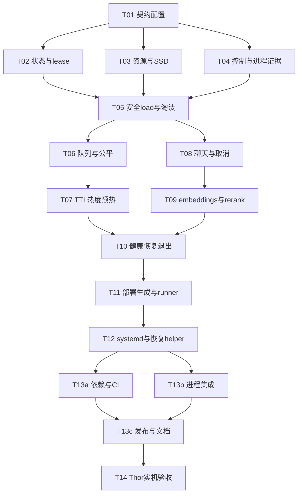

# 05 实施任务与验收

## 1. 执行约定

这里的文件和命令是后续修复应创建的产物，不代表当前仓库已经提供这些命令。
每任务先写能揭示缺陷的测试，再实现；不可用“全部mock正确返回”代替关键失败与竞争测试。
不要求模拟实际GPU内存分配；策略测试使用可控fake clock、FakeBackend与FakeResource，硬件行为进入独立Thor验收。
每项完成后记录测试命令、退出码、对应commit；T14前禁止把README写成production-ready。
每项primary owner为arch/backend；当前无frontend任务。每个任务主要修改不超过5个文件，新增小测试文件按表明确列出。

## 2. 依赖图与检查点

检查点A（T01—T05）：核心不变量和停止证据；B（T06—T10）：API/取消/恢复闭环；C（T11—T13）：可复现部署；D（T14）：实际可用。

## T01：严格配置和接口契约

- Primary owner：arch；依赖：无；范围M。
- 文件：`model_scheduler/contracts.py`、`model_scheduler/config.py`、`config.yaml`、`tests/test_config.py`。
- 内容：移植reference类型；实现04完整schema；拒绝未知key、重复key、字符串布尔、负值、无穷值、非loopback、多worker、非法model ID与路径。
- 验收：旧配置明确报schema_version缺失；新lab配置可加载；保留有效的4个模型ID；pinned组合和单模型预算校验有测试。
- 命令：`python -m pytest tests/test_config.py -q`。
- 前置脚手架：该任务同时建立最小pytest配置；测试依赖先安装于开发venv，正式锁由T13统一产出。

## T02：状态机和lease原子性

- Primary owner：backend；依赖：T01；范围M。
- 文件：`model_scheduler/models.py`、`model_scheduler/model_registry.py`、`tests/test_registry.py`。
- 内容：移植Book的状态、operation、generation、lease逻辑到现有模块，测试不得直接修改计数模拟release。
- 验收：F01/F03回归；整批淘汰第二候选拒绝新lease；取消/重复释放不伤其他请求；旧operation不覆盖新代；失败保留预算。
- 命令：`python -m pytest tests/test_registry.py -q`。

## T03：统一内存与SSD门禁

- Primary owner：backend；依赖：T01；范围M。
- 文件：`model_scheduler/resource_monitor.py`、`model_scheduler/storage_monitor.py`、`tests/test_resources.py`、`tests/test_storage.py`。
- 内容：psutil统一口径、快照时效、预算公式；UUID/真实mountpoint/文件元数据校验；受控hash校验。
- 验收：多GPU值不能被加到系统RAM；旧快照拒绝；目录存在但未挂盘拒绝；错误UUID、symlink、文件变化拒绝；所有探测有timeout。
- 命令：`python -m pytest tests/test_resources.py tests/test_storage.py -q`。

## T04：生命周期控制与停止证据

- Primary owner：backend；依赖：T01；范围M。
- 文件：`model_scheduler/llama_swap_client.py`、`model_scheduler/process_observer.py`、`tests/test_backend_control.py`、`tests/fixtures/llama_swap_contract.json`。
- 内容：严格解析已固定版本/running；未知结构报协议错误；调用warmup后inspect+direct health；stop后证明实例停止；单独control连接池。
- 验收：卸载HTTP200但容器仍Running不能释放预算；Docker不可达返回UNKNOWN；model ID必须匹配；load404不能直接视为成功；异常统一类型。
- 命令：`python -m pytest tests/test_backend_control.py -q`。
- fixture来源：真实固定llama-swap版本启动输出及响应，记录version/hash；现有含糊猜测多种JSON结构的解析器不得保留为silent fallback。

## T05：串行生命周期与安全准入纵向闭环

- Primary owner：backend；依赖：T02/T03/T04；范围M。
- 文件：`model_scheduler/scheduler.py`、`model_scheduler/eviction_policy.py`、`tests/fakes.py`、`tests/test_scheduler_lifecycle.py`。
- 内容：一个condition和生命周期worker、模型预算、整批淘汰、未发送rollback、回收等待、代际校验。
- 验收：FakeBackend下完整load→lease→release→evict→新load；batch第二模型受保护；持锁时无IO；slow load不阻塞READY模型准入；外部模型消失只502不自动load。
- 命令：`python -m pytest tests/test_scheduler_lifecycle.py -q`。
- 检查点A：T01—T05全部通过；reference测试之外必须有真正async交错测试，用Event控制时序，不使用任意sleep碰运气。

## T06：请求队列、deadline与公平性

- Primary owner：backend；依赖：T05；范围M。
- 文件：`model_scheduler/request_queue.py`、`model_scheduler/scheduler.py`、`tests/test_queue.py`、`tests/test_scheduler_fairness.py`。
- 内容：WAITING/GRANTED/CLAIMED握手、队列128上限、老化、共享load、切换冻结与30秒解除、cooldown。
- 验收：queue满429；deadline边界只504或lease二选一；grant前后取消无泄漏；同模型100个等待只一次load；热模型持续请求时冷模型可获得冻结机会；冻结超时后原模型恢复准入。
- 命令：`python -m pytest tests/test_queue.py tests/test_scheduler_fairness.py -q`。

## T07：TTL、热度与pinned预热

- Primary owner：backend；依赖：T06；范围M。
- 文件：`model_scheduler/heat_tracker.py`、`model_scheduler/scheduler.py`、`tests/test_lifecycle_policy.py`。
- 内容：独立热度时间戳、每grant一次权重、完成token一次、last lease release启动TTL、preload/退避。
- 验收：pinned不被TTL/资源/手动淘汰；故障仍能清理及重预热；TTL与请求同时到达时需求优先；冷却不阻塞ready接口；热度半衰期数值精确测试。
- 命令：`python -m pytest tests/test_lifecycle_policy.py -q`。

## T08：聊天网关、SSE和取消所有权

- Primary owner：backend；依赖：T05/T06；范围M。
- 文件：`model_scheduler/gateway.py`、`model_scheduler/responses.py`、`app.py`、`tests/test_chat_api.py`、`tests/test_cancellation.py`。
- 内容：直连固定后端、shared httpx、不重试、请求验证、统一错误、服务端request_id、流响应owner、主动disconnect监听。
- 验收：tools等字段不丢；上游4xx出现在提交HTTP前；从未运行iterator也清理；body/queue/load/connect/nonstream/stream全部阶段取消覆盖；read-idle与绝对deadline均生效；不存在伪DONE。
- 命令：`python -m pytest tests/test_chat_api.py tests/test_cancellation.py -q`。

## T09：向量与重排序完整接口

- Primary owner：backend；依赖：T08；范围M。
- 文件：`model_scheduler/api_models.py`、`model_scheduler/gateway.py`、`app.py`、`tests/test_embedding_rerank_api.py`、`tests/fixtures/inference_contract.json`。
- 内容：03全部数据契约与/v1/models；float→base64；rerank全部索引校验、同分排序、top_n和文档回填。
- 验收：单/批向量匹配index；base64解码与float32一致；rerank重复文本独立排名、NaN和缺index失败；能力错误不入队；查询model list不load。
- 命令：`python -m pytest tests/test_embedding_rerank_api.py -q`。

## T10：启动、健康、全局恢复、退出与管理接口

- Primary owner：backend；依赖：T07/T09；范围M。
- 文件：`app.py`、`run.py`、`model_scheduler/scheduler.py`、`tests/test_service_lifecycle.py`、`tests/test_admin_api.py`。
- 内容：app factory+lifespan、单实例锁、只读/live、完整/health、真实status、统一unload、load超时恢复协调、graceful shutdown。
- 验收：依赖未就绪live200/health503；第二实例退出73；启动遗留容器不能被当成零预算；迟到load被恢复epoch隔离；上游健康false不返回200；未知unload404。
- 命令：`python -m pytest tests/test_service_lifecycle.py tests/test_admin_api.py -q`。
- 检查点B：完整模拟HTTP服务可完成三类请求及取消/错误/恢复；清理任务注册表、waiter表、lease表在关机后均为空。

## T11：部署输入、配置生成与模型runner

- Primary owner：backend；依赖：T10；范围M。
- 文件：`model_scheduler/deploy.py`、`deploy/model-runner.py`、`llama-swap.config.example.yaml`、`tests/test_deploy_render.py`、`tests/test_model_runner.py`。
- 内容：collect/render/migrate/preflight命令、单一manifest、固定端口/alias/labels/只读挂载、argv调用。
- 验收：scheduler URL=llama proxy=Docker publish；生产拒绝占位、浮动tag、未实测预算；runner不能stop未知标签；模型参数由能力确定；文件sha/路径逃逸验证。
- 命令：`python -m pytest tests/test_deploy_render.py tests/test_model_runner.py -q`。

## T12：systemd、SSD依赖与控制面恢复helper

- Primary owner：backend；依赖：T11；范围M。
- 文件：`deploy/model-scheduler.service.in`、`deploy/llama-swap.service.in`、`deploy/control-recover.py`、`tests/test_recovery_helper.py`、`deploy/INSTALL.md`。
- 内容：挂载绑定、固定sudo helper、停止cgroup后只清理标签匹配容器、重新启动控制面；完整安装/插盘恢复/回滚命令。
- 验收：helper无任意参数；sudoers精确匹配；停swap不导致scheduler自停；SSD缺失拒绝启动；对其他容器无操作；恢复并发锁生效。
- 命令：`python -m pytest tests/test_recovery_helper.py -q`；Thor上`systemd-analyze verify`检查渲染后unit。

## T13a：依赖锁与CI门禁

- Primary owner：arch；依赖：T12；范围M。
- 文件：`requirements.in`、`requirements.lock`、`requirements-dev.lock`、`.github/workflows/test.yml`、`pyproject.toml`。
- 内容：固定Python版本、依赖hash、ruff、pytest配置和Linux CI；删改旧requirements.txt的迁移说明纳入T13c。
- 验收：干净Python3.12环境可从锁安装；CI运行全部非Thor测试；不访问真实模型/GPU；失败阻止发布。
- 命令：`python -m pip install --require-hashes -r requirements-dev.lock`；`python -m ruff check .`；`python -m pytest tests -m 'not thor' -q`。

## T13b：真实HTTP/进程集成验收

- Primary owner：backend；依赖：T12；范围M。
- 文件：`tests/integration/test_process_lifecycle.py`、`tests/integration/test_http_disconnect.py`、`tests/integration/fake_server.py`、`tests/integration/test_control_recovery.py`。
- 内容：真实本地socket/subprocess故障；不止httpx MockTransport；实际固定llama-swap与轻量fake模型服务联调。
- 验收：杀模型进程后推理不能启动新进程；真正客户端断连回收lease；load超时后迟到子进程会被恢复清理；SSE分块/UTF8边界保真。
- 命令：`python -m pytest tests/integration -m 'not thor' -q`。
- 要求：CI必须安装固定llama-swap二进制及校验hash；无Docker的CI通过可控ProcessObserver fake测，真实Docker证据留T14。

## T13c：发布与操作文档

- Primary owner：backend；依赖：T13a/T13b；范围M。
- 文件：`README.md`、`requirements.txt`、`docs/operations.md`、`scripts/build-release.py`、`tests/test_release.py`。
- 内容：README准确描述新推理路径、配置、接口和限制；旧requirements.txt指向确定安装流程；发布源码/锁/模板/manifest及SHA256清单。
- 验收：构建不包含模型、.venv、日志或用户配置；旧版无tests不能标记ready；单命令生成可审计归档但不自动安装系统文件。
- 命令：`python scripts/build-release.py --output build/releases`；`python -m pytest tests/test_release.py -q`。
- 检查点C：干净Linux环境重建部署目录，配置一致性检查、集成测试和unit校验全部通过。

## T14：AGX Thor 实机发布门禁

- Primary owner：backend；依赖：T13c；范围M。
- 文件：`tests/thor/test_acceptance.py`、`scripts/measure-models.py`、`docs/validation/thor-report.json`、`docs/operations.md`。
- 内容：以下实机清单；检测不到Thor/SSD/真实模型则标记未执行，不把skip算通过。
- 命令：`python -m pytest tests/thor -m thor -q`；`python scripts/measure-models.py --manifest /etc/self-model-switch/manifest.json --output /tmp/thor-measurements.json`。
- 报告必须保存真实GPU、内存、模型SHA、镜像digest和请求结果，不保存用户prompt。

## 3. 必须验收的场景矩阵

| 编号 | 场景 | 通过条件 |
|---|---|---|
| A01 | 冷启动服务，llama-swap未启动 | live200/health503；上游恢复后preload成功并health200 |
| A02 | embedding预热与请求 | pinned已READY；返回维度正确的有限向量 |
| A03 | rerank三篇文本 | 所有索引恰好一次，top_n稳定，同分按index |
| A04 | chat非流/流 | 正常JSON、合法SSE/DONE；usage未知不伪造 |
| A05 | 低预算触发两模型淘汰 | 第二候选不能获得新lease；有效请求不被停止 |
| A06 | 同模型100个等待者 | 队列真实可见；一次load；并发上限正确 |
| A07 | 队列128已满 | 第129个WAITING返回429；释放后可再次入队 |
| A08 | 每个等待/推理阶段断连 | 无永久waiter/lease；其他有效请求不受重复release影响 |
| A09 | 模型进程意外退出 | 当前请求502；没有自动启动；下一请求经过新准入 |
| A10 | load超时后迟到启动 | ERROR保留预算；恢复停止旧控制cgroup及受管容器后才能重试 |
| A11 | stop成功响应但进程仍活 | 不返回手动卸载200、不释放预算 |
| A12 | TTL边界与新请求同到 | 请求优先；active/pinned不因TTL停止 |
| A13 | 热模型持续请求 | 冷目标建立意图，冻结及30秒解冻可观测，无无限永久冻结 |
| A14 | SSD缺失/错误UUID/根盘空目录 | 拒绝推理，不把根盘当模型盘，不创建模型文件 |
| A15 | SSD掉线与恢复 | 取消请求并停止模型；插回+明确恢复命令后通过hash再就绪 |
| A16 | 第二实例/多worker | 启动失败，不出现双份调度计数 |
| A17 | 控制面重启/系统重启 | 不复用旧lease，不接管未知容器，preload恢复 |
| A18 | pinned模型不能加载 | health持续503，有error_code及退避，无无限快速重启 |
| A19 | 非法JSON/body/strict bool | 正确400/408/413/415，统一request_id错误体 |
| A20 | 实例身份、端口或配置不符 | 阻断准入，不能停止不属于本部署的容器 |

## 4. Thor 内存与SSD测量

测量工具只在停止生产服务、独占实例锁后执行；不与真实用户请求争用设备。
逐模型使用固定context、parallel、batch参数运行冷启动及接近上下文上限的请求，记录1秒间隔MemAvailable、GPU指标、容器身份。
峰值估算 `reserved_bytes = max(1, ceil(max(baseline_available - min_available, 0)))`，baseline为无受管模型时连续10秒MemAvailable中位数。
预算已包含进程和模型实际运行增量，scheduler另加15%裕量；不是GGUF大小。重复至少3轮取最大值。
应在隔离其他重负载的条件下测量；若后台进程导致明显漂移，报告失败并重测，不接受负值/零值预算。
每个最大并发slot均有接近最大上下文的请求；未测到最大配置负载则measured不能为true。

SSD报告记录UUID、接口枚举、挂载参数、实际文件读取速率、首次加载耗时和后续切换耗时。
不清空系统page cache制造“冷”数据，不写大文件磨盘；报告说明缓存状态未知，首次与后续结果分别列出。
不预设Type-C就是某带宽；性能SLO由实际测量报告提供，硬性上限是本计划deadline。

连续30分钟混合负载：80% chat、10% embedding、10% rerank；总客户端并发4；每2分钟切换chat大小模型。
故障注入与正常压测分开记录。正常阶段必须零500、零lease泄漏、零错误淘汰、零OOM killer事件；允许预期429/504但报告比例和原因。
通过缩小测试model_budget触发淘汰，不靠耗尽Thor真实RAM。每轮结束queue=0，lease=0，状态与Docker一致。
掉盘默认通过测试挂载模拟；真实SSD拔插只能在确认无磁盘写入、服务已准备好的单独维护步骤进行，不自动执行物理设备操作。

## 5. 发布及回滚

### 验收报告机器契约

报告JSON必填顶层：schema_version=1、timestamp_utc、source_commit、deployment_id、jetpack_version、
image_digest、llama_swap_version、llama_swap_sha256、ssd_uuid、models、scenarios、soak。
models为四个固定model_id的字典，每项包含sha256、context_size、parallel、batch_size、ubatch_size、
cache_type_k、cache_type_v、gpu_layers、fit、reserved_bytes、peak_deltas_bytes（三个以上正整数）、
gpu_verified（必须true）、capability_verified（必须true）、cold_load_seconds（有限非负数）。
scenarios为A01..A20的完整字典，值固定passed/failed/not_run；production要求全部passed。
soak固定字段duration_seconds（>=1800）、http_500_count（0）、oom_count（0）、lease_leaks（0）、
unsafe_evictions（0）、request_count（正整数）、http_429_count、http_504_count、queue_final（0）、leases_final（0）。
production渲染校验全部字段及输入manifest相等，不信任手动写measured=true；报告也是发布归档的一部分。
报告结构校验无法证明报告没有被人为伪造；其可信来源是受控实机测试流程及关联日志，不能声称提供密码学证明。

### 切换顺序

发布要求A/B/C/D四检查点全部通过；production render必须校验报告与manifest一致。
先停止scheduler排空，再停止llama-swap，确认模型容器全部退出；保存现有配置和current链接指向。
新release安装独立venv，校验hash/单位文件，切换current及配套配置，启动并进行三类API冒烟。
失败则停止新版本，恢复旧release指向及**同一版本配套配置**，重新启动并验证；不只回滚Python文件。
当前审查基线尚不稳定，不能作为“已知可用”自动回滚目标；首次上线失败应停机保持health503，回到实验环境修复。
模型文件不参与应用回滚，不删除/移动SSD数据。镜像digest旧版本保留到新版本验收完成。

## 6. 完成定义

- [ ] F01—F15都有实现、回归测试或明确的首版禁用约束。
- [ ] HTTP契约与生成OpenAPI一致，无静默缺失功能。
- [ ] 全部配置字段有执行路径，status没有虚构queue_size。
- [ ] 确认停止之前从不释放模型预算；推理不会自动绕过准入load。
- [ ] 单worker、SSD挂载、镜像/模型版本与GPU兼容验证通过。
- [ ] 所有生命周期/资源/取消事件有可关联日志，敏感内容不被记录。
- [ ] 30分钟混合负载与恢复矩阵通过，保存真实报告。
- [ ] README准确说明部署、模型路径和当前限制。
