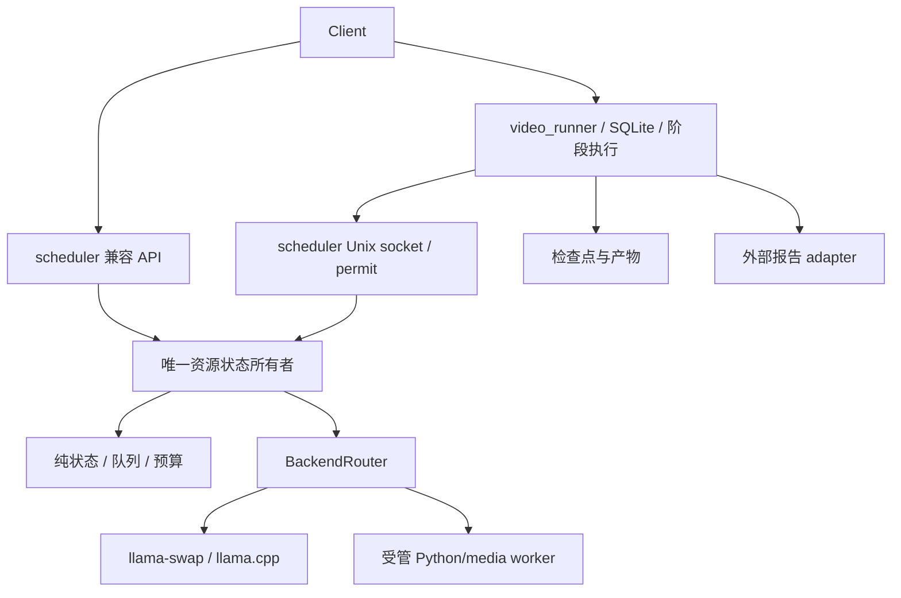

# 01 目标、边界和修改范围

## 1. 用户可见结果

对约两小时的本地 1080p 影片，生成镜头 JSON、匿名人物出现区间、带匿名说话人的台词时间轴、
每镜头相对深度图、镜头语义描述、原分辨率打码视频、带证据引用的人物关系报告。
真名是有证据的可选字段；未知不得由模型猜测补全。结果追溯到源哈希、全片时间、模型与参数。
失败后通过显式 resume 从验证过的检查点继续。

## 2. 相对当前源码的增量

| 当前代码 | 限制 | 修改 |
|---|---|---|
| config.py | schema v1，固定四 ID/三能力/单文件 | schema v2 动态模型、runtime、资产集合，显式迁移 |
| registry/scheduler/contracts | 请求 lease、状态、队列 | 保留并回归；增加 phase permit 和 execution 终结证据 |
| backend_control.py | LlamaSwapBackend | BackendRouter + WorkerBackend |
| model_runner.py | 一张镜像、四端口、llama 固定 argv | 按 manifest/runtime/资产角色构造受限 argv |
| process_observer.py | 全局镜像身份 | 每模型镜像、labels、实例、boot epoch |
| gateway.py/app.py | 三 JSON API | 保留兼容接口；增加音频与 worker 执行适配 |
| storage_monitor.py | 单文件、周期全量哈希 | 多资产；启动/恢复全量 hash，周期 metadata/mount 校验 |
| deploy.py | 四模型、单镜像、report v2 | candidate v3、多 runtime、report v3，绑定实际代码产物 |
| tests/thor/test_acceptance.py | 报告字段检查 | hardware 实际场景执行器与独立验证器 |
| 无 | 任务、产物、质量 | video_runner、workers、acceptance 包 |

不假定旧计划 F01—F15 仍未修复；以本基线和回归结果为准。新增能力不能回退停止证据、SSD 门禁、取消幂等。

## 3. 模块依赖

生产目录：`model_scheduler/` 调度；`video_runner/` API、SQLite、executor、stages、artifacts；
`workers/` server、moss、face_detect、face_embed、depth、media；`acceptance/` catalog、executors、metrics、evidence、gate。

- contracts 只含类型和纯校验，不依赖 HTTP/Docker/Torch/SQLite。
- scheduler 不读取台词语义、不维护影片数据库、不调用外部 LLM。
- runner 不启动 Docker/FFmpeg、不加载 CUDA；所有本地重计算经 scheduler。
- Torch/ORT/TRT 安装在 worker 镜像，不进入 scheduler 依赖锁。
- media worker 负责 FFmpeg、PySceneDetect、合成，也有预算、实例身份与停止证据。
- acceptance 从公开/内部受控接口执行，不能直接改 registry 或数据库制造成功。

## 4. 首版模型选择与范围

balanced-v1 角色：asr、face_detect、face_embed、depth、vision，每角色映射一个明确模型 ID。
人脸阶段拆为检测跟踪和 embedding 两个阶段，不要求检测与识别模型同时驻留。
分镜使用 PySceneDetect。TransNetV2、第二套 ASR、metric depth、实时视频、多机不在首版。
vision 使用固定 Qwen2.5-VL llama.cpp GGUF+mmproj；MOSS 首版使用官方 Transformers 推理 adapter。
若 MOSS 在目标设备不通过 B 门禁，则能力未交付，不自动切换未经测试的 SGLang/vLLM。
人脸检测为 manifest 明确选择的 SCRFD 或 YuNet；embedding 为固定 InsightFace 资产；
深度首版 Depth Anything V2 Small，后续 Base/Large 是独立候选配置，必须重测。

## 5. 完成边界

三种发布 scope：scheduler-only、local-pipeline、full-pipeline。scope 决定承诺能力，不能用缩小 scope 掩盖原 scope 失败。
无 Web UI、公网、多租户、自动下载模型、自动磁盘格式化或驱动升级。
不声称抽样评估证明任意影片绝无漏码；产物附质量检查覆盖范围。
类型完整；进程内 deadline 用 monotonic，持久化和报告用 UTC；禁止吞异常、任意 shell、调用方自选后端 URL。
