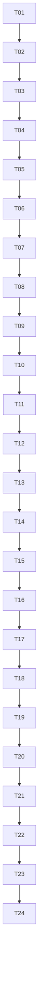

# 05 实施任务、依赖与交付检查点

## 1. 执行纪律

此处是未来生产修改任务，不是本轮已完成项。每项先增加能够揭露违约的测试，再实现；已有测试不能通过删断言变绿。
每任务主改动<=5文件，表中含测试文件；发现超出需拆子任务并更新依赖。主owner为arch或backend，无前端范围。
使用Python3.12干净venv与固定依赖锁。S用fake clock/controlled Event构造交错，不用任意sleep碰运气。
B/P/Q/O/E不得用mock替代。每次记录commit、命令、exit code、测试环境、证据目录；未跑是not_run，不算通过。
reference只给纯契约，不直接替换已有生产Book；先核对当前实现，保留已修复行为。

## 2. 有向依赖与检查点



首版采用这条保守顺序，避免在尚未封闭的生命周期上并行堆业务。
CP1=T03配置/身份；CP2=T06许可闭环；CP3=T09两类模型；CP4=T12任务/转写；
CP5=T15人脸/深度；CP6=T18完整本地产物/外部报告；CP7=T21验收执行；CP8=T24设备发布。
每个检查点失败只继续修复，不提前声称下一层可用。

## 3. 任务清单

下列验证命令是各任务实施后必须提供的路径；新建目录内的测试文件是明确交付，不假定当前存在。

| ID / owner / 依赖 | 主要文件（含测试，最多5个） | 可验收结果 | 验证命令 |
|---|---|---|---|
| T01 arch / 无 | contracts.py、config.py、config.yaml、tests/test_config.py、tests/test_contracts_v2.py | 动态ID、runtime/asset/envelope、严格schema、旧四ID兼容；重复/越界/能力错配拒绝；schema导出 | `python -m pytest tests/test_config.py tests/test_contracts_v2.py -q` |
| T02 backend / T01 | deploy.py、model_runner.py、process_observer.py、tests/test_deploy_render.py、tests/test_model_runner.py | 多镜像/端口/资产argv、无任意shell；每模型身份观测；candidate不依赖报告 | `python -m pytest tests/test_deploy_render.py tests/test_model_runner.py tests/test_process_observer.py -q` |
| T03 backend / T02 | storage_monitor.py、deploy.py、tests/test_storage.py、tests/test_device_identity.py、docs/operations.md | 多资产hash、真实挂载、同型号换机拒绝、metadata变更门禁；迁移报告无假测量值 | `python -m pytest tests/test_storage.py tests/test_device_identity.py -q` |
| T04 backend / T03 | phase_permits.py、scheduler.py、contracts.py、tests/test_phase_permits.py、tests/test_scheduler_lifecycle.py | phase/execution分离、epoch fencing、TTL不释放预算、UNKNOWN保留槽 | `python -m pytest tests/test_phase_permits.py tests/test_scheduler_lifecycle.py -q` |
| T05 backend / T04 | scheduler.py、request_queue.py、resource_monitor.py、tests/test_phase_admission.py、tests/test_resources.py | 所有入口共享互斥；drain超时不伤有效请求；两重内存门槛和边界准确 | `python -m pytest tests/test_phase_admission.py tests/test_resources.py tests/test_queue.py -q` |
| T06 backend / T05 | backend_router.py、worker_backend.py、workers/server.py、tests/test_worker_protocol.py、tests/integration/test_worker_lifecycle.py | fake真实socket worker load/execute/cancel/stop闭环；迟到/失联不误释放，unit可复用同stage实例 | `python -m pytest tests/test_worker_protocol.py tests/integration/test_worker_lifecycle.py -q` |
| T07 backend / T06 | app.py、gateway.py、api_models.py、tests/test_vision_api.py、tests/test_chat_api.py | mmproj模型接受真实图像协议，data URL/像素限制；旧chat/SSE取消回归 | `python -m pytest tests/test_vision_api.py tests/test_chat_api.py tests/test_cancellation.py -q` |
| T08 backend / T07 | workers/moss.py、worker_backend.py、workers/locks/moss.txt、tests/test_moss_adapter.py、tests/test_worker_protocol.py | MOSS官方接口固定版本，合法分段输出，CUDA同步终结；不把fake结果算设备支持 | `python -m pytest tests/test_moss_adapter.py tests/test_worker_protocol.py -q` |
| T09 backend / T08 | app.py、api_models.py、gateway.py、tests/test_audio_api.py、tests/integration/test_audio_disconnect.py | multipart流式暂存、64MiB/时长限制、转写返回毫秒时间轴，断连/超时无泄漏 | `python -m pytest tests/test_audio_api.py tests/integration/test_audio_disconnect.py -q` |
| T10 backend / T09 | video_runner/contracts.py、video_runner/job_store.py、video_runner/api.py、tests/test_jobs.py、tests/test_job_store.py | 创建/查询/取消/resume、SQLite幂等和状态迁移、HTTP断连不取消job | `python -m pytest tests/test_jobs.py tests/test_job_store.py -q` |
| T11 backend / T10 | video_runner/artifacts.py、video_runner/executor.py、tests/test_artifacts.py、tests/integration/test_job_recovery.py | fsync/rename/DB顺序，崩溃边界/损坏/旧attempt提交均按07处理，显式resume | `python -m pytest tests/test_artifacts.py tests/integration/test_job_recovery.py -q` |
| T12 backend / T11 | workers/media.py、video_runner/stages/media.py、video_runner/stages/asr.py、tests/test_media_stages.py、tests/test_asr_timeline.py | probe→shots→ASR纵向闭环，PTS/音轨offset、1500s切块、2s交叠、S01命名空间正确 | `python -m pytest tests/test_media_stages.py tests/test_asr_timeline.py -q` |
| T13 backend / T12 | workers/face_detect.py、video_runner/stages/face_tracks.py、tests/test_face_tracks.py、workers/locks/vision.txt | 检测/CSRT/重检测，原图坐标和逐帧轨迹，未解决间隙标记，内存有界 | `python -m pytest tests/test_face_tracks.py -q` |
| T14 backend / T13 | workers/face_embed.py、video_runner/stages/face_identity.py、tests/test_face_identity.py、tests/test_person_spans.py | complete-link确定聚类、同帧互斥、unknown、区间并集，人工映射可追溯 | `python -m pytest tests/test_face_identity.py tests/test_person_spans.py -q` |
| T15 backend / T14 | workers/depth.py、video_runner/stages/depth.py、tests/test_depth.py、workers/locks/depth.txt | Small关键帧深度、relative语义、resize/minmax/constant handling、无缺shot | `python -m pytest tests/test_depth.py -q` |
| T16 backend / T15 | video_runner/stages/vision.py、video_runner/stages/mask.py、workers/media.py、tests/test_shot_descriptions.py、tests/test_mask_render.py | 图像JSON结构、人物ID验证、原片打码及整帧兜底，完整解码/AV检查 | `python -m pytest tests/test_shot_descriptions.py tests/test_mask_render.py -q` |
| T17 backend / T16 | video_runner/external_report.py、video_runner/stages/report.py、video_runner/job_store.py、tests/test_report.py、tests/test_external_unknown.py | 分批/汇总/证据引用、预算上限、不确定计费调用不重放、显式恢复 | `python -m pytest tests/test_report.py tests/test_external_unknown.py -q` |
| T18 backend / T17 | video_runner/cli.py、video_runner/executor.py、tests/integration/test_pipeline.py、tests/integration/test_pipeline_faults.py、docs/pipeline.md | 输入登记、完整stage序列、队列、取消/重启和产物引用闭环；文档准确区分scope | `python -m pytest tests/integration/test_pipeline.py tests/integration/test_pipeline_faults.py -q` |
| T19 arch / T18 | acceptance/contracts.py、acceptance/catalog.py、acceptance/evidence.py、acceptance/gate.py、tests/acceptance/test_gate.py | 动态case集、v3封套、candidate/环境/hash/有效期，缺evaluator拒绝；旧v2拒绝 | `python -m pytest tests/acceptance/test_gate.py -q` |
| T20 backend / T19 | acceptance/metrics/timeline.py、acceptance/metrics/faces.py、acceptance/metrics/semantic.py、tests/acceptance/test_metrics.py、docs/datasets.md | Q01..Q06指标与固定标注schema，手算小例/分母0/匹配平局，阈值配置防漂移 | `python -m pytest tests/acceptance/test_metrics.py -q` |
| T21 backend / T20 | acceptance/executors/software.py、acceptance/executors/hardware.py、acceptance/executors/pipeline.py、acceptance/cli.py、tests/acceptance/test_executors.py | S/B/P/Q/O/E执行、原始事件采集、每case语义evaluator注册；无空实现/假通过 | `python -m pytest tests/acceptance/test_executors.py -q` |
| T22 backend / T21 | deploy.py、tests/hardware/test_acceptance.py、tests/thor/test_acceptance.py、tests/test_deploy_render.py、scripts/build-release.py | 新run/verify/render/preflight贯通，移除旧Thor专用报告通过路径；发布包包含证据索引 | `python -m pytest tests/test_deploy_render.py tests/test_release.py -q` |
| T23 backend / T22 | deploy/model-scheduler.service.in、deploy/video-runner.service.in、deploy/control-recover.py、tests/test_recovery_helper.py、.github/workflows/test.yml | Unix权限、单实例、服务依赖、旧容器清理、CI的软件层与硬件层隔离 | `python -m pytest tests/test_recovery_helper.py tests/test_runtime.py -q` |
| T24 backend / T23 | docs/operations.md、README.md、requirements.lock、requirements-dev.lock、docs/validation/README.md | 固定依赖/发布说明，实机与质量全测，失败如实记录，达标才产production bundle | 见下列最终命令 |

路径未带包名前缀的生产Python文件均位于`model_scheduler/`，唯`app.py`位于根目录。
T21的executor文件含该类场景的采集和evaluator入口；共享纯指标在T20，不能额外隐藏未计数的大模块。
如果拆包会超过5文件，应先在此拆成T21a/T21b，不能省掉语义验证只保留封套验证。

## 4. 每个检查点的交付

- CP1：配置schema、迁移错误报告、候选生成、资产/设备反例；不宣称模型可运行。
- CP2：真实本地socket/subprocess的许可/取消/停止事件；不把HTTP200当停止。
- CP3：图像/音频协议和两个backend adapter可测；设备兼容仍待B。
- CP4：小fixture可创建任务、保存检查点并恢复；无已提交unit重做。
- CP5：人物/深度结构正确；效果仍待Q。
- CP6：fake/full接口链完整、外部未知不重试；不将mock外部报告作为E。
- CP7：每个必测ID有真实executor和独立断言；随机删除/篡改证据必定失败。
- CP8：目标设备完整scope通过；否则保留software_verified或已通过层，阻止production。

## 5. 最终命令与退出语义

软件CI（新增hardware/pipeline_hardware/quality_hardware/remote_provider marker；旧thor移除并更新所有引用）：

```bash
python -m ruff check .
python -m pytest tests -m 'not hardware and not pipeline_hardware and not quality_hardware and not remote_provider' -q
python run.py --check-config
```

设备验收在独占维护时运行，所有环境数据真实提供：

```bash
python -m acceptance collect --output build/facts.json
python -m model_scheduler.deploy candidate --input deployment-input.json --output build/candidate
python -m acceptance run --candidate build/candidate/candidate.json --scope full-pipeline --output build/evidence --maintenance
python -m acceptance verify --candidate build/candidate/candidate.json --evidence build/evidence
python -m model_scheduler.deploy render --candidate build/candidate/candidate.json --evidence build/evidence --mode production --output build/production
python -m model_scheduler.deploy preflight --manifest build/production/manifest.json
```

verify退出0=scope全集通过，2=输入/证据缺失或结构错，3=完整证据的语义/指标失败。
run退出0=执行完成且通过，2=环境不能执行，3=至少一case失败；即使失败也保存已产生证据，not_run明确列出。
hardware pytest只能作为run的场景实现/CI包装，不允许再变成“读取手写passed文件就通过”。

## 6. 完成定义

- [ ] 既有三类API及取消/资源/SSD回归通过；动态模型不再依赖四ID。
- [ ] 所有本地负载受许可约束；phase/HTTP/worker取消均有独立停止证据。
- [ ] 任务幂等、断点恢复、时间戳、身份未知、产物提交符合03/07。
- [ ] 必测场景由candidate推导；所有成功结论由原始证据重算。
- [ ] 最大envelope内存/耗时测量、2小时长片、30分钟混合负载、Q门槛全部通过。
- [ ] preflight重验物理设备、软件栈、代码、资产和证据；scope声明准确。
- [ ] 生产发布只生成可审计产物；实际系统安装/切换是独立操作，不在本轮执行。
